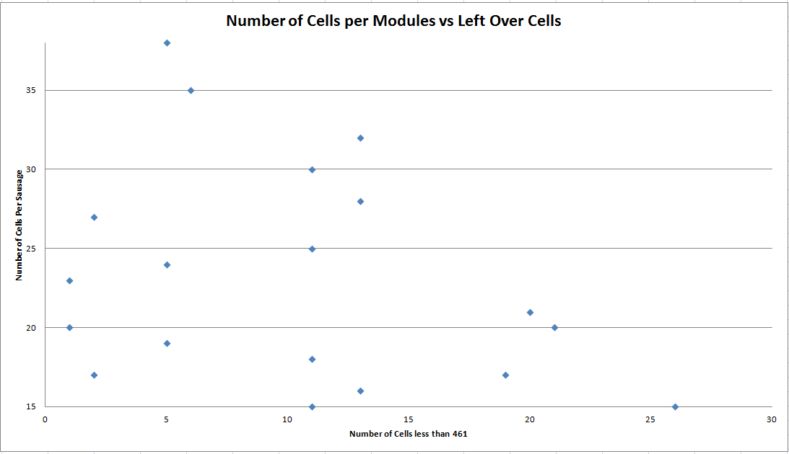
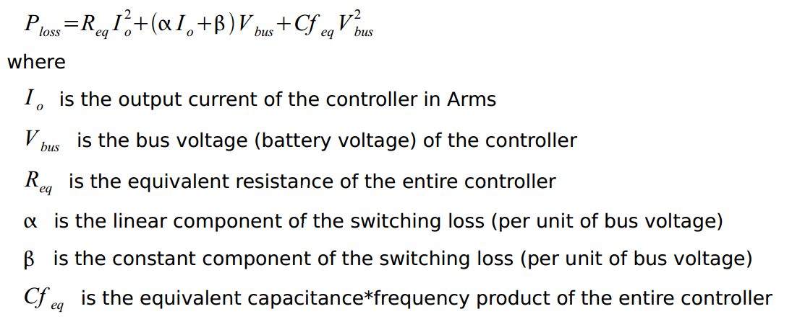
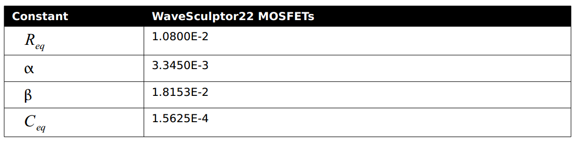
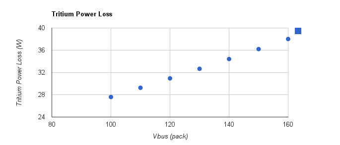
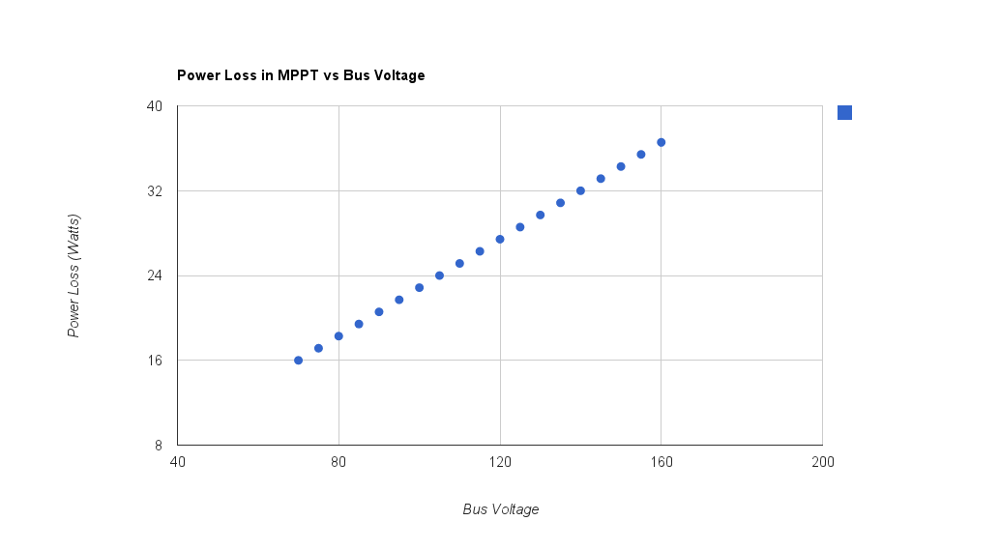

# SSCP - Battery Pack Voltage

# Battery Pack Voltage

## Number of Lithium Cells Optimization

### Maximizing Energy Density 

Constraints:

### Embedded Content

Embedded content: [Custom embed]()

<iframe width="100%" height="400" src="" frameborder="0"></iframe>

The weight of a panasonic 3.1Ah cells is 45.5 grams which means the battery pack can have a maximum of 461 cells for the entire pack to obey the 21kg maximum weight in the rules. Note that different capacity NCRs have different weights. 

The following graph shows the number of cells in parallel versus the number of cells that cannot be used, due to the 461 cell limit. The number of cells in series and parallel should be chosen to get as close to 461 cells without exceeding this number.

Maximal Battery Configurations:

### Embedded Content

Embedded content: [Custom embed]()

<iframe width="100%" height="400" src="" frameborder="0"></iframe>

### Minimizing Power Converter Losses

Tritium Losses

Theory

A motor controller operates like a buck converter, and thus losses go with buck ratio meaning that as the difference between the motor controller back emf and bus voltage increases so do the motor controller losses. The equation for tritium losses can be found on page nine of the user manual and is shown below:

[ page nine of the user manual](http://tritium.com.au/wp-content/uploads/2012/07/TRI88.004v2_Users_Manual.pdf)

The tritium constants: 

The only unknown in the above equation is Io which can be calculated from motor parameters which are found in either the motor controller datasheet or can be pulled from the tritium itself as it runs PhasorSense to set up a motor. Such a paramter is given in kV which is a generated voltage per unit of angular velocity. The details of the calculations can be found in the Motor Back EMF tab of the spreasheet attached at the bottom. NOTE: this is only relevant if we use a pre-made motor with a fixed kV. Because the 2013 entry's motor is custom-designed, we can gear the kV to the bus voltage.

Results

MPPT Losses

Theory

### Embedded Content

Embedded content: [Custom embed]()

<iframe width="100%" height="400" src="" frameborder="0"></iframe>

The MPPT is boost converter which means that the efficiency goes down as the boost ratio goes up. The equation can be found in the link in the above table.

Results

## Conclusion

Motor Controller losses and MPPT losses added together are shown at different bus voltages

### Embedded Content

Embedded content: [Custom embed]()

<iframe width="100%" height="400" src="" frameborder="0"></iframe>

See MATH FOR PACK VOLTAGE. NOTE!! This spreadsheet was generated as a first-pass at pack size selection, and is useful for calculating MPPT and Motor Controller losses. It factors in motor losses, which are not relevant to the 2013 design, because we are designing our own motor, whose kV will be chosen based on bus voltage.

[ MATH FOR PACK VOLTAGE](https://docs.google.com/spreadsheet/ccc?key=0AiqMxQYJhb9idG1pcnhfeTVicm1ic0JiT1BMc05lN3c#gid=0)

Conclusion, Updated 10-24-2012

Conventional wisdom about electric vehicles suggests that a higher voltage is better, because less current is required for the same amount of power output, and power losses in wires is proportional to the square of current; however, because there is no set limit to the gauge of our current-carrying wire (except that it does not become a prohibitively large diameter, which may be a concern in the wires that run from the MPPTs to the battery pack, due to the long run), the I2R losses are not the driving factor.

Both MPPT and Motor Controller losses decrease as bus voltage decreases. However, there is a practical minimum voltage of the high voltage bus: the output voltage of strings of panels must work out with the MPPT configuration, we may want to leave the ability to use the NGM motor if our own motor does not work, and the Vicor DC-DC converters have a minimum operating voltage. Given a 4x5 solar module (20 cells in series, allowing 19 modules. Size is chosen to need only one reasonably-shaped module across the entire car), and a 0.55V MPP for a SunPower C60 cell, each module will output 11V at MPP. As bus voltage decreases, the maximum number of modules in series decreases, reducing the flexibility of panel wiring (array shading must be considered). Our MPPT units operate in Boost mode, so the product of module MPP and number of modules must stay under the minimum cell voltage.

In the past, motor kV  and the higher voltage of GaAs cells drove our bus voltage upwards; however, since we are designing our own motor (and can vary its kV by winding it differently), the motor has little to no bearing on our bus voltage (except if we choose to use the NGM motor). It could be advantageous to use the NGM as a fall-back plan if we decide that our own motor is not good enough, for any reason. The next paragraph explains how the minimum operating voltage (to keep compatible with the NGM, and keeping some margin) is found.

[ NGM motor](/home/sscp-2012-2013/mechanical-2012-2013/motors/ngm-scm-150)

The below spreadsheet is an attempt at decoupling the motor from the decision of pack voltage. It allows the user to tweak parameters and see the trends across pack voltage. Please make a copy of this spreadsheet if you choose to edit anything other than the first page.

### Embedded Content

Embedded content: [Embedded Content]()

<iframe width="100%" height="400" src="" frameborder="0"></iframe>

Vicor:

There's been concern that a lower voltage would cause problems for the Vicor, i.e. that under heavy load, a lesser pack voltage would droop below the 67V rated minimum of the Vicor. On 12/18/12, the Vicor was tested to be operational (at 48W load) down to 60 Volts input voltage, where it proceeds to cut out. Upon cutout, the input voltage must return to 67V before the unit restarts. However, if cold-booting, the unit can be operational with an input voltage down in the range of 64V. 

### Embedded Google Drive File

Google Drive File: [Embedded Content](https://drive.google.com/embeddedfolderview?id=1yXvxDKSuvzRUiXUeuYFL8_rSErGxeMH1#list)

<iframe width="100%" height="400" src="https://drive.google.com/embeddedfolderview?id=1yXvxDKSuvzRUiXUeuYFL8_rSErGxeMH1#list" frameborder="0"></iframe>

