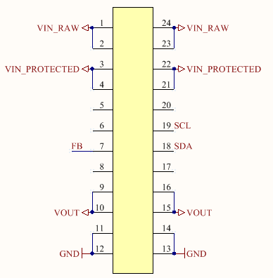

# SSCP - Low Current

# Low Current

The lower current power supply converts power from an input voltage range of 4.5V to 45V to a configurable output voltage from 0.8V to Vin at 100mA. The default and by far dominant use case will be 24V to 3.3V. It also senses and reports the current drawn by all outputs.

The pinout is given by the following diagram:

VIN_RAW is the input voltage (24V). VIN_PROTECTED is a protected 24V output (it is protected from excessive power draw, overvoltage, and reverse voltage). SCL and SDA are the serial interface for the current sense. VOUT is a 3.3V output, and GND is common ground for VIN_RAW, VIN_PROTECTED, and VOUT. FB should be connected to GND via a resistor (Rfb); this determines VOUT through the following relation:

Vout = 0.8 * ( 1 + (316K) / Rfb )

For Vout = 3.3V, Rfb = 101K

The heart of the converter is a LTC3631, a buck converter PMIC. It is fairly efficient over a very wide output current range, is rated to 125°C and is extremely simple. It is a monolithic synchronous buck and thus requires only a few external components.

[ LTC3631](http://www.linear.com/product/LTC3631)

Design Reviews

Simulation, Schematic, Layout - Sasha (4 Feb 2012)

Simulation

- Soft start - 5ms

- Use VFB

- p11 - choose inductor so switching frequency is reasonable

Schematic

- No need for zener

Layout

- No acute angles

- Shorten path between sw pin and inductor

Simulation, Schematic, Layout - Sasha (11 Feb 2012)

Simulation

- Ensure it matches schematic exactly

Schematic

- Always place components on a 10 unit grid

- Connect all grounds to a common point for visual intuition regarding ground currents

- Put different parts of the same schematic in boxes for labelling

- Use actual power / gnd signals for power / ground instead of net labels

- Use higher voltage output cap (higher than 6.3V)

Layout

- One via per current path

Work Log

2012-05-12 - Assembly

- Assembled and tested buck converter. Appears to be operating nominally with a very reasonable transient and almost zero ripple.

- Assembled but didn't test digital current sense.

- Assembled part of voltage protection; still waiting on IC to arrive to complete assembly.

TODO: Test efficiency, test digital current sense, build and test voltage protection

2012-05-28 - Protection Assembly (Alejandro)

- Added voltage protection IC and its peripheral passive components (excluding a Zener diode and including the NFET)

- HASN'T BEEN TESTED, INSPECT CONNECTIONS FOR SHORTS BEFORE DOING SO

- Used 3.01 Ohm sense resistor instead of listed 3.3 Ohm resistor

TODO: Test efficiency, digital current sense, voltage protection

2012-06-08

- Attempted to debug protection circuitry. Does not cut off at >30V as it should.

- Discovered the LT chip had failed short between GND and FB. Replaced it.

- It still does not cut off at the correct voltage, even when Vfb > 1.2V (tested it up to Vfb approx = 1.6V).

TODO: Work out what's going on with voltage protection

2012-06-17

- I'd previously measured efficiency. It's operating at around 60-65% efficiency, approximately 20 % points below datasheet values.

- Used a thermal imaging camera to determine the most dissipative component is the inductor. The inductor's series resistance is rated for about 3 Ohms.

- Tested with a variety of different inductors and discovered using this inductor yielded over 75% efficiency.

[ this inductor](http://www.digikey.com/product-detail/en/SRR7045-221M/SRR7045-221MTR-ND/1970431)

TODO: redesign board for that inductor, purchase several inductors of different values of the same footprint.

### Embedded Google Drive File

Google Drive File: [Embedded Content](https://drive.google.com/embeddedfolderview?id=1VEu3lDhW3V8UIH3V_ThA8hMFC41dQTwv#list)

<iframe width="100%" height="400" src="https://drive.google.com/embeddedfolderview?id=1VEu3lDhW3V8UIH3V_ThA8hMFC41dQTwv#list" frameborder="0"></iframe>

