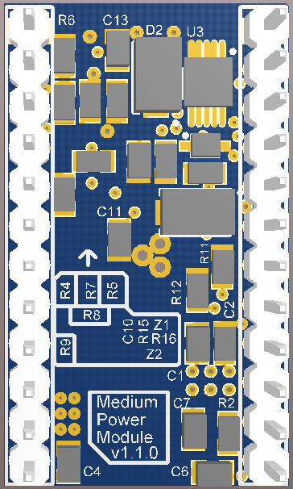
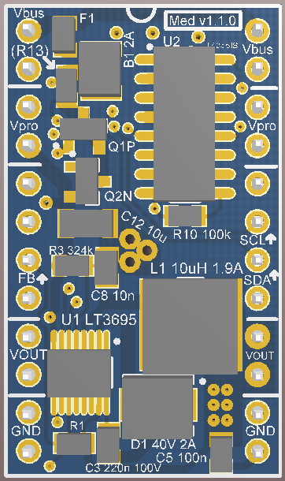
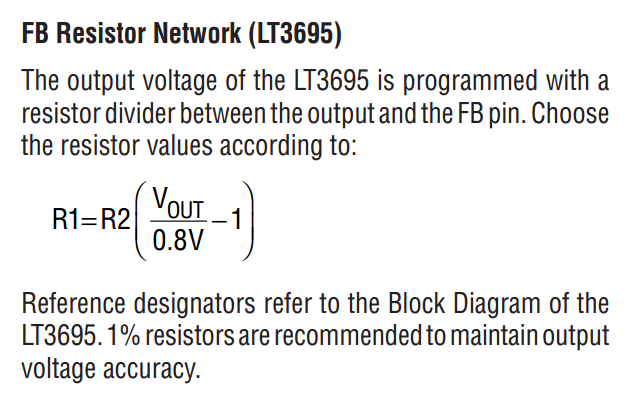
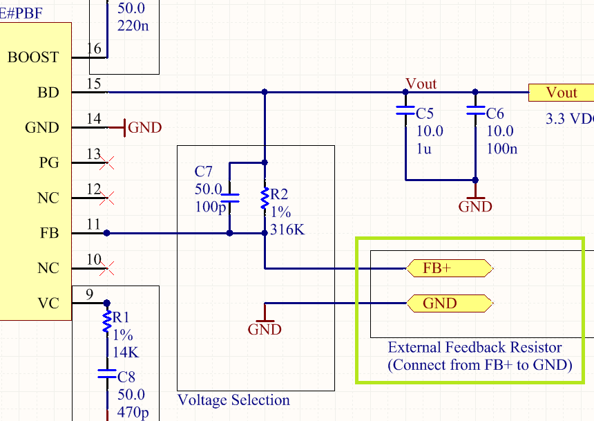

# SSCP - Medium Current

# Medium Current

Current Revision: v1.1.0 (6 Oct 2012)

The medium-current point-of-load (POL) power supply module supplies up to 1A DC current, at either 3.3V or 5V. An external, required feedback resistor sets the output voltage to the user's

requirements. It is the go-to power supply module for most any regulated power requirements, including microcontrollers, indicators, sensors, etc. 

The medium-current regulator is a drop-in pin-compatible replacement for either the low- or high-current versions of the same module. The feedback resistors are standardized among our boards, so the target circuit should handle the swap as though nothing happened.

## Main IC: LT3695

The board is based on the LT3695 1A Fault-Tolerant Micropower Step-Down Regulator. This regulator provides selectable switching frequency, extremely low drop-out voltages and minimal power overhead. It comes in a 16MSOP package for convenient surface-mounting.

[ LT3695 1A Fault-Tolerant Micropower Step-Down Regulator](http://www.linear.com/product/LT3695)

In designing the board, we had to choose between the LT3695 and the LT3973. The 3973 is a great alternative part, though the 3695 offers 250mA more output current capability. While the 750mA-capable 3973 consumes on 2.5uA of quiescent current (compared to 75uA for the 3695), ultimately the point of the Medium supply board is to bridge the gap between low- and high-power modules, and so we decided it should be able to put out 1A comfortably.

## Other Design Decisions

The Medium module can supply 1A of regulated 3.3V or 5V DC, protected from bus anomalies by the protection circuitry. The ferrite beads are intentionally oversized to allow the module to serve as pure protection circuitry, bypassing the regulator. The medium module can safely supply up to 3A total (regulated and unregulated combined) output current, as limited by the ferrite beads. 

The regulator has a current limiter built in and will not allow output current draw beyond around 1.5A at 3.3V or 1.4A at 5V.

The inductance of the main switching inductor for the medium module was chosen based on the recommendations of the supplier datasheet and satisfactory results in simulation via LTspice. The regulator IC will clamp output current before the inductor is overloaded, so a larger inductor is unnecessary.

The schematic in the medium module includes a small (100pF) feed-forward capacitor coupling the output and switching lines. In simulation, this capacitor smoothed soft-starts and gretly

improved output response time.

The medium power module will soft-start after bus power is applied, even during spike conditions, so circuits using it for power so not need to protect against power anomalies. The output remains clean even in overvoltage conditions, with no notable spikes in output voltage.

## Setting the Output Voltage

The medium power module, like the low- and high-current variations, omits a feedback resistor to set the output voltage. DO NOT USE the medium module without the feedback resistor! Doing so will lead to undefined output behavior and can destroy your circuit. Please choose your feedback resistor carefully, and as always check the output voltage of the module before installing it in your final circuit.

According to the datasheet:

Top of Medium v110

Bottom of Medium v110

We have standardized the low-, medium- and high-power boards to share the high-side resistor value of 316k.

Thus the equation for Vout as a function of R2, the low-side resistor, becomes

Vout = 0.8V + (252.8k / R2)

or

R2 = 252.8k / (Vout - 0.8)

### Embedded Content

Embedded content: [Custom embed]()

<iframe width="100%" height="400" src="" frameborder="0"></iframe>

## Assembly Notes

Important: C3, the 220nF capacitor used for boosting, and C2, the 2.2uF input filter capacitor, need to be 50V, but the Capacitor Superkit in the shop only has lower-rated units. Make sure to special-order the higher-voltage caps.

## Usage Notes

As noted above, the ferrite beads are rated for 3A, so drawing up to 3A of raw current through the module's headers will provide protection from the CAN bus spikes, but no regulation.

The LT3695 guarantees 1A output current, so anything beyond that threshold is at the user's risk.

Find this board's source files in SVN under sunbad/electrical/projects/power_modules/medium_power_1-1-0/

