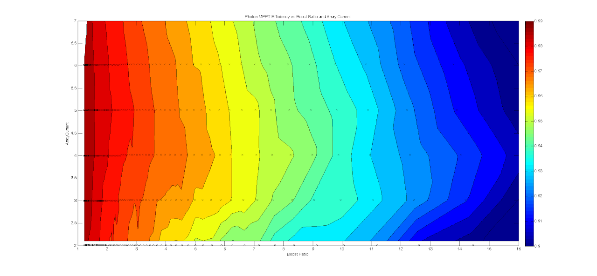
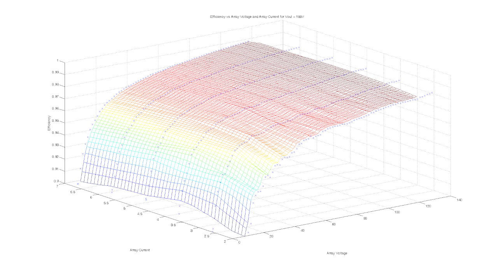
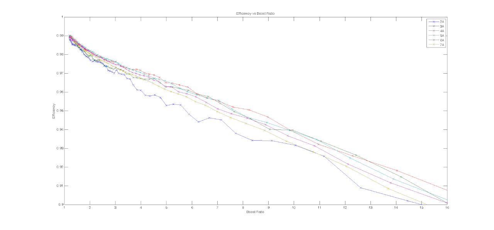
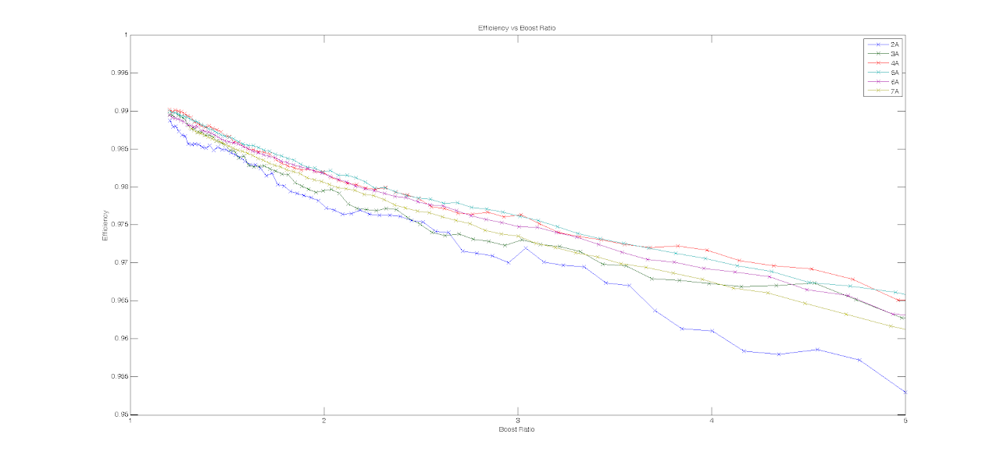

# SSCP - Sam MPPT

# Sam MPPT

## Proton 1.3

### Introduction

The 2011 entry Xenith ran 4 of these trackers. 

### Fuses

Input/Output Fuse: 5x20 15 Amp Fast Blow

### Efficiency Plots

### Known Issues

* The bus voltage input is designed for 12V and requires a DC/DC to power. The trackers implement an non-SSCP compliment can interface that requires special case handling. Shitty screw terminal connectors are used which can vibrate out and are generally badThe ceramic caps are not Automotive rated and one cracked and shorted taking a tracker out of commission during WSC 2011. 
* The bus voltage input is designed for 12V and requires a DC/DC to power. 
* The trackers implement an non-SSCP compliment can interface that requires special case handling. 
* Shitty screw terminal connectors are used which can vibrate out and are generally bad
* The ceramic caps are not Automotive rated and one cracked and shorted taking a tracker out of commission during WSC 2011. 

* The bus voltage input is designed for 12V and requires a DC/DC to power. 
* The trackers implement an non-SSCP compliment can interface that requires special case handling. 
* Shitty screw terminal connectors are used which can vibrate out and are generally bad
* The ceramic caps are not Automotive rated and one cracked and shorted taking a tracker out of commission during WSC 2011. 

The bus voltage input is designed for 12V and requires a DC/DC to power. 

The trackers implement an non-SSCP compliment can interface that requires special case handling. 

Shitty screw terminal connectors are used which can vibrate out and are generally bad

The ceramic caps are not Automotive rated and one cracked and shorted taking a tracker out of commission during WSC 2011. 

### Can Interface

I have the base address set to 0x600 on the trackers. The binary channel number is appended to that. The CAN runs at 125kbit.

If you issue a RTR packet to the baseaddress + the set CAN address (0 is all switches down), the tracker will return a data packet length 8 on the same address.

so you issue 0x600R

and the channel 0 tracker will return ID 0x600 + 8 bytes of data 

Byte 0 = Voltage Array LSB

Byte 1 = Voltage Array MSB

Voltage = Byte 0 + 0x100 * Byte 1

Scale is 100 -> 1 count = 10mV

Value 12345 = 123.45V 

Byte 2 = Current Array LSB

Byte 3 = Current Array MSB

Current = Byte 2 + 0x100 * Byte 3

Scale is 1000 -> 1 count = 1mA

Value 12345 = 12.345A

Byte 4 = Voltage Battery LSB

Byte 5 = Voltage Battery MSB

Voltage = Byte 4 + 0x100 * Byte 5

Scale is 100 -> 1 count = 10mV

Value 12345 = 123.45V 

Byte 6 = Temperature LSB

Byte 7 = Temperature MSB

Temperature = Byte 6+ 0x100 * Byte 7

Scale is 100 -> 1 count = 10mC

Value 12345 = 123.45C 

To shut the tracker off, you issue a packet to base address 0x610 + channel number data length 1, with bit zero the enable state.

The trackers are default enabled. If you have a tracker on channel 0, issue an ID 0x610 packet with data 0x00, the tracker will be disabled.

If you set the data to 0x01, the tracker will be reenabled.

### Enclosure - Thermal Calculations

The following are very rough calculations to get in the ballpark of necessary cooling for enclosing 6 of Sam's MPPTs. Efficiencies are based on analysis here. Suppose we have an 18"x18"x3" box.

[ here](/home/sscp-2012-2013/array-2012-2013/sunbad-array-layout)

The worst case efficiency (calculated above) is 97.17% - given that the MPPT channel producing the most power will run ~260W through it, the worst case power dissipation per MPPT is approximately 7.5W. Let's assume that all the power dissipation happens in one FET, for a conservative analysis.

Greg says Sam uses the IRFP4668 FET, which has about a 0.6 K/W thermal resistance from junction to sink.

[ IRFP4668 FET](http://www.irf.com/product-info/datasheets/data/irfp4668pbf.pdf)

To keep the junction below 125 celsius (175C maximum for this FET), at 50C ambient, we can afford (125-50 C)/(7.5W) - 0.6K/W = ~9.4 K/W of thermal resistance from junction to ambient. An Ohmite TO-247 heat sink suggests approximately 400 ft/min for a 9K/W thermal resistance, with air blowing at the side of a heat sink. 

[ Ohmite TO-247 heat sink](http://media.digikey.com/pdf/Data%20Sheets/Ohmite%20PDFs/W_Series.pdf)

400 ft / min = 2.03 m/s. Assuming the box has a cross-sectional area of 6"x3" for each MPPT, the area that the 2.03m/s flows through will be 0.011m^2. This means 0.022 m^3/s = 46 CFM. The box should provide 46 CFM of airflow per MPPT.

Since there are 6 MPPTs, 6 fans would make this analysis work out. This naive thermal model does not account for the way that air flows in the box, it simply assumes that air flows completely over the FET. Another inaccuracy (that works in the FET's favor) is that all the power dissipation will not occur in one device.

At a first glance, this fan is reasonable. Note that a smaller fan will let the cross-sectional area of the box decrease (because it is thinner), so less airflow would be required.

[ this](http://www.digikey.com/product-detail/en/PMD2407PTB1-A.%282%29.GN/259-1411-ND/1249284)

Update From Sam October 2016 regarding new (Arctan) MPPTs:

"For first order analysis, the efficiency is the same. For second order, they're 1% more efficient above 2:1 boost ratio." 

### Embedded Google Drive File

Google Drive File: [Embedded Content](https://drive.google.com/embeddedfolderview?id=1yAYHFPoaZYimiRfmu-PXkUmztG3tVJi8#list)

<iframe width="100%" height="400" src="https://drive.google.com/embeddedfolderview?id=1yAYHFPoaZYimiRfmu-PXkUmztG3tVJi8#list" frameborder="0"></iframe>

