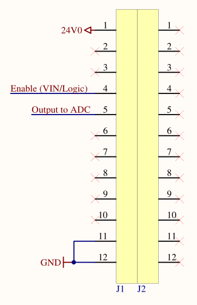

# SSCP - Suspension Travel Sensor

# Suspension Travel Sensor

Project Owner: Vincent Sparacio

Overview:

This sensor need to be able to accurately measure the travel of the suspension as such a rate that it can see how the suspension behaves when the car goes over a bump. Is it critically damped? how much movement does the aero-body have?

Pinout:

The pinout is given by the following diagram:

24V0 is the input voltage (24V) which comes from the car. Enable (VIN/Logic) leads to the enable on the linear regulator which controls when the board is (when 24V) and is not (0V) powered on. The Output to ADC is the signal that is converted into the distance of suspension travel. This output signal is determined by the position of the linear potentiometer. The output voltage (Output to ADC) is given by the following relation:

(Vout / Vin * Length of extended potentiometer in inches**) = Position of the potentiometer; e.g., if vout is 1.1 volts, then we know that the potentiometer is halfway extended, etc.

**These will be added once it is decided what Vin and the length of the potentiometer will be.

Components Overview:

* The LT1678 acts as a current buffer for the low pass filter on the board. Otherwise, the potentiometer would alter the time constant of the filter. A Molex Microfit 3pin Header is used for the potentiometer to interface with the rest of the board. The linear potentiometer used in the sensor is a Celesco MLP-125 (8inch retracted length + 5 inch measuring length).The max resistance (when fully compressed is 10,000 ohms and has a life expectancy of ~25 million cycles, which is enough for a race or two. Their small size also means that they'll be light.In order to output a clean 3.3V for the sensor, the LDO used is the Texas Instruments TPS7A4901.
* The LT1678 acts as a current buffer for the low pass filter on the board. Otherwise, the potentiometer would alter the time constant of the filter. 
* A Molex Microfit 3pin Header is used for the potentiometer to interface with the rest of the board. 
* The linear potentiometer used in the sensor is a Celesco MLP-125 (8inch retracted length + 5 inch measuring length).The max resistance (when fully compressed is 10,000 ohms and has a life expectancy of ~25 million cycles, which is enough for a race or two. Their small size also means that they'll be light.
* The max resistance (when fully compressed is 10,000 ohms and has a life expectancy of ~25 million cycles, which is enough for a race or two. Their small size also means that they'll be light.
* In order to output a clean 3.3V for the sensor, the LDO used is the Texas Instruments TPS7A4901.

* The LT1678 acts as a current buffer for the low pass filter on the board. Otherwise, the potentiometer would alter the time constant of the filter. 
* A Molex Microfit 3pin Header is used for the potentiometer to interface with the rest of the board. 
* The linear potentiometer used in the sensor is a Celesco MLP-125 (8inch retracted length + 5 inch measuring length).The max resistance (when fully compressed is 10,000 ohms and has a life expectancy of ~25 million cycles, which is enough for a race or two. Their small size also means that they'll be light.
* The max resistance (when fully compressed is 10,000 ohms and has a life expectancy of ~25 million cycles, which is enough for a race or two. Their small size also means that they'll be light.
* In order to output a clean 3.3V for the sensor, the LDO used is the Texas Instruments TPS7A4901.

The LT1678 acts as a current buffer for the low pass filter on the board. Otherwise, the potentiometer would alter the time constant of the filter. 

[LT1678](http://cds.linear.com/docs/Datasheet/16789fs.pdf)

A Molex Microfit 3pin Header is used for the potentiometer to interface with the rest of the board. 

[Molex Microfit 3pin Header](http://datasheet.octopart.com/43650-0316-Molex-datasheet-35451.pdf)

The linear potentiometer used in the sensor is a Celesco MLP-125 (8inch retracted length + 5 inch measuring length).

[Celesco MLP-125](http://www.celesco.com/_datasheets/mlp.pdf)

* The max resistance (when fully compressed is 10,000 ohms and has a life expectancy of ~25 million cycles, which is enough for a race or two. Their small size also means that they'll be light.

The max resistance (when fully compressed is 10,000 ohms and has a life expectancy of ~25 million cycles, which is enough for a race or two. Their small size also means that they'll be light.

In order to output a clean 3.3V for the sensor, the LDO used is the Texas Instruments TPS7A4901.

[ Texas Instruments TPS7A4901](http://www.ti.com/lit/ds/symlink/tps7a4901.pdf)

Decision Design Log:

* Rather than using an LDO, an instrumentation op-amp was considered in order to filter out power supply noise. For our purposes, the LDO should be sufficient to produce a clean enough signal for the potentiometer.A 5.1K ohm resister may be put in series with the potentiometer, but can also be replaced with a 0 ohm resistor (ref. 5K1). The purpose is to ensure that the voltage never exceeds 3.3 volts, but because we are powering the op-amp with the same 3.3V from the LDO, it is not entirely necessary.
* Rather than using an LDO, an instrumentation op-amp was considered in order to filter out power supply noise. For our purposes, the LDO should be sufficient to produce a clean enough signal for the potentiometer.
* A 5.1K ohm resister may be put in series with the potentiometer, but can also be replaced with a 0 ohm resistor (ref. 5K1). The purpose is to ensure that the voltage never exceeds 3.3 volts, but because we are powering the op-amp with the same 3.3V from the LDO, it is not entirely necessary.

* Rather than using an LDO, an instrumentation op-amp was considered in order to filter out power supply noise. For our purposes, the LDO should be sufficient to produce a clean enough signal for the potentiometer.
* A 5.1K ohm resister may be put in series with the potentiometer, but can also be replaced with a 0 ohm resistor (ref. 5K1). The purpose is to ensure that the voltage never exceeds 3.3 volts, but because we are powering the op-amp with the same 3.3V from the LDO, it is not entirely necessary.

Rather than using an LDO, an instrumentation op-amp was considered in order to filter out power supply noise. For our purposes, the LDO should be sufficient to produce a clean enough signal for the potentiometer.

A 5.1K ohm resister may be put in series with the potentiometer, but can also be replaced with a 0 ohm resistor (ref. 5K1). The purpose is to ensure that the voltage never exceeds 3.3 volts, but because we are powering the op-amp with the same 3.3V from the LDO, it is not entirely necessary.

### Embedded Google Drive File

Google Drive File: [Embedded Content](https://drive.google.com/embeddedfolderview?id=1uEAFOUGDFxI2vcXMpNKxwzsCZjQIJ6gS#list)

<iframe width="100%" height="400" src="https://drive.google.com/embeddedfolderview?id=1uEAFOUGDFxI2vcXMpNKxwzsCZjQIJ6gS#list" frameborder="0"></iframe>

