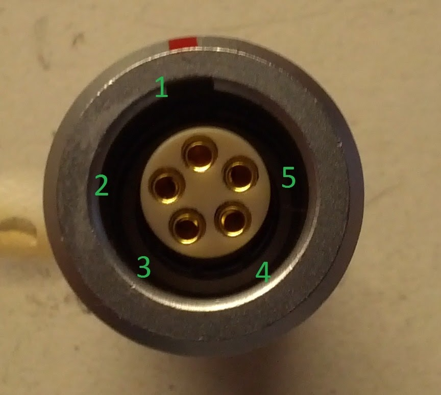

# SSCP - Luminos Pinouts and Connector Part Numbers

# Luminos Pinouts and Connector Part Numbers

### (CAN) Phoenix M12 A Code

CAN Pinout

### Embedded Content

Embedded content: [Custom embed]()

<iframe width="100%" height="400" src="" frameborder="0"></iframe>

Male M12 Pinout:

Phoenix Part Numbers:

Phoenix Part Numbers:

    Male PCB Mount 5 Pos Outside Nut: 1694224, used extensively

    Male PCB Inside Nut: 1436602 (not used)

    Male Panel Mount Square Flange: 1440973, used on the battery and MPPT box

    Male Panel Mount Round Flange: 1671111, not used due to the superiority of 1440973 on thin fiberglass panel

    

Tees (1 Male 2 Female)

    

    Simple Tee: Phoenix 1541186, used extensively

    Bolt mount Tee: Phoenix 1507793, heavy, do not use

### Steering Wheel Connection

### Embedded Content

Embedded content: [Custom embed]()

<iframe width="100%" height="400" src="" frameborder="0"></iframe>

### (Many) Deutsch DTM-12

Light Board Outputs (12POS)

B Code Deutch Connector (Black Box front)

Pin List

Part Numbers (from wirecare.com):

    Female Connector, key A, for heat shrink: DTM06-12SA-E007

    Female Connector, key B, for heat shrink: DTM06-12SB-E007

    Wedgelock (needed for female connector): WM-12S

    Pins: 0462-201-20141 (nickel, 20ga)

     Pins: 0462-201-2031 (gold, 20ga)

     Pins: 0462-005-20141(gold 16-18ga)

    Protective Boot: DTM12S-BT (this sucks, don't buy it)

    Sealing Plugs (for sealing unused pins): 0413-204-2005

Light Cabling: 

    Four corners of car:

        Front Left/Right: 

            Black: Turn-

            Red: Turn +

            Green: Headlight+   

            White:    Headlight-

        Rear Left/Right: 

            Black: Brake -

            Red:  Brake +

            Green:  Turn +

            White:    Turn -

        Rear Bubble: 

            Black: Brake -

            Red:   Brake +

Tire Pressure External Output (12 POS)

A Coded (Grey Box front)

### Embedded Content

Embedded content: [Custom embed]()

<iframe width="100%" height="400" src="" frameborder="0"></iframe>

### Embedded Content

Embedded content: [Custom embed]()

<iframe width="100%" height="400" src="" frameborder="0"></iframe>

Driver Controls Inputs

A Code (Grey Box Front)

### Embedded Content

Embedded content: [Custom embed]()

<iframe width="100%" height="400" src="" frameborder="0"></iframe>

(Pedals) TE Superseal 1.5 Pedal Sensor Connectors (North America Version)

Used for Pedal Sensors (http://www.mouser.com/ProductDetail/Honeywell/RTY060LVNAX/?qs=F9TaENl%252b8CBk8p5RBbW/zw==)

[http://www.mouser.com/ProductDetail/Honeywell/RTY060LVNAX/?qs=F9TaENl%252b8CBk8p5RBbW/zw==](http://www.mouser.com/ProductDetail/Honeywell/RTY060LVNAX/?qs=F9TaENl%252b8CBk8p5RBbW/zw==)

TE Part Numbers:

Boot: 880811-2

Wire Seal: 281934-2

Connector: 282087-1

Pins: 282403-1 (Correct, Mouser shipped the incorrect part)

### (High Voltage) TE HVA280

Used for Pack->array and Pack->Motor controllers

### Embedded Content

Embedded content: [Custom embed]()

<iframe width="100%" height="400" src="" frameborder="0"></iframe>

 1

 2

 HV+

 HV-

Part Numbers:

3 Bay Header,  ADE Code: 2103340-1

1 Bay Header, A Code: 

Plug, Finger Actuated, Individually shielded, A code: 

Plug, Finger Actuated, Individually shielded, D code: 

Plug, Finger Actuated, Individually shielded, E code: 

### (Battery Pack HV) Ring Terminals

### Molex 10ga Crimps with M5 Stud

### (Battery Pack HV Sense) Ring Terminals

Molex 22ga crimps

### Motor HV

### Embedded Content

Embedded content: [Custom embed]()

<iframe width="100%" height="400" src="" frameborder="0"></iframe>

### Motor Resolver

### Embedded Content

Embedded content: [Custom embed]()

<iframe width="100%" height="400" src="" frameborder="0"></iframe>

