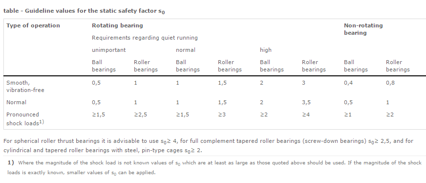
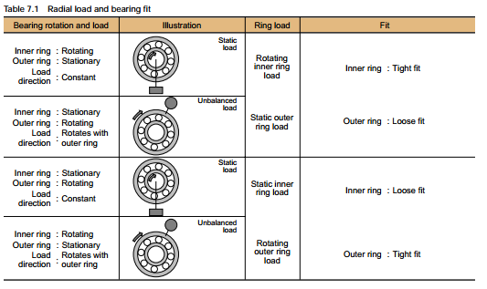
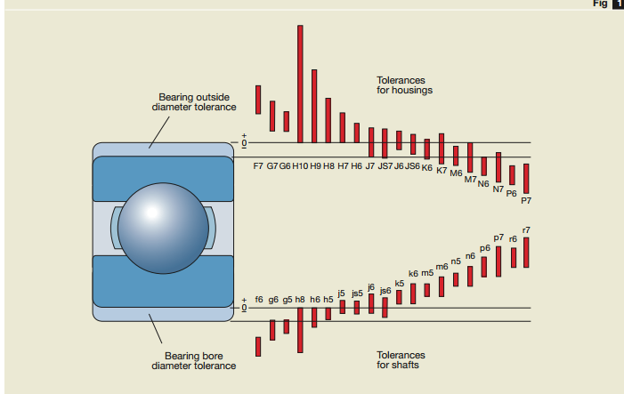
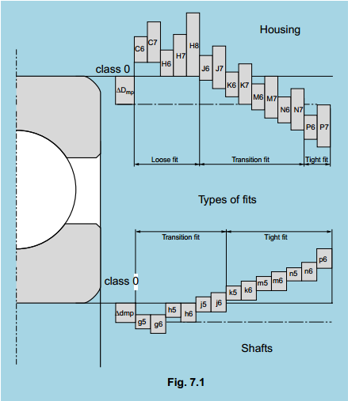
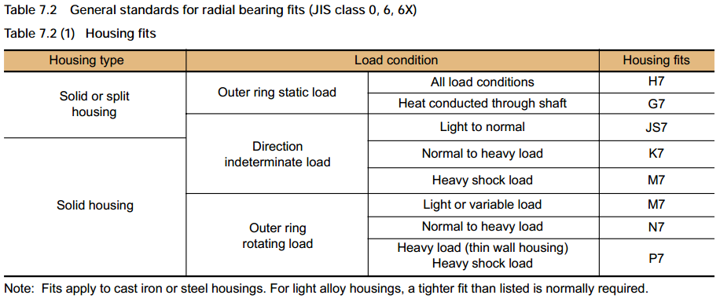
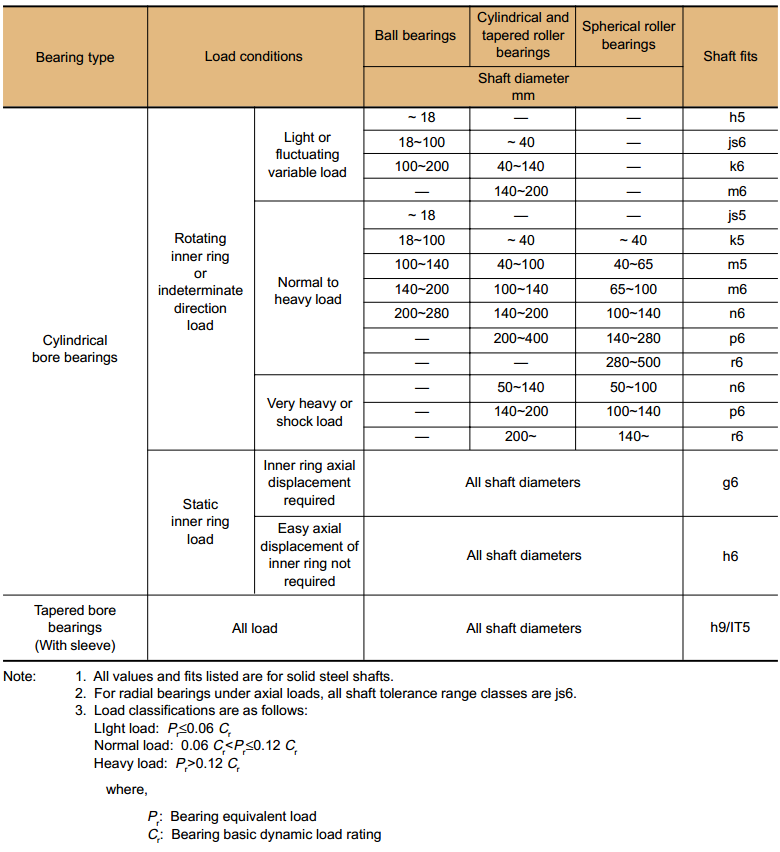
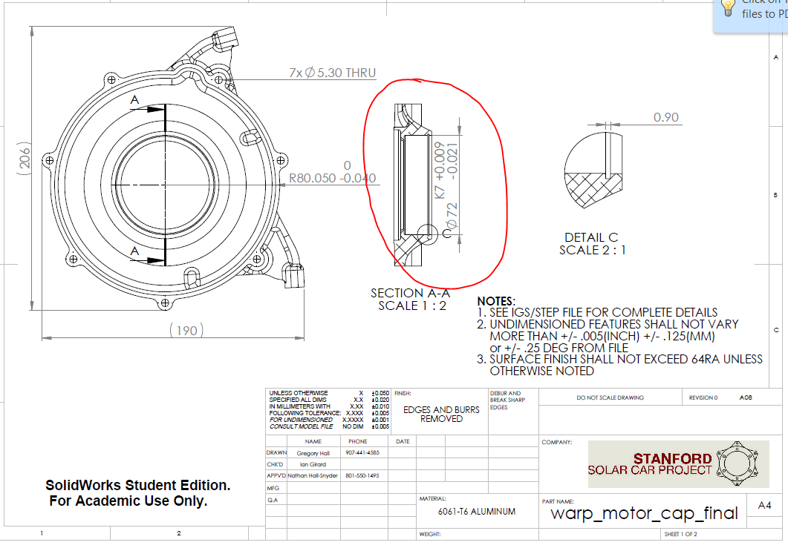

# bearing-design

## SSCP - Bearing Design

## Bearing Design

### HOW TO DESIGN STUFF WITH BEARINGS

Before starting, I suggest you read the SKF Guide to Bearing Design for Electric Motors: http://www.promshop.info/cataloguespdf/rolling.pdf

[http://www.promshop.info/cataloguespdf/rolling.pdf](http://www.promshop.info/cataloguespdf/rolling.pdf)

Sweet! Now, you can start designing bearings!

* Determine the static and dynamic loads for the bearing set in kN or kgF, using math and the loading conditions at the bottom of the Mechanical page. Then select the appropriate factor of safety based on the expected loads. NOTE: THIS IS COUNTER-INTUITIVE AND INVOLVES MATH, SEE BELOW:Static load is the greatest load that the bearing will ever see during a transient event, e.g. shockDynamic load is the steady state rotating load. Use the SKF factor of safety table to determine the derating factor of your bearing. For the Warp Motor we used the noise-unimportant >=1,5 for the outer, shock-loaded bearing and >= 1 for the inner, non-shock-loaded bearing.
* Determine the static and dynamic loads for the bearing set in kN or kgF, using math and the loading conditions at the bottom of the Mechanical page. Then select the appropriate factor of safety based on the expected loads. NOTE: THIS IS COUNTER-INTUITIVE AND INVOLVES MATH, SEE BELOW:
* Static load is the greatest load that the bearing will ever see during a transient event, e.g. shock
* Dynamic load is the steady state rotating load. Use the SKF factor of safety table to determine the derating factor of your bearing. For the Warp Motor we used the noise-unimportant >=1,5 for the outer, shock-loaded bearing and >= 1 for the inner, non-shock-loaded bearing.
* Use the SKF factor of safety table to determine the derating factor of your bearing. For the Warp Motor we used the noise-unimportant >=1,5 for the outer, shock-loaded bearing and >= 1 for the inner, non-shock-loaded bearing.

1. Determine the static and dynamic loads for the bearing set in kN or kgF, using math and the loading conditions at the bottom of the Mechanical page. Then select the appropriate factor of safety based on the expected loads. NOTE: THIS IS COUNTER-INTUITIVE AND INVOLVES MATH, SEE BELOW:
2. Static load is the greatest load that the bearing will ever see during a transient event, e.g. shock
3. Dynamic load is the steady state rotating load. Use the SKF factor of safety table to determine the derating factor of your bearing. For the Warp Motor we used the noise-unimportant >=1,5 for the outer, shock-loaded bearing and >= 1 for the inner, non-shock-loaded bearing.
4. Use the SKF factor of safety table to determine the derating factor of your bearing. For the Warp Motor we used the noise-unimportant >=1,5 for the outer, shock-loaded bearing and >= 1 for the inner, non-shock-loaded bearing.

Determine the static and dynamic loads for the bearing set in kN or kgF, using math and the loading conditions at the bottom of the Mechanical page. Then select the appropriate factor of safety based on the expected loads. NOTE: THIS IS COUNTER-INTUITIVE AND INVOLVES MATH, SEE BELOW:

[Mechanical](../../../../../../stanford.edu/testduplicationsscp/home/sscp-2012-2013/mechanical-2012-2013/)

Static load is the greatest load that the bearing will ever see during a transient event, e.g. shock

Dynamic load is the steady state rotating load.&#x20;

1. Use the SKF factor of safety table to determine the derating factor of your bearing. For the Warp Motor we used the noise-unimportant >=1,5 for the outer, shock-loaded bearing and >= 1 for the inner, non-shock-loaded bearing.

Use the SKF factor of safety table to determine the derating factor of your bearing. For the Warp Motor we used the noise-unimportant >=1,5 for the outer, shock-loaded bearing and >= 1 for the inner, non-shock-loaded bearing.

* http://www.skf.com/group/products/bearings-units-housings/roller-bearings/principles/selection-of-bearing-size/selecting-bearing-size-using-static-load/required-basic-static-load-rating/index.html
* http://www.skf.com/group/products/bearings-units-housings/roller-bearings/principles/selection-of-bearing-size/selecting-bearing-size-using-static-load/required-basic-static-load-rating/index.html
* http://www.skf.com/group/products/bearings-units-housings/roller-bearings/principles/selection-of-bearing-size/selecting-bearing-size-using-static-load/required-basic-static-load-rating/index.html
* http://www.skf.com/group/products/bearings-units-housings/roller-bearings/principles/selection-of-bearing-size/selecting-bearing-size-using-static-load/required-basic-static-load-rating/index.html
* http://www.skf.com/group/products/bearings-units-housings/roller-bearings/principles/selection-of-bearing-size/selecting-bearing-size-using-static-load/required-basic-static-load-rating/index.html

1. http://www.skf.com/group/products/bearings-units-housings/roller-bearings/principles/selection-of-bearing-size/selecting-bearing-size-using-static-load/required-basic-static-load-rating/index.html

http://www.skf.com/group/products/bearings-units-housings/roller-bearings/principles/selection-of-bearing-size/selecting-bearing-size-using-static-load/required-basic-static-load-rating/index.html

[http://www.skf.com/group/products/bearings-units-housings/roller-bearings/principles/selection-of-bearing-size/selecting-bearing-size-using-static-load/required-basic-static-load-rating/index.html](http://www.skf.com/group/products/bearings-units-housings/roller-bearings/principles/selection-of-bearing-size/selecting-bearing-size-using-static-load/required-basic-static-load-rating/index.html)

1. Determine the bearing types, following these rulesUse the proper type of bearing for the load:Deep Groove ("Normal" Bearings) for primarily medium radial loads and some axial loads and minimal axial misalignment (LOW FRICTION)Self Aligning Ball Bearings for medium radial loads, no axial loads, and some to large axial misalignment (VERY LOW FRICTION)Roller Bearings for only high radial loads, no axial loads, and no axial misalignment (VERY LOW FRICTION)Spherical Roller Bearings for only high radial loads, no axial loads, and some axial misalignment (MEDIUM FRICTION)Angular Contact Bearing for medium radial loads and medium axial loads, and no axial misalignment (MEDIUM FRICTION)Tapered Roller Bearings for high radial loads and high axial loads and no axial misalignment (MEDIUM FRICTION)Spherical Roller Thrust Bearings for high radial loads, high axial loads, and some axial misalignment (MEDIUM FRICTION)Ball Thrust Bearings for no radial loads, medium axial loads, and small axial misalignment (VERY LOW FRICTION)Cylindrical Roller Thrust Bearings for no radial loads, high axial loads, and some axial misalignment (VERY HIGH FRICTION)More bearing types exist, browse the SKF catalog to have your mind blown
2. Use the proper type of bearing for the load:Deep Groove ("Normal" Bearings) for primarily medium radial loads and some axial loads and minimal axial misalignment (LOW FRICTION)Self Aligning Ball Bearings for medium radial loads, no axial loads, and some to large axial misalignment (VERY LOW FRICTION)Roller Bearings for only high radial loads, no axial loads, and no axial misalignment (VERY LOW FRICTION)Spherical Roller Bearings for only high radial loads, no axial loads, and some axial misalignment (MEDIUM FRICTION)Angular Contact Bearing for medium radial loads and medium axial loads, and no axial misalignment (MEDIUM FRICTION)Tapered Roller Bearings for high radial loads and high axial loads and no axial misalignment (MEDIUM FRICTION)Spherical Roller Thrust Bearings for high radial loads, high axial loads, and some axial misalignment (MEDIUM FRICTION)Ball Thrust Bearings for no radial loads, medium axial loads, and small axial misalignment (VERY LOW FRICTION)Cylindrical Roller Thrust Bearings for no radial loads, high axial loads, and some axial misalignment (VERY HIGH FRICTION)More bearing types exist, browse the SKF catalog to have your mind blown
3. Deep Groove ("Normal" Bearings) for primarily medium radial loads and some axial loads and minimal axial misalignment (LOW FRICTION)Self Aligning Ball Bearings for medium radial loads, no axial loads, and some to large axial misalignment (VERY LOW FRICTION)Roller Bearings for only high radial loads, no axial loads, and no axial misalignment (VERY LOW FRICTION)Spherical Roller Bearings for only high radial loads, no axial loads, and some axial misalignment (MEDIUM FRICTION)Angular Contact Bearing for medium radial loads and medium axial loads, and no axial misalignment (MEDIUM FRICTION)Tapered Roller Bearings for high radial loads and high axial loads and no axial misalignment (MEDIUM FRICTION)Spherical Roller Thrust Bearings for high radial loads, high axial loads, and some axial misalignment (MEDIUM FRICTION)Ball Thrust Bearings for no radial loads, medium axial loads, and small axial misalignment (VERY LOW FRICTION)Cylindrical Roller Thrust Bearings for no radial loads, high axial loads, and some axial misalignment (VERY HIGH FRICTION)More bearing types exist, browse the SKF catalog to have your mind blown
4. Deep Groove ("Normal" Bearings) for primarily medium radial loads and some axial loads and minimal axial misalignment (LOW FRICTION)
5. Self Aligning Ball Bearings for medium radial loads, no axial loads, and some to large axial misalignment (VERY LOW FRICTION)
6. Roller Bearings for only high radial loads, no axial loads, and no axial misalignment (VERY LOW FRICTION)
7. Spherical Roller Bearings for only high radial loads, no axial loads, and some axial misalignment (MEDIUM FRICTION)
8. Angular Contact Bearing for medium radial loads and medium axial loads, and no axial misalignment (MEDIUM FRICTION)
9. Tapered Roller Bearings for high radial loads and high axial loads and no axial misalignment (MEDIUM FRICTION)
10. Spherical Roller Thrust Bearings for high radial loads, high axial loads, and some axial misalignment (MEDIUM FRICTION)
11. Ball Thrust Bearings for no radial loads, medium axial loads, and small axial misalignment (VERY LOW FRICTION)
12. Cylindrical Roller Thrust Bearings for no radial loads, high axial loads, and some axial misalignment (VERY HIGH FRICTION)
13. More bearing types exist, browse the SKF catalog to have your mind blown

Determine the bearing types, following these rules

1. Use the proper type of bearing for the load:Deep Groove ("Normal" Bearings) for primarily medium radial loads and some axial loads and minimal axial misalignment (LOW FRICTION)Self Aligning Ball Bearings for medium radial loads, no axial loads, and some to large axial misalignment (VERY LOW FRICTION)Roller Bearings for only high radial loads, no axial loads, and no axial misalignment (VERY LOW FRICTION)Spherical Roller Bearings for only high radial loads, no axial loads, and some axial misalignment (MEDIUM FRICTION)Angular Contact Bearing for medium radial loads and medium axial loads, and no axial misalignment (MEDIUM FRICTION)Tapered Roller Bearings for high radial loads and high axial loads and no axial misalignment (MEDIUM FRICTION)Spherical Roller Thrust Bearings for high radial loads, high axial loads, and some axial misalignment (MEDIUM FRICTION)Ball Thrust Bearings for no radial loads, medium axial loads, and small axial misalignment (VERY LOW FRICTION)Cylindrical Roller Thrust Bearings for no radial loads, high axial loads, and some axial misalignment (VERY HIGH FRICTION)More bearing types exist, browse the SKF catalog to have your mind blown
2. Deep Groove ("Normal" Bearings) for primarily medium radial loads and some axial loads and minimal axial misalignment (LOW FRICTION)Self Aligning Ball Bearings for medium radial loads, no axial loads, and some to large axial misalignment (VERY LOW FRICTION)Roller Bearings for only high radial loads, no axial loads, and no axial misalignment (VERY LOW FRICTION)Spherical Roller Bearings for only high radial loads, no axial loads, and some axial misalignment (MEDIUM FRICTION)Angular Contact Bearing for medium radial loads and medium axial loads, and no axial misalignment (MEDIUM FRICTION)Tapered Roller Bearings for high radial loads and high axial loads and no axial misalignment (MEDIUM FRICTION)Spherical Roller Thrust Bearings for high radial loads, high axial loads, and some axial misalignment (MEDIUM FRICTION)Ball Thrust Bearings for no radial loads, medium axial loads, and small axial misalignment (VERY LOW FRICTION)Cylindrical Roller Thrust Bearings for no radial loads, high axial loads, and some axial misalignment (VERY HIGH FRICTION)More bearing types exist, browse the SKF catalog to have your mind blown
3. Deep Groove ("Normal" Bearings) for primarily medium radial loads and some axial loads and minimal axial misalignment (LOW FRICTION)
4. Self Aligning Ball Bearings for medium radial loads, no axial loads, and some to large axial misalignment (VERY LOW FRICTION)
5. Roller Bearings for only high radial loads, no axial loads, and no axial misalignment (VERY LOW FRICTION)
6. Spherical Roller Bearings for only high radial loads, no axial loads, and some axial misalignment (MEDIUM FRICTION)
7. Angular Contact Bearing for medium radial loads and medium axial loads, and no axial misalignment (MEDIUM FRICTION)
8. Tapered Roller Bearings for high radial loads and high axial loads and no axial misalignment (MEDIUM FRICTION)
9. Spherical Roller Thrust Bearings for high radial loads, high axial loads, and some axial misalignment (MEDIUM FRICTION)
10. Ball Thrust Bearings for no radial loads, medium axial loads, and small axial misalignment (VERY LOW FRICTION)
11. Cylindrical Roller Thrust Bearings for no radial loads, high axial loads, and some axial misalignment (VERY HIGH FRICTION)
12. More bearing types exist, browse the SKF catalog to have your mind blown

Use the proper type of bearing for the load:

1. Deep Groove ("Normal" Bearings) for primarily medium radial loads and some axial loads and minimal axial misalignment (LOW FRICTION)Self Aligning Ball Bearings for medium radial loads, no axial loads, and some to large axial misalignment (VERY LOW FRICTION)Roller Bearings for only high radial loads, no axial loads, and no axial misalignment (VERY LOW FRICTION)Spherical Roller Bearings for only high radial loads, no axial loads, and some axial misalignment (MEDIUM FRICTION)Angular Contact Bearing for medium radial loads and medium axial loads, and no axial misalignment (MEDIUM FRICTION)Tapered Roller Bearings for high radial loads and high axial loads and no axial misalignment (MEDIUM FRICTION)Spherical Roller Thrust Bearings for high radial loads, high axial loads, and some axial misalignment (MEDIUM FRICTION)Ball Thrust Bearings for no radial loads, medium axial loads, and small axial misalignment (VERY LOW FRICTION)Cylindrical Roller Thrust Bearings for no radial loads, high axial loads, and some axial misalignment (VERY HIGH FRICTION)More bearing types exist, browse the SKF catalog to have your mind blown
2. Deep Groove ("Normal" Bearings) for primarily medium radial loads and some axial loads and minimal axial misalignment (LOW FRICTION)
3. Self Aligning Ball Bearings for medium radial loads, no axial loads, and some to large axial misalignment (VERY LOW FRICTION)
4. Roller Bearings for only high radial loads, no axial loads, and no axial misalignment (VERY LOW FRICTION)
5. Spherical Roller Bearings for only high radial loads, no axial loads, and some axial misalignment (MEDIUM FRICTION)
6. Angular Contact Bearing for medium radial loads and medium axial loads, and no axial misalignment (MEDIUM FRICTION)
7. Tapered Roller Bearings for high radial loads and high axial loads and no axial misalignment (MEDIUM FRICTION)
8. Spherical Roller Thrust Bearings for high radial loads, high axial loads, and some axial misalignment (MEDIUM FRICTION)
9. Ball Thrust Bearings for no radial loads, medium axial loads, and small axial misalignment (VERY LOW FRICTION)
10. Cylindrical Roller Thrust Bearings for no radial loads, high axial loads, and some axial misalignment (VERY HIGH FRICTION)
11. More bearing types exist, browse the SKF catalog to have your mind blown
12. Deep Groove ("Normal" Bearings) for primarily medium radial loads and some axial loads and minimal axial misalignment (LOW FRICTION)
13. Self Aligning Ball Bearings for medium radial loads, no axial loads, and some to large axial misalignment (VERY LOW FRICTION)
14. Roller Bearings for only high radial loads, no axial loads, and no axial misalignment (VERY LOW FRICTION)
15. Spherical Roller Bearings for only high radial loads, no axial loads, and some axial misalignment (MEDIUM FRICTION)
16. Angular Contact Bearing for medium radial loads and medium axial loads, and no axial misalignment (MEDIUM FRICTION)
17. Tapered Roller Bearings for high radial loads and high axial loads and no axial misalignment (MEDIUM FRICTION)
18. Spherical Roller Thrust Bearings for high radial loads, high axial loads, and some axial misalignment (MEDIUM FRICTION)
19. Ball Thrust Bearings for no radial loads, medium axial loads, and small axial misalignment (VERY LOW FRICTION)
20. Cylindrical Roller Thrust Bearings for no radial loads, high axial loads, and some axial misalignment (VERY HIGH FRICTION)
21. More bearing types exist, browse the SKF catalog to have your mind blown

Deep Groove ("Normal" Bearings) for primarily medium radial loads and some axial loads and minimal axial misalignment (LOW FRICTION)

Self Aligning Ball Bearings for medium radial loads, no axial loads, and some to large axial misalignment (VERY LOW FRICTION)

Roller Bearings for only high radial loads, no axial loads, and no axial misalignment (VERY LOW FRICTION)

Spherical Roller Bearings for only high radial loads, no axial loads, and some axial misalignment (MEDIUM FRICTION)

Angular Contact Bearing for medium radial loads and medium axial loads, and no axial misalignment (MEDIUM FRICTION)

Tapered Roller Bearings for high radial loads and high axial loads and no axial misalignment (MEDIUM FRICTION)

Spherical Roller Thrust Bearings for high radial loads, high axial loads, and some axial misalignment (MEDIUM FRICTION)

Ball Thrust Bearings for no radial loads, medium axial loads, and small axial misalignment (VERY LOW FRICTION)

Cylindrical Roller Thrust Bearings for no radial loads, high axial loads, and some axial misalignment (VERY HIGH FRICTION)

More bearing types exist, browse the SKF catalog to have your mind blown

* Bearing assemblies must not be "hyper-static", or over-defined. Bearing Assemblies must not be hyper-static on both the outer and inner races. Common ways of making sure this is correct include using a deep groove bearing (defines both axial and radial motion) and a roller bearing (defines only radial motion). Hyper-static bearing systems will dramatically reduce bearing life, especially when using bearings not designed for axial force and when different temperatures cause thermal expansion.Bearing assemblies must have a method of keeping out environmental contaminants. Bearing protections generally are:Open - protected by external seals, can presents lubrication problemsShielded - Protected by a metal flange, reliable lubricationSealed - Protected by a rubber seal, reliable lubrication
* Bearing assemblies must not be "hyper-static", or over-defined. Bearing Assemblies must not be hyper-static on both the outer and inner races. Common ways of making sure this is correct include using a deep groove bearing (defines both axial and radial motion) and a roller bearing (defines only radial motion). Hyper-static bearing systems will dramatically reduce bearing life, especially when using bearings not designed for axial force and when different temperatures cause thermal expansion.Bearing assemblies must have a method of keeping out environmental contaminants. Bearing protections generally are:Open - protected by external seals, can presents lubrication problemsShielded - Protected by a metal flange, reliable lubricationSealed - Protected by a rubber seal, reliable lubrication
* Bearing assemblies must not be "hyper-static", or over-defined. Bearing Assemblies must not be hyper-static on both the outer and inner races. Common ways of making sure this is correct include using a deep groove bearing (defines both axial and radial motion) and a roller bearing (defines only radial motion). Hyper-static bearing systems will dramatically reduce bearing life, especially when using bearings not designed for axial force and when different temperatures cause thermal expansion.
* Bearing assemblies must have a method of keeping out environmental contaminants. Bearing protections generally are:Open - protected by external seals, can presents lubrication problemsShielded - Protected by a metal flange, reliable lubricationSealed - Protected by a rubber seal, reliable lubrication
* Open - protected by external seals, can presents lubrication problems
* Shielded - Protected by a metal flange, reliable lubrication
* Sealed - Protected by a rubber seal, reliable lubrication
* Bearing assemblies must not be "hyper-static", or over-defined. Bearing Assemblies must not be hyper-static on both the outer and inner races. Common ways of making sure this is correct include using a deep groove bearing (defines both axial and radial motion) and a roller bearing (defines only radial motion). Hyper-static bearing systems will dramatically reduce bearing life, especially when using bearings not designed for axial force and when different temperatures cause thermal expansion.Bearing assemblies must have a method of keeping out environmental contaminants. Bearing protections generally are:Open - protected by external seals, can presents lubrication problemsShielded - Protected by a metal flange, reliable lubricationSealed - Protected by a rubber seal, reliable lubrication
* Bearing assemblies must not be "hyper-static", or over-defined. Bearing Assemblies must not be hyper-static on both the outer and inner races. Common ways of making sure this is correct include using a deep groove bearing (defines both axial and radial motion) and a roller bearing (defines only radial motion). Hyper-static bearing systems will dramatically reduce bearing life, especially when using bearings not designed for axial force and when different temperatures cause thermal expansion.
* Bearing assemblies must have a method of keeping out environmental contaminants. Bearing protections generally are:Open - protected by external seals, can presents lubrication problemsShielded - Protected by a metal flange, reliable lubricationSealed - Protected by a rubber seal, reliable lubrication
* Open - protected by external seals, can presents lubrication problems
* Shielded - Protected by a metal flange, reliable lubrication
* Sealed - Protected by a rubber seal, reliable lubrication

1. Bearing assemblies must not be "hyper-static", or over-defined. Bearing Assemblies must not be hyper-static on both the outer and inner races. Common ways of making sure this is correct include using a deep groove bearing (defines both axial and radial motion) and a roller bearing (defines only radial motion). Hyper-static bearing systems will dramatically reduce bearing life, especially when using bearings not designed for axial force and when different temperatures cause thermal expansion.
2. Bearing assemblies must have a method of keeping out environmental contaminants. Bearing protections generally are:Open - protected by external seals, can presents lubrication problemsShielded - Protected by a metal flange, reliable lubricationSealed - Protected by a rubber seal, reliable lubrication
3. Open - protected by external seals, can presents lubrication problems
4. Shielded - Protected by a metal flange, reliable lubrication
5. Sealed - Protected by a rubber seal, reliable lubrication

Bearing assemblies must not be "hyper-static", or over-defined. Bearing Assemblies must not be hyper-static on both the outer and inner races. Common ways of making sure this is correct include using a deep groove bearing (defines both axial and radial motion) and a roller bearing (defines only radial motion). Hyper-static bearing systems will dramatically reduce bearing life, especially when using bearings not designed for axial force and when different temperatures cause thermal expansion.

Bearing assemblies must have a method of keeping out environmental contaminants. Bearing protections generally are:

1. Open - protected by external seals, can presents lubrication problems
2. Shielded - Protected by a metal flange, reliable lubrication
3. Sealed - Protected by a rubber seal, reliable lubrication

Open - protected by external seals, can presents lubrication problems

Shielded - Protected by a metal flange, reliable lubrication

Sealed - Protected by a rubber seal, reliable lubrication

1. Bearing assemblies should have the proper pre-load. Preload is the amount of axial force applied to a bearing to keep the bearing system constrained. Some bearing types do well with preload, others do not. Preload is specified by the manufacturer, though you will need to choose between none, light, medium, and heavy preload. For example, Deep groove bearings should not be excessively preloaded, but tapered roller bearings and angular contact bearings generally have a large amount of preload. How is preload accomplished?
2. Bearing assemblies should have the proper pre-load. Preload is the amount of axial force applied to a bearing to keep the bearing system constrained. Some bearing types do well with preload, others do not. Preload is specified by the manufacturer, though you will need to choose between none, light, medium, and heavy preload. For example, Deep groove bearings should not be excessively preloaded, but tapered roller bearings and angular contact bearings generally have a large amount of preload. How is preload accomplished?
3. Bearing assemblies should have the proper pre-load. Preload is the amount of axial force applied to a bearing to keep the bearing system constrained. Some bearing types do well with preload, others do not. Preload is specified by the manufacturer, though you will need to choose between none, light, medium, and heavy preload. For example, Deep groove bearings should not be excessively preloaded, but tapered roller bearings and angular contact bearings generally have a large amount of preload. How is preload accomplished?

Bearing assemblies should have the proper pre-load. Preload is the amount of axial force applied to a bearing to keep the bearing system constrained. Some bearing types do well with preload, others do not. Preload is specified by the manufacturer, though you will need to choose between none, light, medium, and heavy preload. For example, Deep groove bearings should not be excessively preloaded, but tapered roller bearings and angular contact bearings generally have a large amount of preload. How is preload accomplished?

* Wave Spring: A wave spring with a calibrated force is introduced into the bearing stack that applies preload.Matched Pair: Two bearings are purchased together such that, when compressed together by a bearing nut, will have exactly the correct amount of preload. This is common for angular contact bearings.Magnets: The NGM motor uses the magnetic force between the rotor and iron core stator to accomplish preloadNut: A nut is tightened down to a specified torque to give bearing preloads. Commonly used on cars with beefy tapered roller bearings.Bearing assemblies should have low friction. See the excel document attached to the bottom of the page to design to minimize bearing friction.
* Wave Spring: A wave spring with a calibrated force is introduced into the bearing stack that applies preload.Matched Pair: Two bearings are purchased together such that, when compressed together by a bearing nut, will have exactly the correct amount of preload. This is common for angular contact bearings.Magnets: The NGM motor uses the magnetic force between the rotor and iron core stator to accomplish preloadNut: A nut is tightened down to a specified torque to give bearing preloads. Commonly used on cars with beefy tapered roller bearings.Bearing assemblies should have low friction. See the excel document attached to the bottom of the page to design to minimize bearing friction.
* Wave Spring: A wave spring with a calibrated force is introduced into the bearing stack that applies preload.
* Matched Pair: Two bearings are purchased together such that, when compressed together by a bearing nut, will have exactly the correct amount of preload. This is common for angular contact bearings.
* Magnets: The NGM motor uses the magnetic force between the rotor and iron core stator to accomplish preload
* Nut: A nut is tightened down to a specified torque to give bearing preloads. Commonly used on cars with beefy tapered roller bearings.
* Bearing assemblies should have low friction. See the excel document attached to the bottom of the page to design to minimize bearing friction.
* Wave Spring: A wave spring with a calibrated force is introduced into the bearing stack that applies preload.Matched Pair: Two bearings are purchased together such that, when compressed together by a bearing nut, will have exactly the correct amount of preload. This is common for angular contact bearings.Magnets: The NGM motor uses the magnetic force between the rotor and iron core stator to accomplish preloadNut: A nut is tightened down to a specified torque to give bearing preloads. Commonly used on cars with beefy tapered roller bearings.Bearing assemblies should have low friction. See the excel document attached to the bottom of the page to design to minimize bearing friction.
* Wave Spring: A wave spring with a calibrated force is introduced into the bearing stack that applies preload.
* Matched Pair: Two bearings are purchased together such that, when compressed together by a bearing nut, will have exactly the correct amount of preload. This is common for angular contact bearings.
* Magnets: The NGM motor uses the magnetic force between the rotor and iron core stator to accomplish preload
* Nut: A nut is tightened down to a specified torque to give bearing preloads. Commonly used on cars with beefy tapered roller bearings.
* Bearing assemblies should have low friction. See the excel document attached to the bottom of the page to design to minimize bearing friction.

1. Wave Spring: A wave spring with a calibrated force is introduced into the bearing stack that applies preload.
2. Matched Pair: Two bearings are purchased together such that, when compressed together by a bearing nut, will have exactly the correct amount of preload. This is common for angular contact bearings.
3. Magnets: The NGM motor uses the magnetic force between the rotor and iron core stator to accomplish preload
4. Nut: A nut is tightened down to a specified torque to give bearing preloads. Commonly used on cars with beefy tapered roller bearings.
5. Bearing assemblies should have low friction. See the excel document attached to the bottom of the page to design to minimize bearing friction.

Wave Spring: A wave spring with a calibrated force is introduced into the bearing stack that applies preload.

Matched Pair: Two bearings are purchased together such that, when compressed together by a bearing nut, will have exactly the correct amount of preload. This is common for angular contact bearings.

Magnets: The NGM motor uses the magnetic force between the rotor and iron core stator to accomplish preload

Nut: A nut is tightened down to a specified torque to give bearing preloads. Commonly used on cars with beefy tapered roller bearings.

Bearing assemblies should have low friction. See the excel document attached to the bottom of the page to design to minimize bearing friction.

1. Determine the bearing fits. This determines exactly how the bearing will be attached to your parts:

Determine the bearing fits. This determines exactly how the bearing will be attached to your parts:

* Determine the bearing tolerances: This is a call-out in an engineering drawing pointing to a bearing face, determined by surface specification of the bearings and the material of your part. See the Misumi Guide for what each fit class does: http://www.misumiusa.com/CategoryImages/Metric\_2006\_pdf/METRIC1835-1836.pdf. NOTE: OFTEN BEARINGS ARE SLIGHTLY UNDERSIZED FROM THEIR SPECIFIED DIAMETER. CONFIRM THAT THE BEARING IS THE SIZE YOU THINK IT IS BEFORE DESIGNING TOLERANCES. CONSIDER GIVING THE BEARING TO THE MACHINE SHOP FOR BETTER RESULTS. Common Bearing Tolerances are:Interference/Press Fit: See below, consult machine shopSlip Fit: See below, consult machine shopSlip Fit with Glue: design the fit for the glue specifications. We used Loctite 680 for a loose slip fit ( > .005"), Loctite 648 for a tight slip fit (.005" clearance or less)Standard fits (callouts go in drawings after consultation with a machine shop) are here:
* Determine the bearing tolerances: This is a call-out in an engineering drawing pointing to a bearing face, determined by surface specification of the bearings and the material of your part. See the Misumi Guide for what each fit class does: http://www.misumiusa.com/CategoryImages/Metric\_2006\_pdf/METRIC1835-1836.pdf.&#x20;
* NOTE: OFTEN BEARINGS ARE SLIGHTLY UNDERSIZED FROM THEIR SPECIFIED DIAMETER. CONFIRM THAT THE BEARING IS THE SIZE YOU THINK IT IS BEFORE DESIGNING TOLERANCES. CONSIDER GIVING THE BEARING TO THE MACHINE SHOP FOR BETTER RESULTS.&#x20;
* Common Bearing Tolerances are:Interference/Press Fit: See below, consult machine shopSlip Fit: See below, consult machine shopSlip Fit with Glue: design the fit for the glue specifications. We used Loctite 680 for a loose slip fit ( > .005"), Loctite 648 for a tight slip fit (.005" clearance or less)Standard fits (callouts go in drawings after consultation with a machine shop) are here:
* Interference/Press Fit: See below, consult machine shopSlip Fit: See below, consult machine shopSlip Fit with Glue: design the fit for the glue specifications. We used Loctite 680 for a loose slip fit ( > .005"), Loctite 648 for a tight slip fit (.005" clearance or less)Standard fits (callouts go in drawings after consultation with a machine shop) are here:
* Interference/Press Fit: See below, consult machine shop
* Slip Fit: See below, consult machine shop
* Slip Fit with Glue: design the fit for the glue specifications. We used Loctite 680 for a loose slip fit ( > .005"), Loctite 648 for a tight slip fit (.005" clearance or less)
* Standard fits (callouts go in drawings after consultation with a machine shop) are here:

1. Determine the bearing tolerances: This is a call-out in an engineering drawing pointing to a bearing face, determined by surface specification of the bearings and the material of your part. See the Misumi Guide for what each fit class does: http://www.misumiusa.com/CategoryImages/Metric\_2006\_pdf/METRIC1835-1836.pdf.&#x20;
2. NOTE: OFTEN BEARINGS ARE SLIGHTLY UNDERSIZED FROM THEIR SPECIFIED DIAMETER. CONFIRM THAT THE BEARING IS THE SIZE YOU THINK IT IS BEFORE DESIGNING TOLERANCES. CONSIDER GIVING THE BEARING TO THE MACHINE SHOP FOR BETTER RESULTS.&#x20;
3. Common Bearing Tolerances are:Interference/Press Fit: See below, consult machine shopSlip Fit: See below, consult machine shopSlip Fit with Glue: design the fit for the glue specifications. We used Loctite 680 for a loose slip fit ( > .005"), Loctite 648 for a tight slip fit (.005" clearance or less)Standard fits (callouts go in drawings after consultation with a machine shop) are here:
4. Interference/Press Fit: See below, consult machine shopSlip Fit: See below, consult machine shopSlip Fit with Glue: design the fit for the glue specifications. We used Loctite 680 for a loose slip fit ( > .005"), Loctite 648 for a tight slip fit (.005" clearance or less)Standard fits (callouts go in drawings after consultation with a machine shop) are here:
5. Interference/Press Fit: See below, consult machine shop
6. Slip Fit: See below, consult machine shop
7. Slip Fit with Glue: design the fit for the glue specifications. We used Loctite 680 for a loose slip fit ( > .005"), Loctite 648 for a tight slip fit (.005" clearance or less)
8. Standard fits (callouts go in drawings after consultation with a machine shop) are here:

Determine the bearing tolerances: This is a call-out in an engineering drawing pointing to a bearing face, determined by surface specification of the bearings and the material of your part. See the Misumi Guide for what each fit class does: http://www.misumiusa.com/CategoryImages/Metric\_2006\_pdf/METRIC1835-1836.pdf.&#x20;

[http://www.misumiusa.com/CategoryImages/Metric\_2006\_pdf/METRIC1835-1836.pdf](http://www.misumiusa.com/CategoryImages/Metric_2006_pdf/METRIC1835-1836.pdf)

NOTE: OFTEN BEARINGS ARE SLIGHTLY UNDERSIZED FROM THEIR SPECIFIED DIAMETER. CONFIRM THAT THE BEARING IS THE SIZE YOU THINK IT IS BEFORE DESIGNING TOLERANCES. CONSIDER GIVING THE BEARING TO THE MACHINE SHOP FOR BETTER RESULTS.&#x20;

Common Bearing Tolerances are:

1. Interference/Press Fit: See below, consult machine shopSlip Fit: See below, consult machine shopSlip Fit with Glue: design the fit for the glue specifications. We used Loctite 680 for a loose slip fit ( > .005"), Loctite 648 for a tight slip fit (.005" clearance or less)Standard fits (callouts go in drawings after consultation with a machine shop) are here:
2. Interference/Press Fit: See below, consult machine shop
3. Slip Fit: See below, consult machine shop
4. Slip Fit with Glue: design the fit for the glue specifications. We used Loctite 680 for a loose slip fit ( > .005"), Loctite 648 for a tight slip fit (.005" clearance or less)
5. Standard fits (callouts go in drawings after consultation with a machine shop) are here:
6. Interference/Press Fit: See below, consult machine shop
7. Slip Fit: See below, consult machine shop
8. Slip Fit with Glue: design the fit for the glue specifications. We used Loctite 680 for a loose slip fit ( > .005"), Loctite 648 for a tight slip fit (.005" clearance or less)
9. Standard fits (callouts go in drawings after consultation with a machine shop) are here:

Interference/Press Fit: See below, consult machine shop

Slip Fit: See below, consult machine shop

Slip Fit with Glue: design the fit for the glue specifications. We used Loctite 680 for a loose slip fit ( > .005"), Loctite 648 for a tight slip fit (.005" clearance or less)

Standard fits (callouts go in drawings after consultation with a machine shop) are here:

* Recommended bearing fits are listed here (recommendations from NTN)
* Recommended bearing fits are listed here (recommendations from NTN)
* Recommended bearing fits are listed here (recommendations from NTN)
* Recommended bearing fits are listed here (recommendations from NTN)
* Recommended bearing fits are listed here (recommendations from NTN)

1. Recommended bearing fits are listed here (recommendations from NTN)

Recommended bearing fits are listed here (recommendations from NTN)

* Example K7 Fit for the Warp motor main spindle bearing:
* Example K7 Fit for the Warp motor main spindle bearing:
* Example K7 Fit for the Warp motor main spindle bearing:
* Example K7 Fit for the Warp motor main spindle bearing:
* Example K7 Fit for the Warp motor main spindle bearing:

1. Example K7 Fit for the Warp motor main spindle bearing:

Example K7 Fit for the Warp motor main spindle bearing:

* Do your best to match the Coefficients of Thermal Expansion of your materials. If your bearings are 440C Stainless, use a 440C Stainless shaft. If the bearing is press-fit into aluminum, use a J7 fit instead of a H7 fit to make sure that the bearing is still held tightly even after expansion.
* Do your best to match the Coefficients of Thermal Expansion of your materials. If your bearings are 440C Stainless, use a 440C Stainless shaft. If the bearing is press-fit into aluminum, use a J7 fit instead of a H7 fit to make sure that the bearing is still held tightly even after expansion.

1. Do your best to match the Coefficients of Thermal Expansion of your materials. If your bearings are 440C Stainless, use a 440C Stainless shaft. If the bearing is press-fit into aluminum, use a J7 fit instead of a H7 fit to make sure that the bearing is still held tightly even after expansion.

Do your best to match the Coefficients of Thermal Expansion of your materials. If your bearings are 440C Stainless, use a 440C Stainless shaft. If the bearing is press-fit into aluminum, use a J7 fit instead of a H7 fit to make sure that the bearing is still held tightly even after expansion.

1. Prefer standard bearing sizes, so that if one manufacturer is being slow, we can use another.
2. If designing a motor, you should design for possible high voltages!Any conductive loop in your motor can pick up stray flux and induce voltages, especially with a fast-switching motor controller! This includes loops between the stator, bearings, and rotor.Any motor can act as a parallel-plate capacitor and accumulate charge, which might eventually discharge through the grease in your bearings!These factors may affect your design to varying degrees, depending on the motor design. On a two-bearing motor, using one conductive (metal) and one non-conductive (ceramic) bearing or using two SGR (shaft grounding rings,  http://www.est-aegis.com/ ) will solve the first, and most significant problem. Using two non-conductive bearings, or one SGR,  will solve the second problem. For reference, Tesla Motors uses two ceramic bearings for their motor.
3. Any conductive loop in your motor can pick up stray flux and induce voltages, especially with a fast-switching motor controller! This includes loops between the stator, bearings, and rotor.
4. Any motor can act as a parallel-plate capacitor and accumulate charge, which might eventually discharge through the grease in your bearings!
5. These factors may affect your design to varying degrees, depending on the motor design. On a two-bearing motor, using one conductive (metal) and one non-conductive (ceramic) bearing or using two SGR (shaft grounding rings,  http://www.est-aegis.com/ ) will solve the first, and most significant problem. Using two non-conductive bearings, or one SGR,  will solve the second problem. For reference, Tesla Motors uses two ceramic bearings for their motor.

Prefer standard bearing sizes, so that if one manufacturer is being slow, we can use another.

If designing a motor, you should design for possible high voltages!

1. Any conductive loop in your motor can pick up stray flux and induce voltages, especially with a fast-switching motor controller! This includes loops between the stator, bearings, and rotor.
2. Any motor can act as a parallel-plate capacitor and accumulate charge, which might eventually discharge through the grease in your bearings!
3. These factors may affect your design to varying degrees, depending on the motor design. On a two-bearing motor, using one conductive (metal) and one non-conductive (ceramic) bearing or using two SGR (shaft grounding rings,  http://www.est-aegis.com/ ) will solve the first, and most significant problem. Using two non-conductive bearings, or one SGR,  will solve the second problem. For reference, Tesla Motors uses two ceramic bearings for their motor.

Any conductive loop in your motor can pick up stray flux and induce voltages, especially with a fast-switching motor controller! This includes loops between the stator, bearings, and rotor.

Any motor can act as a parallel-plate capacitor and accumulate charge, which might eventually discharge through the grease in your bearings!

These factors may affect your design to varying degrees, depending on the motor design. On a two-bearing motor, using one conductive (metal) and one non-conductive (ceramic) bearing or using two SGR (shaft grounding rings,  http://www.est-aegis.com/ ) will solve the first, and most significant problem. Using two non-conductive bearings, or one SGR,  will solve the second problem. For reference, Tesla Motors uses two ceramic bearings for their motor.

[http://www.est-aegis.com/](http://www.est-aegis.com/)

### Bearings used in the Past

Apogee Hubs: Champion Ceramic Hybrid Bearings, 3/4" ID

Apogee Motor: NSK Precision Bearings, Steel Custom ID

Xenith Hubs: SKF E2 Bearings, 6004 20mm ID

Xenith Motor: SKF E2 Bearings, 6206 30mm ID

Luminos Motor: SKF E2 Bearings, 6207 and 6006 with bearing preload design

### Resources

NTN Guide to Bearing Fits http://www.ntnamerica.com/pdf/2200/brgfits.pdf

[http://www.ntnamerica.com/pdf/2200/brgfits.pdf](http://www.ntnamerica.com/pdf/2200/brgfits.pdf)

SKF Guide to Bearing Design for electric motors: http://www.promshop.info/cataloguespdf/rolling.pdf&#x20;

[http://www.promshop.info/cataloguespdf/rolling.pdf](http://www.promshop.info/cataloguespdf/rolling.pdf)

SKF Hybrid Bearings White Paper: http://www.bartlettbearing.com/pdf/SKF%20Hybrid%20bearings%20for%20Electrical%20Machinery.pdf

[http://www.bartlettbearing.com/pdf/SKF%20Hybrid%20bearings%20for%20Electrical%20Machinery.pdf](http://www.bartlettbearing.com/pdf/SKF%20Hybrid%20bearings%20for%20Electrical%20Machinery.pdf)

SKF Bearing Friction Estimation Equations: http://www.skf.com/portal/skf/home/products?maincatalogue=1\&lang=en\&newlink=1\_0\_36

[http://www.skf.com/portal/skf/home/products?maincatalogue=1\&lang=en\&newlink=1\_0\_36](http://www.skf.com/portal/skf/home/products?maincatalogue=1\&lang=en\&newlink=1_0_36)

SKF Bearing Friction Table: http://www.skf.com/skf/productcatalogue/jsp/viewers/tableViewer.jsp?tableName=1\_0\_t6.tab\&maincatalogue=1\&lang=en

[http://www.skf.com/skf/productcatalogue/jsp/viewers/tableViewer.jsp?tableName=1\_0\_t6.tab\&maincatalogue=1\&lang=en](http://www.skf.com/skf/productcatalogue/jsp/viewers/tableViewer.jsp?tableName=1_0_t6.tab\&maincatalogue=1\&lang=en)

SKF Bearing Preload Guide:  http://www.skf.com/portal/skf/home/products?lang=en\&maincatalogue=1\&newlink=9\_1\_28&#x20;

[ http://www.skf.com/portal/skf/home/products?lang=en\&maincatalogue=1\&newlink=9\_1\_28](http://www.skf.com/portal/skf/home/products?lang=en\&maincatalogue=1\&newlink=9_1_28)

SKF E2 Bearings: http://www.skf.com/files/876653.pdf and http://www.skf.com/portal/skf/home/industries?contentId=874281

[http://www.skf.com/files/876653.pdf](http://www.skf.com/files/876653.pdf)

[http://www.skf.com/portal/skf/home/industries?contentId=874281](http://www.skf.com/portal/skf/home/industries?contentId=874281)

Shaft Grounding Rings for dissipating static and capacitance effects:  http://www.est-aegis.com/ \[NOTE: Ceramic bearings can accomplish similar purposes]

[ http://www.est-aegis.com/](http://www.est-aegis.com/)

Smalley Wave Springs for applying preload: http://www.smalley.com/wave\_springs/wavo\_springs.asp

[http://www.smalley.com/wave\_springs/wavo\_springs.asp](http://www.smalley.com/wave_springs/wavo_springs.asp)

Ceramic Bearings:  http://www.bocabearings.com/&#x20;

[ http://www.bocabearings.com/](http://www.bocabearings.com/)

#### Embedded Google Drive File

Google Drive File: [Embedded Content](https://drive.google.com/embeddedfolderview?id=1_f6i9NUxvDEB1w7z3hTIgk-_zyZR_YTn#list)
