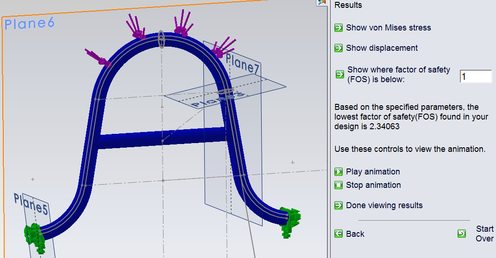
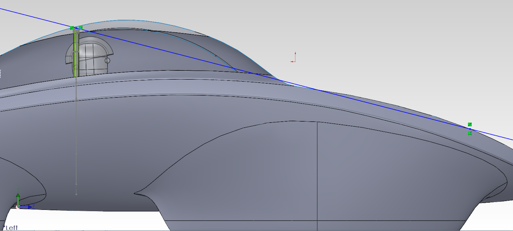

# SSCP - 2013 Roll Cage

# 2013 Roll Cage

## Rev 1.0

From preliminary modeling and simulation of a few general load cases, it appears that a 1" (0.095" wall thickness) Chromoly 4130 Steel roll bar with a bend radius of 4.75" will meet 5G impact force requirements and size constraints inside the bubble. There is plenty more work to design mounting, simulate more force directions and loads, additional structural beams, and finding a shop to do bending or the necessary dies to bend it ourselves, but initial analysis look OK to fit in current bubble.

Force is 12750 Newtons, or equivalently, 5 G's acceleration of  260kg estimated car+driver weight.

