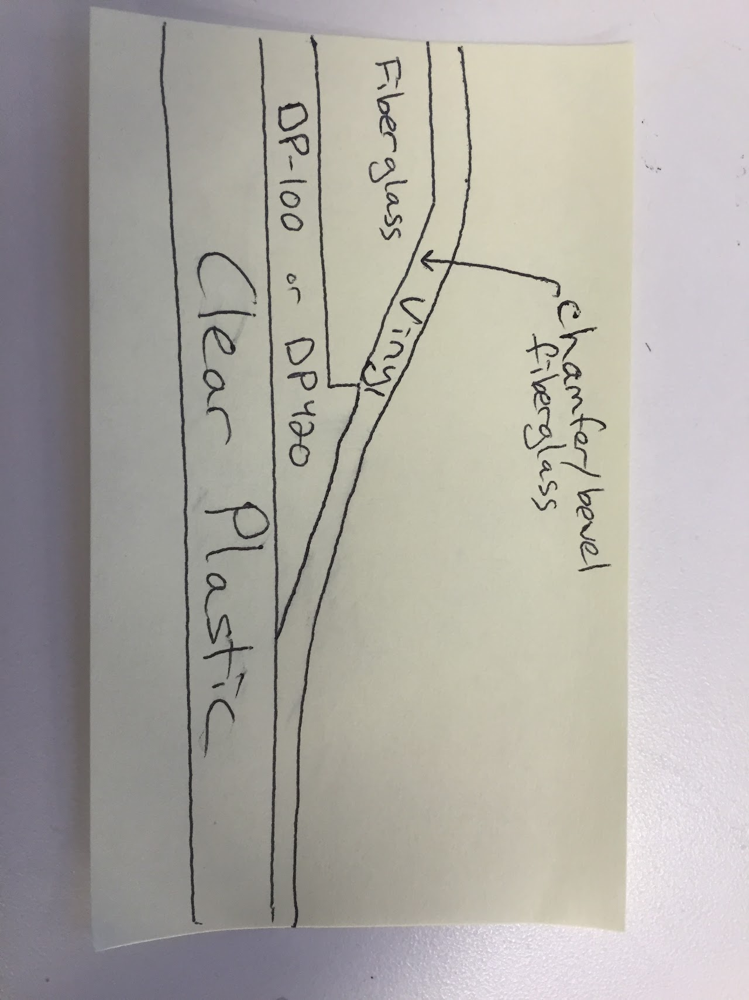
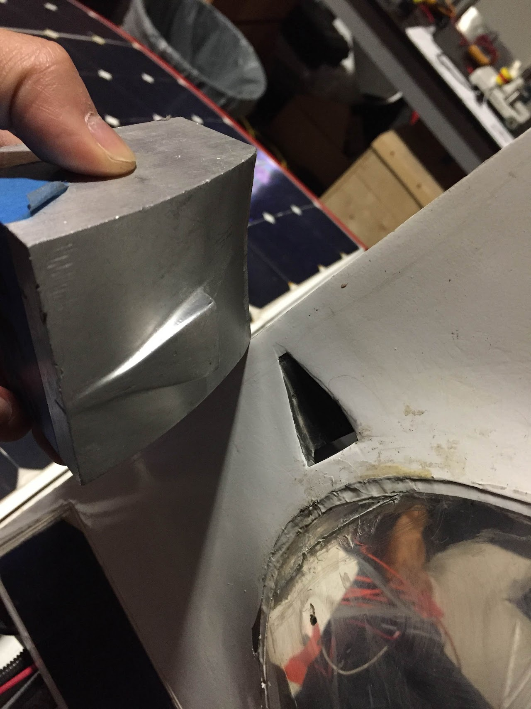

# bubble-canopy

## SSCP - Bubble / Canopy

## Bubble / Canopy

### Contacts for Thermoforming

H\&S Thermoforming made Xenith's bubble

Philip Roberts Models can do small bubbles in Palo Alto: philip@philiprobertsmodels.com

Steven Kopiske is knowledgable about thermoforming Steven.Kopiske@deufol.com

### Notes from October 2012 meeting with Philip Roberts

* Length of Sunbad's bubble was a limiting factor for his shopTheir machine is only 3ft longThere may be shops in San Jose that can fit out bubblePETG is the easiest to thermoformPolycarbonate polishes better than PETGCould we ask the mold manufacturer to cut out the fiberglass tool after they do their first layup?They could put in a zinc plate hoop around the perimiter of the bubble allowing them to release the bubble from the rest of the moldIt is best to thermoform into the negative since it is easier to polish the outside of the bubble than the inside
* Length of Sunbad's bubble was a limiting factor for his shop
* Their machine is only 3ft long
* There may be shops in San Jose that can fit out bubble
* PETG is the easiest to thermoform
* Polycarbonate polishes better than PETG
* Could we ask the mold manufacturer to cut out the fiberglass tool after they do their first layup?They could put in a zinc plate hoop around the perimiter of the bubble allowing them to release the bubble from the rest of the mold
* They could put in a zinc plate hoop around the perimiter of the bubble allowing them to release the bubble from the rest of the mold
* It is best to thermoform into the negative since it is easier to polish the outside of the bubble than the inside
* Length of Sunbad's bubble was a limiting factor for his shop
* Their machine is only 3ft long
* There may be shops in San Jose that can fit out bubble
* PETG is the easiest to thermoform
* Polycarbonate polishes better than PETG
* Could we ask the mold manufacturer to cut out the fiberglass tool after they do their first layup?They could put in a zinc plate hoop around the perimiter of the bubble allowing them to release the bubble from the rest of the mold
* They could put in a zinc plate hoop around the perimiter of the bubble allowing them to release the bubble from the rest of the mold
* It is best to thermoform into the negative since it is easier to polish the outside of the bubble than the inside

Length of Sunbad's bubble was a limiting factor for his shop

Their machine is only 3ft long

There may be shops in San Jose that can fit out bubble

PETG is the easiest to thermoform

Polycarbonate polishes better than PETG

Could we ask the mold manufacturer to cut out the fiberglass tool after they do their first layup?

* They could put in a zinc plate hoop around the perimiter of the bubble allowing them to release the bubble from the rest of the mold

They could put in a zinc plate hoop around the perimiter of the bubble allowing them to release the bubble from the rest of the mold

It is best to thermoform into the negative since it is easier to polish the outside of the bubble than the inside

### Notes from Rich Kietzke

&#x20;We can do this in our Utah facility. Erv Baker is the contact. He is currently out of the office until Monday. Please feel free to contact him directly office 801-444-2429 cell 801-699-5379 e.baker@proplas.com

[e.baker@proplas.com](mailto:e.baker@proplas.com)

We appreciate the opportunity to assist with your needs and look forward to working with you !!

Thanks & Have a Great Day !!!

&#x20;Rich

Cell 408-590-8109

Ervin Baner E.Baker@proplas.com

David Wetzel D.Wetzel@proplas.com

### Notes on gluing in the Clear Windows

In 2013 I vinyl wrapped the carbon canopy before we put the window in. However, I would actually recommend gluing in the window before you vinyl wrap the door.&#x20;

I had to be pretty careful when I was applying the vinyl to the canopy since I was worried that I would snap the carbon when I was pulling on the vinyl. If you had the window glued in to the canopy the whole canopy assembly would be a lot stronger. It will make the vinyl wrapping shop's job easier if they don't have to baby the canopy because you're worried about the fiberglass breaking.

Plus if you glue the window panels in before hand you could extend the vinyl onto the clear window by a centimeter or so. Covering the seam between the fiberglass and the plastic window with vinyl would help to smooth over the seam between the fiberglass and the plastic. On Luminos we had the carbon and the vinyl end along the same curve, so there was a more abrupt seam.

Also, on Luminos I actually sanded down the carbon at the edges of the window to taper the carbon. This helped to minimize the height of the step up from the window to the carbon.

...

We used GE Silicone II, but this stuff shrinks. It meets every other requirement that we had apart from the shrinkage.&#x20;

[GE Silicone II](http://www.homedepot.com/p/GE-Silicone-II-10-1-oz-Clear-Kitchen-and-Bath-Caulk-HD5040-24C/100663319)

I don't think the vinyl will likely peel if you cut the vinyl at the seam or at the window. The vinyl is liable to peel on your access panels if you don't wrap extra vinyl onto the backside of the panels since you repeatedly install/remove fairing tape from those seams. You will never have to peel tape off the vinyl on your door, so you do not need to worry as much (or probably at all) about the vinyl peeling as long as the surface is clean when you apply the vinyl.

I would recommend not wrapping the vinyl through the hole and onto the back side of your fiberglass since it will make the seam thicker. The vinyl probably will not peel at that location.

I would recommend using epoxy to fill the seam at the edge of the fiberglass instead of silicone. See the cross section below for a diagram of what I have in mind.

Test applying the vinyl to DP-100 or DP-420 to make sure it sticks well. You probably would still want to mask off the parts of the windscreen that you do not want to get epoxy on.

BTW, DP-100 has a really low glass transition temperature (onset at 23C and mid-point at 29C). You may want to avoid using DP-100 anywhere that will get warm, or prevent people from using it altogether.&#x20;

Also, last cycle we used a bunch of neodymium magnets to press the carbon/fiberglass against the plastic window while the epoxy cured. The magnets worked really well. Just place a magnet on each side of your stack every 1-2 inches.

### NACA Duct Installation

In 2013 we machined an aluminum positive mold in the shape of the NACA duct. We then covered it in mold release agent, cut an oversized hole in the door where we wanted the NACA duct, potted the hole with black Epoxy, and then clamped in the mold. We removed the mold when the epoxy cured.

&#x20;

The mistake we made was not polishing the mold well enough and not using enough release agent on the mold. It was really difficult to break the mold free from the epoxy. If you see any rough spots on your mold make sure you polish them out and use plenty of mold release agent.

You could also just 3D print the shell of the NACA duct shape you want and then glue that into the door. That would prevent you from needing to worry about a mold, and you wouldn't' have to worry about air bubbles getting trapped against your mold in the glue.
