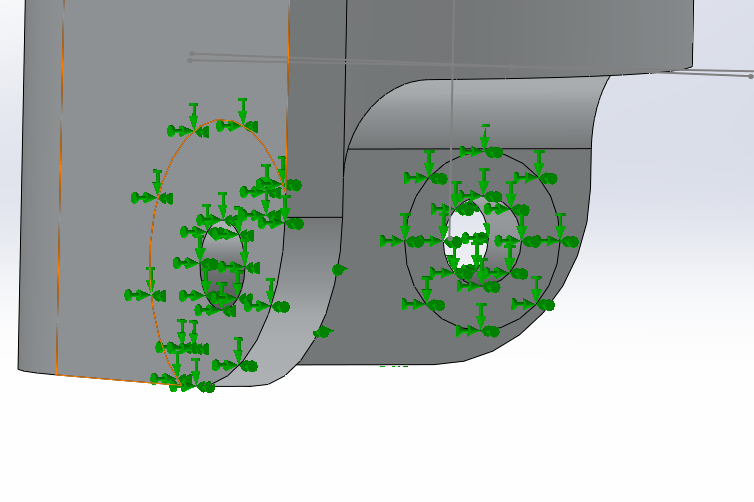
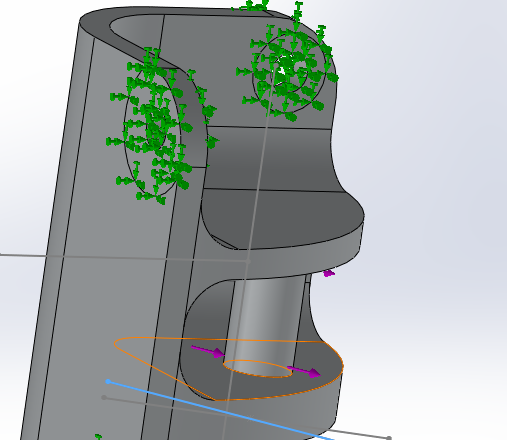
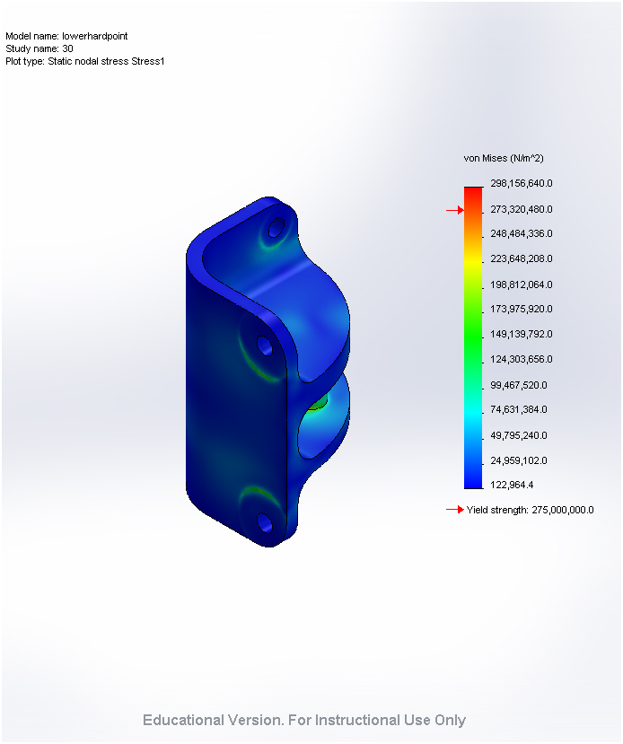
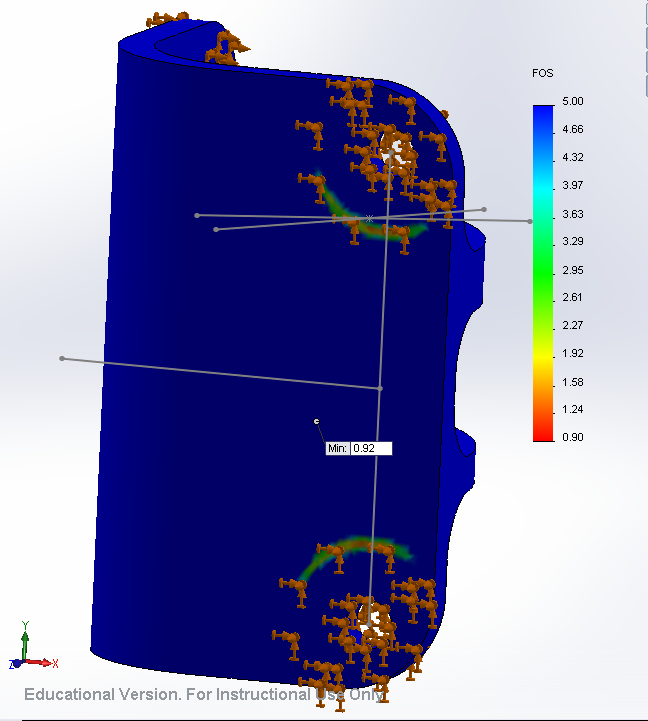
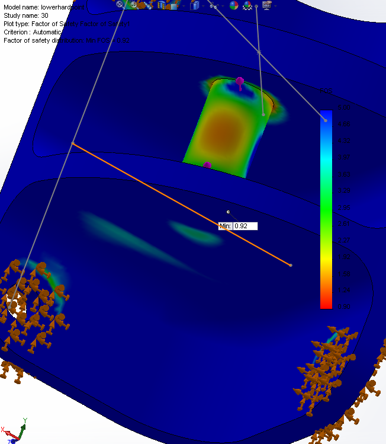
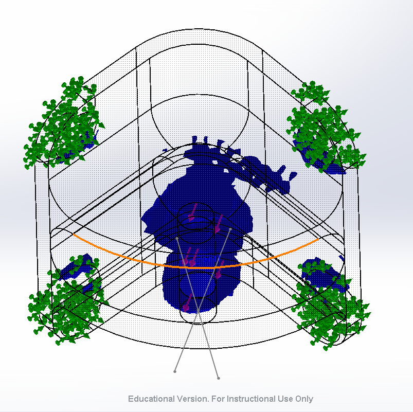
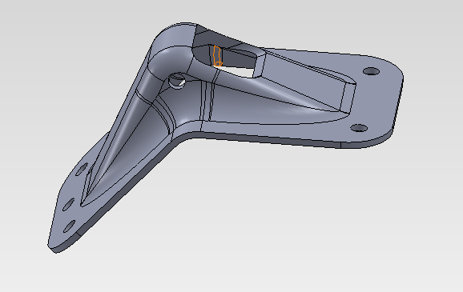

# hard-points

## SSCP - Hard Points

## Hard Points

### Sunbad Hardpoints

#### Lower Hardpoint

Design

The hardpoints are designed to survie

Loading Condition

'FEA Setup

Fixed Geometry:

The bolt/insert interface was simulated by fixing the surface that touches the head of the bolt and the head of the insert. The theory behind this is that most of the load is born by friction rather than shearing the bolts.&#x20;

Load Setup

To simulate the fact there is a spherical bearing held together by a bolt a cylender is used to keep the two tabs together and provide a face to apply the load to.&#x20;

#### FEA Results

Stress

Factor of Safety

Design Insight

Helicoil&#x20;

The thicker area is designed for a screwlocking helicoil that is 1/4in keep. The part number is 3591-4CN-250&#x20;

### Hardpoint Concepts

#### Stamped Hardpoint Idea

Since you need 48 hardpoints (two cars, full set of backups), machining them isn't entirely practical even for machine shop sponsor.

We use these guys at mission: http://www.protostampings.com/showcase.html, and their prices are very reasonable (a mold for a hardpoint would probably be somewhere between $500 and $1000 (non sponsored)).

[http://www.protostampings.com/showcase.html](http://www.protostampings.com/showcase.html)

If you made one, or even two hardpoint designs, you could do 50 aluminum stampings that would cost almost no money, even with post machining. For Apogee, we machined the hardpoints ourselves as well as half 1/2 the hardpoints on xenith, and spent a bunch of time 1. because there are a lot of them and 2. the tolerances matter

It's something worth thinking about....I've attached a demo part that would show what a stamped hardpoint might look like. My guess is that it could be about 50% lighter than Xenith hardpoints just because stamping lets you get material exactly where it needs to be.

#### Embedded Google Drive File

Google Drive File: [Embedded Content](https://drive.google.com/embeddedfolderview?id=1C217aRAmt-fJX0F-iuUKZTv2j-qbZ9FC#list)
