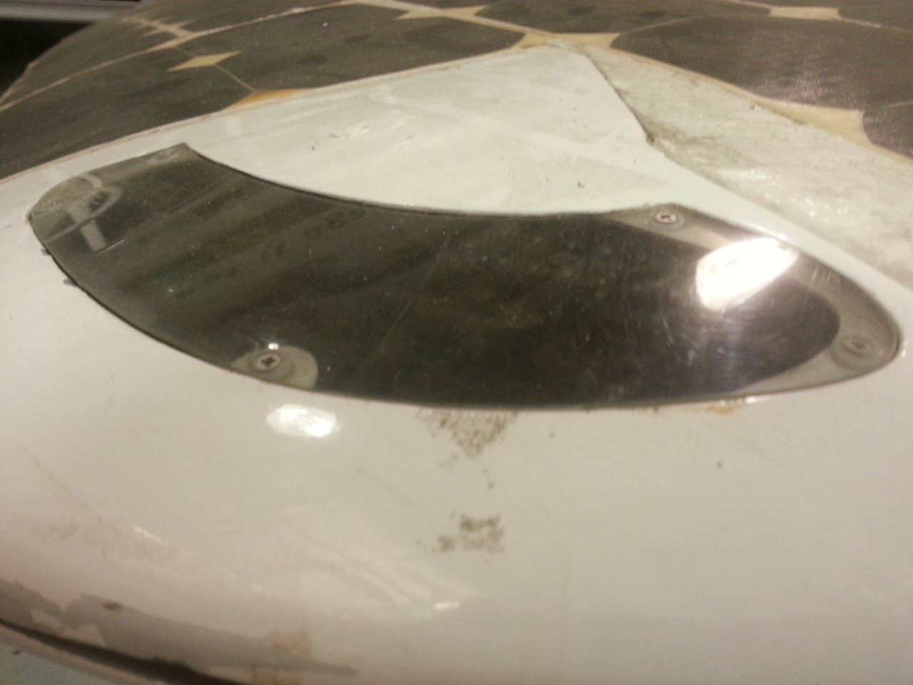
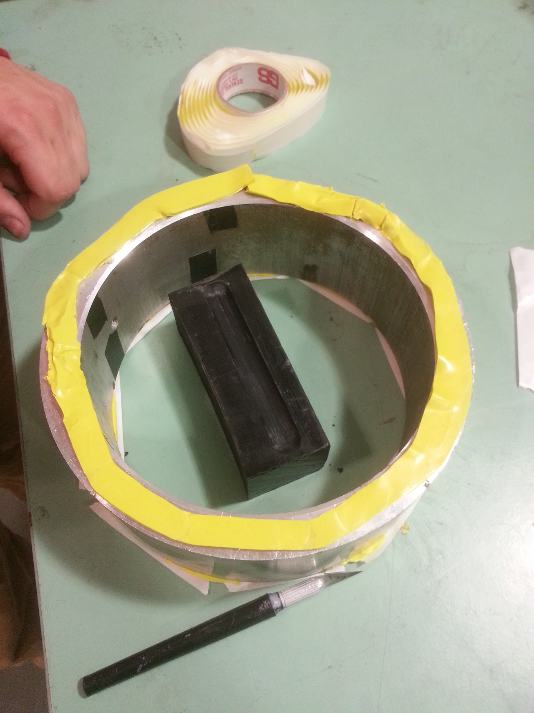

# SSCP - Lights

# Lights

## Inspiration for our current plan: 

http://thomasdaede.com/wordpress/?p=71

## Thermal Considerations

The lights are traditionally sealed in the top shell and can have thermal issues, which is unfortunate as they are both required by the roles and hard to remove. For sunbad the team ordered aluminum core PCBs from a 

## Lens Types

### Clear Cover

Pros: 

* requires least amount of forsight or planningEasy to doMakes it easy to replace LEDS late
* requires least amount of forsight or planning
* Easy to do
* Makes it easy to replace LEDS late

* requires least amount of forsight or planning
* Easy to do
* Makes it easy to replace LEDS late

requires least amount of forsight or planning

Easy to do

Makes it easy to replace LEDS late

Cons: 

* Poor visuals due to more seamsLess optimal aerodynamics
* Poor visuals due to more seams
* Less optimal aerodynamics

* Poor visuals due to more seams
* Less optimal aerodynamics

Poor visuals due to more seams

Less optimal aerodynamics

### Clear Lens

On Xenith the team glued in clear plastic lenses which could be then cast and shaped to fit the car. It worked well enough but shapping the material to fit the outer shape of the car was time consuming and gluing the lenses in was difficut. 

### Cast Lens Assembly

Cast Lens Test 1

Test Materials:

* Spare Amber LED boards from XenithAluminite Water Clear Casting ResinMachined Delrin 1 piece mold
* Spare Amber LED boards from Xenith
* Aluminite Water Clear Casting Resin
* Machined Delrin 1 piece mold

* Spare Amber LED boards from Xenith
* Aluminite Water Clear Casting Resin
* Machined Delrin 1 piece mold

Spare Amber LED boards from Xenith

Aluminite Water Clear Casting Resin

Machined Delrin 1 piece mold

Results:

    After a week and a half of multiple trials with attempting to cast lights we gave up. Everything resulted in bubbles even when we used pressure chambers to pull bubbles out of the mixture

## Cut Acrylic  

This method worked the best. We CNC cut clear acrylic into the shape of the lights. Then we silicon glued the light boards to the back side of the acrylic. In retrospect we should have polished the backside of the lens and the sides of the lens before gluing on the light boards. This would have eliminated some of the haze at the back of the lights. We then painted the sidewalls of the lights with a chrome colored paint. If we had polished the sides of the acrylic we probably would have gotten a mirror finish on the side walls of the lights. Make sure you mask over the exposed section of the light while you are spray painting. Be sure to pot the wires onto the boards with glue. Cut holes in the shell where you intend to put the lights. Put the lights into position, but leave the lights sticking out a few extra millimeters so you can sand the light down to be flush with the car shell. Tack the lights in place with a quick curing glue like DP100. Then come back and glue the lights into place with something like DP420. Once the glue dries you can bondo and gaps and then start sanding the lights and bondo until you have a smooth and continuous surface. Once the lights are the shape you want you can polish the acrylic to a glassy smooth surface with the buffing wheel and aqua-buff compound. Make sure no one tries to clean the lights with any solvents like IPA, acetone, or MEK. They will craze or crack the acrylic. Only use soap and water.

