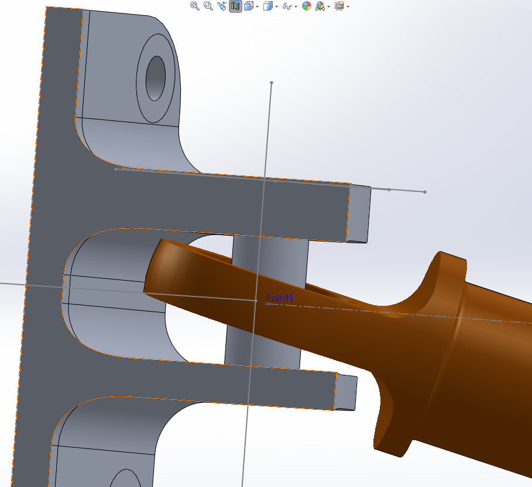
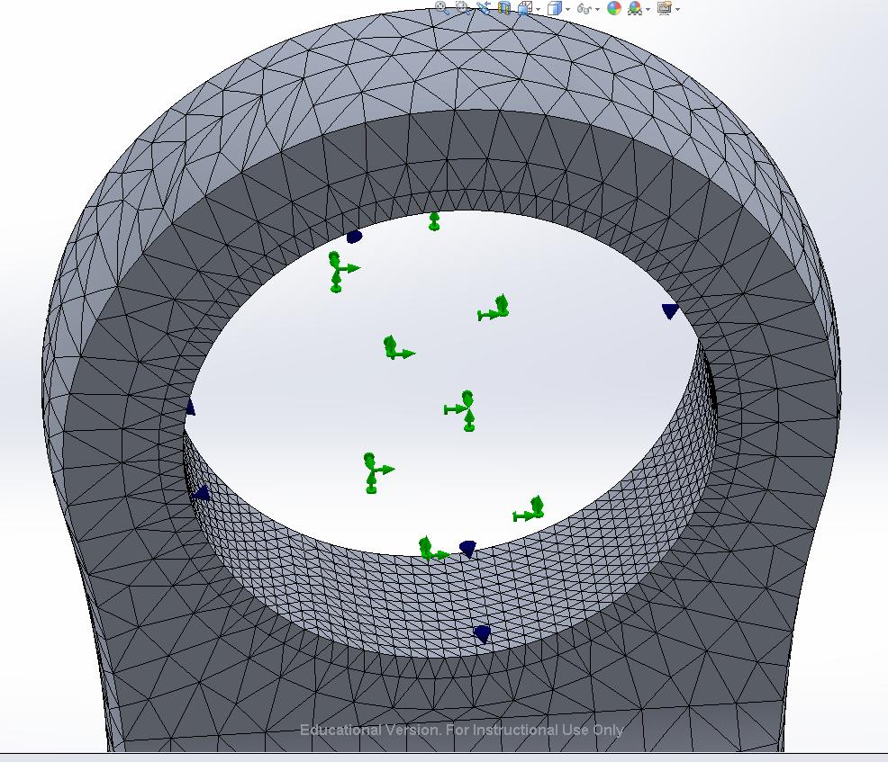
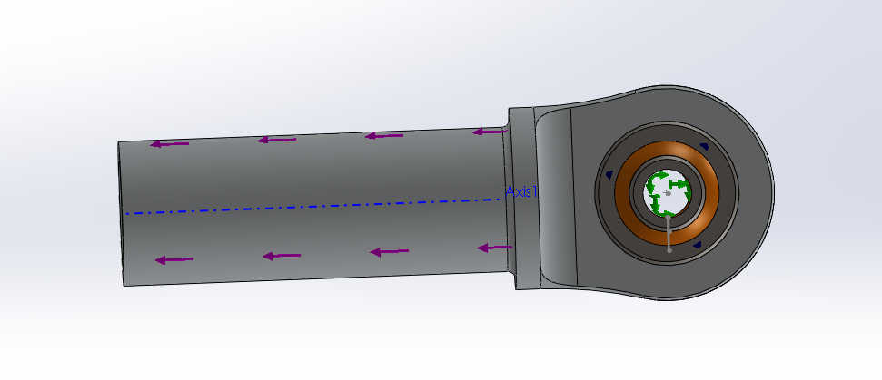
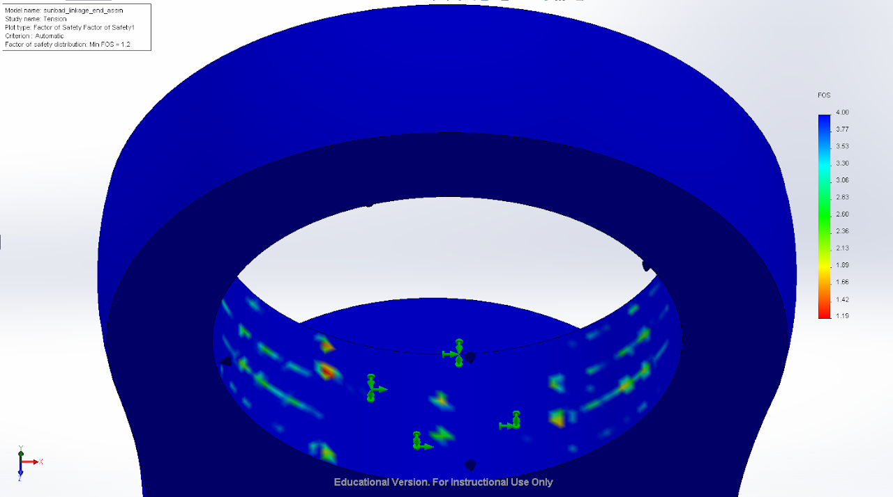
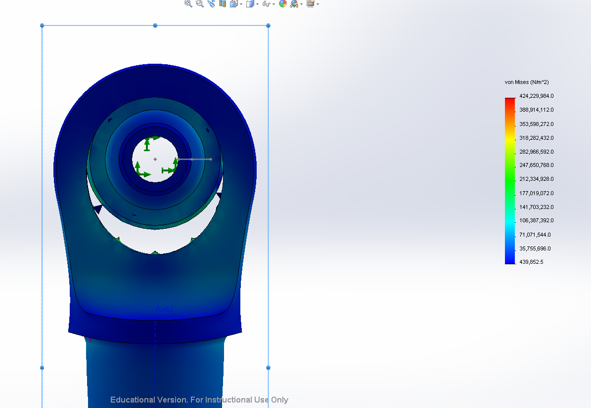
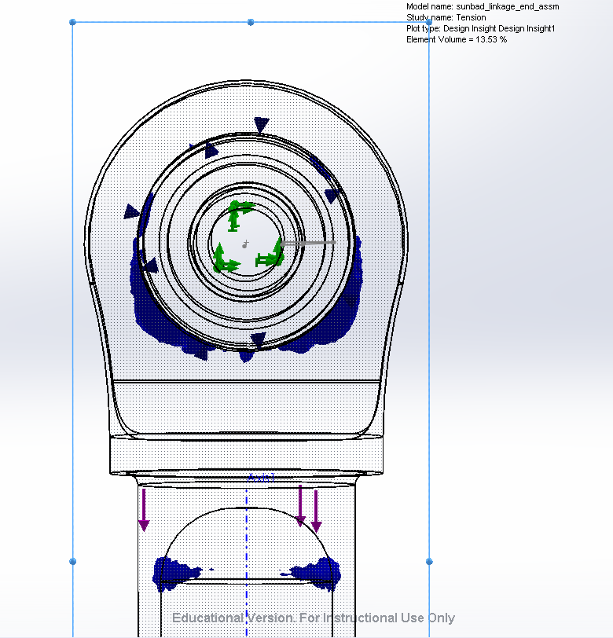

# SSCP - Linkages

# Linkages

## Surface Prep

    Ideal: Phosphoric Acid Anodize

        ANODIZE PER AMS-A-8625

        TYPE I, CLASS 1 (recommended by tye). No further preparation required after this.

    Exploring: Theoretical 3M Coating

        3M AC-130 Spray/film

    Less Ideal:

        West Aluminum Etch: http://www.pbsboatstore.com/860-aluminum-etch-kit.htm

## Fitment Check

## FEA

### Mesh

Mesh element size is about 1.1mm with a mesh control applied to the inner ace to make it a smaller .55mm. 

### FEA Setup

Load

The purple line shows the applied maximum of 6800N of force which was found from the suspension load .txt file that was simulated by shark. 

Bearing Contact Set

The inner and outer race of the bearing were joined with a rigid connection in this analysis. 

Bearing Linkage Interface

The bearing linkage interface was simulated as a bearing connection. It is not sufficent to fix the inside surface of the bearing as in tension the lower part will pull away as can be seen in the deformed result

### Results

Factor of Safety 

From the the image you can see that all areas of factor of safety below about 2.5 are due to mesh issues and therefore the factor of safety of this part is at least 2.5.

### Stress & Deformed Result

The deformed result shows that the bearing contact set worked as we would like. 

### Design Insight

### Embedded Google Drive File

Google Drive File: [Embedded Content](https://drive.google.com/embeddedfolderview?id=1BVPJGqjzPIA0qNHCI3pzD_91-CCAQe2-#list)

<iframe width="100%" height="400" src="https://drive.google.com/embeddedfolderview?id=1BVPJGqjzPIA0qNHCI3pzD_91-CCAQe2-#list" frameborder="0"></iframe>

