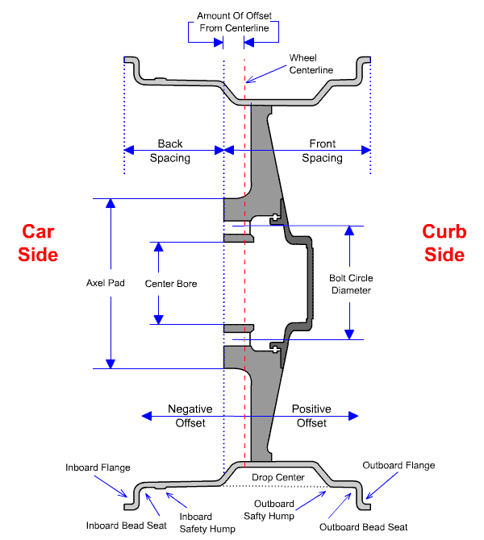
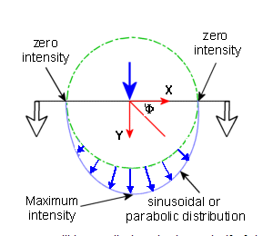

# SSCP - Rim

# Rim

## GH Craft Rims

For Michelin radial 95/80 R16 http://www.ghcraft.com/shops/cfw/cfw_16c_e.htm

[http://www.ghcraft.com/shops/cfw/cfw_16c_e.htm](http://www.ghcraft.com/shops/cfw/cfw_16c_e.htm)

## Custom Rims

### Loading Conditions

Introduction

In all loading conditions because we cannot assume anything about the tire or analysis in our FEA we ignore the tire and apply all forces directly on the inboard and outboard bead seat. The locations of which are shown in the following image: 

Common 

All Loading Conditions can be found on Loading Conditions under final conditions. Those numbers are applied to the contact patch of the tire. 

[Loading Conditions](/home/sscp-2012-2013/mechanical-2012-2013/mechanical-fundamentals/loading-conditions)

Corner

Cornering loads are be similar to the bump load, where the cornering load is subtracting on part of the wheel the force from the pressure, and the other side adding. Place the lateral loads on the bead area, directly over the spoke and angles in between. As in the case of the bump there is a distribution of load over a 15-30 degree section which is highly concentrated in the center, right under the contact patch. 

Bump

During a bump loading case the tire acts very similar to a bolted or bearing connection in terms of how the load is goes through the tire bead. When you have a bearing face there is a percentage of the load carried by the part in compression distributed over the surface. We apply the bump force equally split between the inboard and outboard bead seat.  

An example of this loading condition from the Solidworks documentation on bearing loads is shown below for reference: 

Brake

The braking load can accurately be simulated by applying a torque evenly distributed on the inboard and outboard bead of the rim. 

Fatigue 

TBD

### Embedded Google Drive File

Google Drive File: [Embedded Content](https://drive.google.com/embeddedfolderview?id=1-PXgi1dqBohvMEDiJCciiKzdy0QXT1dk#list)

<iframe width="100%" height="400" src="https://drive.google.com/embeddedfolderview?id=1-PXgi1dqBohvMEDiJCciiKzdy0QXT1dk#list" frameborder="0"></iframe>

