# suspension-design

## SSCP - Suspension Design

## Suspension Design

The suspension, apart from the chassis design and fabrication, may be the single most difficult mechanical task in building a solar car. The number of variables and choices that the designer must take into account is enormous. Furthermore, the suspension is one of the driving variables behind the shape of the aerobody, in particular the fairings. Therefore, the suspension geometry must be developed in tandem with the aerobody so that interferences and hacks aren't present in the final model.

### Functions of a Solarcar Suspension?

* Limit loads on the tires/rims to prevent blowouts and rim failure.Limit loads on the chassis during bumpy conditions and cattle grates.Limit transmitted vibrations to the chassis for driver comfort, loading cycles, and electronics reliability.Keep the car dynamically stable at all times. This means that the car must always default to a straight line if the driver's hands are removed from the wheel. (NHS was able to do this for a record of 6 seconds in Xenith, compared to about .5 in Apogee)Maintain the angle of attack of the aerobody no matter the condition, for optimum aerobody performance.Not allow the wheel or any suspension component interfere with the aerobody over:The entire range of steering travelThe entire range of bump travelThe entire range of droop travelAll of the above at the same time, during a 1g corner.Must have zero bump scrub (the contact patch does not move left-right during bump).Must have zero bump steer (the contact patch does not rotate during bumpMust Have near zero camber change over bump if using radial tires (like Michelins)
* Limit loads on the tires/rims to prevent blowouts and rim failure.
* Limit loads on the chassis during bumpy conditions and cattle grates.
* Limit transmitted vibrations to the chassis for driver comfort, loading cycles, and electronics reliability.
* Keep the car dynamically stable at all times. This means that the car must always default to a straight line if the driver's hands are removed from the wheel. (NHS was able to do this for a record of 6 seconds in Xenith, compared to about .5 in Apogee)
* Maintain the angle of attack of the aerobody no matter the condition, for optimum aerobody performance.
* Not allow the wheel or any suspension component interfere with the aerobody over:The entire range of steering travelThe entire range of bump travelThe entire range of droop travelAll of the above at the same time, during a 1g corner.
* The entire range of steering travel
* The entire range of bump travel
* The entire range of droop travel
* All of the above at the same time, during a 1g corner.
* Must have zero bump scrub (the contact patch does not move left-right during bump).
* Must have zero bump steer (the contact patch does not rotate during bump
* Must Have near zero camber change over bump if using radial tires (like Michelins)
* Limit loads on the tires/rims to prevent blowouts and rim failure.
* Limit loads on the chassis during bumpy conditions and cattle grates.
* Limit transmitted vibrations to the chassis for driver comfort, loading cycles, and electronics reliability.
* Keep the car dynamically stable at all times. This means that the car must always default to a straight line if the driver's hands are removed from the wheel. (NHS was able to do this for a record of 6 seconds in Xenith, compared to about .5 in Apogee)
* Maintain the angle of attack of the aerobody no matter the condition, for optimum aerobody performance.
* Not allow the wheel or any suspension component interfere with the aerobody over:The entire range of steering travelThe entire range of bump travelThe entire range of droop travelAll of the above at the same time, during a 1g corner.
* The entire range of steering travel
* The entire range of bump travel
* The entire range of droop travel
* All of the above at the same time, during a 1g corner.
* Must have zero bump scrub (the contact patch does not move left-right during bump).
* Must have zero bump steer (the contact patch does not rotate during bump
* Must Have near zero camber change over bump if using radial tires (like Michelins)

Limit loads on the tires/rims to prevent blowouts and rim failure.

Limit loads on the chassis during bumpy conditions and cattle grates.

Limit transmitted vibrations to the chassis for driver comfort, loading cycles, and electronics reliability.

Keep the car dynamically stable at all times. This means that the car must always default to a straight line if the driver's hands are removed from the wheel. (NHS was able to do this for a record of 6 seconds in Xenith, compared to about .5 in Apogee)

Maintain the angle of attack of the aerobody no matter the condition, for optimum aerobody performance.

Not allow the wheel or any suspension component interfere with the aerobody over:

* The entire range of steering travel
* The entire range of bump travel
* The entire range of droop travel
* All of the above at the same time, during a 1g corner.

The entire range of steering travel

The entire range of bump travel

The entire range of droop travel

All of the above at the same time, during a 1g corner.

Must have zero bump scrub (the contact patch does not move left-right during bump).

Must have zero bump steer (the contact patch does not rotate during bump

Must Have near zero camber change over bump if using radial tires (like Michelins)

### Design Variables:

This is not an exhaustive list of all the design variables - it is merely a list of the standard independent variables that will drive the geometry. You should understand all of these and their effect on performance before starting suspension design.

* Track Width: the distance between the left and right wheelsCamber Angle: for rolling resistance purposes, this should always be zero (look up "camber thrust")Toe Angle: for rolling resistance purposes, this should always be zeroCastor Angle: when looking at the side of a car, this is the angle the line drawn between the upper and lower ball joints on the upright makes with the vertical.Kingpin Angle: when looking at the front of a car, this is the angle the line drawn between the upper and lower ball joints on the upright makes with the verticalScrub Radius: The distance between the point created by the intersection of the steering axis with the ground and the center of the contact patch.Suspension travel: Aim for at least 2" of bump with 1" of droop (3" minimum suspension travel). In general, suspensions should be set up so that 1/3 of the travel is sag from the sprung mass.Tire Information: This goes without saying - make sure you have your tires nailed down and sourced before starting.Desired steering radiusDesired Ackerman effect
* Track Width: the distance between the left and right wheels
* Camber Angle: for rolling resistance purposes, this should always be zero (look up "camber thrust")
* Toe Angle: for rolling resistance purposes, this should always be zero
* Castor Angle: when looking at the side of a car, this is the angle the line drawn between the upper and lower ball joints on the upright makes with the vertical.
* Kingpin Angle: when looking at the front of a car, this is the angle the line drawn between the upper and lower ball joints on the upright makes with the vertical
* Scrub Radius: The distance between the point created by the intersection of the steering axis with the ground and the center of the contact patch.
* Suspension travel: Aim for at least 2" of bump with 1" of droop (3" minimum suspension travel). In general, suspensions should be set up so that 1/3 of the travel is sag from the sprung mass.
* Tire Information: This goes without saying - make sure you have your tires nailed down and sourced before starting.
* Desired steering radius
* Desired Ackerman effect
* Track Width: the distance between the left and right wheels
* Camber Angle: for rolling resistance purposes, this should always be zero (look up "camber thrust")
* Toe Angle: for rolling resistance purposes, this should always be zero
* Castor Angle: when looking at the side of a car, this is the angle the line drawn between the upper and lower ball joints on the upright makes with the vertical.
* Kingpin Angle: when looking at the front of a car, this is the angle the line drawn between the upper and lower ball joints on the upright makes with the vertical
* Scrub Radius: The distance between the point created by the intersection of the steering axis with the ground and the center of the contact patch.
* Suspension travel: Aim for at least 2" of bump with 1" of droop (3" minimum suspension travel). In general, suspensions should be set up so that 1/3 of the travel is sag from the sprung mass.
* Tire Information: This goes without saying - make sure you have your tires nailed down and sourced before starting.
* Desired steering radius
* Desired Ackerman effect

Track Width: the distance between the left and right wheels

Camber Angle: for rolling resistance purposes, this should always be zero (look up "camber thrust")

Toe Angle: for rolling resistance purposes, this should always be zero

Castor Angle: when looking at the side of a car, this is the angle the line drawn between the upper and lower ball joints on the upright makes with the vertical.

Kingpin Angle: when looking at the front of a car, this is the angle the line drawn between the upper and lower ball joints on the upright makes with the vertical

Scrub Radius: The distance between the point created by the intersection of the steering axis with the ground and the center of the contact patch.

Suspension travel: Aim for at least 2" of bump with 1" of droop (3" minimum suspension travel). In general, suspensions should be set up so that 1/3 of the travel is sag from the sprung mass.

Tire Information: This goes without saying - make sure you have your tires nailed down and sourced before starting.

Desired steering radius

Desired Ackerman effect

### Design Procedure:

#### Solidworks Geometry Development

2D Bump Geometry

A solidworks sketch was made with the following procedure:

* defined the geometry of one wheel's suspension from the front view, including two a-arms, the steering axis, and the wheel.
* copied this geometry two times, for three total. added equal relations between all major members in each copy of the sketch, and then dimensions to define the geometry except for one degree of freedom. these three sketches represented the suspension at ride height, full bump, and full droop.&#x20;
* Define the position of the contact patch center at each of these three positions. In order to minimize bump scrub, I defined the ride height condition to have zero camber, and the three contact patches to be coincident to a circle of a relatively large radius. defining them as directly vertical is geometrically impossible.
* when the correct combinations of relations and dimensions were achieved, the geometry sketch solved for the lengths of the a-arms and their positions in the y-z plane.

defined the geometry of one wheel's suspension from the front view, including two a-arms, the steering axis, and the wheel.

copied this geometry two times, for three total. added equal relations between all major members in each copy of the sketch, and then dimensions to define the geometry except for one degree of freedom. these three sketches represented the suspension at ride height, full bump, and full droop.&#x20;

Define the position of the contact patch center at each of these three positions. In order to minimize bump scrub, I defined the ride height condition to have zero camber, and the three contact patches to be coincident to a circle of a relatively large radius. defining them as directly vertical is geometrically impossible.

when the correct combinations of relations and dimensions were achieved, the geometry sketch solved for the lengths of the a-arms and their positions in the y-z plane.

Below is a screen clipping of the 2D bump sketch:

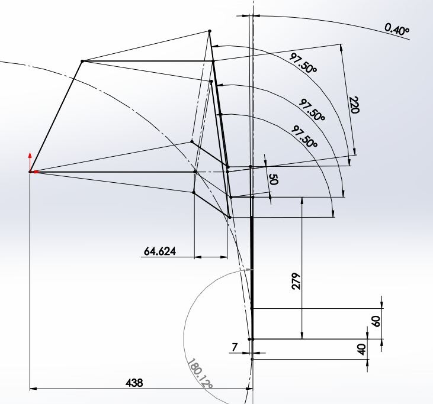

The conditions that I defined are summarized as follows:

#### Embedded Content

Embedded content: [Custom embed](suspension-design.md)

After all of these constraints were solved for, the geometry that resulted resembled a relatively standard SLA double wishbone suspension, with all of our desired characteristics.

3D Static Geometry

Taking the 2D geometry to 3D was relatively straightforward, but required a lot of dimensions to simply be chosen. Some of the basic dimensions as they stand now:

&#x20;Caster Angle

&#x20;A-arm width

&#x20;5 deg

&#x20;600mm

In the process of building the suspension as a 3D sketch, some additional design decisions were made. It was decided that the suspension should be a simple multi-link geometry, with the bottom control arm split into two independent links. This served a dual function: first, it allowed us to put the steering axis through the virtual center of this new 4-bar linkage, which put the steering axis inside the wheel itself and decreased the volume that the wheel swept through in steer travel and therefore the size of the fairing; second, the dual hardpoints on the upright rather than one large rod-end on the end of a traditional control arm gave us a lot more flexibility in the mechanical design of the upright and wheel-motor.&#x20;

After the decision to move to multi-link was made, the 2D bump geometry was reworked accordingly.

Below is an image of the 3D geometry sketch:

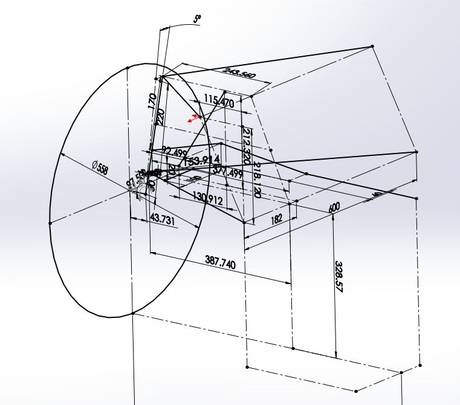

Additional geometry calculators that were used in the process. They are:

Shock travel

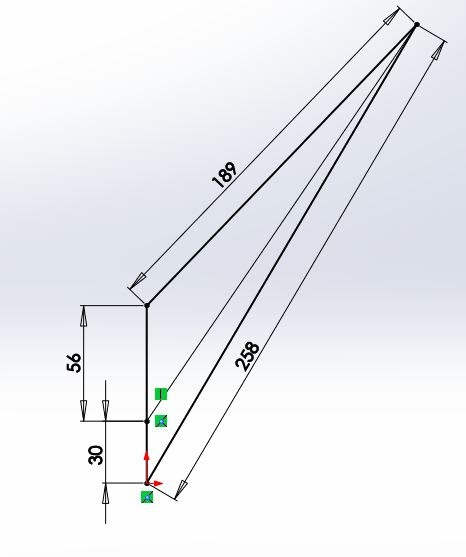

&#x20;Ackermann

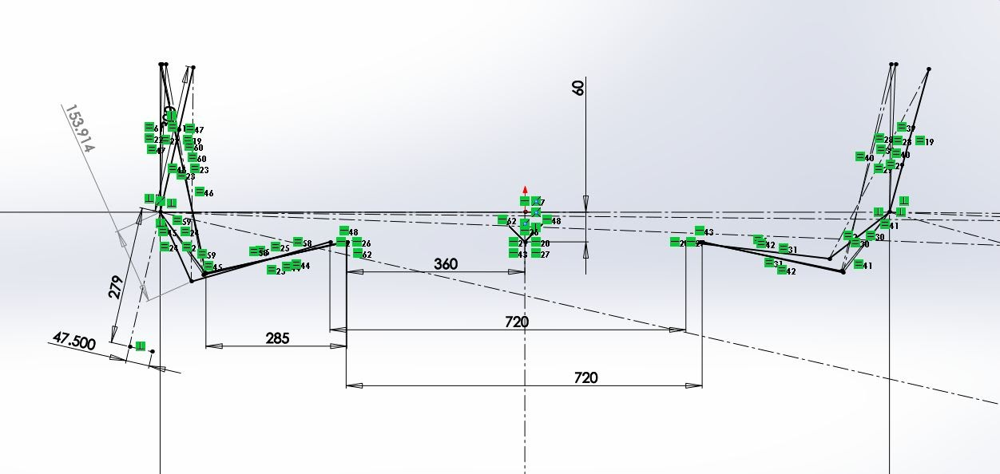

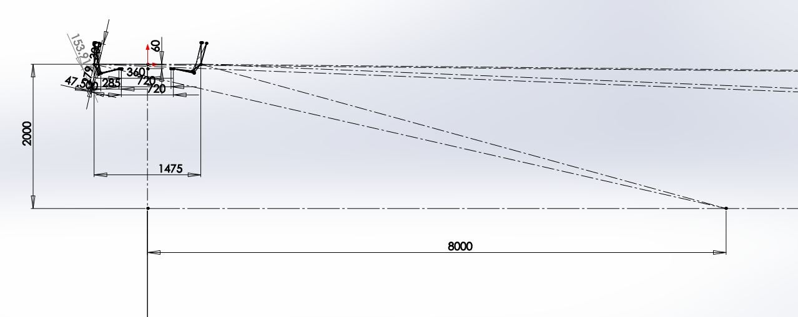

&#x20;    &#x20;

4-bar geometry for bottom multilink

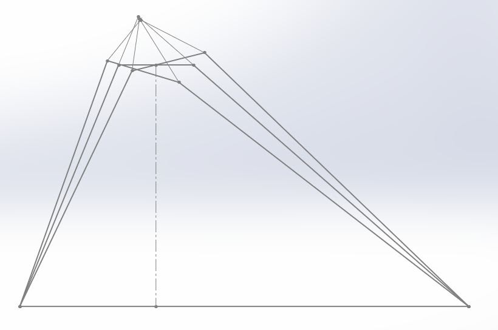

### Kinematics

Lotus Shark

We used a piece of software by Lotus called Shark to do simple kinematic analysis of the geometry, and to calculate forces at the hardpoints given certain loading conditions at the wheel. The output from the final suspension geometry is shown below:

[Shark](http://www.lotuscars.com/gb/engineering/engineering-software)

Front, Top, Side View

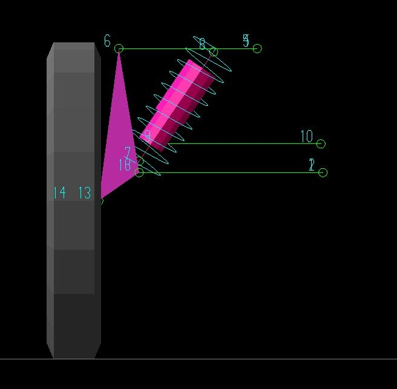

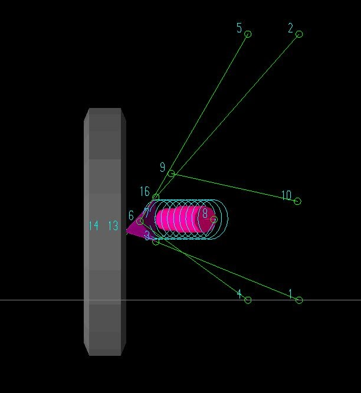

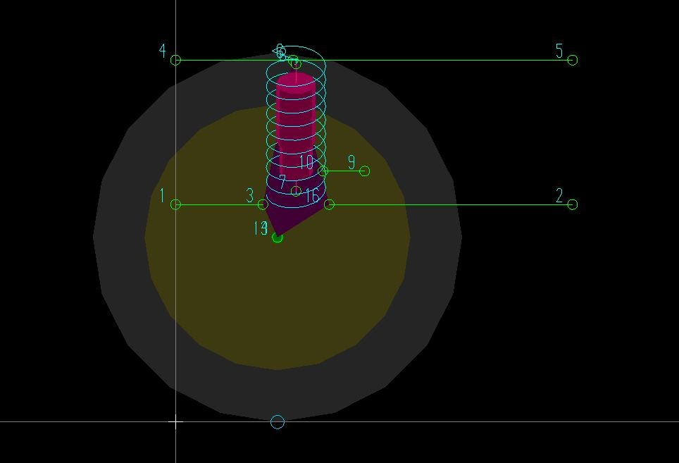

&#x20;  &#x20;

Isometric, with and without tire

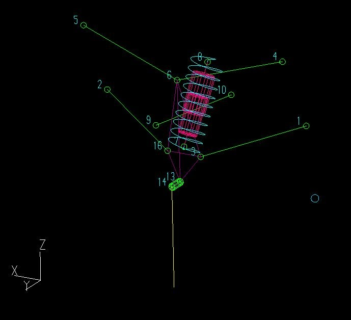

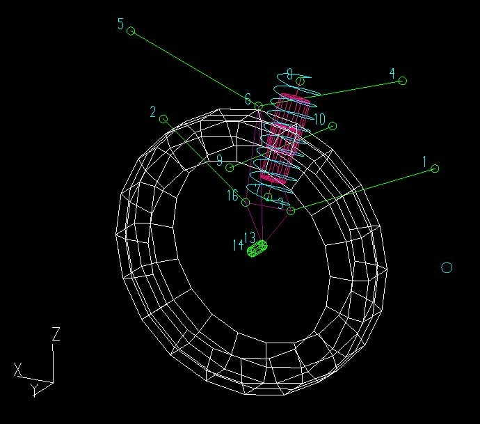

&#x20;&#x20;

Scrub (mm) vs Bump travel (mm)

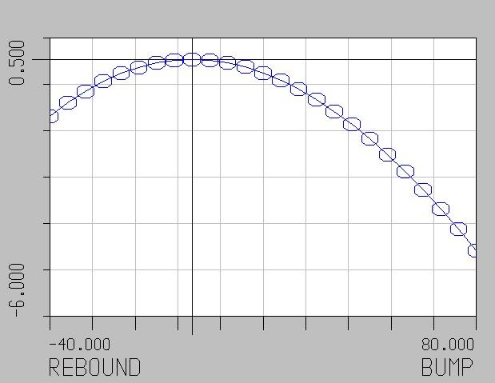

Scrub Derivative vs Bump travel (mm)

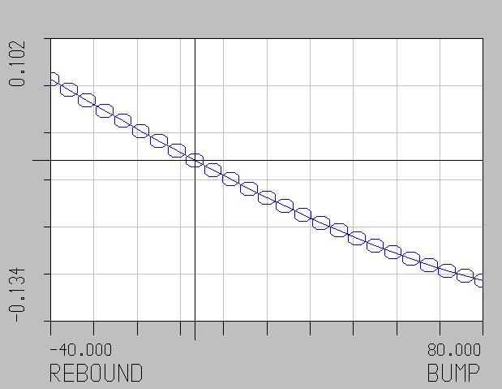

Camber (deg) vs Bump travel (mm)

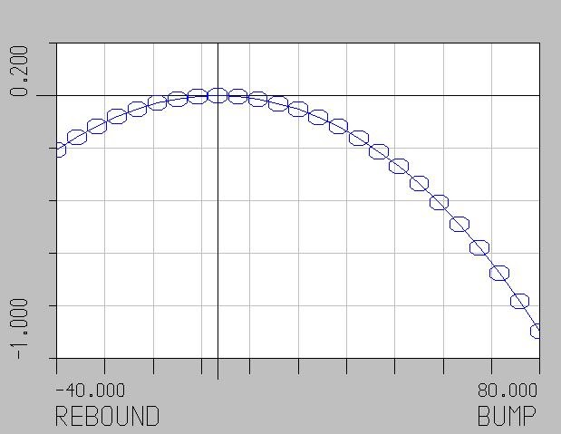

Camber Derivative vs Bump travel (mm)

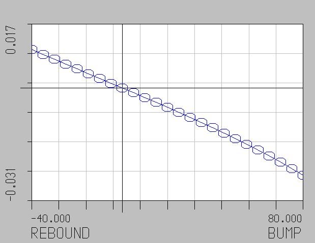

Toe (deg) vs Bump travel (mm)

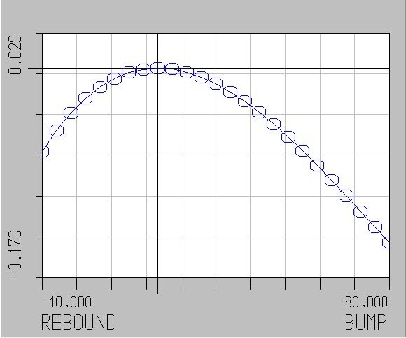

Ackermann (%) vs Steer travel (mm)

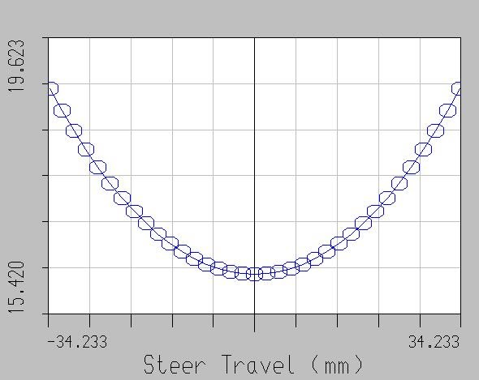

Ackermann Error (deg) vs Steer travel (mm)

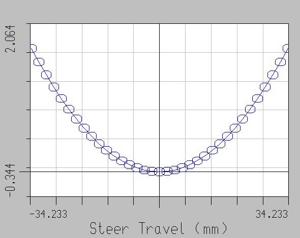

Forces being displayed during a 4-2-1 combined bump, corner, and brake

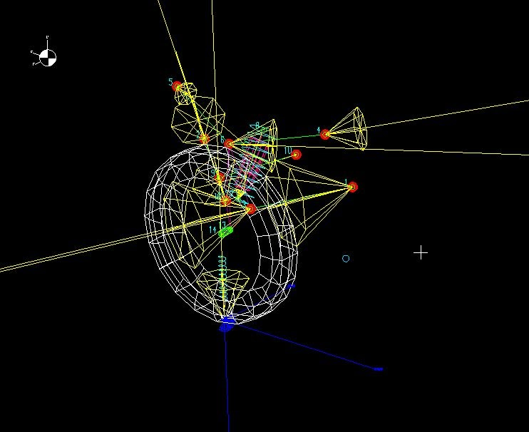

### Testing Procedure:

\[TBD]

### Measuring Toe

1. Measure the toe of the car from different points on the wheel as well as rotating the tire. This must be done at nominal ride height to get an accurate measurement. We have a very nice, expensive tool for measuring changes in toe. I suggest that you use it.
2. Remove the shock and measure the toe change as the ride height changes. This is easy to do with the car lift.&#x20;
3. Plot this data against the data generated by SHARK. If the two are the same, then, and ONLY THEN, can you assume that the toe you measure in the shop will be the same while driving.
4. Now go driving, enjoying the comfort of knowing that your suspension is not eating $500 michelins.

#### Ride Height

Final optimal ride height. These values are measured from trailing edge and lowest point on lights. Make sure car has correct ballast.

* Left rear 13.9in
* Right rear 14.5
* Left light 16.9
* Right light 16.75

Left rear 13.9in

Right rear 14.5

Left light 16.9

Right light 16.75

#### Embedded Google Drive File

Google Drive File: [Embedded Content](https://drive.google.com/embeddedfolderview?id=10EACGIEeqmAy88U4DnS1mGRW_E98Xqrd#list)
