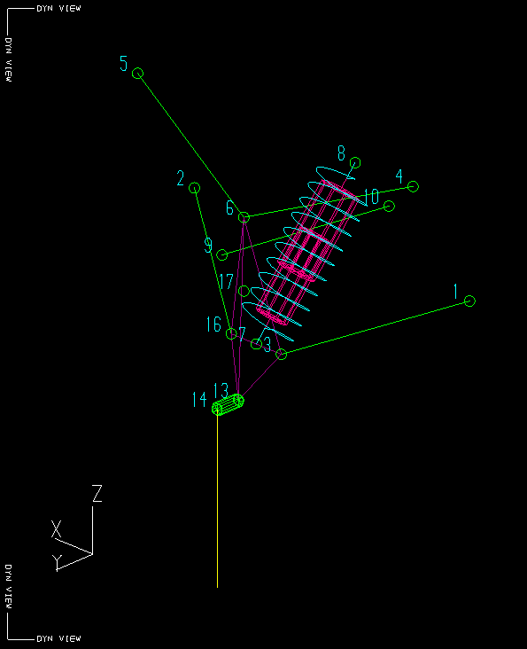
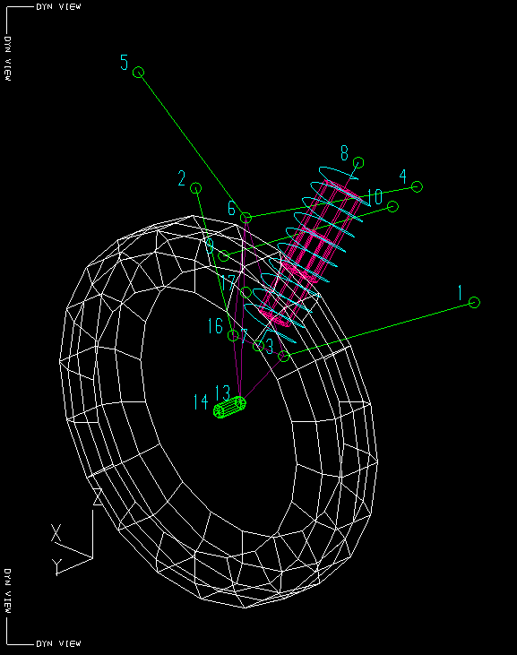

# suspension-modeling-2012\_11\_15

## SSCP - Suspension Modeling 2012\_11\_15

## Suspension Modeling 2012\_11\_15

From Nathan Golshan:

Here are some very-nearly-final analysis results on the suspension geometry, which is now fully modeled in shark to give forces at every joint.

three files are attached: two pictures to reference for point numbering (one with the tire and one without for clarity) and a .txt file with the force values at each joint at ride height, full droop, half bump, and full bump.

the loading scenario here is a 4g bump, 2g brake, and 1g corner, with the full weight of the car applied at one wheel. The cornering force is applied as if this were the outside wheel, seeing as this is the worst case scenario from a weight transfer perspective.

some explanation might be necessary here: this is a multi-link geometry, but not fully so. Whereas Xenith's suspension had independent links in place of the top control arm, this has two independent links on the bottom and an a-arm on the top.&#x20;

each part is as follows:

top a-arm - 4,5,6

bottom front link - 1,3

bottom rear link - 2,16

steering link - 9,10

shock/damper - 7,8

part of upright - 3,6,7,9,16,13,14

chassis hardpoints - 1,2,4,5,8

#### Embedded Google Drive File

Google Drive File: [Embedded Content](https://drive.google.com/embeddedfolderview?id=1672GZ3Wbl3f7WjgzJUKoImEkdWJq6uYD#list)
