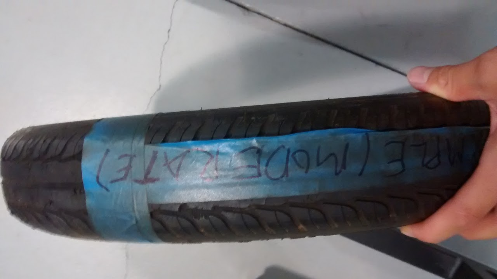
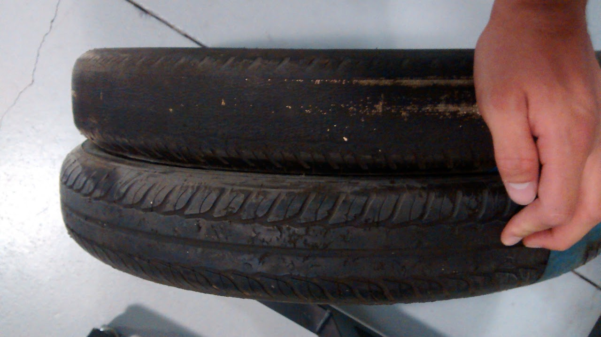

# tires

## SSCP - Tires

## Tires

#### Purchasing Michelin X

Urban Concept 95/80 R16

Best to order all at once.&#x20;

Will Whitley is the contact. $425  each \~$500 USD a piece including tax and shipping

All information will come from customer service in terms of ship date

Check or Credit Card

Other Contacts

Steve Dolby  -  Product Marketing

Michelin Tyre Public Limited Company

Campbell Road

Stoke-on-Trent

ST4 4EY

Telephone:        +44 (0) 1782 402338

Facsimile:        +44 (0) 1782 402334

Mobile:                +44 (0) 7967 478952

Email:                steve.dolby@uk.michelin.com

[steve.dolby@uk.michelin.com](mailto:steve.dolby@uk.michelin.com)

website:         www.michelin.co.uk

[www.michelin.co.uk](http://www.michelin.co.uk/)

Peter

$500 with shipping and tax

8644584264

Tires have shipped

Should arrive&#x20;

Shipped yesterday

FedEx ground

28 tires

Payment

Usually require payment upon receipt

Week or so to get

Once you get there will be an invoice created internally

Then Will will send invoice to you

The whole process may take a while

Michelin is nor&#x20;

### Michelin Blog Post on Radial X

This is from the WSC and Michelin AU site in 2013 and is the authoritative source for CRR.&#x20;

The MICHELIN Radial X offers an extremely low rolling resistance of around 1.3 kg/t. This is equivalent to climbing a permanent slope of 0.13%. Many passenger car tyres today have rolling resistance equivalent to climb a permanent slope of 1%.

The energy efficiency of the new MICHELIN Radial X tyre is approximately 7 to 8 times better than the average passenger car tyre meaning it remains the tyre of choice for the front running competitors.

#### Embedded Content

Embedded content: [Custom embed](tires.md)

&#x20;

&#x20;

&#x20;

....

This has been achieved through a number of different innovations, but by far the most significant is the integration of silica in the rubber compound. The result of this was a reduction of the tyres rolling resistance by 35%, which in turn reduced fuel consumption by 5% for a vehicle driven at 90 km/h.

The most recent evolution of MICHELIN green tyres offer is the MICHELIN ENERGY XM2 tyre.

Not only does this tyre benefit from a lower rolling resistance, it is also safe thanks to improved braking distances and lasts longer than its competitors.

This is just one of the examples of the technology developed for the World Solar Challenge already making a difference in our day-to-day lives. We will not stop here; with the shift to more relevant, every day solutions in the 2013 World Solar Challenge, we hope that the feedback we get from our teams will continue to drive our progress in this area.

On behalf of the Michelin Group I wish all the competitors the best of luck and congratulate them and the event organisers for their dedication to creating sustainable mobility.

Together we can find a better way forward!

To find out more about MICHELIN tyres, visit www.michelin.com.au

[www.michelin.com.au](http://www.michelin.com.au/)

### Tire Crr Theory&#x20;

Check out the Michelin\_Rolling\_resistance PDF which is attached to this page for everything you want to know about CRR, how it changes in real life conditions, and how it is measured.&#x20;

Tire Wear Examples

Moderate                                                            Heavy Wear

#### Embedded Google Drive File

Google Drive File: [Embedded Content](https://drive.google.com/embeddedfolderview?id=1IUZBCjZnG13gssd3AGgR9x2wAr5cKVAK#list)
