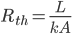

# SSCP - Tritium Heat Sink

# Tritium Heat Sink

Description:

Project to design a heat sink for the 2015 car's Tritium WaveSculptor 22 motor controllers.

To-Do:

* Set up a testing apparatus to find thermal conductivities of various materialsSet up LabJack U3-LVFind temperature probes for the LabJackSet up Tritium (spare or from Luminos) to be able to measure temperature of materials while running LuminosTest existing heat sink or some other rectangular block of aluminumCut a rectangle out of a honeycomb slab (there are some at the back of the shop) and test itLayup some carbon fiber and test it (talk to Jamie)Model different geometries + materialsDesign heat sink to fit specs of 2015 car!
* Set up a testing apparatus to find thermal conductivities of various materialsSet up LabJack U3-LVFind temperature probes for the LabJackSet up Tritium (spare or from Luminos) to be able to measure temperature of materials while running LuminosTest existing heat sink or some other rectangular block of aluminumCut a rectangle out of a honeycomb slab (there are some at the back of the shop) and test itLayup some carbon fiber and test it (talk to Jamie)
* Set up LabJack U3-LV
* Find temperature probes for the LabJack
* Set up Tritium (spare or from Luminos) to be able to measure temperature of materials while running Luminos
* Test existing heat sink or some other rectangular block of aluminum
* Cut a rectangle out of a honeycomb slab (there are some at the back of the shop) and test it
* Layup some carbon fiber and test it (talk to Jamie)
* Model different geometries + materials
* Design heat sink to fit specs of 2015 car!

* Set up a testing apparatus to find thermal conductivities of various materialsSet up LabJack U3-LVFind temperature probes for the LabJackSet up Tritium (spare or from Luminos) to be able to measure temperature of materials while running LuminosTest existing heat sink or some other rectangular block of aluminumCut a rectangle out of a honeycomb slab (there are some at the back of the shop) and test itLayup some carbon fiber and test it (talk to Jamie)
* Set up LabJack U3-LV
* Find temperature probes for the LabJack
* Set up Tritium (spare or from Luminos) to be able to measure temperature of materials while running Luminos
* Test existing heat sink or some other rectangular block of aluminum
* Cut a rectangle out of a honeycomb slab (there are some at the back of the shop) and test it
* Layup some carbon fiber and test it (talk to Jamie)
* Model different geometries + materials
* Design heat sink to fit specs of 2015 car!

Set up a testing apparatus to find thermal conductivities of various materials

* Set up LabJack U3-LV
* Find temperature probes for the LabJack
* Set up Tritium (spare or from Luminos) to be able to measure temperature of materials while running Luminos
* Test existing heat sink or some other rectangular block of aluminum
* Cut a rectangle out of a honeycomb slab (there are some at the back of the shop) and test it
* Layup some carbon fiber and test it (talk to Jamie)

Set up LabJack U3-LV

Find temperature probes for the LabJack

Set up Tritium (spare or from Luminos) to be able to measure temperature of materials while running Luminos

Test existing heat sink or some other rectangular block of aluminum

Cut a rectangle out of a honeycomb slab (there are some at the back of the shop) and test it

Layup some carbon fiber and test it (talk to Jamie)

Model different geometries + materials

Design heat sink to fit specs of 2015 car!

Background:

Tritium WaveSculptor 22 Specs:

* Max design temperature: 70°CMax automatic shutdown temperature: 80°CCold plate / thermal interface dimensions: 250 mm X 117 mmThreads: 8x M4, 14mm max depth (see Tritium website - Mechanical Assembly doc for hole locations)
* Max design temperature: 70°C
* Max automatic shutdown temperature: 80°C
* Cold plate / thermal interface dimensions: 250 mm X 117 mmThreads: 8x M4, 14mm max depth (see Tritium website - Mechanical Assembly doc for hole locations)
* Threads: 8x M4, 14mm max depth (see Tritium website - Mechanical Assembly doc for hole locations)

* Max design temperature: 70°C
* Max automatic shutdown temperature: 80°C
* Cold plate / thermal interface dimensions: 250 mm X 117 mmThreads: 8x M4, 14mm max depth (see Tritium website - Mechanical Assembly doc for hole locations)
* Threads: 8x M4, 14mm max depth (see Tritium website - Mechanical Assembly doc for hole locations)

Max design temperature: 70°C

Max automatic shutdown temperature: 80°C

Cold plate / thermal interface dimensions: 250 mm X 117 mm

* Threads: 8x M4, 14mm max depth (see Tritium website - Mechanical Assembly doc for hole locations)

Threads: 8x M4, 14mm max depth (see Tritium website - Mechanical Assembly doc for hole locations)

Heat Sink Design Principles:

The heat sink will dissipate heat from the metal "cold plate" on the bottom of the Tritium. Heat moves from the cold plate into the heat sink (some type of thermally conducting paste is used to ensure a good interface); conducts through the heat sink to the outer surfaces; and convects/radiates into the surrounding fluid (in this case, air).

The rate of heat to be dissipated equals the power loss in the Tritium controller. Tritium gives a formula for predicting power loss:

where

* R = 1.0800e-2 Ohms is the equivalent resistance of the controllera = 3.3450e-3 is the linear component of switching lossb = 1.8153e-2 is the constant component of switching lossC = 1.5625e-4 is the eq. capacitance * frequency product of the controllerI is the output current in Amps root mean square (Arms)V is the bus (battery) voltage to the controller.
* R = 1.0800e-2 Ohms is the equivalent resistance of the controller
* a = 3.3450e-3 is the linear component of switching loss
* b = 1.8153e-2 is the constant component of switching loss
* C = 1.5625e-4 is the eq. capacitance * frequency product of the controller
* I is the output current in Amps root mean square (Arms)
* V is the bus (battery) voltage to the controller.

* R = 1.0800e-2 Ohms is the equivalent resistance of the controller
* a = 3.3450e-3 is the linear component of switching loss
* b = 1.8153e-2 is the constant component of switching loss
* C = 1.5625e-4 is the eq. capacitance * frequency product of the controller
* I is the output current in Amps root mean square (Arms)
* V is the bus (battery) voltage to the controller.

R = 1.0800e-2 Ohms is the equivalent resistance of the controller

a = 3.3450e-3 is the linear component of switching loss

b = 1.8153e-2 is the constant component of switching loss

C = 1.5625e-4 is the eq. capacitance * frequency product of the controller

I is the output current in Amps root mean square (Arms)

V is the bus (battery) voltage to the controller.

See the Tritium WaveSculptor 22 manual, Ch. 7 for more (see Tritium controller link below).

Overall, the heat sink (including thermal paste, the heat sink itself, and convection into the ambient) must satisfy

where T_j = cold plate temp., T_a = ambient, P_loss = power loss from the Tritium, and R_th = thermal resistance of the heatsink, measured in °C/W. Note R_th is a specific property of the sink, dependent on geometry, etc.

For a rectangular geometry, of length L, perpendicular area A, & thermal conductivity k, the thermal resistance is

Testing Phase 1: Characterizing Materials

We'll test various materials that may be used in the next car's heat sink.

Tentative materials to test:

* AluminumCarbon fiber + aluminum honeycombCarbon fiber used on Luminos outer shellOther composites that Jamie finds
* Aluminum
* Carbon fiber + aluminum honeycomb
* Carbon fiber used on Luminos outer shell
* Other composites that Jamie finds

* Aluminum
* Carbon fiber + aluminum honeycomb
* Carbon fiber used on Luminos outer shell
* Other composites that Jamie finds

Aluminum

Carbon fiber + aluminum honeycomb

Carbon fiber used on Luminos outer shell

Other composites that Jamie finds

Tentative testing apparatus: Bolt the material (preferably a rectangular prism shape) to test to a Tritium. Hook the Tritium to Luminos to get telemetry data (specifically, Tritium temperature and power draw to calculate power loss) while running the car. Use a temperature probe to measure the temperature of the end of the material opposite the end attached to the Tritium.

Compute thermal conductivity with

Setup:

 [ MOSFETS]

Results:

Aluminum:

    L = 5 cm, A = 6.3 cm * 3.9 cm = 24.57 cm^2, Ta = 47.3 C, Tj = 53.2 C, P = (1.87V*10.01A + 1.82V*10.03A + 2.02V*10.08A + 1.87V*10.06A) = 76.15 W

    => k = (LP)/(A*(Tj-Ta)) = 262.6 W/m-K

Carbon Honeycomb:

    L = 1.3 cm, A (trapezoid) = 0.5 * 6.8 cm * (7.0 + 6.1) cm = 44.54 cm^2, Ta = 41.2 C, Tj = 43.4 C, P = (same as above) 76.15 W

    => k = 101.0 W/m-K

Using the LabJack U3-LV

Manual: http://labjack.com/sites/default/files/2011/04/U3_UG_Export_04282011.pdf

[http://labjack.com/sites/default/files/2011/04/U3_UG_Export_04282011.pdf](http://labjack.com/sites/default/files/2011/04/U3_UG_Export_04282011.pdf)

SSCP page for temperature sensing for Luminos: https://sites.google.com/a/stanfordsolarcar.com/sscp/home/composites/temperature-sensing

[https://sites.google.com/a/stanfordsolarcar.com/sscp/home/composites/temperature-sensing](/home/sscp-2012-2013/composites-2012-2013/temperature-sensing)

What do the acronyms mean?

GND = Ground

SGND = Thermal fuse in series with ground, for attaching ground from other powered devices

VS = Supply voltage ~5V

FI00-07 = Flexible analog/digital input or digital output

Temperature sensor: LM35 temperature sensor.

[LM35](http://www.ti.com/lit/ds/symlink/lm35.pdf)

    * Change the Range to U_rgUNI2p5V for unipolar 2.5V Range.

Output: The sensor has a valid output from 0-150C (0-300F) and is calibrated in centigrade where each 10mV = 1C with no offset factor so multiplying the sensor output voltage by 100x yields the temperature in Centigrade.

Setting up:

1. The programs are installed on one of the Toughbooks.

2. Plug in the LabJack and open up the LJControlPanel to find the device. Close the Panel.

3. Open up LJStreamUD.

4. Plug in sensor:

    * White/orange to VS

    * White/blue to GND

    * White to FIO input/output

5. For one thermocouple: Set the # of channels to 1. Set Ch+ to the connected channel. Set Ranges to LJ_rgUNI2P5V.

6. The voltage reading should be 10mV / °C with no offset. So for the Scaling Equation, type y=a*100 (replace a with the proper letter depending on the row). The scaled value should be the temperature in °C.

Links:

Tritium controller: http://tritium.com.au/products/wavesculptor22-motor-inverter/

[http://tritium.com.au/products/wavesculptor22-motor-inverter/](http://tritium.com.au/products/wavesculptor22-motor-inverter/)

Heat sink design: http://www.ti.com/lit/an/slva462/slva462.pdf

[http://www.ti.com/lit/an/slva462/slva462.pdf](http://www.ti.com/lit/an/slva462/slva462.pdf)

