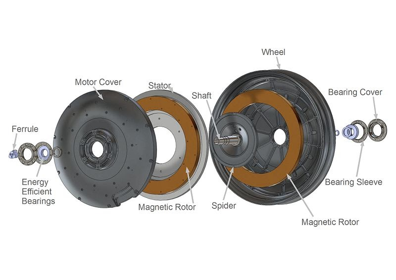
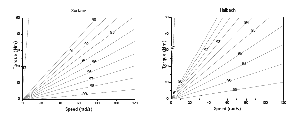

# csiromarand-motor

## SSCP - CSIRO/MARAND Motor

## CSIRO/MARAND Motor

#### Summary

The CSIRO is a coreless axial flux permanent magnet motor. Developed by CSIRO, the Australian research agency in 1995, the motor has been used by almost all winning teams since its invention.

#### Efficiency Plot

Source: "Solar Car Motor - Kit notes

#### History

This motor was used for SSCP 2010-2011 car Xenith. The motor carried the car almost all the way across Australia, despite several problems.

#### History of Problems

Pre-2011

Testing: During testing, we had problems with the stator rubbing in corners. The tolerances of our homemade rim/motor were not particularly good, meaning that we had to shim basically every component of the motor to get to the recommended 1.75mm gap. This problem was fixed by having a professional machinist make the rim

WSC 2011

Race Day 1: Improper reinstallation of the motor after a tire change cased the stator to apply torque without being restrained. This spun the stator internally, twisting wires and pulling out one of the phase lines and damaging another. It was fixed with an air dremel, a soldering iron, and quick-set glue,  The root cause of the misalignment was the installation by glue, instead of a press fit, or a torque pin in the motor shaft.

Race Day 4: The second damaged phase line finally pulled out, and required the same solder hack as the first failure

Post WSC 2011

Spring 2012: The incorrect assembly of the motor (either a spacer ring was not installed or was swapped with another spacer ring), caused the stator to move axially 2mm relative to the rotors, crashing the stator against the rotor. This caused the motor to have very high friction immediately, which brought the car to a rapid stop from \~ 15 mph. The incident did not damage the motor, but the rapid drop in back EMF caused a phase of the tritium to explode.&#x20;

#### Mounting Pattern

Since the CSIRO is a "kit," the team must design the casing for the motor. There are no standard mounting dimensions

#### Bearings

Since the CSIRO is a "kit," the team must design the bearings for the motor. There are no standard bearings

#### Embedded Google Drive File

Google Drive File: [Embedded Content](https://drive.google.com/embeddedfolderview?id=1HfretWruIP12gayqEvgmzmZAX8No-1aK#list)
