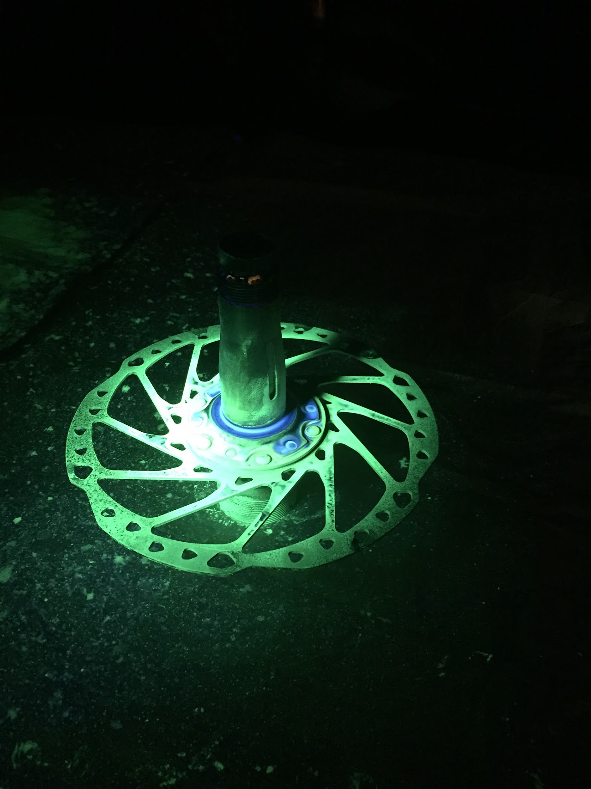
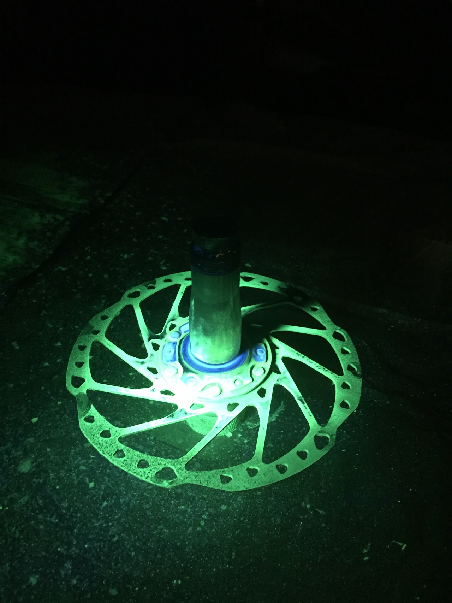
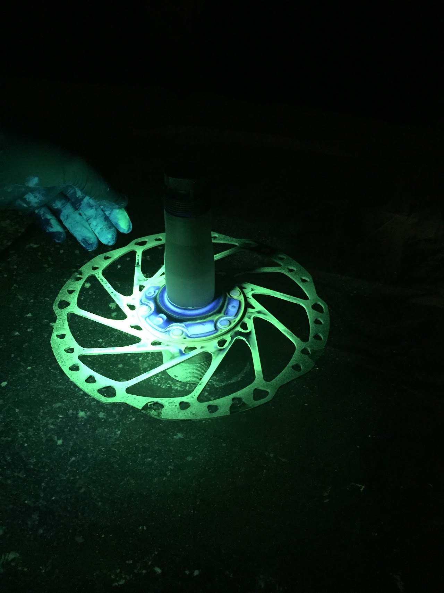
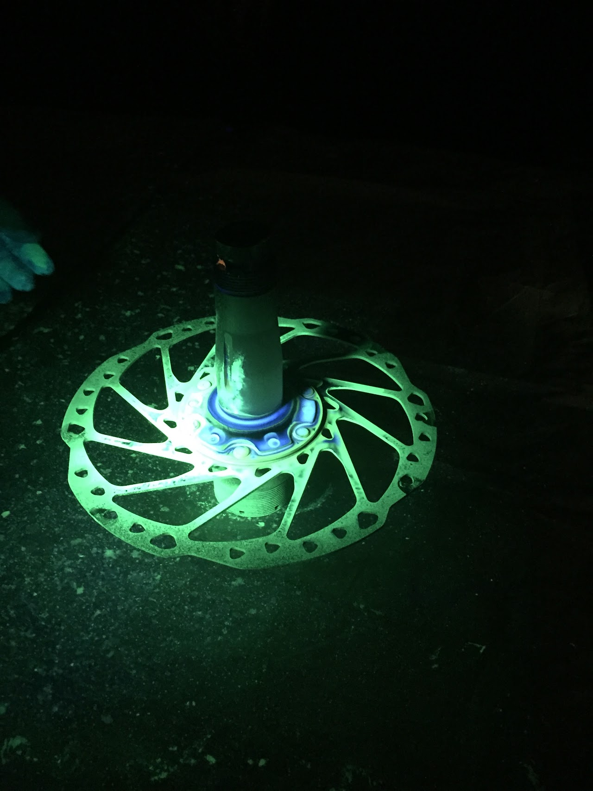
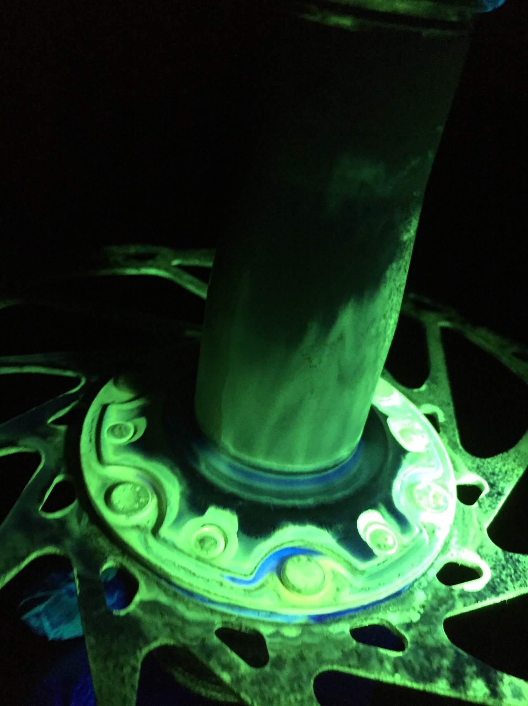
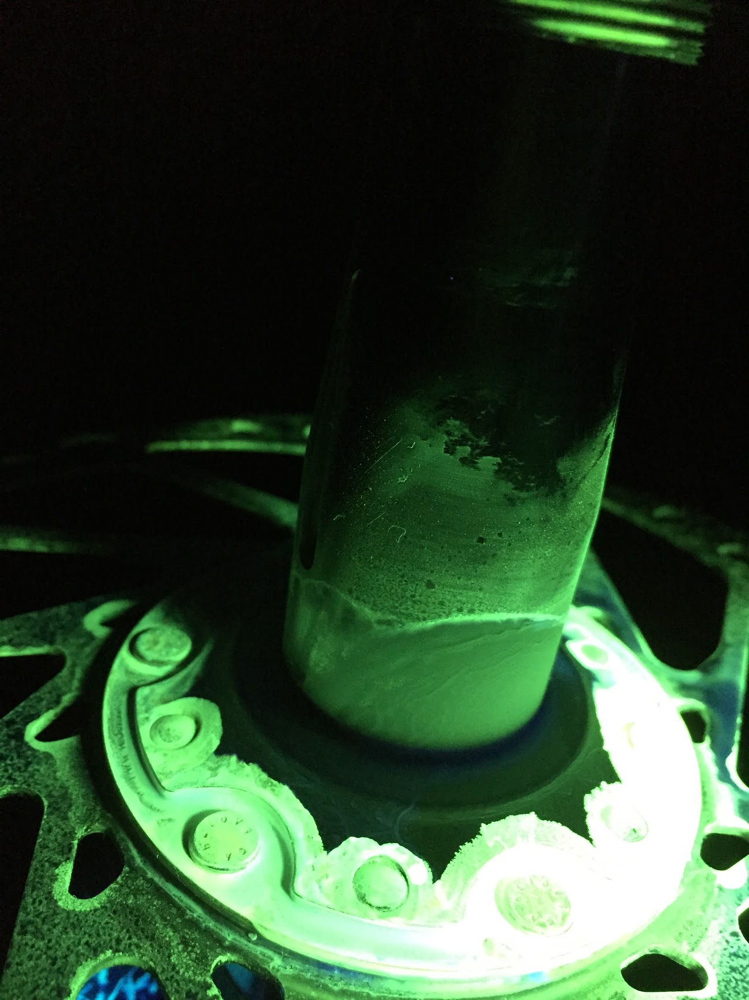
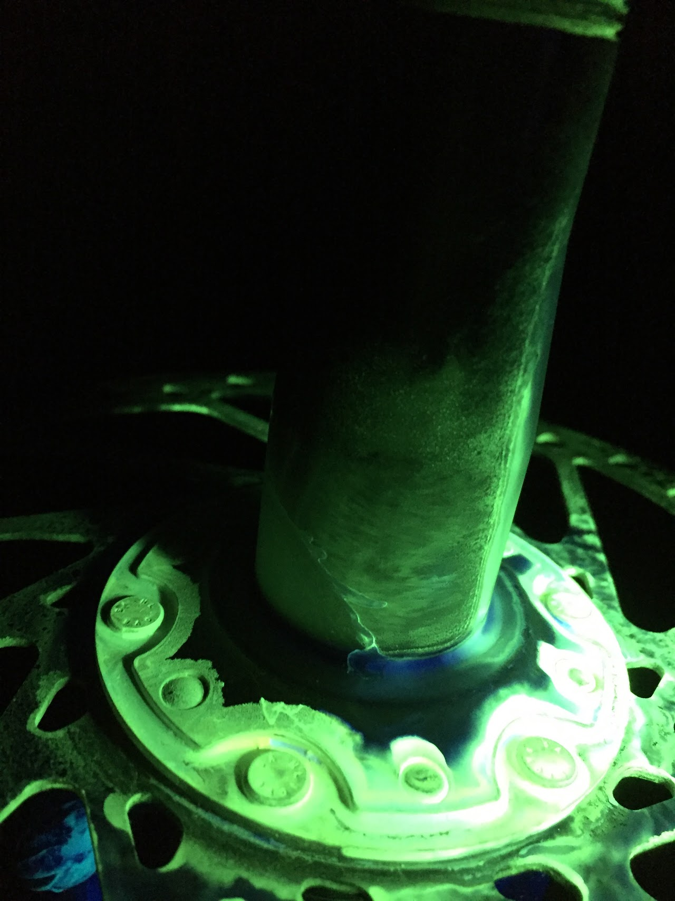
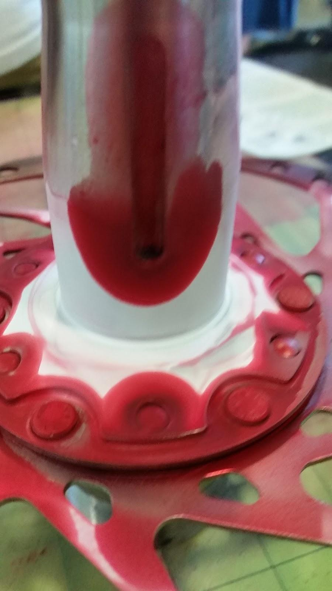
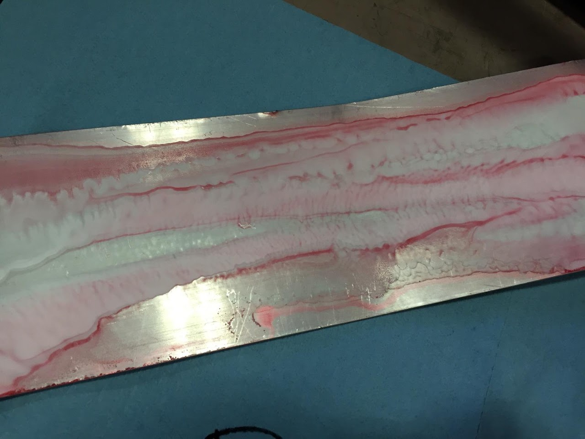

# SSCP - Motor Integrity Testing

# Motor Integrity Testing

Warp 2 Dye Test with high-quality UV dye (November 2016)

No signs of cracking at the base of the spindle:

Warp 1 Dye Test with high-quality UV dye (October 2016)

Video of control: https://www.youtube.com/watch?v=OyWoXyBQS-U&feature=youtu.be

[https://www.youtube.com/watch?v=OyWoXyBQS-U&feature=youtu.be](https://www.youtube.com/watch?v=OyWoXyBQS-U&feature=youtu.be)

No signs of crack at the base of the spindle:

Report:

Hey all,

TL;DR The Flourescent dye penetrant test went well!

I have attached a pic of the motor spindle under the black light after we put the developer on it. It seems as though the long section has no cracks, compared to our control sample (a piece of aluminum bat stock we hammered up to induce cracking). We'll put videos of both the spindle and control test on the YouTube channel.

Assuming we put the right amount of developer on the spindle, there are no signs of cracks of any kind, so our recommendation is to proceed with the motors from the previous cycles.

- Motor Sub-Team "Leads"

Ben Barcklay, Max Wang, Henry Weller

Dye Test with low-quality dye (Spring 2016)

We weren't able to find cracks, but this claim is tenuous at best since we were not sure if the way we ran the test had the ability to find the cracks we were looking for. The reason we are unsure is because we also did the test on a piece of scrap aluminum that we had bent multiple times by hitting it with a hammer, with the intent of causing fatigue and making cracks (we assumed that aluminum would form these cracks given the degree of force we applied). The scrap aluminum did not show signs of cracks using DPT, thus putting into question our results from the DPT on the spindle.

---

Nathan Hall-Snyder responded to the test results: “This was my concern with a cheap kit...there's a reason why people pay $$$ for the UV dye kits. They're significantly more sensitive. I did the same aluminum test that you did, but was able to find small cracks. Not anything so small that they couldn't be seen with the eye...

While the motor is taken apart, I would ask around @Stanford and see if you can borrow someone's UV dye kit.

The results look about the same as the last time I used a red dye kit.

Please make a write up including the pictures and link it to the Warp Motor page on the site.”

---

Follow ups: We will search for a more sensitive DPT kit by asking around with labs and other student groups on campus.

---

Photos of results can be found here.

[ here](https://drive.google.com/a/stanford.edu/folderview?id=0B39uc5IP-LPEV3pGeWdIVzFoZnc&usp=sharing)

Motor used: left warp 1

.

View of spindle. No signs of cracks.

.

View of scrap aluminum. There were no signs of cracks here either.

