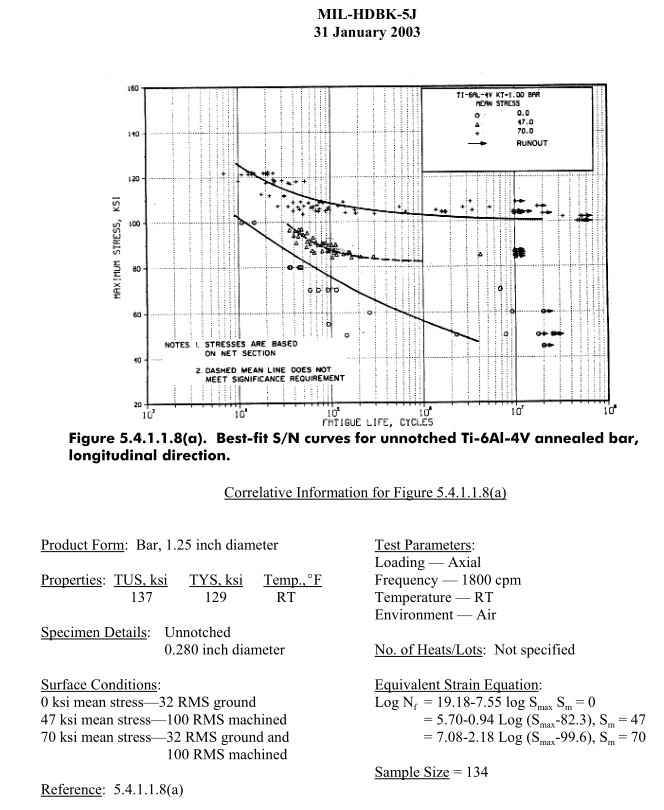

# SSCP - Motor Spindle Longevity Analysis

# Motor Spindle Longevity Analysis

This page addresses the durability of the spindles manufactured for Luminos (2012-2013) by Gonsel's Machine Shop.

## Introduction

The spindles of the motor and rear hub are the single most highly stressed rotating component of the solar car. Therefore, it will be subjected to the largest number of fatigue cycles (once per rotation) as well as some of the highest loads (due to combined braking, cornering, and bump loads). Failure of the spindle could result in catastrophic loss of control of the solar car.

The spindles were machined out of 6AL-4V Annealed Bar Titanium. Some of the titanium was purchased from Ebay and some was purchased from President Titanium. No surface treatment other than mechanical polishing was performed on the bearing surfaces.

While the spindles performed without fault for the duration of the 2013 race season, there was some question as to whether they could be used again. The analysis below looks as at some of the concerns and addresses them, ultimately concluding that the spindles are safe to use.

## Concerns

The following are the categories of problems we identified if we were to re-use the spindles on newer cars.

### Existing Cracks

I purchased a MAGNAFLUX dye kit, disassembled the front left motor, and used the kit on the highly-stressed flange. The dye kit has an ultra-low viscosity red dye that leeches into cracks, and then the developer draws the dye back out. This kit was not able to find any evidence of cracks on the surface of the flange. I bent a piece of aluminum to purposefully add some cracks to verify the functionality of the dye kit. I did not see any problems on the critically stressed surface.

### Stress Fatigue

The flange under question is highly stressed during shock loading, but not particularly stressed during normal car operation. Titanium is a rather special material in that if the total stress is below a certain threshold, then the material has a functionally infinite fatigue life. This makes it an excellent choice for aircraft structural components (and spindles). However, care has to be taken to make sure that the high-cycle stress is below roughly 1/3 of the yield strength of the material.

Michael performed a relatively detailed ANSYS simulation of the part using the following conditions:

* Load of 889 N (the most heavily loaded wheel on Luminos + 1/4 of the driver weight) applied on the wheel bearing face. We assume this is the steady state rotating load.
* Bearing fixtures on the bearing faces
* Material Properties from page 946 in MIL-HDBK-5J for Annealed 3" to 4" Titanium 6AL-4V BarTensile yield: 120 KSICompressive yield: 120 KSIUltimate Yield: 130 KSI
* Tensile yield: 120 KSI
* Compressive yield: 120 KSI
* Ultimate Yield: 130 KSI

Load of 889 N (the most heavily loaded wheel on Luminos + 1/4 of the driver weight) applied on the wheel bearing face. We assume this is the steady state rotating load.

Bearing fixtures on the bearing faces

Material Properties from page 946 in MIL-HDBK-5J for Annealed 3" to 4" Titanium 6AL-4V Bar

[MIL-HDBK-5J](https://engineering.purdue.edu/AAE/Academics/Courses/aae450/2008/spring/5_struct/MIL-HDBK-5J.pdf)

* Tensile yield: 120 KSI
* Compressive yield: 120 KSI
* Ultimate Yield: 130 KSI

Tensile yield: 120 KSI

Compressive yield: 120 KSI

Ultimate Yield: 130 KSI

The maximum stress is at the correct location (the bearing fillet) and is 14399 PSI. See the attached picture.

The S-N curves on page 959 (above) of the handbook show that our stress is not even on the chart for fatigue life. For reference, the number of cycles for one wheel assembly is around 1x10^7 cycles.

In conclusion, the spindle is safely (with a 2x safety margin) in the "no-fatigue" regime of titanium.

### Stress Corrosion

Reading several books (Skunk Works, Moon Lander) about the history of the aerospace program and guides on titanium, there are several methods of contamination that can cause embrittlement of titanium. They are hydrogen, chlorine, and cadmium embrittlement. For reference, embrittlement is another word for stress-corrosion cracking, a means of failure due to a combination of mechanical stress and influence of chemicals. I address each one individually:

Hydrogen Embrittlement:

Since we have not done any thermal processing of the spindles (no heat treatment), this is unlikely to be a concern. Hydrogen embrittlement is most often a concern when there is moisture in a heat treatment oven or pickling path.

Chlorine Embrittlement

There are a number of places where chlorine can be introduced into titanium. Here are the places where, in the history of the spindles, they could have come in contact with chlorine:

* Dissolved chlorine in Gonsel's cutting fluid. Not a concern because chlorinated cutting fluids cause around 10 types of cancer and are not commonly used. This guide recommends the use of water-based cutting fluids for machining titanium given the risks and alternatives.
* Chlorine in tap water used to wash the parts off. The titanium parts were never at elevated temperature during cleaning, so this is unlikely to be a concern.
* Chlorine in shop rags used to clean off the parts. If the rags have been dry-cleaned in PERC a dry-cleaning compound and industrial degreaser, then trace chlorine compounds are a potential contaminant. I need to follow up with the rag company to determine what sort of cleaning chemicals they use.
* Chlorine in isopropanol used to clean off the parts. IPA doesn't have chlorine in it, so this shouldn't be a problem.
* Chlorine in the grease used in the bearings: the MSDS for the E2 Bearing grease contains no substances that need to be reported. Since chlorinated compounds tend to be nasty, I would say with high probability that there is no significant concentration of chlorine in the grease.
* Chlorine in the grease used to make sliding the bearings on and off easier: Mobilith SHC 100 grease is a synthetic grease with no chlorinated compounds. Furthermore, there is no mention of any compatibility problems with materials in the datasheet.

Dissolved chlorine in Gonsel's cutting fluid. Not a concern because chlorinated cutting fluids cause around 10 types of cancer and are not commonly used. This guide recommends the use of water-based cutting fluids for machining titanium given the risks and alternatives.

[This guide](http://www.cimcool.com/wp-content/uploads/tech-reports/machiningtitanium.pdf)

Chlorine in tap water used to wash the parts off. The titanium parts were never at elevated temperature during cleaning, so this is unlikely to be a concern.

Chlorine in shop rags used to clean off the parts. If the rags have been dry-cleaned in PERC a dry-cleaning compound and industrial degreaser, then trace chlorine compounds are a potential contaminant. I need to follow up with the rag company to determine what sort of cleaning chemicals they use.

Chlorine in isopropanol used to clean off the parts. IPA doesn't have chlorine in it, so this shouldn't be a problem.

Chlorine in the grease used in the bearings: the MSDS for the E2 Bearing grease contains no substances that need to be reported. Since chlorinated compounds tend to be nasty, I would say with high probability that there is no significant concentration of chlorine in the grease.

[MSDS](http://www.skf.com/binary/30-25333/LESA2_EN.pdf)

Chlorine in the grease used to make sliding the bearings on and off easier: Mobilith SHC 100 grease is a synthetic grease with no chlorinated compounds. Furthermore, there is no mention of any compatibility problems with materials in the datasheet.

[Mobilith SHC 100 ](http://www.tricocorp.com/wp-content/uploads/2014/01/PL3_Mobilith-SHC-100.pdf)

I think the highest risk of potential contamination is from shop rags, but since we have never operated the spindles at elevated temperatures, and there is no evidence of stress-corrosion cracking, I don't believe it is a concern.

Cadmium Embrittlement

Cadmium embrittlement is a well-known effect where cadmium atoms from bolts, wrenches, or surface treatment compounds can significantly decrease the strength of titanium. In the design and manufacturing of the motors, I specifically avoided using fasteners or tools with cadmium plating on them to avoid this issue.

## Conclusion

I believe that the spindles will continue to function for the foreseeable future and do not need to be replaced. -NHS 8/17/2014

