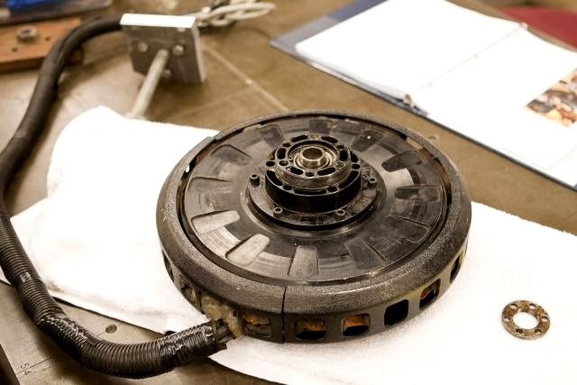
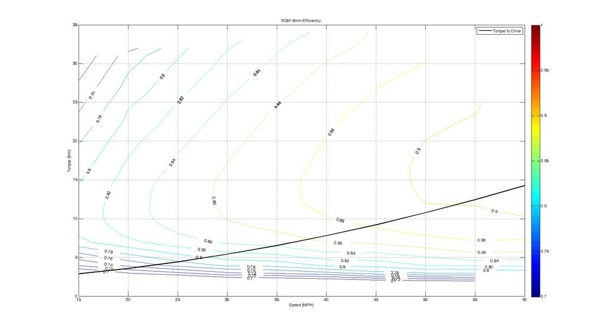

# SSCP - NGM SCM-150

# NGM SCM-150

### Summary

The NGM is a physically robust, torquey motor used by the majority of teams in the US. The motor is well designed and powerful, though not especially efficient.

Photo Credit: Calsol

### Efficiency Plot

The University of Minnesota team characterized the NGM Motor. The graph is here:

### KV Data from UNMSVP

2mm gap - kV = 1.970 V/mph

3mm gap - kV = 1.642 V/mph

4mm gap - kV = 1.504 V/mph

5mm gap - kV = 1.457 V/mph

6mm gap - kV = 1.463 V/mph

### History of Problems

Hall Sensors (Apogee): The built in hall sensors failed, causing us to machine the stator and install our own hall sensors, which worked without problems for WSC 2009 and ASC 2010.

Bearing Failures (Apogee): The bearings can be installed in several different configurations, all of which initially seem to be correct. However, there are only two correct configurations, one configuration for 0 to 50% gap, and 50% to 100% gap. Incorrect installation of the bearings can lead to much higher friction in the motor and immediate bearing failure.

Cogging Torque (Solstice and Equinox): The cogging torque of the motor caused rod ends to "pop" on the a-arm suspension on which it was mounted. The "popping" would generally occur during the transition from six-step to sensorless commutation. While easily fixed, rod ends becoming disengaged is obviously not ideal.

Weight (Solstice and Equinox): Due to the extra unsprung mass of the single-wheel drive, on these four wheel cars, the driven tire would often see the most wear and would be the first to get a flat during testing and racing. The cause of this is unknown.

Wheel Nut Design (Apogee): Due to play with the torque transfer pins, repeated cycling of the brakes led to wheel nut loosening. This manifested in "creaking" of the wheels after a long day of driving. Uncorrected, this can lead to wheel loosening. The wheel nut design was changed to rectify this with Xenith.

### Mounting Pattern

The NGM uses a 5x1/4-20 bolt circle for torque transfer and a center stud with a bearing not for shear force transfer. We did not attached the bearing nut for Apogee and did not have any problems.

### Bearing Part Numbers

### History

The NGM Solar Car Motor has been used on the following Stanford Cars:

Solstice (2004-2005)

Equinox (2006-2007)

Apogee (2008-2009)

Earlier Cars?

Specifications can be found in the attached documents.

### Embedded Google Drive File

Google Drive File: [Embedded Content](https://drive.google.com/embeddedfolderview?id=1aVG61H0vufNsErvYDSbr1CXUzxiqXyKi#list)

<iframe width="100%" height="400" src="https://drive.google.com/embeddedfolderview?id=1aVG61H0vufNsErvYDSbr1CXUzxiqXyKi#list" frameborder="0"></iframe>

