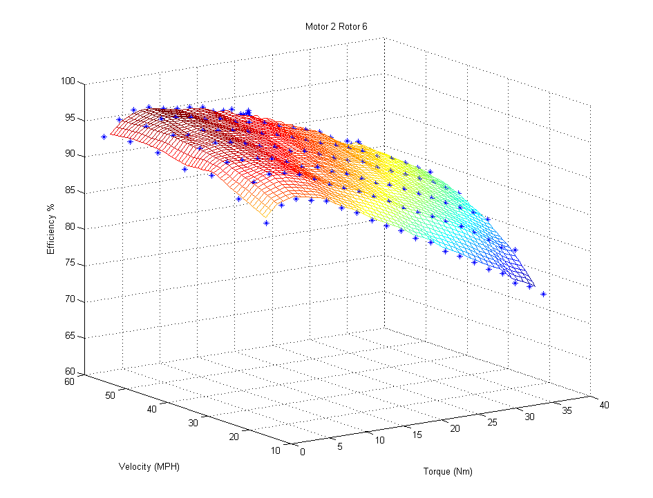
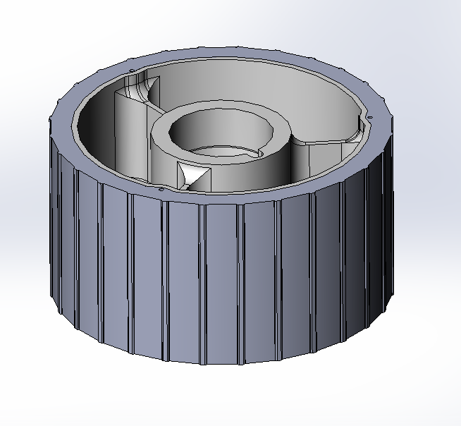

# SSCP - Warp Motor

# Warp Motor

## Summary

This motor is a collaboration between Sam Lenius from the University of Minnesota Solar Vehicle Project and Nathan Hall-Snyder of SSCP. The intention is to create a scaled down motor with high efficiency and extremely high reliability for use in the team's 2013 vehicle. The decreased size requires the use of two motors to meet the torque requirements for the World Solar Challenge.

### Motor Log

(Insert new log items here!)

October 2017

Warp 1 and 2 (silver motors) were swapped into Sundae in Darwin to evenly wear bearings.  These motors, Warp 1 and 2, were used for all static and dynamic scrutineering and raced WSC 2017 with no issues.

September 2017

Warp 3 and 4 (black motors) were used to test in Australia with no issues.

August 2017

Warp 3 and 4 (black motors) were disassembled by Rachel and Sarah S to swap bearings and motor caps (to mate with Sundae's upright) and reassembled.  Brake rotors of Warp 1, 2, 3, and 4 replaced.  Warp 1 and 2 (silver motors) were used for some dynamic testing at Crow's landing, neighborhood drives, and Sundae's first Central Valley test drive.  Warp 3 and 4 (black motors) were used for the second Central Valley test drive.  No issues.

July 2017

Warp 1 and 2 (silver motors) were disassembled by Rachel to swap bearings and motor caps (to mate with Sundae's upright) and reassembled.

November 2016

Disassembled warp 2 completely and performed Zyglow dye penetrant test on it. No cracks were revealed.

[ performed Zyglow dye penetrant test](/stanford.edu/testduplicationsscp/home/sscp-2012-2013/mechanical-2012-2013/motors/motor-integrity-testing)

October 2016

Used a fluorescent dye penetration kit (Zyglow) to test the motor spindle for cracks. No cracks were revealed, so we reassembled Warp 1 with that spindle and new bearings. 

[ to test the motor spindle](/stanford.edu/testduplicationsscp/home/sscp-2012-2013/mechanical-2012-2013/motors/motor-integrity-testing)

April 2016

Used a red dye penetration kit (Spotcheck) to test the motors for cracks. The quality of the test came into question because though we were not able to find any cracks, we were also not able to do so on an aluminum sheet that we hit many times with a hammer. See here for detailed results and photos.

[ here](https://docs.google.com/document/d/10vYskmjBx28TAcDme4u2SZJBrkGw7NQbbiI1rvOsnxM/edit?usp=sharing)

October 2015

Motors 1 and 2 (Silver Motors) were raced across Australia with no problems during the race. An intermittent open circuit in a poorly-made resolver cable caused torque reversal before the race...see the issues section for more info.

September 2015

Sam L and Nathan swapped out the low-torque rotors on motors 1 and 2 for new high torque rotors 8 and 11. The rubber stator compression ring was also replaced with the cork version used on motors 3 and 4. Excess glue was removed from the area where the rubber compression ring used to be. No obvious wear was observed on the inside of the motors. Torque putty was applied to all reinstalled bolts and the bearing nut.

May 2015

The bearings on motor 3 were replaced by Nathan, Darren, Aravind, and Harry. No damage was observed to the removed bearings. One of the set screws in the bearing locknut was semi-stripped. It was therefore not torqued to the required spec, but still firmly engaged. Nathan recommends that this set screw be replaced upon next service. No torque putty was applied to the bearing locknut, rear case bolts, or front bolts since the torque putty at the shop was dried out.

August 2014

At the request of team lead Guillermo, Nathan and Michael took a look at the risk of fatigue on the titanium spindles. The results of that analysis are a subpage of this page here.

[here](/stanford.edu/testduplicationsscp/home/sscp-2012-2013/mechanical-2012-2013/motors/motor-spindle-longevity-analysis)

January 2014

Nathan disassembled the left motor, replaced the bearings, and inspect all components. No unexpected wear was found. Notes of wear - blackened grease around the inner bearing indicates that the inner bearing outer race is rotating in place.

October 2013

Motors 3 and 4 (Black Motors) were raced across Australia with no problems (!).

Early October 2013

Luminos was dropped off sawhorses to the (left) during testing in Oz. The brake rotor on motor 4 was replaced. No lasting damage was believed to be sustained after the replacement.

One of the motors appeared to cut out while driving. Root cause was the backshell of the resolver connector not being fully screwed in.

Summer 2013

Motors 1 and 2 were driven a total of one WSC's worth of test miles, mostly in the Central Valley. Several problems were identified, including failed Molex Microfit connectors and heat damage to magnets.

### Motor Status

For Luminos, a total of four stators, four cases, and six rotors were manufactured. Rotors 1 and 2 were damaged by excess heat during the magnet glue heating process and as such have lower torque than the other motors. They should be considered mechanical samples or backups only.

Rotors 3 and 4 have smaller magnets, lower torque, but a higher top speed.

Rotors 5 and 6 have a different magnet design, higher torque, but a lower top speed.

The efficiency is is essentially the same between the two rotor configurations (within .5%)

### Embedded Content

Embedded content: [Custom embed]()

<iframe width="100%" height="400" src="" frameborder="0"></iframe>

## Technical Specifications

### Absolute Maximum Specifications

### Embedded Content

Embedded content: [Custom embed]()

<iframe width="100%" height="400" src="" frameborder="0"></iframe>

### Technical Specifications

 * For some drive torque, not necessarily a cruise torque. See efficiency maps below

 ** During a day of non-aggressive test-driving around Thunderhill

 *** Decreased operating temperature recommended to prevent loss of press-fit on stator. The stator can move at 120C

### Pinouts

### Embedded Content

Embedded content: [Custom embed]()

<iframe width="100%" height="400" src="" frameborder="0"></iframe>

### Embedded Content

Embedded content: [Custom embed]()

<iframe width="100%" height="400" src="" frameborder="0"></iframe>

### Embedded Content

Embedded content: [Custom embed]()

<iframe width="100%" height="400" src="" frameborder="0"></iframe>

## Efficiency Data

The plots are of low speed torque vs current with both the original design and the new design rotors, a plot of estimated system cruise efficiency by convolving max's power to drive curve through a bilinear interpolation of efficiency points collected on the dyno, and an example of the type of data that I have collected (in this case Motor 2 with a high torque rotor).

Remember that this data is of electrical power into the controller to mechanical power output of the motor. It combines the losses of the controller and the motor into a single number.

The new rotors will give ~20% higher torque then the original design. This will come at the expense of a limit to top speed at low battery voltages. With the black edition rotors, top speed will be around 70MPH at top of pack, 62MPH at nominal voltage and 53MPH at effective bottom of pack.

## Known Issues

### In-Service Failures

Resolver Cable Failure #2

The field-wireable cable was improperly assembled, resulting in an intermittent open-circuit that confused the resolver board and resulted in inconsistent and dangerous torque changes. Several resistor values were also discovered to be improperly specified on the Tritium resolver board.

Resolver Cable Failure

The Molex Microfit connectors on the Tritium Resolver adapter board had an intermittent open, causing unpredictable behavior of the motor.

Resolver Connector 

The 8 Pin M12 connector on the motor was not fully screwed down, causing unpredictable behavior of the motor.

Bearing Failure

While not specifically on the motor, the rear hub of Luminos suffered a bearing failure that caused more noticeable bearing drag (during a free spin test). The cause of the failure is unknown, though suspected to be dust ingress.

Bearing Thermal Tolerances (SOLVED)

When the motor heats up to operating temperatures, the tolerance within the bearings changes, causing more play in on the motor shaft. While not known to cause problems, it nonetheless deviates from the motor design intent. This has since been root caused to a tolerance issue on a fillet on the rims. A too-large radius prevented the rims from fully seating. The rims were sanded down and the problem was fixed.

### Suggested Changes

* Remove vanes from rotor carrier to reduce windage lossesBraze aluminum cover over vanesModify design for two-sided machining with no vanesModify cover to not interfere with brake calipersEasy cadUse a better material for the stator pad. Possibly put the stator pad underneath the stator or control tolerances to an extent that the aluminum provides the squishThe cork worked rather well - the tolerance of any given stator will probably not be close enough to use stator compression. If M19 steel is used, then we can use bolts directly on the statorFigure out how to stop the inner bearing outer race from spinning in place. Reminder: the black grease indicates that aluminum is being worn away from the shell.Skf recommends the use of an o-ring on the outer bearing race to prevent it from rotating.Study, characterize, and eliminate playChange the bolt circle on the front ( make it actually a 7 bolt circle)Figure out a better way to remove the rotor assembly...3D print a rubber wire holder that guides and seals the connector area from the spinning motorEasily said, difficult to find 3d printable rubber that is strong enough. Maybe cast silicone?
* Remove vanes from rotor carrier to reduce windage lossesBraze aluminum cover over vanesModify design for two-sided machining with no vanes
* Braze aluminum cover over vanes
* Modify design for two-sided machining with no vanes
* Modify cover to not interfere with brake calipersEasy cad
* Easy cad
* Use a better material for the stator pad. Possibly put the stator pad underneath the stator or control tolerances to an extent that the aluminum provides the squishThe cork worked rather well - the tolerance of any given stator will probably not be close enough to use stator compression. If M19 steel is used, then we can use bolts directly on the stator
* The cork worked rather well - the tolerance of any given stator will probably not be close enough to use stator compression. If M19 steel is used, then we can use bolts directly on the stator
* Figure out how to stop the inner bearing outer race from spinning in place. Reminder: the black grease indicates that aluminum is being worn away from the shell.Skf recommends the use of an o-ring on the outer bearing race to prevent it from rotating.
* Skf recommends the use of an o-ring on the outer bearing race to prevent it from rotating.
* Study, characterize, and eliminate play
* Change the bolt circle on the front ( make it actually a 7 bolt circle)
* Figure out a better way to remove the rotor assembly...
* 3D print a rubber wire holder that guides and seals the connector area from the spinning motorEasily said, difficult to find 3d printable rubber that is strong enough. Maybe cast silicone?
* Easily said, difficult to find 3d printable rubber that is strong enough. Maybe cast silicone?

* Remove vanes from rotor carrier to reduce windage lossesBraze aluminum cover over vanesModify design for two-sided machining with no vanes
* Braze aluminum cover over vanes
* Modify design for two-sided machining with no vanes
* Modify cover to not interfere with brake calipersEasy cad
* Easy cad
* Use a better material for the stator pad. Possibly put the stator pad underneath the stator or control tolerances to an extent that the aluminum provides the squishThe cork worked rather well - the tolerance of any given stator will probably not be close enough to use stator compression. If M19 steel is used, then we can use bolts directly on the stator
* The cork worked rather well - the tolerance of any given stator will probably not be close enough to use stator compression. If M19 steel is used, then we can use bolts directly on the stator
* Figure out how to stop the inner bearing outer race from spinning in place. Reminder: the black grease indicates that aluminum is being worn away from the shell.Skf recommends the use of an o-ring on the outer bearing race to prevent it from rotating.
* Skf recommends the use of an o-ring on the outer bearing race to prevent it from rotating.
* Study, characterize, and eliminate play
* Change the bolt circle on the front ( make it actually a 7 bolt circle)
* Figure out a better way to remove the rotor assembly...
* 3D print a rubber wire holder that guides and seals the connector area from the spinning motorEasily said, difficult to find 3d printable rubber that is strong enough. Maybe cast silicone?
* Easily said, difficult to find 3d printable rubber that is strong enough. Maybe cast silicone?

Remove vanes from rotor carrier to reduce windage losses

* Braze aluminum cover over vanes
* Modify design for two-sided machining with no vanes

Braze aluminum cover over vanes

Modify design for two-sided machining with no vanes

Modify cover to not interfere with brake calipers

* Easy cad

Easy cad

Use a better material for the stator pad. Possibly put the stator pad underneath the stator or control tolerances to an extent that the aluminum provides the squish

* The cork worked rather well - the tolerance of any given stator will probably not be close enough to use stator compression. If M19 steel is used, then we can use bolts directly on the stator

The cork worked rather well - the tolerance of any given stator will probably not be close enough to use stator compression. If M19 steel is used, then we can use bolts directly on the stator

Figure out how to stop the inner bearing outer race from spinning in place. Reminder: the black grease indicates that aluminum is being worn away from the shell.

* Skf recommends the use of an o-ring on the outer bearing race to prevent it from rotating.

Skf recommends the use of an o-ring on the outer bearing race to prevent it from rotating.

Study, characterize, and eliminate play

Change the bolt circle on the front ( make it actually a 7 bolt circle)

Figure out a better way to remove the rotor assembly...

3D print a rubber wire holder that guides and seals the connector area from the spinning motor

* Easily said, difficult to find 3d printable rubber that is strong enough. Maybe cast silicone?

Easily said, difficult to find 3d printable rubber that is strong enough. Maybe cast silicone?

## Maintenance Instructions

### Brake Rotor Swap

* Remove nuts using allen wrench of proper size. Minimize spinning of bolts - spinning produces particles inside the motor that are ingested by the bearing.Throw away nuts, they're one use nutsRemove washersRemove brake rotorSwap brake rotor. Ensure that rotation direction is correctReapply washersUsing fresh nuts, torque to 6 N-m in a star patternApply torque putty
* Remove nuts using allen wrench of proper size. Minimize spinning of bolts - spinning produces particles inside the motor that are ingested by the bearing.
* Throw away nuts, they're one use nuts
* Remove washers
* Remove brake rotor
* Swap brake rotor. Ensure that rotation direction is correct
* Reapply washers
* Using fresh nuts, torque to 6 N-m in a star pattern
* Apply torque putty

1. Remove nuts using allen wrench of proper size. Minimize spinning of bolts - spinning produces particles inside the motor that are ingested by the bearing.
2. Throw away nuts, they're one use nuts
3. Remove washers
4. Remove brake rotor
5. Swap brake rotor. Ensure that rotation direction is correct
6. Reapply washers
7. Using fresh nuts, torque to 6 N-m in a star pattern
8. Apply torque putty

Remove nuts using allen wrench of proper size. Minimize spinning of bolts - spinning produces particles inside the motor that are ingested by the bearing.

Throw away nuts, they're one use nuts

Remove washers

Remove brake rotor

Swap brake rotor. Ensure that rotation direction is correct

Reapply washers

Using fresh nuts, torque to 6 N-m in a star pattern

Apply torque putty

### Front Face Removal

* Remove the motor from the vehicleRemove the resolver capRemove the resolver sealing capRemove the 7x M5 bolts on the front of the motor. The rotor can be spun to gain access to all the boltsInstall the m16 backing plate by spinning it into the motor from the backInstall at least 3 M6 bolts in the backing plate, preferably 4PLACE THE ROD CENTERING RING IN THE FRONT OF THE SPINDLETwist the M16 rod, making sure that the threads on the spindle and threads on the backing plate are aligned.Jig the motor on the bridgeport using the vise and a 5/8" colletSpin the spindle to remove the motorOnce the rotor assembly is completely free of the stator, spin it off of the rod.Place the rotor somewhere safe, away from magnetic materialsUsing a sharp razor blade, clean the red sealant from the aluminum faces
* Remove the motor from the vehicle
* Remove the resolver cap
* Remove the resolver sealing cap
* Remove the 7x M5 bolts on the front of the motor. The rotor can be spun to gain access to all the bolts
* Install the m16 backing plate by spinning it into the motor from the back
* Install at least 3 M6 bolts in the backing plate, preferably 4
* PLACE THE ROD CENTERING RING IN THE FRONT OF THE SPINDLE
* Twist the M16 rod, making sure that the threads on the spindle and threads on the backing plate are aligned.
* Jig the motor on the bridgeport using the vise and a 5/8" collet
* Spin the spindle to remove the motor
* Once the rotor assembly is completely free of the stator, spin it off of the rod.
* Place the rotor somewhere safe, away from magnetic materials
* Using a sharp razor blade, clean the red sealant from the aluminum faces

1. Remove the motor from the vehicle
2. Remove the resolver cap
3. Remove the resolver sealing cap
4. Remove the 7x M5 bolts on the front of the motor. The rotor can be spun to gain access to all the bolts
5. Install the m16 backing plate by spinning it into the motor from the back
6. Install at least 3 M6 bolts in the backing plate, preferably 4
7. PLACE THE ROD CENTERING RING IN THE FRONT OF THE SPINDLE
8. Twist the M16 rod, making sure that the threads on the spindle and threads on the backing plate are aligned.
9. Jig the motor on the bridgeport using the vise and a 5/8" collet
10. Spin the spindle to remove the motor
11. Once the rotor assembly is completely free of the stator, spin it off of the rod.
12. Place the rotor somewhere safe, away from magnetic materials
13. Using a sharp razor blade, clean the red sealant from the aluminum faces

Remove the motor from the vehicle

Remove the resolver cap

Remove the resolver sealing cap

Remove the 7x M5 bolts on the front of the motor. The rotor can be spun to gain access to all the bolts

Install the m16 backing plate by spinning it into the motor from the back

Install at least 3 M6 bolts in the backing plate, preferably 4

PLACE THE ROD CENTERING RING IN THE FRONT OF THE SPINDLE

Twist the M16 rod, making sure that the threads on the spindle and threads on the backing plate are aligned.

Jig the motor on the bridgeport using the vise and a 5/8" collet

Spin the spindle to remove the motor

Once the rotor assembly is completely free of the stator, spin it off of the rod.

Place the rotor somewhere safe, away from magnetic materials

Using a sharp razor blade, clean the red sealant from the aluminum faces

### Rotor Removal

* Loosen the three set screws on the locknutPlace the assembly in a nearby rim, use the bearing nut socket (in the motor kit) or the black spanner tool with a breaker bar to unscrew the bearing nut. This nut is torqued toRemove the upper bearing. Force may be required. IF A PRESS OR OTHER EXCESSIVE FORCE IS USED, THE BEARING MUST BE REPLACED UPON REASSEMBLY!!!Remove the rotor. Force may be required. If a press is used, use extreme caution not to damage bearings or aluminum componentsFor reassembly, see the above section "rotor sub-assembly instructions"
* Loosen the three set screws on the locknut
* Place the assembly in a nearby rim, use the bearing nut socket (in the motor kit) or the black spanner tool with a breaker bar to unscrew the bearing nut. This nut is torqued to
* Remove the upper bearing. Force may be required. IF A PRESS OR OTHER EXCESSIVE FORCE IS USED, THE BEARING MUST BE REPLACED UPON REASSEMBLY!!!
* Remove the rotor. Force may be required. If a press is used, use extreme caution not to damage bearings or aluminum components
* For reassembly, see the above section "rotor sub-assembly instructions"

1. Loosen the three set screws on the locknut
2. Place the assembly in a nearby rim, use the bearing nut socket (in the motor kit) or the black spanner tool with a breaker bar to unscrew the bearing nut. This nut is torqued to
3. Remove the upper bearing. Force may be required. IF A PRESS OR OTHER EXCESSIVE FORCE IS USED, THE BEARING MUST BE REPLACED UPON REASSEMBLY!!!
4. Remove the rotor. Force may be required. If a press is used, use extreme caution not to damage bearings or aluminum components
5. For reassembly, see the above section "rotor sub-assembly instructions"

Loosen the three set screws on the locknut

Place the assembly in a nearby rim, use the bearing nut socket (in the motor kit) or the black spanner tool with a breaker bar to unscrew the bearing nut. This nut is torqued to

Remove the upper bearing. Force may be required. IF A PRESS OR OTHER EXCESSIVE FORCE IS USED, THE BEARING MUST BE REPLACED UPON REASSEMBLY!!!

Remove the rotor. Force may be required. If a press is used, use extreme caution not to damage bearings or aluminum components

For reassembly, see the above section "rotor sub-assembly instructions"

### Bearing Swap

* Complete "Front Face Removal" and "Rotor Removal"Do not remove the circlip for the lower bearingPress the spindle out of the front face. The front face must be carefully supported with aluminum spacers that contact the aluminum, not the brake rotor. The recommended tool is the bridgeport. Excessive force may be required - take care not to damage the titanium spindle. If damage is suspected, find a m16 bolt to press on to spread out loads.Remove the bearing circlip with a small screwdriverPress out the bearing and discard the bearingFollow "Rotor Sub-Assembly Instructions" on this page
* Complete "Front Face Removal" and "Rotor Removal"
* Do not remove the circlip for the lower bearing
* Press the spindle out of the front face. The front face must be carefully supported with aluminum spacers that contact the aluminum, not the brake rotor. The recommended tool is the bridgeport. Excessive force may be required - take care not to damage the titanium spindle. If damage is suspected, find a m16 bolt to press on to spread out loads.
* Remove the bearing circlip with a small screwdriver
* Press out the bearing and discard the bearing
* Follow "Rotor Sub-Assembly Instructions" on this page

1. Complete "Front Face Removal" and "Rotor Removal"
2. Do not remove the circlip for the lower bearing
3. Press the spindle out of the front face. The front face must be carefully supported with aluminum spacers that contact the aluminum, not the brake rotor. The recommended tool is the bridgeport. Excessive force may be required - take care not to damage the titanium spindle. If damage is suspected, find a m16 bolt to press on to spread out loads.
4. Remove the bearing circlip with a small screwdriver
5. Press out the bearing and discard the bearing
6. Follow "Rotor Sub-Assembly Instructions" on this page

Complete "Front Face Removal" and "Rotor Removal"

Do not remove the circlip for the lower bearing

Press the spindle out of the front face. The front face must be carefully supported with aluminum spacers that contact the aluminum, not the brake rotor. The recommended tool is the bridgeport. Excessive force may be required - take care not to damage the titanium spindle. If damage is suspected, find a m16 bolt to press on to spread out loads.

Remove the bearing circlip with a small screwdriver

Press out the bearing and discard the bearing

Follow "Rotor Sub-Assembly Instructions" on this page

### Stator Removal (not recommended)

* Complete rotor assembly removal as aboveRemove MX150L connectorRemove pins and zip ties from MX150L connectorCut thermal epoxy on thermistor, taking extreme care not to damage the thermistorStraighten phase wiresHeat motor to ~120C (1-2 hours in oven) to expand the aluminumUsing gloves, slide the stator out of the case
* Complete rotor assembly removal as above
* Remove MX150L connector
* Remove pins and zip ties from MX150L connector
* Cut thermal epoxy on thermistor, taking extreme care not to damage the thermistor
* Straighten phase wires
* Heat motor to ~120C (1-2 hours in oven) to expand the aluminum
* Using gloves, slide the stator out of the case

1. Complete rotor assembly removal as above
2. Remove MX150L connector
3. Remove pins and zip ties from MX150L connector
4. Cut thermal epoxy on thermistor, taking extreme care not to damage the thermistor
5. Straighten phase wires
6. Heat motor to ~120C (1-2 hours in oven) to expand the aluminum
7. Using gloves, slide the stator out of the case

Complete rotor assembly removal as above

Remove MX150L connector

Remove pins and zip ties from MX150L connector

Cut thermal epoxy on thermistor, taking extreme care not to damage the thermistor

Straighten phase wires

Heat motor to ~120C (1-2 hours in oven) to expand the aluminum

Using gloves, slide the stator out of the case

## Assembly Instructions

### Final Assembly

1. Remove the resolver cover (if installed)
2. Remove the resolver sealing cap (if installed)
3. Spin the M16 Rod into m16 backing plate
4. Bolt on the M16 backing plate with at least 4 M6 Bolts
5. Verify that the M16 rod is securely mounted
6. Verify that the bearing spring is installed
7. Verify that the stator compression gasket is installed
8. Apply Loctite 518 alumium sealant to the front flange
9. Install the rod centering ring on the front of the spindle assembly
10. Start threading the spindle assembly on the rod. Verify that it engages the centering ring.
11. The assembly will not close with the backing fixture fully installed. Loosen the four M6 bolts and center the rotor assembly by hand.
12. Compress by hand the motor, wiping away any excess gasket
13. Use the 7 bolt circle to close the motor.
14. Verify that the motor spins freely and noiselessly. The only notable noise should be the cogging of the motor.
15. Fully remove the M6 bolts from the back of the motor
16. Fully remove the M16 rod and fixture plate
17. Torque 7x M5 Grade 12.9 bolts with medium (Blue) Loctite, tighten to 7.1 N-m.
18. Apply torque putty to front bolts
19. Re-install the resolver cover with M4 Torx, (Blue) Loctite, torque to 2 N-m
20. Re-install the connector cover with M4 Torx, (Blue) Loctite, torque to 2 N-m
21. You're done!

Remove the resolver cover (if installed)

Remove the resolver sealing cap (if installed)

Spin the M16 Rod into m16 backing plate

Bolt on the M16 backing plate with at least 4 M6 Bolts

Verify that the M16 rod is securely mounted

Verify that the bearing spring is installed

Verify that the stator compression gasket is installed

Apply Loctite 518 alumium sealant to the front flange

Install the rod centering ring on the front of the spindle assembly

Start threading the spindle assembly on the rod. Verify that it engages the centering ring.

The assembly will not close with the backing fixture fully installed. Loosen the four M6 bolts and center the rotor assembly by hand.

Compress by hand the motor, wiping away any excess gasket

Use the 7 bolt circle to close the motor.

Verify that the motor spins freely and noiselessly. The only notable noise should be the cogging of the motor.

Fully remove the M6 bolts from the back of the motor

Fully remove the M16 rod and fixture plate

Torque 7x M5 Grade 12.9 bolts with medium (Blue) Loctite, tighten to 7.1 N-m.

Apply torque putty to front bolts

Re-install the resolver cover with M4 Torx, (Blue) Loctite, torque to 2 N-m

Re-install the connector cover with M4 Torx, (Blue) Loctite, torque to 2 N-m

You're done!

### Resolver Sub-Assembly Instructions

1. Cut 2x pieces of Varflex protective sheathing to 3.5"
2. Cut the resolver wires to 4.25"
3. Prepare 8x 5/16" long pieces of heatshrink
4. Stuff the resolver wires into the first
5. Stuff the thermocouple wires into the second protective sheath
6. Strip 1/8" of each wire, including the thermocouple
7. Put the M12 shell over all wires
8. Solder the solder pins in the order indicated above
9. Shrink heat-shrink
10. Check connectivity with a multimeter.
11. Snap the pins into the M12 shell
12. Verify that the Varflex sheating is at least .25" away from the connector
13. Clamp the connector so it is facing straight up
14. Pot the connector cup with 3M DP-270
15. Wait 3 hours
16. Place a small ziptie .5" away from the connector to prevent the thermocouple wires from fatiguing before installation (not shown in picture).

Cut 2x pieces of Varflex protective sheathing to 3.5"

Cut the resolver wires to 4.25"

Prepare 8x 5/16" long pieces of heatshrink

Stuff the resolver wires into the first

Stuff the thermocouple wires into the second protective sheath

Strip 1/8" of each wire, including the thermocouple

Put the M12 shell over all wires

Solder the solder pins in the order indicated above

Shrink heat-shrink

Check connectivity with a multimeter.

Snap the pins into the M12 shell

Verify that the Varflex sheating is at least .25" away from the connector

Clamp the connector so it is facing straight up

Pot the connector cup with 3M DP-270

Wait 3 hours

Place a small ziptie .5" away from the connector to prevent the thermocouple wires from fatiguing before installation (not shown in picture).

### Stator/Case Instructions

1. Heat the case to 125C in an oven. Make sure the connectors are not installed.
2. Quickly install the resolver sub-assembly by placing it in the housing, wires closest to the center of the car. Route the wires to the connector cutout area.
3. Clean the stator and apply thermal paste to the sides of the stator evenly
4. Ensure that the phase wires are in the proper location to pass through the opening in the case
5. Install the stator in the housing wires-inward. Force should not be needed
6. Clean the exposed face of the top lamination with isopropanol
7. Place the self-adhesive cork pressure gasket around the perimeter of the motor
8. Install the zip tie for the resolver wires with an M3 screw and BLUE LOCTITE
9. Crimp and solder to Molex MX150L terminals
10. Install the MX150L panel-mount with two screws
11. Install the pins in the MX150, taking care to match the correct pinout
12. Zip tie wires and verify that no rubbing will take place during motor vibration
13. Install the resolver connector, taking care not to over-stress the wires
14. Verify that the resolver connector is installed at the correct angle for the right-angle M12 cable
15. Install the nut for the resolver connector 
16. Verify that no wires can touch metal at any location
17. Verify that all pins are fully seated by tugging on them with pliers
18. Install the Connector cover with BLUE LOCTITE tightening each M4 torx button screw to 2 N-m
19. Grease and install the bearing spring (shown in purple above) in the inner bearing seating area
20. You're done!

Heat the case to 125C in an oven. Make sure the connectors are not installed.

Quickly install the resolver sub-assembly by placing it in the housing, wires closest to the center of the car. Route the wires to the connector cutout area.

Clean the stator and apply thermal paste to the sides of the stator evenly

Ensure that the phase wires are in the proper location to pass through the opening in the case

Install the stator in the housing wires-inward. Force should not be needed

Clean the exposed face of the top lamination with isopropanol

Place the self-adhesive cork pressure gasket around the perimeter of the motor

Install the zip tie for the resolver wires with an M3 screw and BLUE LOCTITE

Crimp and solder to Molex MX150L terminals

Install the MX150L panel-mount with two screws

Install the pins in the MX150, taking care to match the correct pinout

Zip tie wires and verify that no rubbing will take place during motor vibration

Install the resolver connector, taking care not to over-stress the wires

Verify that the resolver connector is installed at the correct angle for the right-angle M12 cable

Install the nut for the resolver connector 

Verify that no wires can touch metal at any location

Verify that all pins are fully seated by tugging on them with pliers

Install the Connector cover with BLUE LOCTITE tightening each M4 torx button screw to 2 N-m

Grease and install the bearing spring (shown in purple above) in the inner bearing seating area

You're done!

### Spindle Sub-Assembly Instructions

1. Press-on the resolver rotor. If it is loose, clean both faces with IPA and use Loctite 638 (high strength green bearing retainer) to glue it in place.
2. Place 6x Hi-loks studs in the spindle
3. Place 1x Shimano Rotor, centerlock removed and with holes bored for #10 clearance, on the studs
4. Place 6x Stainless Steel Washers on the hi-locks studs
5. Install 6x 10-32 nuts. Make sure that Cadmium Plated nuts are not used. Waspalloy nuts are ok.
6. Tighten Hi-loks studs to 6 N-m
7. Apply Torque Putty to hi-locks
8. You're done! 

Press-on the resolver rotor. If it is loose, clean both faces with IPA and use Loctite 638 (high strength green bearing retainer) to glue it in place.

Place 6x Hi-loks studs in the spindle

Place 1x Shimano Rotor, centerlock removed and with holes bored for #10 clearance, on the studs

Place 6x Stainless Steel Washers on the hi-locks studs

Install 6x 10-32 nuts. Make sure that Cadmium Plated nuts are not used. Waspalloy nuts are ok.

Tighten Hi-loks studs to 6 N-m

Apply Torque Putty to hi-locks

You're done! 

### Rotor Sub-Assembly Instructions

1. Clean the outer race of the motor cap with IPA
2. Clean outer race of the motor cap bearing (E2.6207) with IPA to remove the packaging oil
3. Apply Loctite 641 (Medium strength bearing retainer) to the outside of the outer race.
4. Press the bearing into the motor cap, using provided spacers to ensure that only the outer race has force applied.
5. Install Circlip VHM-72. Verify that the clip is fully engaged. If so, then the bearing has fully seated.
6. Apply a thin film of Mobil-1 synthetic grease (red) to the bearing faces of the spindle and inner races of both bearings.
7. Make sure your spindle has Hi-Lok studs in place for the brake rotor! Use tape to hold in place if necessary.
8. Press the spindle into the inner race of the bearing with the split aluminum tube. THE INNER RACE OF THE BEARING MUST BE SUPPORTED AND THE OUTER RACE MUST BE ALLOWED TO FLOAT. OTHERWISE, BEARING DAMAGE WILL OCCUR.
9. Install the key in the spindle, tapping gently with a screwdriver and hammer to ensure full seating
10. Install the rotor. The rotor must firmly seat - verify that it fully seats by seating it several times and verifying that it makes an audible clunk.
11. Install the outer bearing
12. Install the bearing nut, hand tighten
13. Attach a rim with seated tire to the spindle.
14. Install the bearing nut shiny side touching the bearing race. Tighten to 80 N-m with a large torque wrench. Have a friend hold the wheel.
15. Note: if the tightening torque doesn't sharply increase when tightening, then there is a tolerance problem with the rotor. Remove, machine, and try again.
16. Apply loc-tite high strength (Red Loctite) to the set screws, and tighten bearing nut set screw to 4 N-m
17. Apply torque putty to the bearing nut
18. You're done!

Clean the outer race of the motor cap with IPA

Clean outer race of the motor cap bearing (E2.6207) with IPA to remove the packaging oil

Apply Loctite 641 (Medium strength bearing retainer) to the outside of the outer race.

Press the bearing into the motor cap, using provided spacers to ensure that only the outer race has force applied.

Install Circlip VHM-72. Verify that the clip is fully engaged. If so, then the bearing has fully seated.

Apply a thin film of Mobil-1 synthetic grease (red) to the bearing faces of the spindle and inner races of both bearings.

Make sure your spindle has Hi-Lok studs in place for the brake rotor! Use tape to hold in place if necessary.

Press the spindle into the inner race of the bearing with the split aluminum tube. THE INNER RACE OF THE BEARING MUST BE SUPPORTED AND THE OUTER RACE MUST BE ALLOWED TO FLOAT. OTHERWISE, BEARING DAMAGE WILL OCCUR.

Install the key in the spindle, tapping gently with a screwdriver and hammer to ensure full seating

Install the rotor. The rotor must firmly seat - verify that it fully seats by seating it several times and verifying that it makes an audible clunk.

Install the outer bearing

Install the bearing nut, hand tighten

Attach a rim with seated tire to the spindle.

Install the bearing nut shiny side touching the bearing race. Tighten to 80 N-m with a large torque wrench. Have a friend hold the wheel.

Note: if the tightening torque doesn't sharply increase when tightening, then there is a tolerance problem with the rotor. Remove, machine, and try again.

Apply loc-tite high strength (Red Loctite) to the set screws, and tighten bearing nut set screw to 4 N-m

Apply torque putty to the bearing nut

You're done!

### Rotor Stacking Process

1. Materials Needed:60mm worth of good laminationsMachined rotor holder1 bottle Permabond 940IPA or other solvent degreaserNitrile or Latex type GlovesClean Workspace
2. 60mm worth of good laminations
3. Machined rotor holder
4. 1 bottle Permabond 940
5. IPA or other solvent degreaser
6. Nitrile or Latex type Gloves
7. Clean Workspace
8. BEFORE THE ROTOR HOLDER LEAVES THE CNC

Materials Needed:

1. 60mm worth of good laminations
2. Machined rotor holder
3. 1 bottle Permabond 940
4. IPA or other solvent degreaser
5. Nitrile or Latex type Gloves
6. Clean Workspace

60mm worth of good laminations

Machined rotor holder

1 bottle Permabond 940

IPA or other solvent degreaser

Nitrile or Latex type Gloves

Clean Workspace

BEFORE THE ROTOR HOLDER LEAVES THE CNC

* Ensure that laminations have a loose slip fit on the rotor holder aluminum. Turn or mill down part until the laminations slip on. They must not be super tight or you wont be able to align them.Using the Renishaw probe, confirm the concentricity of the bearing race to the outer surface of the rotor holder, runout spec is 0.003"
* Ensure that laminations have a loose slip fit on the rotor holder aluminum. Turn or mill down part until the laminations slip on. 
* They must not be super tight or you wont be able to align them.
* Using the Renishaw probe, confirm the concentricity of the bearing race to the outer surface of the rotor holder, runout spec is 0.003"

1. Ensure that laminations have a loose slip fit on the rotor holder aluminum. Turn or mill down part until the laminations slip on. 
2. They must not be super tight or you wont be able to align them.
3. Using the Renishaw probe, confirm the concentricity of the bearing race to the outer surface of the rotor holder, runout spec is 0.003"

Ensure that laminations have a loose slip fit on the rotor holder aluminum. Turn or mill down part until the laminations slip on. 

They must not be super tight or you wont be able to align them.

Using the Renishaw probe, confirm the concentricity of the bearing race to the outer surface of the rotor holder, runout spec is 0.003"

1. Clear off a worktable
2. Put on gloves to ensure that laminations don't get human grease on them.
3. Clean the rotor holder with IPA. Ensure thats it's entirely dry before starting stacking.
4. Stack laminations on the rotor holder part one by one until the rotor holder is full. 

Clear off a worktable

Put on gloves to ensure that laminations don't get human grease on them.

Clean the rotor holder with IPA. Ensure thats it's entirely dry before starting stacking.

Stack laminations on the rotor holder part one by one until the rotor holder is full. 

* Pay attention to where the small notch caused by laser cutting is. This should be consistently aligned for maximum accuracy, the magnets will not fit well if you ignore this. It's also used for handy indexing later.
* Pay attention to where the small notch caused by laser cutting is. 
* This should be consistently aligned for maximum accuracy, the magnets will not fit well if you ignore this. 
* It's also used for handy indexing later.

1. Pay attention to where the small notch caused by laser cutting is. 
2. This should be consistently aligned for maximum accuracy, the magnets will not fit well if you ignore this. 
3. It's also used for handy indexing later.

Pay attention to where the small notch caused by laser cutting is. 

This should be consistently aligned for maximum accuracy, the magnets will not fit well if you ignore this. 

It's also used for handy indexing later.

1. Align the laminations to one another. The laminations should be almost perfectly in line. This is necessary to ensure the magnets seat correctly.
2. Using light taps from a hammer on a very straight piece of steel, the laminations can be rotated to align. A 6" steel ruler was used for this tool.

Align the laminations to one another. The laminations should be almost perfectly in line. This is necessary to ensure the magnets seat correctly.

Using light taps from a hammer on a very straight piece of steel, the laminations can be rotated to align. A 6" steel ruler was used for this tool.

* The steel of the laminations is relatively soft compared to most tools and laminations can be damaged if they're on too tight or forced to align.If you're unsure of the fit, it's better if the laminations fit slightly too loose then too tight.
* The steel of the laminations is relatively soft compared to most tools and laminations can be damaged if they're on too tight or forced to align.
* If you're unsure of the fit, it's better if the laminations fit slightly too loose then too tight.

1. The steel of the laminations is relatively soft compared to most tools and laminations can be damaged if they're on too tight or forced to align.
2. If you're unsure of the fit, it's better if the laminations fit slightly too loose then too tight.

The steel of the laminations is relatively soft compared to most tools and laminations can be damaged if they're on too tight or forced to align.

If you're unsure of the fit, it's better if the laminations fit slightly too loose then too tight.

1. After laminations are stacked and aligned, add Permabond 940 to lock the laminations together.

After laminations are stacked and aligned, add Permabond 940 to lock the laminations together.

* Permabond 940 is very low viscosity and easily wicks between the laminations and the body of the rotor holder.
* Permabond 940 is very low viscosity and easily wicks between the laminations and the body of the rotor holder.

1. Permabond 940 is very low viscosity and easily wicks between the laminations and the body of the rotor holder.

Permabond 940 is very low viscosity and easily wicks between the laminations and the body of the rotor holder.

1. After the rotor is glued, chuck the rotor holder in the lathe from the side with the deep pockets.

After the rotor is glued, chuck the rotor holder in the lathe from the side with the deep pockets.

* Using a dial indicator, measure the runout of the laminations by measuring the differential height of the alignment bumps individually, add the 28 measurements to a spreadsheet.Calculate total indicated runout. This must be less then 0.01", preferably on the order of 0.003", large gap variation is bad.
* Using a dial indicator, measure the runout of the laminations by measuring the differential height of the alignment bumps individually, add the 28 measurements to a spreadsheet.
* Calculate total indicated runout. This must be less then 0.01", preferably on the order of 0.003", large gap variation is bad.

1. Using a dial indicator, measure the runout of the laminations by measuring the differential height of the alignment bumps individually, add the 28 measurements to a spreadsheet.
2. Calculate total indicated runout. This must be less then 0.01", preferably on the order of 0.003", large gap variation is bad.

Using a dial indicator, measure the runout of the laminations by measuring the differential height of the alignment bumps individually, add the 28 measurements to a spreadsheet.

Calculate total indicated runout. This must be less then 0.01", preferably on the order of 0.003", large gap variation is bad.

### Magnet Gluing Process

1. Materials Needed:Rotor holder with installed laminations1 sprayer Loctite 7387 Activator1 tube Loctite 331 Magnet Bonding AdhesiveIPA or other solvent degreaserNitrile or Latex type GlovesOrganic Vapor RespiratorClean Workspace1-2 people, 3 hours of time
2. Rotor holder with installed laminations
3. 1 sprayer Loctite 7387 Activator
4. 1 tube Loctite 331 Magnet Bonding Adhesive
5. IPA or other solvent degreaser
6. Nitrile or Latex type Gloves
7. Organic Vapor Respirator
8. Clean Workspace
9. 1-2 people, 3 hours of time
10. Clear off a worktable
11. Put on gloves to ensure that laminations and magnets don't get human grease on them.
12. Put on an organic vapor respirator when using the glue, it's quite foul.
13. Clean the surface of the rotor with IPA and dry it off.
14. Spray surface of the lamination steel on the rotor with Loctite 7387 Activator.
15. Put the rotor on it's side on a table. Get two nonmagnetic blocks and put them on either side to prevent the rotor from rolling off the table.
16. Get a popsicle stick and a small steel block (it's a handy magnet holder).
17. Carefully remove the N/S magnets from the box and stick one line of them to the steel block with the inside radius facing you.
18. Apply a small amount of Loctite 331 Magnet Bonding Adhesive to the top magnet. Spread it to a thin film with the popsicle stick.
19. Install the magnet onto the rotor. Start with the first magnet covering the line of laser notches. The glue cures within 10 seconds, get it to the correct place very quickly.
20. Wipe off excess adhesive from the surface of the rotor.
21. Install the other 13 N/S magnets one by one. The rotor should have half it's magnets in place.
22. Put the excess N/S magnets back in the box.
23. Ensure all excess adhesive is wiped away and spray on more 7387 activator to cover the areas that may have been wiped clean.
24. Get out the S/N magnets and repeat process until all magnets are in place.
25. Set aside to cure 24 hours minimum before handling again.
26. After full cure, use gaussmeter to check magnetic strength.

Materials Needed:

1. Rotor holder with installed laminations
2. 1 sprayer Loctite 7387 Activator
3. 1 tube Loctite 331 Magnet Bonding Adhesive
4. IPA or other solvent degreaser
5. Nitrile or Latex type Gloves
6. Organic Vapor Respirator
7. Clean Workspace
8. 1-2 people, 3 hours of time

Rotor holder with installed laminations

1 sprayer Loctite 7387 Activator

1 tube Loctite 331 Magnet Bonding Adhesive

IPA or other solvent degreaser

Nitrile or Latex type Gloves

Organic Vapor Respirator

Clean Workspace

1-2 people, 3 hours of time

Clear off a worktable

Put on gloves to ensure that laminations and magnets don't get human grease on them.

Put on an organic vapor respirator when using the glue, it's quite foul.

Clean the surface of the rotor with IPA and dry it off.

Spray surface of the lamination steel on the rotor with Loctite 7387 Activator.

Put the rotor on it's side on a table. Get two nonmagnetic blocks and put them on either side to prevent the rotor from rolling off the table.

Get a popsicle stick and a small steel block (it's a handy magnet holder).

Carefully remove the N/S magnets from the box and stick one line of them to the steel block with the inside radius facing you.

Apply a small amount of Loctite 331 Magnet Bonding Adhesive to the top magnet. Spread it to a thin film with the popsicle stick.

Install the magnet onto the rotor. Start with the first magnet covering the line of laser notches. The glue cures within 10 seconds, get it to the correct place very quickly.

Wipe off excess adhesive from the surface of the rotor.

Install the other 13 N/S magnets one by one. The rotor should have half it's magnets in place.

Put the excess N/S magnets back in the box.

Ensure all excess adhesive is wiped away and spray on more 7387 activator to cover the areas that may have been wiped clean.

Get out the S/N magnets and repeat process until all magnets are in place.

Set aside to cure 24 hours minimum before handling again.

After full cure, use gaussmeter to check magnetic strength.

* Chuck the rotor into the latheWith a 0.005" gap backed by a HSS tool blank, the flux should be ~6000 gauss. Record the magnetic strength of each magnet in a spreadsheet. Ensure that magnetism is consistent, normal variation is ~5%. 
* Chuck the rotor into the lathe
* With a 0.005" gap backed by a HSS tool blank, the flux should be ~6000 gauss. 
* Record the magnetic strength of each magnet in a spreadsheet. 
* Ensure that magnetism is consistent, normal variation is ~5%. 

1. Chuck the rotor into the lathe
2. With a 0.005" gap backed by a HSS tool blank, the flux should be ~6000 gauss. 
3. Record the magnetic strength of each magnet in a spreadsheet. 
4. Ensure that magnetism is consistent, normal variation is ~5%. 

Chuck the rotor into the lathe

With a 0.005" gap backed by a HSS tool blank, the flux should be ~6000 gauss. 

Record the magnetic strength of each magnet in a spreadsheet. 

Ensure that magnetism is consistent, normal variation is ~5%. 

### Stator Stacking Process

1. Materials Needed:60mm of good stator laminations1 bottle Permabond 94024 ounces IPANitrile or Latex type Gloves3mm precision steel pins10mm precision dowel pinsAluminum block with guide pins installed2 gallon or larger stainless steel potRazor bladesClean Workspace2-3 people, 4 hours of time
2. 60mm of good stator laminations
3. 1 bottle Permabond 940
4. 24 ounces IPA
5. Nitrile or Latex type Gloves
6. 3mm precision steel pins
7. 10mm precision dowel pins
8. Aluminum block with guide pins installed
9. 2 gallon or larger stainless steel pot
10. Razor blades
11. Clean Workspace
12. 2-3 people, 4 hours of time
13. Clear off an entire worktable or even two. This takes a lot of space, namely for the drying of the laminations
14. Setup aluminum block with 4 dowel pins installed with a sheet of release film on the base
15. Put on and use gloves for the whole process. Grease on the laminations is a big no-no
16. Lamination incoming inspection

Materials Needed:

1. 60mm of good stator laminations
2. 1 bottle Permabond 940
3. 24 ounces IPA
4. Nitrile or Latex type Gloves
5. 3mm precision steel pins
6. 10mm precision dowel pins
7. Aluminum block with guide pins installed
8. 2 gallon or larger stainless steel pot
9. Razor blades
10. Clean Workspace
11. 2-3 people, 4 hours of time

60mm of good stator laminations

1 bottle Permabond 940

24 ounces IPA

Nitrile or Latex type Gloves

3mm precision steel pins

10mm precision dowel pins

Aluminum block with guide pins installed

2 gallon or larger stainless steel pot

Razor blades

Clean Workspace

2-3 people, 4 hours of time

Clear off an entire worktable or even two. This takes a lot of space, namely for the drying of the laminations

Setup aluminum block with 4 dowel pins installed with a sheet of release film on the base

Put on and use gloves for the whole process. Grease on the laminations is a big no-no

Lamination incoming inspection

* Open lamination packagingInspect individual laminations under bright lightBe judicious about rejecting laminations, we rejected ~5% of laminations for cutting defects and burrs.Look for small burrs - these look like tiny metal balls and can be removed carefully with a razor bladeReject any lamination with significant bends or any kinking of the steel or surface blemishes such as rust or other irregularitiesAfter inspection place the lamination in a bath of IPA to remove any residues from the surface of the laminationsShake the excess IPA off and set out laminations to dry on rolled out paper towelsWait until all the IPA has dried off, you can use a hairdryer to accelerate this
* Open lamination packaging
* Inspect individual laminations under bright light
* Be judicious about rejecting laminations, we rejected ~5% of laminations for cutting defects and burrs.
* Look for small burrs - these look like tiny metal balls and can be removed carefully with a razor blade
* Reject any lamination with significant bends or any kinking of the steel or surface blemishes such as rust or other irregularities
* After inspection place the lamination in a bath of IPA to remove any residues from the surface of the laminations
* Shake the excess IPA off and set out laminations to dry on rolled out paper towels
* Wait until all the IPA has dried off, you can use a hairdryer to accelerate this

1. Open lamination packaging
2. Inspect individual laminations under bright light
3. Be judicious about rejecting laminations, we rejected ~5% of laminations for cutting defects and burrs.
4. Look for small burrs - these look like tiny metal balls and can be removed carefully with a razor blade
5. Reject any lamination with significant bends or any kinking of the steel or surface blemishes such as rust or other irregularities
6. After inspection place the lamination in a bath of IPA to remove any residues from the surface of the laminations
7. Shake the excess IPA off and set out laminations to dry on rolled out paper towels
8. Wait until all the IPA has dried off, you can use a hairdryer to accelerate this

Open lamination packaging

Inspect individual laminations under bright light

Be judicious about rejecting laminations, we rejected ~5% of laminations for cutting defects and burrs.

Look for small burrs - these look like tiny metal balls and can be removed carefully with a razor blade

Reject any lamination with significant bends or any kinking of the steel or surface blemishes such as rust or other irregularities

After inspection place the lamination in a bath of IPA to remove any residues from the surface of the laminations

Shake the excess IPA off and set out laminations to dry on rolled out paper towels

Wait until all the IPA has dried off, you can use a hairdryer to accelerate this

1. Stacking

Stacking

* Stack the laminations individually on the base. Pay attention to the notch indicating where the laser started. These should all be precisely aligned when you're done.Use 3mm dowel pins through alignment holes to keep the stack precisely aligned.Pay close attention to how the laminations are aligning. Some laminations come in with errors in how they're lasered, these need to be recognized and discardedUse a surface height gauge and measure the stack height. The stack should be within 1 lamination of 60mm under 100lbf compression when you're done.When the stack is the right height it needs to be aligned, use a ruler and twist it back and forth gently between the slot gaps to align the laminations to one another.After the laminations are well aligned, add a sheet of release film to the top, stack the plastic stator on top of that and add approximately 100lbm on top of that to compress the stack.
* Stack the laminations individually on the base. Pay attention to the notch indicating where the laser started. These should all be precisely aligned when you're done.
* Use 3mm dowel pins through alignment holes to keep the stack precisely aligned.
* Pay close attention to how the laminations are aligning. Some laminations come in with errors in how they're lasered, these need to be recognized and discarded
* Use a surface height gauge and measure the stack height. The stack should be within 1 lamination of 60mm under 100lbf compression when you're done.
* When the stack is the right height it needs to be aligned, use a ruler and twist it back and forth gently between the slot gaps to align the laminations to one another.
* After the laminations are well aligned, add a sheet of release film to the top, stack the plastic stator on top of that and add approximately 100lbm on top of that to compress the stack.

1. Stack the laminations individually on the base. Pay attention to the notch indicating where the laser started. These should all be precisely aligned when you're done.
2. Use 3mm dowel pins through alignment holes to keep the stack precisely aligned.
3. Pay close attention to how the laminations are aligning. Some laminations come in with errors in how they're lasered, these need to be recognized and discarded
4. Use a surface height gauge and measure the stack height. The stack should be within 1 lamination of 60mm under 100lbf compression when you're done.
5. When the stack is the right height it needs to be aligned, use a ruler and twist it back and forth gently between the slot gaps to align the laminations to one another.
6. After the laminations are well aligned, add a sheet of release film to the top, stack the plastic stator on top of that and add approximately 100lbm on top of that to compress the stack.

Stack the laminations individually on the base. Pay attention to the notch indicating where the laser started. These should all be precisely aligned when you're done.

Use 3mm dowel pins through alignment holes to keep the stack precisely aligned.

Pay close attention to how the laminations are aligning. Some laminations come in with errors in how they're lasered, these need to be recognized and discarded

Use a surface height gauge and measure the stack height. The stack should be within 1 lamination of 60mm under 100lbf compression when you're done.

When the stack is the right height it needs to be aligned, use a ruler and twist it back and forth gently between the slot gaps to align the laminations to one another.

After the laminations are well aligned, add a sheet of release film to the top, stack the plastic stator on top of that and add approximately 100lbm on top of that to compress the stack.

1. Gluing

Gluing

* Using Permabond 940, add lines of glue to the outside of the stack. This will wick in between the laminations and tack them together. After adding 15 or so lines of glue, wait 10-15min and then remove the stacking compression.Add glue to the inside of the teeth, after you add glue to each tooth, reapply the release film, plastic stator and compression mass.After waiting 10-15min for the glue to cure, remove the mass and after confirming that the laminations are all glued, remove the stator from the block. Remove the dowel pins first then twist the stator to unstick it.
* Using Permabond 940, add lines of glue to the outside of the stack. This will wick in between the laminations and tack them together. After adding 15 or so lines of glue, wait 10-15min and then remove the stacking compression.
* Add glue to the inside of the teeth, after you add glue to each tooth, reapply the release film, plastic stator and compression mass.
* After waiting 10-15min for the glue to cure, remove the mass and after confirming that the laminations are all glued, remove the stator from the block. Remove the dowel pins first then twist the stator to unstick it.

1. Using Permabond 940, add lines of glue to the outside of the stack. This will wick in between the laminations and tack them together. After adding 15 or so lines of glue, wait 10-15min and then remove the stacking compression.
2. Add glue to the inside of the teeth, after you add glue to each tooth, reapply the release film, plastic stator and compression mass.
3. After waiting 10-15min for the glue to cure, remove the mass and after confirming that the laminations are all glued, remove the stator from the block. Remove the dowel pins first then twist the stator to unstick it.

Using Permabond 940, add lines of glue to the outside of the stack. This will wick in between the laminations and tack them together. After adding 15 or so lines of glue, wait 10-15min and then remove the stacking compression.

Add glue to the inside of the teeth, after you add glue to each tooth, reapply the release film, plastic stator and compression mass.

After waiting 10-15min for the glue to cure, remove the mass and after confirming that the laminations are all glued, remove the stator from the block. Remove the dowel pins first then twist the stator to unstick it.

1. Double check the stack height, it may have relaxed slightly after the mass is removed. Remove or add laminations as required.
2. Add glue to the entire surface of the stator, inside and outside. Use a paper towel to spread out drops. 
3. Ensure that extra glue is added to the laminations on the ends, they are the most likely to be accidentally removed.

Double check the stack height, it may have relaxed slightly after the mass is removed. Remove or add laminations as required.

Add glue to the entire surface of the stator, inside and outside. Use a paper towel to spread out drops. 

Ensure that extra glue is added to the laminations on the ends, they are the most likely to be accidentally removed.

### Stator powder-coating process

[Insert Powder Coating Process Here]

### Stator winding process

[Insert winding process here]

### Stator vacuum-infusion process

1. Verify that all windings meet the clearance requirements (15mm MAX resolver side, 13mm MAX brake rotor side)
2. Remove all items from the stator that don't need epoxy(varflex tubing, etc)
3. Mask the outside with blue tape
4. Preheat the oven to 90C
5. Prepare .5L of 3M [INSERT 3M PRODUCT NUMBER HERE] two-part epoxy.
6. Drape a large piece of stretchable vacuum bag into a harbor freight pressure bucket. Zip tie in place around the bucket
7. Place .5L of casting resin in the vacuum bag
8. Place the stator, with windings completed and tested, into the bucket.
9. Connect the vacuum pump THROUGH THE RESIN TRAP. FAILURE TO DO SO WILL RESULT IN DESTRUCTION OF PUMP!!!
10. Pull full vacuum on the bucket for 15 minutes.
11. Remove stator, wipe as clean as possible, paying particular attention to the edges that will seat on the motor
12. Hang in the oven with string
13. Bake for 8 hours. Check in at 1 hour to wipe off excess glue droplets
14. Re-verify that the windings meet the clearance requirements (15mm MAX resolver side, 13mm MAX brake rotor side)
15. Verify that motor leads are free to twist
16. Cut motor leads to [INSERT MOTOR LEAD LENGTH HERE]
17. Install var-flex tubing over motor leads
18. Install MX150 crimps, Male
19. Heat-shrink over MX150 crimps, holding var-flex tubing in place
20. Glue Varflex tubing to the stator with 3M CA-50 flexible Cyanoacrylate
21. You're done!

Verify that all windings meet the clearance requirements (15mm MAX resolver side, 13mm MAX brake rotor side)

Remove all items from the stator that don't need epoxy(varflex tubing, etc)

Mask the outside with blue tape

Preheat the oven to 90C

Prepare .5L of 3M [INSERT 3M PRODUCT NUMBER HERE] two-part epoxy.

Drape a large piece of stretchable vacuum bag into a harbor freight pressure bucket. Zip tie in place around the bucket

Place .5L of casting resin in the vacuum bag

Place the stator, with windings completed and tested, into the bucket.

Connect the vacuum pump THROUGH THE RESIN TRAP. FAILURE TO DO SO WILL RESULT IN DESTRUCTION OF PUMP!!!

Pull full vacuum on the bucket for 15 minutes.

Remove stator, wipe as clean as possible, paying particular attention to the edges that will seat on the motor

Hang in the oven with string

Bake for 8 hours. Check in at 1 hour to wipe off excess glue droplets

Re-verify that the windings meet the clearance requirements (15mm MAX resolver side, 13mm MAX brake rotor side)

Verify that motor leads are free to twist

Cut motor leads to [INSERT MOTOR LEAD LENGTH HERE]

Install var-flex tubing over motor leads

Install MX150 crimps, Male

Heat-shrink over MX150 crimps, holding var-flex tubing in place

Glue Varflex tubing to the stator with 3M CA-50 flexible Cyanoacrylate

You're done!

## Bill of Materials 

### Embedded Content

Embedded content: [Embedded Content]()

<iframe width="100%" height="400" src="" frameborder="0"></iframe>

### Rotor Purchasing

The high and low torque rotors differ in both laminations and magnets. Drawings (and correspondence from ordering) are attached to this page. The high torque rotors require "rotor2" and "magnet - N42SH - high torque" in "Luminos_Ordering_History.zip". Note that the low torque (both N42SH and SM26U) files and quotes may be found in this zip file, but Sam says that low torque rotors should not be re-made without a magnet redesign.

Rotor lamination stacks are 60mm tall, and high torque magnets are 15mm long. Thus, each rotor requires (60/15)*14 = 56 North, and the same number of South magnets. 

## Simulation Results

2014 Work:

Currently working on building a full FEA motor dyno. Starting by simulating the Black Edition motor configuration as-built with the aim of having the simulation reflect as closely as possible the measured results on the motor dyno.

Full motor dyno simulations

Simulated Efficiency Map

8/27/2014 Simulation Progress

By reducing corner radii and adjusting the tooth tip design I was able to increase the copper area available by ~50%. Looking at previous results it looked like the majority of losses were copper losses. By working the iron higher, I was able to bring the losses more into balance. There are some outstanding questions about whether or not the windings will actually fit in the case and if there will be anomalous eddy losses due to lines of flux crossing the slot, but this looks like progress.

Next I'm going to look into more optimization of the tooth geometry.

 

## Bearing and Iron Loss Estimates

Silver Motor Upgrade

During the summer of 2015, we made new high torque rotors for the two lower uncoated motors. We made new magnets and rotor steel, we cut new aluminum rotors and we assembled them into the two motors.

Rotor 11 was assembled into motor housing 1 and rotor 8 was assembled into motor housing 2. 

### Embedded Content

Embedded content: [Custom embed]()

<iframe width="100%" height="400" src="" frameborder="0"></iframe>

### Embedded Google Drive File

Google Drive File: [Embedded Content](https://drive.google.com/embeddedfolderview?id=1WKQA9IzGqeQSe_kLWNHqcYbj49Qj9qqX#list)

<iframe width="100%" height="400" src="https://drive.google.com/embeddedfolderview?id=1WKQA9IzGqeQSe_kLWNHqcYbj49Qj9qqX#list" frameborder="0"></iframe>

