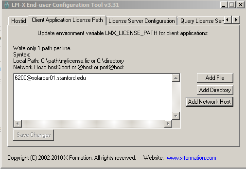

# hyperworks

## SSCP - Hyperworks

## Hyperworks

Licence Server Domain Name:

sscp4.stanford.edu

Download

[Download](http://www.altairhyperworks.com/HWProductDownload.aspx)

Be sure to follow the instillation instructions.&#x20;

Go to the Client Application Licence Path and click Add Network Host, and enter the server information listed above. Then query the licence server and it should spit out a bunch of information. Now you are ready to run Altair Hyperworks products!

#### Embedded Google Drive File

Google Drive File: [Embedded Content](https://drive.google.com/embeddedfolderview?id=12mZcA0YpNWZWQm94vqSMpBR2tePRxHOE#list)
