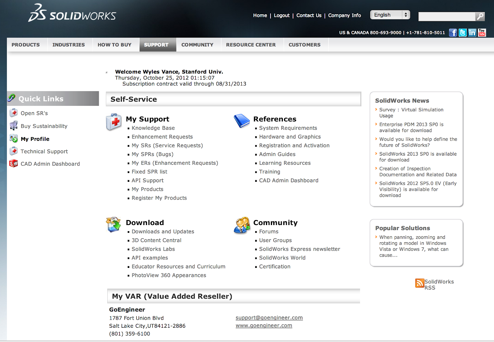

# SSCP - Solving Blank Installer Problem for SolidWorks 2012

# Solving Blank Installer Problem for SolidWorks 2012

To download the latest service pack of SW if your installation manager is blank upon install, 

Create a New Account here: https://registration.solidworks.com/eservice_enu/start.swe?SWECmd=InvokeMethod&SWEMethod=FrameEventMethodRegisterNewUser&_sn=d3ERfS9PpksZHc46TKYxLUcNnSlXGjPed6FobG2zIA0p9MuXyD6tqU9zu8yN9hSs&SWEView=Login+View&SWEHo=registration.solidworks.com&SWETS=1351141829&SWEApplet=Login+Applet

[https://registration.solidworks.com/eservice_enu/start.swe?SWECmd=InvokeMethod&SWEMethod=FrameEventMethodRegisterNewUser&_sn=d3ERfS9PpksZHc46TKYxLUcNnSlXGjPed6FobG2zIA0p9MuXyD6tqU9zu8yN9hSs&SWEView=Login+View&SWEHo=registration.solidworks.com&SWETS=1351141829&SWEApplet=Login+Applet](https://registration.solidworks.com/eservice_enu/start.swe?SWECmd=InvokeMethod&SWEMethod=FrameEventMethodRegisterNewUser&_sn=d3ERfS9PpksZHc46TKYxLUcNnSlXGjPed6FobG2zIA0p9MuXyD6tqU9zu8yN9hSs&SWEView=Login+View&SWEHo=registration.solidworks.com&SWETS=1351141829&SWEApplet=Login+Applet)

Or if that link doesn't work, go to http://www.solidworks.com/sw/support/downloads.htm, click Login for full access to the lastest SolidWorks release and updates. Then click "Click here to create an account"

[http://www.solidworks.com/sw/support/downloads.htm](http://www.solidworks.com/sw/support/downloads.htm)

[Login for full access to the lastest SolidWorks release and updates.](https://customerportal.solidworks.com/)

[Click here to create an account](https://registration.solidworks.com/eservice_enu/start.swe?SWEMethod=FrameEventMethodRegisterNewUser&SWEApplet=Login+Applet&SWEView=Login+View&SWECmd=InvokeMethod)

Use the serial key in the installation documentation PDF to create a full account. Just click OK to the address/info already in the system.

Then go do Downloads and Updates

Go to the "Select Version" Drop down menu at the top of the screen. Choose "2012"

Then you can download Solidworks 2012 Service Pack 5.0 32 or 64 bit, depending on what your hardware is. Installation Manager should work then. Follow rest of pdf documentation.

Wyles

