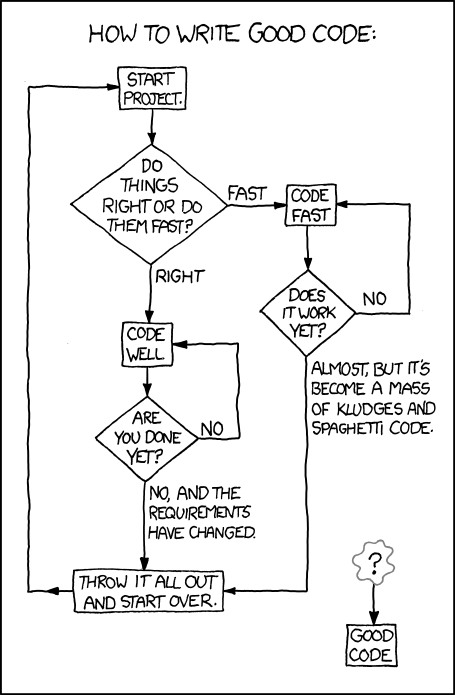

# programming-2012-2013

## SSCP - Programming 2012-2013

## Programming 2012-2013

Eric Thong is responsible for embedded code. Contact him at ethong@stanford.edu

What you need to get started:&#x20;

* IAR--Our programming and development environment.  We have 10 floating licenses.Altium--Head over to the electrical page to sort this one out.  We have some number of floating licenses for it.  Altium is our board design and layout suite.  Having it lets you look at schematics and layouts for the boards you're working with and figure out which pins to probe, etc. &#x20;
* IAR--Our programming and development environment.  We have 10 floating licenses.
* Altium--Head over to the electrical page to sort this one out.  We have some number of floating licenses for it.  Altium is our board design and layout suite.  Having it lets you look at schematics and layouts for the boards you're working with and figure out which pins to probe, etc. &#x20;
* IAR--Our programming and development environment.  We have 10 floating licenses.
* Altium--Head over to the electrical page to sort this one out.  We have some number of floating licenses for it.  Altium is our board design and layout suite.  Having it lets you look at schematics and layouts for the boards you're working with and figure out which pins to probe, etc. &#x20;

IAR--Our programming and development environment.  We have 10 floating licenses.

[IAR](../../../../../stanford.edu/testduplicationsscp/home/sscp-2012-2013/programming-2012-2013/installing-iar/)

Altium--Head over to the electrical page to sort this one out.  We have some number of floating licenses for it.  Altium is our board design and layout suite.  Having it lets you look at schematics and layouts for the boards you're working with and figure out which pins to probe, etc. &#x20;

[Altium](../../../../../stanford.edu/testduplicationsscp/home/sscp-2012-2013/electrical-2012-2013/electrical-administation/needed-software/)

TinyCAD and FreePCB are both legacy tools for looking at early Xenith boards and Apogee boards.  You don't need to download them, but we'll give you links anyway.

* FreePCB--Legacy board layout tool.  Free online, and worth having in case you want to check out the schematics of boards from before this cycle.TinyCAD--Legacy board design/schematic tool.  Also free online; TinyCAD and FreePCB work together and we used them together in the last cycle.
* FreePCB--Legacy board layout tool.  Free online, and worth having in case you want to check out the schematics of boards from before this cycle.
* TinyCAD--Legacy board design/schematic tool.  Also free online; TinyCAD and FreePCB work together and we used them together in the last cycle.
* FreePCB--Legacy board layout tool.  Free online, and worth having in case you want to check out the schematics of boards from before this cycle.
* TinyCAD--Legacy board design/schematic tool.  Also free online; TinyCAD and FreePCB work together and we used them together in the last cycle.

FreePCB--Legacy board layout tool.  Free online, and worth having in case you want to check out the schematics of boards from before this cycle.

[FreePCB](http://www.freepcb.com/)

TinyCAD--Legacy board design/schematic tool.  Also free online; TinyCAD and FreePCB work together and we used them together in the last cycle.

[TinyCAD](http://sourceforge.net/projects/tinycad/)

All members need SVN access.

* SVN access--You need to be able to pull down files and use version control for projects you're working on.  Get Sunbad (the newest car, where we'll be putting all of our new files) and Sunflower (the SVN for Xenith, which is a good reference.)TortoiseSVN--Need this for SVN access.  You should find instructions on the other page.
* SVN access--You need to be able to pull down files and use version control for projects you're working on.  Get Sunbad (the newest car, where we'll be putting all of our new files) and Sunflower (the SVN for Xenith, which is a good reference.)
* TortoiseSVN--Need this for SVN access.  You should find instructions on the other page.
* SVN access--You need to be able to pull down files and use version control for projects you're working on.  Get Sunbad (the newest car, where we'll be putting all of our new files) and Sunflower (the SVN for Xenith, which is a good reference.)
* TortoiseSVN--Need this for SVN access.  You should find instructions on the other page.

SVN access--You need to be able to pull down files and use version control for projects you're working on.  Get Sunbad (the newest car, where we'll be putting all of our new files) and Sunflower (the SVN for Xenith, which is a good reference.)

[SVN access](../../../../../stanford.edu/testduplicationsscp/home/sscp-2018-2019/electrical-2018-2019/svn-access/)

TortoiseSVN--Need this for SVN access.  You should find instructions on the other page.

If you have any ideas for cool projects, or just want more information about anything in particular, shoot us an email: ethong@stanford.edu, fenichr@stanford.edu (Luminos code team lead).

Strategy (PC code) is being managed by Jason Jong (jjong@stanford.edu).

[jjong@stanford.edu](mailto:jjong@stanford.edu)
