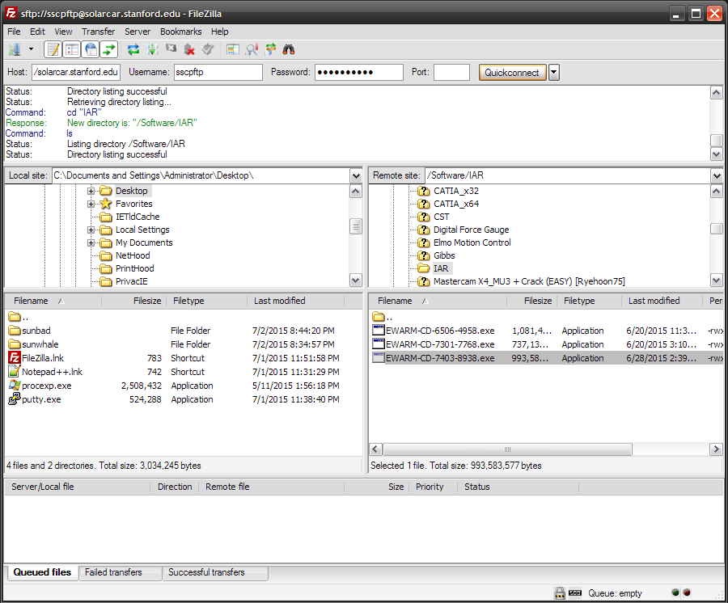

# installing-iar

## SSCP - Installing IAR

## Installing IAR

### OLD -- use instructions on "New Member Orientation" page

### Initial Setup

#### For people who use Mac OS X:

Luckily, VMWare Fusion and Windows 7 are free to all Stanford students.

1. Download and install VMware Fusion: https://stanford.onthehub.com/WebStore/OfferingsOfMajorVersionList.aspx?pmv=89f2d7fa-7337-e411-9403-b8ca3a5db7a1\&cmi\_mnuMain=0b57b739-b182-de11-8cd1-0030487d8897

[https://stanford.onthehub.com/WebStore/OfferingsOfMajorVersionList.aspx?pmv=89f2d7fa-7337-e411-9403-b8ca3a5db7a1\&cmi\_mnuMain=0b57b739-b182-de11-8cd1-0030487d8897](https://stanford.onthehub.com/WebStore/OfferingsOfMajorVersionList.aspx?pmv=89f2d7fa-7337-e411-9403-b8ca3a5db7a1\&cmi_mnuMain=0b57b739-b182-de11-8cd1-0030487d8897)

Note: Remember the key from the download page. You'll need this to install VMware Fusion.

2. Download Windows 7: http://stanford.onthehub.com/WebStore/OfferingDetails.aspx?o=bd53a14f-e040-e311-93f6-b8ca3a5db7a1

[http://stanford.onthehub.com/WebStore/OfferingDetails.aspx?o=bd53a14f-e040-e311-93f6-b8ca3a5db7a1](http://stanford.onthehub.com/WebStore/OfferingDetails.aspx?o=bd53a14f-e040-e311-93f6-b8ca3a5db7a1)

Note: You'll need to download Microsoft's Secure Download Manager to do this. Also, remember your key from the download page. You'll need this to install Windows.

3. Install Windows 7 within VMware Fusion. Here's a guide on how to do that: http://kb.vmware.com/selfservice/microsites/search.do?language=en\_US\&cmd=displayKC\&externalId=1011677

[http://kb.vmware.com/selfservice/microsites/search.do?language=en\_US\&cmd=displayKC\&externalId=1011677](http://kb.vmware.com/selfservice/microsites/search.do?language=en_US\&cmd=displayKC\&externalId=1011677)

#### For people who use linux:

1. Download VMware Player: https://my.vmware.com/web/vmware/free#desktop\_end\_user\_computing/vmware\_player/6\_0

[https://my.vmware.com/web/vmware/free#desktop\_end\_user\_computing/vmware\_player/6\_0](https://my.vmware.com/web/vmware/free#desktop_end_user_computing/vmware_player/6_0)

2. Download Windows 7: http://stanford.onthehub.com/WebStore/OfferingDetails.aspx?o=bd53a14f-e040-e311-93f6-b8ca3a5db7a1

[http://stanford.onthehub.com/WebStore/OfferingDetails.aspx?o=bd53a14f-e040-e311-93f6-b8ca3a5db7a1](http://stanford.onthehub.com/WebStore/OfferingDetails.aspx?o=bd53a14f-e040-e311-93f6-b8ca3a5db7a1)

3. Install Windows 7 within VMware Player.

#### For everyone:

Once Windows is installed, it's time to install IAR inside Windows.

### Downloading IAR

From SFTP (For a slightly older version of IAR)

* Set up SFTP: https://sites.google.com/a/stanfordsolarcar.com/sscp/home/new-member-onboarding/ftp-accessGet IAR from our SFTP server. The file is /Software/EWARM-CD-7403-8938.exe
* Set up SFTP: https://sites.google.com/a/stanfordsolarcar.com/sscp/home/new-member-onboarding/ftp-access
* Get IAR from our SFTP server. The file is /Software/EWARM-CD-7403-8938.exe

1. Set up SFTP: https://sites.google.com/a/stanfordsolarcar.com/sscp/home/new-member-onboarding/ftp-access
2. Get IAR from our SFTP server. The file is /Software/EWARM-CD-7403-8938.exe

Set up SFTP: https://sites.google.com/a/stanfordsolarcar.com/sscp/home/new-member-onboarding/ftp-access

[https://sites.google.com/a/stanfordsolarcar.com/sscp/home/new-member-onboarding/ftp-access](../../../../../stanford.edu/testduplicationsscp/home/new-member-orientation/sftp-access/)

Get IAR from our SFTP server. The file is /Software/EWARM-CD-7403-8938.exe

## From IAR (Not recommended - the newer versions of IAR have issues with our license server)

* Login to IAR MyPagesUser: thongerick@gmail.com Password: r%jtxDH#\*VOyOlv8^RUlClick on the Find Updates link by the licence tab to go to the installer download pageUnzip the files and install IAR.
* Login to IAR MyPages
* User: thongerick@gmail.com Password: r%jtxDH#\*VOyOlv8^RUl
* Click on the Find Updates link by the licence tab to go to the installer download page
* Unzip the files and install IAR.

1. Login to IAR MyPages
2. User: thongerick@gmail.com Password: r%jtxDH#\*VOyOlv8^RUl
3. Click on the Find Updates link by the licence tab to go to the installer download page
4. Unzip the files and install IAR.

Login to IAR MyPages

[MyPages](http://www.iar.com/mypages)

User: thongerick@gmail.com Password: r%jtxDH#\*VOyOlv8^RUl

Click on the Find Updates link by the licence tab to go to the installer download page

Unzip the files and install IAR.

1. If you have licensing errors, the licensing server is probably out of date. Contact a server admin (this page should help).&#x20;

If you have licensing errors, the licensing server is probably out of date. Contact a server admin (this page should help).&#x20;

[this page should help](../../../../../stanford.edu/testduplicationsscp/home/it-administration/)

### Activating License

When it asks for a license, select "Use a network license". You don't have to enter a license key

License server: sscp4.stanford.edu

[sscp4.stanford.edu](http://sscp4.stanford.edu/)

### Installing ST-Link Drivers

Go to this website, go to the "Design Resources" tab, and scroll down to the "SW Drivers" section and download the ST-Link USB driver.  Install it.

[this website](http://www.st.com/internet/evalboard/product/251168.jsp)

If that didn't work try downloading the ST-Link utility from the same page and install that.  It should install drivers as part of its installation.
