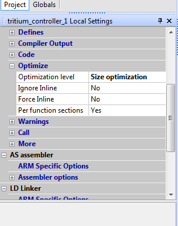
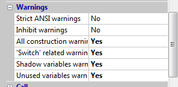
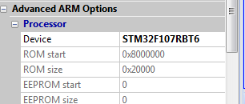

# SSCP - Ride 7 tips

# Ride 7 tips

There will be screenshots and such things here :)

Basic configuration to make your life easier:

Go find the "local settings" on the left side of the screen.

Set your optimization level to "size optimization."  This means that it won't load more of the libraries than it needs to, but won't actually change your code in the optimization process.  If you know your code works and you want it to be faster you can optimize it more later.  When you're not sure about functionality the last thing you need is to have Ride7 changing things.

Also turn on all of the warnings.  Don't say yes to "inhibit warnings."  This will turn off all warnings and made coding much more difficult.

If you copy over a project and are using a different microcontroller than the one it was configured for, you need to change that setting.  If we switch to all F4s this shouldn't be much of an issue.

