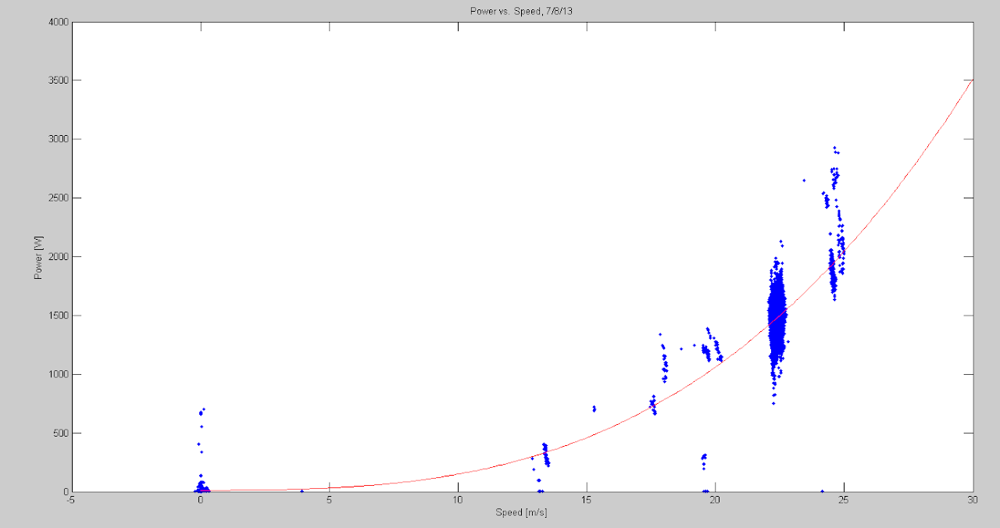
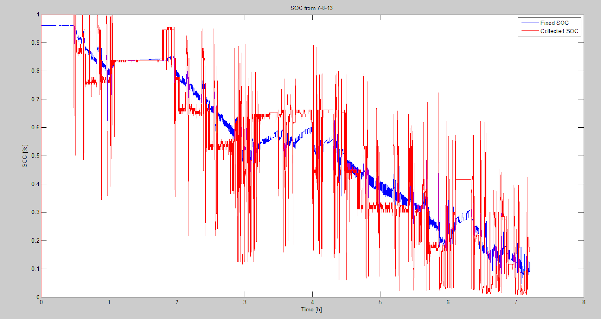
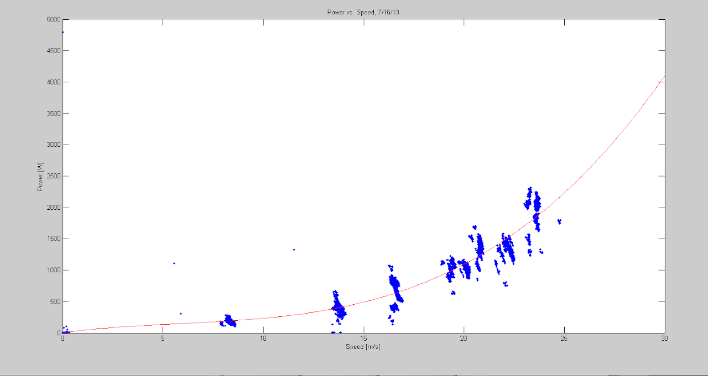
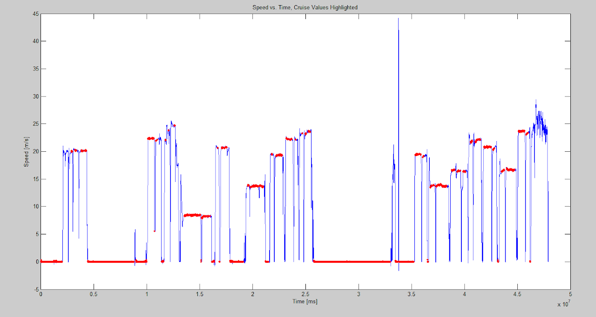
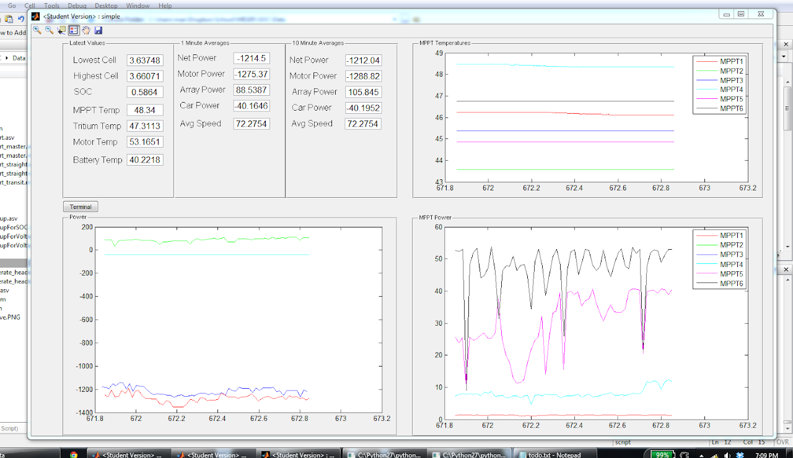
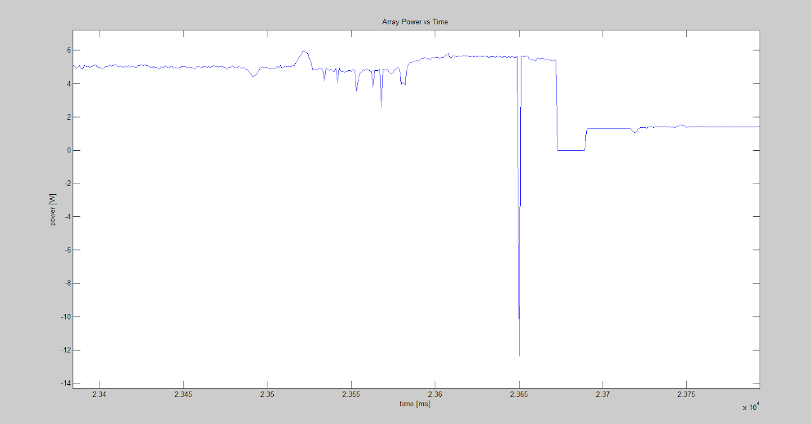
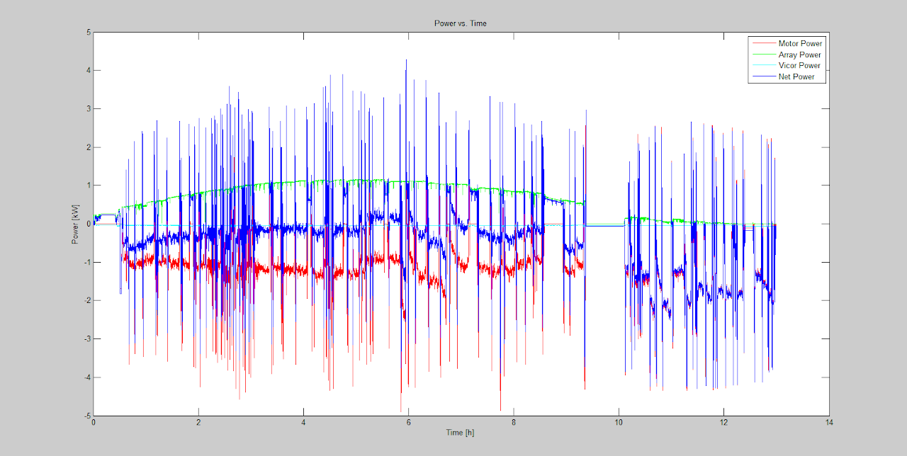
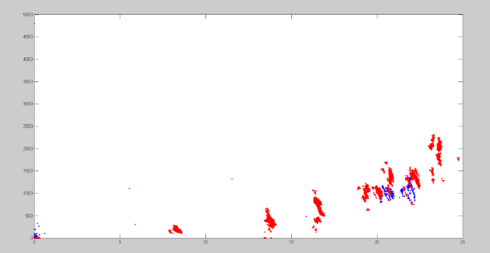

# SSCP - Luminos: Test Driving: Data and Analysis

# Luminos: Test Driving: Data and Analysis

Raw data from test drives can be found on the FTP server in the /Strategy/Luminos Data folder, and is arranged by testing trips that we have made.

Max's MATLAB analysis and plotting code can be found in SVN, in /strategy/matlab-max. It was written in the back of the van with the direction of development being driven by what I wanted to see for making good strategy and car performance decisions.

Note that power-to-drive curves are generated from points at which the speed has a small standard deviation over a 30 second timespan. This is an indicator of "cruise". 

Luminos Central Valley Drive 1

More thorough plotting and analysis should be done using the MATLAB scripts, but below are some of the "eye-candy" plots in which people may be interested: Generated from our third day of driving on 7-8-13.

Power vs. Speed curve, using data points at which the power consumption is very constant. Speed is known to be improperly scaled, and the data set is wider than it should be:

Voltage/Current/Temp-based SOC, before and after correcting our sign convention (red is before correction, blue is after):

Before correction current into the pack was negative and current out was positive.

Luminos Central Valley Drive 1 - 7/15-7/18

Again, more thorough plotting and analysis should be done using the MATLAB scripts, but below are some of the "eye-candy" plots in which people may be interested: 

Power vs. speed curve with controlled runs in increments of 10kph, with 5kph increments around the predicted cruise speed. We ran the tests in a random order to prevent things like changing wind from appearing as a meaningful relationship in the data. We made these runs on this very straight and flat stretch of road. This was done on 7-16-13, see data on FTP or relevant MATLAB data in SVN.

[ this very straight and flat stretch of road](https://maps.google.com/maps?saddr=W+Manning+Ave&daddr=W+Manning+Ave&hl=en&sll=36.60285,-120.195558&sspn=0.012764,0.026157&geocode=FYaHLgIdeXTR-A%3BFXKFLgIdMgfW-A&t=h&mra=mift&mrsp=1&sz=16&z=16)

Here's the result of the cruise identification algorithm on the following day (7-16-13)

After Sam L. made a change to his trackers to prevent resweeping with brief shading, MPPT5 (the one with new code) appeared to do better under telephone pole shadows (7-17-13).

The array current became very negative as the wiring shorted. on 7-17-13

Power vs time curve for 7-17-13. The goal of the day was to run the array in its final wiring configuration for a full day to see the shape of the curve. This day yielded approx. 8.3kWh of array power

Luminos Central Valley Drive 3: Laps from Chico to Red Bluff

The route files and parsed data are in SVN. The raw data is in FTP. 

We used this drive as a test of our strategy infrastructure and process. Overall, it was a great success! We learned:

* There were errors in the solver code that did not match up solar production with distance properly. This has been fixed
* Going through towns is significant: we expected to take approximately 47 minutes per leg of the "race," but each took 55-60 minutes. This caused us to take longer to complete segments, but have a higher cruise speed.
* Insolation during the morning was significantly less than expected because of trees. We may want a way to combat this
* The car was more efficient than when we characterized it in San Joaquin, likely because of wheel covers, road surface, array/bubble sealing, etc
* GPS lock was not as reliable as we had hoped. We may need to manually update our route index in some cases, if we haven't had lock in a while.
* Due to an error in indexing the route lap (a problem that won't exist in Australia), we burned too much power on one leg of the race. This caused us to end the race in Red Bluff (rather than Chico) with ~5% SOC around 5:15pm on the second day.
* Daylight headlight sections caused nearly 35W continuous more than expected
* SOC fluctuates quite a bit while driving - we may want to show multiple methods of computing it before using it in a solver, and have somebody make an educated guess
* We made a 2 minute stop to put foam in the car - math says this costs us 50W since we had 120km to go before a control stop. We need to be much better about our planning and logistics to not incur these sort of losses.
* There are some outstanding questions about how to run strategy "properly"How frequently do you update your cruise speed?Is it better to err on the side of caution early, and power through at the end? Or limp along as necessary at the end of the race?How frequently do you update weather? How do you do this?
* How frequently do you update your cruise speed?
* Is it better to err on the side of caution early, and power through at the end? Or limp along as necessary at the end of the race?
* How frequently do you update weather? How do you do this?

There were errors in the solver code that did not match up solar production with distance properly. This has been fixed

Going through towns is significant: we expected to take approximately 47 minutes per leg of the "race," but each took 55-60 minutes. This caused us to take longer to complete segments, but have a higher cruise speed.

Insolation during the morning was significantly less than expected because of trees. We may want a way to combat this

The car was more efficient than when we characterized it in San Joaquin, likely because of wheel covers, road surface, array/bubble sealing, etc

GPS lock was not as reliable as we had hoped. We may need to manually update our route index in some cases, if we haven't had lock in a while.

Due to an error in indexing the route lap (a problem that won't exist in Australia), we burned too much power on one leg of the race. This caused us to end the race in Red Bluff (rather than Chico) with ~5% SOC around 5:15pm on the second day.

Daylight headlight sections caused nearly 35W continuous more than expected

SOC fluctuates quite a bit while driving - we may want to show multiple methods of computing it before using it in a solver, and have somebody make an educated guess

We made a 2 minute stop to put foam in the car - math says this costs us 50W since we had 120km to go before a control stop. We need to be much better about our planning and logistics to not incur these sort of losses.

There are some outstanding questions about how to run strategy "properly"

* How frequently do you update your cruise speed?
* Is it better to err on the side of caution early, and power through at the end? Or limp along as necessary at the end of the race?
* How frequently do you update weather? How do you do this?

How frequently do you update your cruise speed?

Is it better to err on the side of caution early, and power through at the end? Or limp along as necessary at the end of the race?

How frequently do you update weather? How do you do this?

The car is more efficient! 7-31 vs 7-16:

