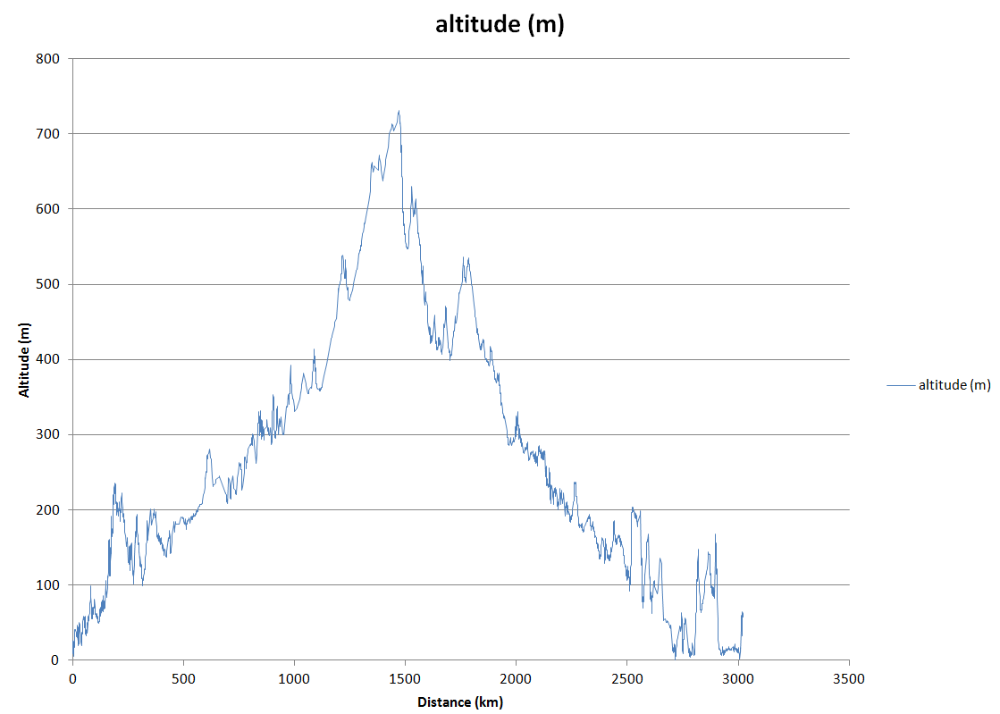
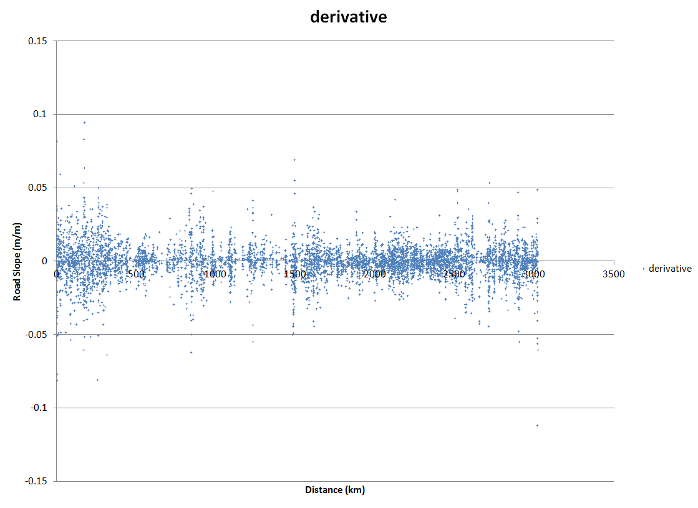

# route-information

## SSCP - Route Information

## Route Information

Attached are route notes that open in google earth as a route and can be used to extract more information. The elevation data was gathered from the  NASA SRTM dataset. http://dds.cr.usgs.gov/srtm/version2\_1/SRTM1/

Methodology:

First the kml file was created in google earth by tracing the route (you can find how to do this one the web). In order to extract reasonable data with similar distance spacing, an interpolation program was written by Sasha Zbrozek [s.zbrozek@gmail.com](mailto:s.zbrozek@gmail.com) in Go. The code can be found in Sunbad-> Utilities->elevationProfiler. The program should interpolate to allow whatever interval you choose. To run the program, there should be a batch file in the program directory that you can run. It'll compile to an EXE. This should spit out a profile and a map

[Go](https://code.google.com/p/go/downloads/detail?name=go1.0.3.windows-amd64.msi\&can=2\&q=)

Use RouteConvertor to convert from KML to CSV http://www.routeconverter.de/releases/en

* Save as i-Blue 747 (.csv) format.
* Remove everything besides Longitude in first column and Latitude in second column.
* Put negative for West in longitude

Google Earth also can add elevation data to a kml file. The SRTM data set is apparently more accurate. This site can also quickly take a kml file and provide distance and elevation data along a path.&#x20;

[This](http://www.geocontext.org/publ/2010/04/profiler/en/?import=kml#!track_path=3\&trk_num=3)

#### Embedded Google Drive File

Google Drive File: [Embedded Content](https://drive.google.com/embeddedfolderview?id=1KramMMVwq51vQIoUl4tJPCc-V1IOcrol#list)
