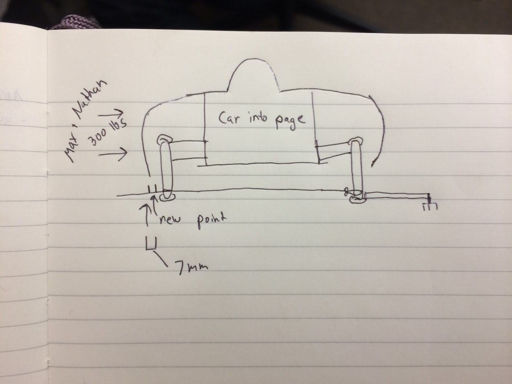
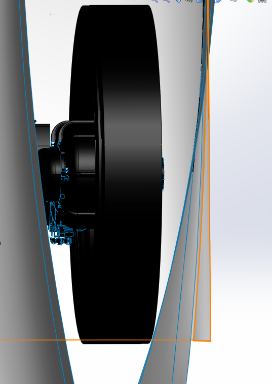
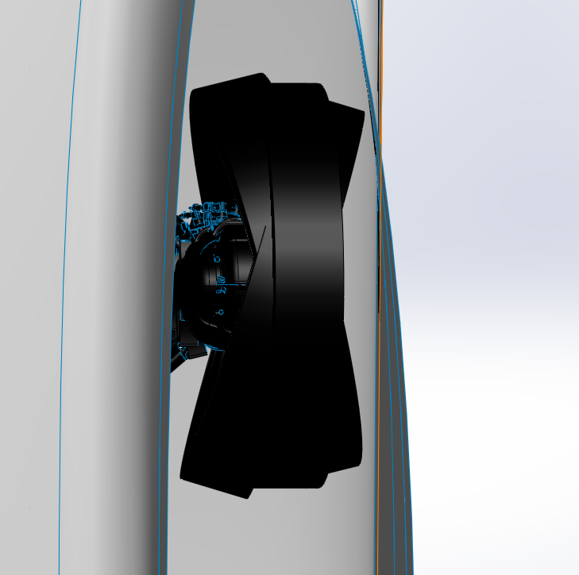
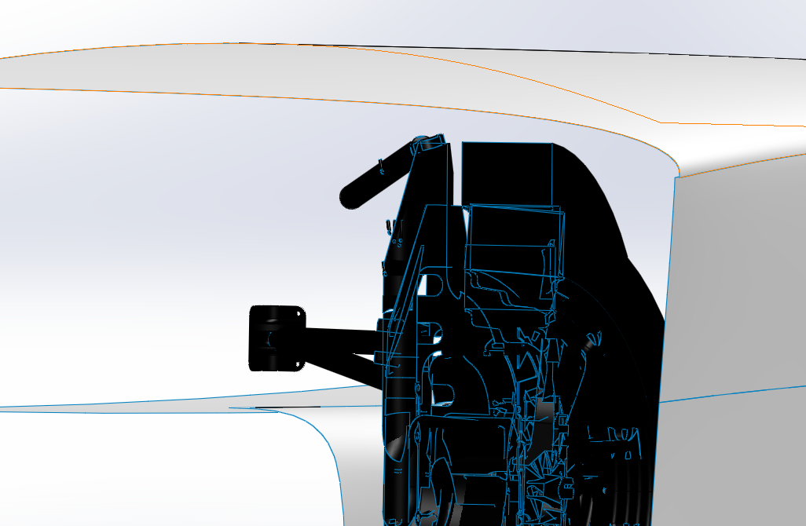
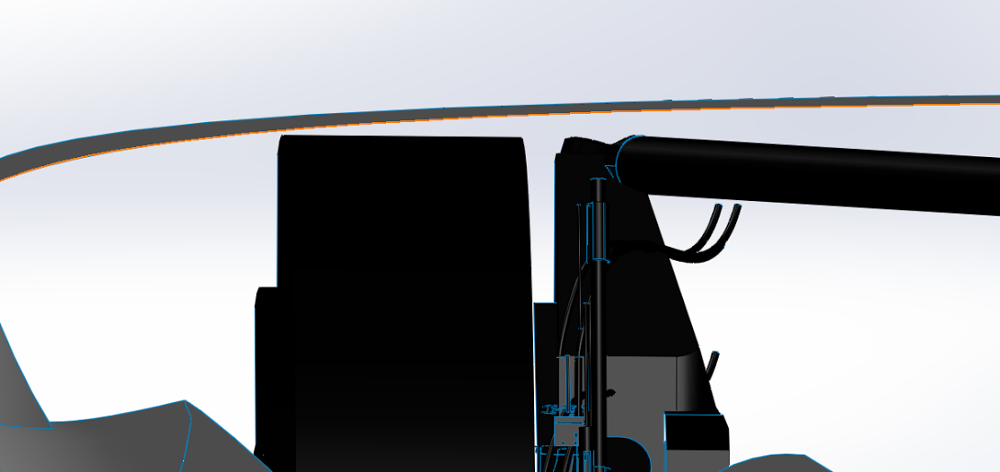
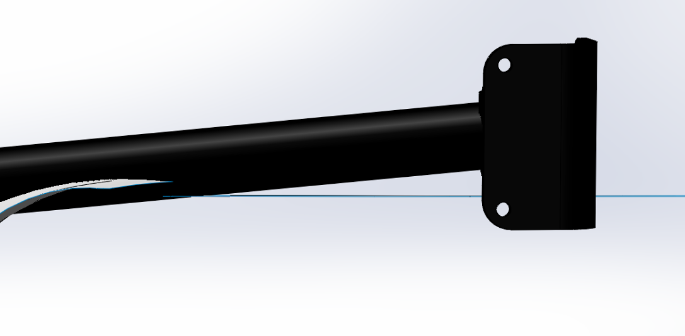
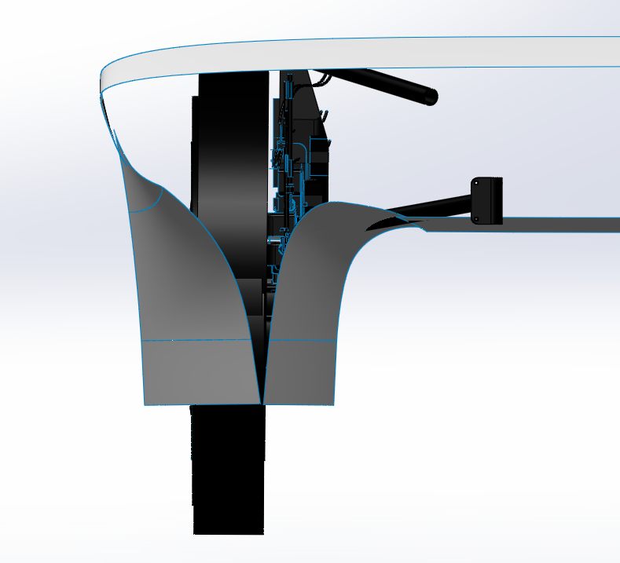

# SSCP - Aerobody Clearances

# Aerobody Clearances

This page works toward answering the question: How much space does there need to be between the wheel volume and outer aerobody shape? 

We are shooting for 2-3cm in the fairings, and 1.5cm in non-critical areas.

NHS and I performed a test to see how much the car deforms from rim-to-rim when approximately a cornering load is applied to the wheel. We pushed as hard as possible on the side of the car while wedging one rim against the wall. The rim deflected 7mm under a load that we think is comparable to the maximum cornering load the car would see. Thus, the 2-3cm we are leaving around the wheel volume is sufficient.

Max Praglin <mpraglin@stanford.edu>

Fri, Nov 7, 2014 at 11:18 PM

To: Stanford Solar Car Project <solarcore@lists.stanford.edu>, sscp aeroteam <sscp_aeroteam@lists.stanford.edu>

Hi Team,

Thought you'd enjoy seeing a few screenshots from a fit check that I'm working on for Sunwhale-031. TL;DR: we will be able to make current suspension geometry (which has comparable loads to Luminos) fit inside our latest aerobody. Darren is working on fleshing out more of the innards for the car such as steering rack mounting, roll cage placement, upper hardpoint shelving, radio box placement, etc. Anna/Aravind - good job getting the design to a place where the suspension and aerobody are playing nice together!

The white surface is the aerobody shell offset by 17mm in the top and bottom shell, and 22mm on the fairing fillets and sides near where the driver will sit. (These are preliminary conservative estimates from Jamie). The only intersection is at the rear-most hardpoint, where I have been told we can make a more compact hardpoint and if necessary, think we could locally grind out carbon to fit the control arm if we had to ship this aerobody today. If the pictures aren't doing it for you, the file is Sunwhale-031-fitcheck in PDM/Sunwhale/Sunwhale Car Assembly.

