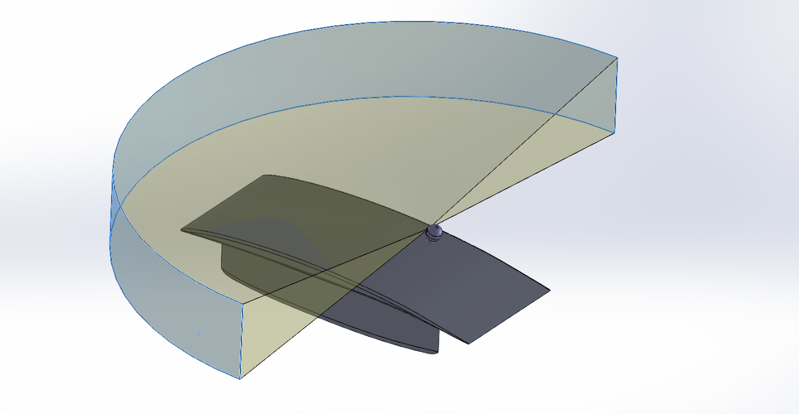
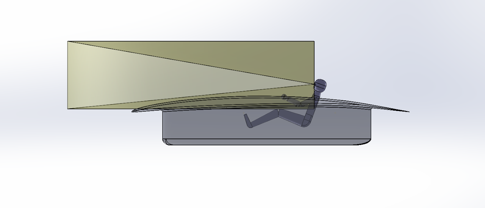
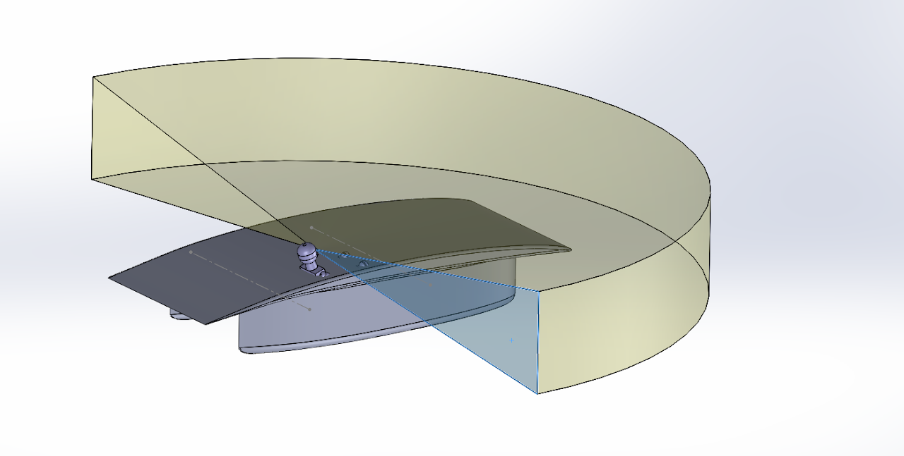

# driver-model

## SSCP - Driver Model

## Driver Model

The driver model is based on 5th percentile half-male/half-female values from the anthropometric data chart below.&#x20;

If I fits I sits:

Some driver model + car, for an idea of how the driver and vision requirements fit in and constrain the car. These are with a cambered catamaran from the CamberJuly28 series.

First area of vision conflict. Angling main foil could give more leeway for driver placement.

Our fairings (0.54m extrusion that the catamaran models have been so far) are currently on the large side. (Butt is about 0.3m from fairing bottom here.)

Lines represent how far forward/back driver's shoulders can be in fairing and still have the driver fit in its current configuration. Shoulder width is accommodated by main foil here. Gives an idea for canopy placement (i.e. nothing super new)

Helmet

We model the helmet as a sphere of diameter 9.5", based on the white helmet from WSC2013. The black tank commander helmet is approx 9" diameter, even though it looks significantly smaller than the white helmet. Based on driver experience and comparisons with the CAD for Luminos, we deemed a 1" clearance between helmet and roll cage enough to turn your head properly. Thus, there is a 10.5" diameter sphere, with the topmost point of the sphere mated 2" above the top of the driver's head.

#### Embedded Google Drive File

Google Drive File: [Embedded Content](https://drive.google.com/embeddedfolderview?id=1CQWGm96G4g2lXBQNY7j52EcSXCFkmcP0#list)
