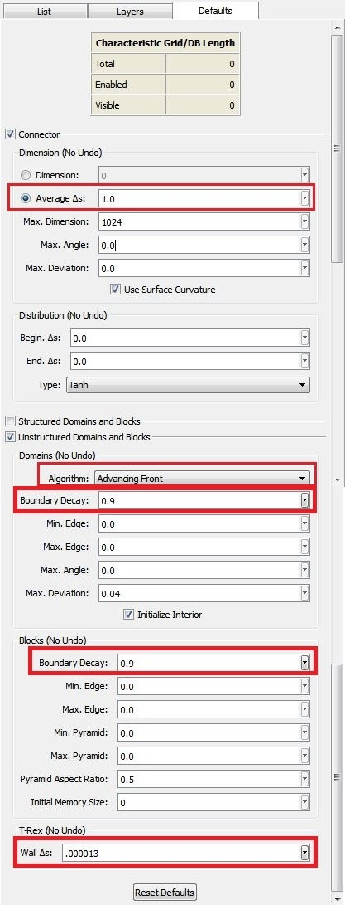
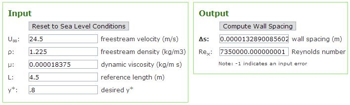
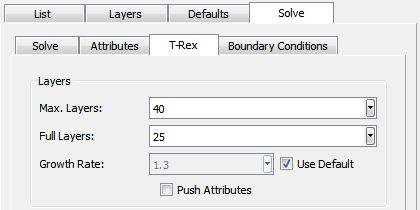
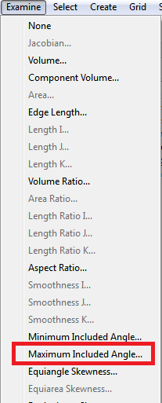
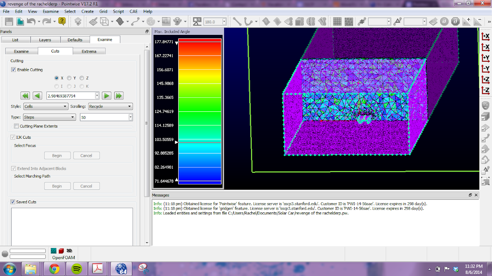
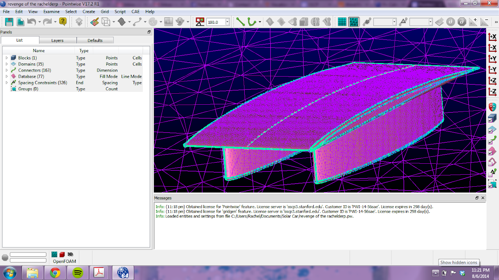
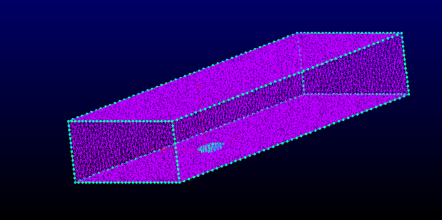

# pointwise-meshing-and-simulation

## SSCP - Pointwise Meshing and Simulation

## Pointwise Meshing and Simulation

Pointwise Customer ID:  PWI-14-56sae

4 Licenses Available; expire May 2015

Process

(Refined from Rough Mesh #1)

Created: 2014-Aug-06

Updated: 2014-Aug-12

Contents:

I. Quick Tips

II. Order of Operations

III. Defaults

IV. T-Rex

V. Examine

I. Quick Tips:

* No need to mess too much with Defaults. Since we're meshing a car that is about the same size every time, just use Defaults similar to those specified in Process.Make sure that the mesh passes the 'eye check'. Triangles should transition gradually across domains, between domains, and through the block. Be careful not to add so many points to one connector that the mesh in one corner becomes too refined -- you will have to add points to ALL other connectors to make sure you have no dramatic transitions. They look ugly and cause jagged, creepy triangles.Create points on corners of the box and delete the box domains -- then the box's domains will turn green when they are created. Also, turn off databases for everything, and change the view so that the car is shaded rather than wireframe.Create layers as you create domains -- car, box, block. Then it is easy to turn off layers in view.The mesh is watertight if it creates the block successfully. To make sure it's a good mesh, follow the steps below and rely on the 'eye check'.Beware of Rhino Horns (note: not the official name for this phenomenon), when triangles jut out from the surface instead of curving around it. These will inevitably happen in varying degrees, but watch out for these on sharper leading and trailing edges. Zoom in and rotate around to make sure you don't have any of those.
* No need to mess too much with Defaults. Since we're meshing a car that is about the same size every time, just use Defaults similar to those specified in Process.
* Make sure that the mesh passes the 'eye check'. Triangles should transition gradually across domains, between domains, and through the block. Be careful not to add so many points to one connector that the mesh in one corner becomes too refined -- you will have to add points to ALL other connectors to make sure you have no dramatic transitions. They look ugly and cause jagged, creepy triangles.
* Create points on corners of the box and delete the box domains -- then the box's domains will turn green when they are created. Also, turn off databases for everything, and change the view so that the car is shaded rather than wireframe.
* Create layers as you create domains -- car, box, block. Then it is easy to turn off layers in view.
* The mesh is watertight if it creates the block successfully. To make sure it's a good mesh, follow the steps below and rely on the 'eye check'.
* Beware of Rhino Horns (note: not the official name for this phenomenon), when triangles jut out from the surface instead of curving around it. These will inevitably happen in varying degrees, but watch out for these on sharper leading and trailing edges. Zoom in and rotate around to make sure you don't have any of those.
* No need to mess too much with Defaults. Since we're meshing a car that is about the same size every time, just use Defaults similar to those specified in Process.
* Make sure that the mesh passes the 'eye check'. Triangles should transition gradually across domains, between domains, and through the block. Be careful not to add so many points to one connector that the mesh in one corner becomes too refined -- you will have to add points to ALL other connectors to make sure you have no dramatic transitions. They look ugly and cause jagged, creepy triangles.
* Create points on corners of the box and delete the box domains -- then the box's domains will turn green when they are created. Also, turn off databases for everything, and change the view so that the car is shaded rather than wireframe.
* Create layers as you create domains -- car, box, block. Then it is easy to turn off layers in view.
* The mesh is watertight if it creates the block successfully. To make sure it's a good mesh, follow the steps below and rely on the 'eye check'.
* Beware of Rhino Horns (note: not the official name for this phenomenon), when triangles jut out from the surface instead of curving around it. These will inevitably happen in varying degrees, but watch out for these on sharper leading and trailing edges. Zoom in and rotate around to make sure you don't have any of those.

No need to mess too much with Defaults. Since we're meshing a car that is about the same size every time, just use Defaults similar to those specified in Process.

Make sure that the mesh passes the 'eye check'. Triangles should transition gradually across domains, between domains, and through the block. Be careful not to add so many points to one connector that the mesh in one corner becomes too refined -- you will have to add points to ALL other connectors to make sure you have no dramatic transitions. They look ugly and cause jagged, creepy triangles.

Create points on corners of the box and delete the box domains -- then the box's domains will turn green when they are created. Also, turn off databases for everything, and change the view so that the car is shaded rather than wireframe.

Create layers as you create domains -- car, box, block. Then it is easy to turn off layers in view.

The mesh is watertight if it creates the block successfully. To make sure it's a good mesh, follow the steps below and rely on the 'eye check'.

Beware of Rhino Horns (note: not the official name for this phenomenon), when triangles jut out from the surface instead of curving around it. These will inevitably happen in varying degrees, but watch out for these on sharper leading and trailing edges. Zoom in and rotate around to make sure you don't have any of those.

II. Order of Operations:

1. Import .igs file (.sldprt file import has been known to screw with geometry) in Pointwise
2. Set Defaults
3. Select all and automatically generate domains
4. Refine connectorsSpacing along leading and trailing edgesLeading edges - spacing = 0.01Trailing edges - spacing = 0.02
5. Spacing along leading and trailing edgesLeading edges - spacing = 0.01Trailing edges - spacing = 0.02
6. Leading edges - spacing = 0.01
7. Trailing edges - spacing = 0.02
8. Create block + initialize block

Import .igs file (.sldprt file import has been known to screw with geometry) in Pointwise

Set Defaults

Select all and automatically generate domains

Refine connectors

1. Spacing along leading and trailing edgesLeading edges - spacing = 0.01Trailing edges - spacing = 0.02
2. Leading edges - spacing = 0.01
3. Trailing edges - spacing = 0.02

Spacing along leading and trailing edges

1. Leading edges - spacing = 0.01
2. Trailing edges - spacing = 0.02

Leading edges - spacing = 0.01

Trailing edges - spacing = 0.02

Create block + initialize block

* T-RexAnalyze for inevitable flaws: rinse and repeat
* T-Rex
* Analyze for inevitable flaws: rinse and repeat

1. T-Rex
2. Analyze for inevitable flaws: rinse and repeat

T-Rex

Analyze for inevitable flaws: rinse and repeat

III. Defaults:

Make sure to set your defaults before you do anything, otherwise you won't be able to create connectors or domains, and you'll be very frustrated.

* Average Deltas: This value specifies the fineness of your mesh, and it will depend on the size of the car. I've found that 0.1 works reasonably well for most cases. However, you will end up changing many connector values that ultimately mess with your default average deltas value.Algorithm: There are two options in the pull-down menu: Advancing Front and Delaney. Either works (try playing with it), but David and Tom have been using Advancing Front. Advancing Front tends to structure the mesh more, which can be helpful at sharper corners. This may still cause problems though, and you can switch to Delaney to play with it.Boundary Decay: Specifies how quickly your mesh 'decays' from the smallest triangles to the largest. Value must be below 1.0, and values closer to 1.0 indicate less decay and more refinement. Start at 0.9, and if you want more refinement then move towards 0.99999 repeated.Wall Deltas: Since we're using T-Rex, we want to specify this. This value will depend on multiple factors, and you can calculate it here: http://www.pointwise.com/yplus/For Sunwhale: U\_infinity = 24.59 m/s; L = 4.5 m; y+ = 0.8--1.0 (other settings can remain the same)Or, you can cheat, and just use deltas = 2e-6. This value comes from David and Tom's calculated value for Luminos and has worked fairly well for them.
* Algorithm: There are two options in the pull-down menu: Advancing Front and Delaney. Either works (try playing with it), but David and Tom have been using Advancing Front. Advancing Front tends to structure the mesh more, which can be helpful at sharper corners. This may still cause problems though, and you can switch to Delaney to play with it.
* Boundary Decay: Specifies how quickly your mesh 'decays' from the smallest triangles to the largest. Value must be below 1.0, and values closer to 1.0 indicate less decay and more refinement. Start at 0.9, and if you want more refinement then move towards 0.99999 repeated.
* Wall Deltas: Since we're using T-Rex, we want to specify this. This value will depend on multiple factors, and you can calculate it here: http://www.pointwise.com/yplus/
* For Sunwhale: U\_infinity = 24.59 m/s; L = 4.5 m; y+ = 0.8--1.0 (other settings can remain the same)
* Or, you can cheat, and just use deltas = 2e-6. This value comes from David and Tom's calculated value for Luminos and has worked fairly well for them.

Average Deltas: This value specifies the fineness of your mesh, and it will depend on the size of the car. I've found that 0.1 works reasonably well for most cases. However, you will end up changing many connector values that ultimately mess with your default average deltas value.

* Algorithm: There are two options in the pull-down menu: Advancing Front and Delaney. Either works (try playing with it), but David and Tom have been using Advancing Front. Advancing Front tends to structure the mesh more, which can be helpful at sharper corners. This may still cause problems though, and you can switch to Delaney to play with it.
* Boundary Decay: Specifies how quickly your mesh 'decays' from the smallest triangles to the largest. Value must be below 1.0, and values closer to 1.0 indicate less decay and more refinement. Start at 0.9, and if you want more refinement then move towards 0.99999 repeated.
* Wall Deltas: Since we're using T-Rex, we want to specify this. This value will depend on multiple factors, and you can calculate it here: http://www.pointwise.com/yplus/
* For Sunwhale: U\_infinity = 24.59 m/s; L = 4.5 m; y+ = 0.8--1.0 (other settings can remain the same)
* Or, you can cheat, and just use deltas = 2e-6. This value comes from David and Tom's calculated value for Luminos and has worked fairly well for them.

Algorithm: There are two options in the pull-down menu: Advancing Front and Delaney. Either works (try playing with it), but David and Tom have been using Advancing Front. Advancing Front tends to structure the mesh more, which can be helpful at sharper corners. This may still cause problems though, and you can switch to Delaney to play with it.

Boundary Decay: Specifies how quickly your mesh 'decays' from the smallest triangles to the largest. Value must be below 1.0, and values closer to 1.0 indicate less decay and more refinement. Start at 0.9, and if you want more refinement then move towards 0.99999 repeated.

Wall Deltas: Since we're using T-Rex, we want to specify this. This value will depend on multiple factors, and you can calculate it here: http://www.pointwise.com/yplus/

For Sunwhale: U\_infinity = 24.59 m/s; L = 4.5 m; y+ = 0.8--1.0 (other settings can remain the same)

Or, you can cheat, and just use deltas = 2e-6. This value comes from David and Tom's calculated value for Luminos and has worked fairly well for them.

IV. T-Rex:

T-Rex effectively creates layers surrounding the surfaces of the car so that we get more information in the boundary layer region. This is how we get the drag number. We can also use this for tough edges, like the leading edge, if that edge is getting jagged and deformed.

Car: Select the car domains and set the boundary condition to 'wall'. The deltas value will be determined as stated above.

* Max Layers: A number equal to 30 or greater. This will require some guess and check to find an appropriate value. This specifies how many total layers you want created, no matter if they are full or not. If Pointwise can do it, it will.Full Layers: Somewhere beneath or equal to the max layers value. This specifies how many full layers you want created.Growth Rate: 1.3 is fine, but David likes to use 1.2.
* Max Layers: A number equal to 30 or greater. This will require some guess and check to find an appropriate value. This specifies how many total layers you want created, no matter if they are full or not. If Pointwise can do it, it will.
* Full Layers: Somewhere beneath or equal to the max layers value. This specifies how many full layers you want created.
* Growth Rate: 1.3 is fine, but David likes to use 1.2.
* Max Layers: A number equal to 30 or greater. This will require some guess and check to find an appropriate value. This specifies how many total layers you want created, no matter if they are full or not. If Pointwise can do it, it will.
* Full Layers: Somewhere beneath or equal to the max layers value. This specifies how many full layers you want created.
* Growth Rate: 1.3 is fine, but David likes to use 1.2.

Max Layers: A number equal to 30 or greater. This will require some guess and check to find an appropriate value. This specifies how many total layers you want created, no matter if they are full or not. If Pointwise can do it, it will.

Full Layers: Somewhere beneath or equal to the max layers value. This specifies how many full layers you want created.

Growth Rate: 1.3 is fine, but David likes to use 1.2.

Surface: Select the single domain you wish to T-Rex (leading edge will sometimes need this for thinner cars) and go into Solve. TBC

\*\*Screenshots coming soon

V. Examine

(Checking the Block Mesh, T-Rex Layers, and Skewness)

Select what you wish to examine: the block for making cuts through the block mesh or T-Rex from the block, or a particular domain for looking at a surface.

Maximum Included Angle

Select 'Maximum Included Angle' from the Examine drop-down menu.

Under 'Cuts', you can move a cross section to view the mesh.

Skewness

Select 'Equiangle Skewness' or one of the other skewness selections (there are different ways of measuring skewness) from the 'Examine' drop-down menu.

For looking at the block, under 'cuts', you can move a cross section to view the mesh. For looking at a surface, the triangles will automatically light up.

Rough Mesh #1 by Rachel Abril

2014-Aug-05

Problems:

* Domains do not correspond with desired connectors. Double overlay of connectors responsible. To correct, ensure that only one connector along each line (concentrate points at edges).
* The connectors for the box around the car have too many points (unnecessarily refined).

Domains do not correspond with desired connectors. Double overlay of connectors responsible. To correct, ensure that only one connector along each line (concentrate points at edges).

The connectors for the box around the car have too many points (unnecessarily refined).

Car mesh

Block

Order of Operations for above mesh:

1. Import .igs file (.sldprt file import has major flaws that creep the bejeezus out of me) in Pointwise
2. Set DefaultsCar: avg triangles = 0.05, everything else = 0Box: avg triangles = 1.0, everything else = 0
3. Car: avg triangles = 0.05, everything else = 0
4. Box: avg triangles = 1.0, everything else = 0
5. Select all and automatically generate connectors

Import .igs file (.sldprt file import has major flaws that creep the bejeezus out of me) in Pointwise

Set Defaults

1. Car: avg triangles = 0.05, everything else = 0
2. Box: avg triangles = 1.0, everything else = 0

Car: avg triangles = 0.05, everything else = 0

Box: avg triangles = 1.0, everything else = 0

Select all and automatically generate connectors

* Turn on points for all
* Turn on points for all

1. Turn on points for all

Turn on points for all

1. Refine connectors

Refine connectors

* Add points (point values for 1-3 refer to the value from leading edge to trailing edge)Points along bottom of fairings \~ 55Points along sides of airfoil \~ 100Points along intersection between fairings and main body \~ 75Points along leading edge of main body \~ 175Points along small edges \~ 5-16Points along trailing edge of main body \~ 8Points along edge of box \~ 15 x 25 x 50Change spacing along leading and trailing edges
* Add points (point values for 1-3 refer to the value from leading edge to trailing edge)Points along bottom of fairings \~ 55Points along sides of airfoil \~ 100Points along intersection between fairings and main body \~ 75Points along leading edge of main body \~ 175Points along small edges \~ 5-16Points along trailing edge of main body \~ 8Points along edge of box \~ 15 x 25 x 50
* Points along bottom of fairings \~ 55Points along sides of airfoil \~ 100Points along intersection between fairings and main body \~ 75Points along leading edge of main body \~ 175Points along small edges \~ 5-16Points along trailing edge of main body \~ 8Points along edge of box \~ 15 x 25 x 50
* Points along bottom of fairings \~ 55
* Points along sides of airfoil \~ 100
* Points along intersection between fairings and main body \~ 75Points along leading edge of main body \~ 175
* Points along leading edge of main body \~ 175
* Points along small edges \~ 5-16
* Points along trailing edge of main body \~ 8
* Points along edge of box \~ 15 x 25 x 50
* Change spacing along leading and trailing edges

1. Add points (point values for 1-3 refer to the value from leading edge to trailing edge)Points along bottom of fairings \~ 55Points along sides of airfoil \~ 100Points along intersection between fairings and main body \~ 75Points along leading edge of main body \~ 175Points along small edges \~ 5-16Points along trailing edge of main body \~ 8Points along edge of box \~ 15 x 25 x 50
2. Points along bottom of fairings \~ 55Points along sides of airfoil \~ 100Points along intersection between fairings and main body \~ 75Points along leading edge of main body \~ 175Points along small edges \~ 5-16Points along trailing edge of main body \~ 8Points along edge of box \~ 15 x 25 x 50
3. Points along bottom of fairings \~ 55
4. Points along sides of airfoil \~ 100
5. Points along intersection between fairings and main body \~ 75Points along leading edge of main body \~ 175
6. Points along leading edge of main body \~ 175
7. Points along small edges \~ 5-16
8. Points along trailing edge of main body \~ 8
9. Points along edge of box \~ 15 x 25 x 50
10. Change spacing along leading and trailing edges

Add points (point values for 1-3 refer to the value from leading edge to trailing edge)

1. Points along bottom of fairings \~ 55Points along sides of airfoil \~ 100Points along intersection between fairings and main body \~ 75Points along leading edge of main body \~ 175Points along small edges \~ 5-16Points along trailing edge of main body \~ 8Points along edge of box \~ 15 x 25 x 50
2. Points along bottom of fairings \~ 55
3. Points along sides of airfoil \~ 100
4. Points along intersection between fairings and main body \~ 75Points along leading edge of main body \~ 175
5. Points along leading edge of main body \~ 175
6. Points along small edges \~ 5-16
7. Points along trailing edge of main body \~ 8
8. Points along edge of box \~ 15 x 25 x 50
9. Points along bottom of fairings \~ 55
10. Points along sides of airfoil \~ 100
11. Points along intersection between fairings and main body \~ 75Points along leading edge of main body \~ 175
12. Points along leading edge of main body \~ 175
13. Points along small edges \~ 5-16
14. Points along trailing edge of main body \~ 8
15. Points along edge of box \~ 15 x 25 x 50

Points along bottom of fairings \~ 55

Points along sides of airfoil \~ 100

Points along intersection between fairings and main body \~ 75

1. Points along leading edge of main body \~ 175

Points along leading edge of main body \~ 175

Points along small edges \~ 5-16

Points along trailing edge of main body \~ 8

Points along edge of box \~ 15 x 25 x 50

Change spacing along leading and trailing edges

* Leading edges - spacing = 0.01Trailing edges - spacing = 0.02
* Leading edges - spacing = 0.01Trailing edges - spacing = 0.02
* Leading edges - spacing = 0.01
* Trailing edges - spacing = 0.02
* Leading edges - spacing = 0.01Trailing edges - spacing = 0.02
* Leading edges - spacing = 0.01
* Trailing edges - spacing = 0.02

1. Leading edges - spacing = 0.01
2. Trailing edges - spacing = 0.02

Leading edges - spacing = 0.01

Trailing edges - spacing = 0.02

1. Create domains

Create domains

* Select car (with defaults for car), then click "domains on database entries" to create domainsSelect box and repeat process (with defaults for box)
* Select car (with defaults for car), then click "domains on database entries" to create domains
* Select box and repeat process (with defaults for box)

1. Select car (with defaults for car), then click "domains on database entries" to create domains
2. Select box and repeat process (with defaults for box)

Select car (with defaults for car), then click "domains on database entries" to create domains

Select box and repeat process (with defaults for box)

1. Create block + initialize block

Create block + initialize block
