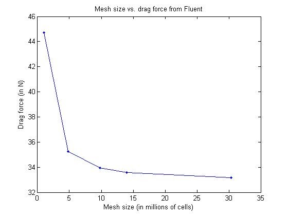
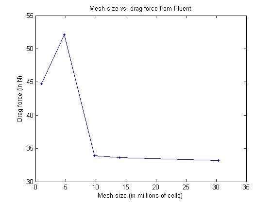

# SSCP - Mesh Refinement Comparisons

# Mesh Refinement Comparisons

To validate our results, we decided to look into drag force vs. mesh size. This is to check that we have reached asymptotic values for the force results from CFD analysis. 

For the purpose of this comparison, we used different mesh sizes for Sunwhale-014. To keep the meshes simple and comparable, Advancing Front was used as the algorithm defining all domains. Each size was determined by a combination of leading edge spacing, trailing edge spacing, and overall connector spacing. Generally, the trailing edge spacing was half the leading edge spacing, while the overall connector spacing was twice the leading edge spacing. 

Results

Update (September 21, 2014): 14.0M cell mesh ran with domain definition consistent to the rest of the meshes, yielded 33.385N drag force. Will update graph when I actually get everything running on my desktop.

### Embedded Content

Embedded content: [Custom embed]()

<iframe width="100%" height="400" src="" frameborder="0"></iframe>

Susan (September 19, 2014): Max reran the 4.8M mesh and got a result that was more consistent with the other numbers. 

Susan (September 18, 2014): Looks pretty good in terms of hitting an asymptote! I was thinking of going slightly larger (maybe not quite 50M cells but maybe ~35-40M cells), and perhaps investigating that spike at 4.8M cells (52.12N??). To that end, I made a 3.0M mesh as well as a 21.1M mesh. 

My mesh generation process is pretty straightforward:

- adjust the leading/trailing edge spacing

- adjust spacing connectors that are adjacent to leading/trailing edges

- dimension other connectors to "overall spacing" as average delta

- add points to the connectors that have different spacing connector values for begin/end to smooth transitions

    - transitions can be smoothed by matching spacing connector values at the intersection of connectors

- if the mesh looks too clumped, choose the domain and re-initialize, refine, and/or decimate. 

All meshes used in this are in the FTP Sunwhale-014 Pointwise folder. 

More info on this topic from Tom:

The AIAA drag prediction workshop is a good example of these types of studies. For instance, check out the slides here to learn a little more about how one might go about this for a large aircraft configuration:http://aaac.larc.nasa.gov/tsab/cfdlarc/aiaa-dpw/Workshop5/presentations/DPW5_Presentation_Files/14_DPW5%20Summary-Draft_V7.pdf. The goal is to see how sensitive the solution is and to try to find a good compromise for the mesh size (ideally it will be “grid converged” in this sense).

[http://aaac.larc.nasa.gov/tsab/cfdlarc/aiaa-dpw/Workshop5/presentations/DPW5_Presentation_Files/14_DPW5%20Summary-Draft_V7.pdf](http://aaac.larc.nasa.gov/tsab/cfdlarc/aiaa-dpw/Workshop5/presentations/DPW5_Presentation_Files/14_DPW5%20Summary-Draft_V7.pdf)

