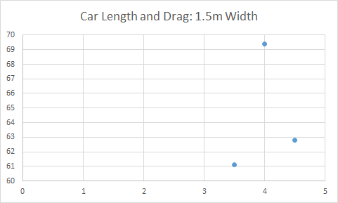
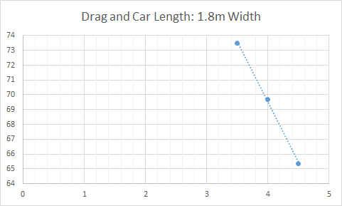
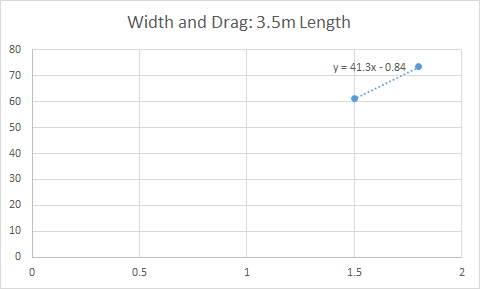
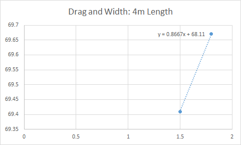
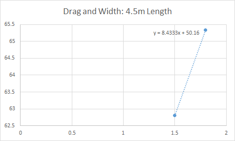

# solidworks-flowsim-quick-simulations

## SSCP - Solidworks FlowSim Quick Simulations

## Solidworks FlowSim Quick Simulations

These are some quick CFD comparisons of different solar car models.&#x20;

I used SolidWorks' CFD solver with standardized conditions. Here are the conditions:&#x20;

Parameters for SolidWorks FlowSim

From Center of Car, farfield forward is 9750mm, and farside rear is 7575mm. Bounding box is 10mm thick.&#x20;

Road surface mesh is a wall with moving speed of 24.6 m/s.&#x20;

Place road surface 40mm below fairing bottom edge.&#x20;

Use level 5 for meshing.

The Solidworks part files and CFD results are in the FTP server under cars/aero/FlowSim CFD of Models.

Drag and Main Body Dimensions

Length Sensitivity

&#x20;  &#x20;

Width Sensitivity

