# SSCP - Cambered Catamarans

# Cambered Catamarans

These Cambered Catamarans are based on the NACA 64A series airfoil.

45180 means that the car is 4.5meters long and 180cm wide.

camber 2 means it has the camber corresponding to coefficient of lift = .2 in Javafoil

thick3 means it has thickness of 3 (approx 3.6% for the Thickness t/c parameter in Javafoil)

These parameters integrated correspond to what the NACA name for the foil is, so NACA 64A-203 would be camber 2, thickness 3

The X component is drag, and Z component is lift (negative is downforce)

Total Force in all Axes

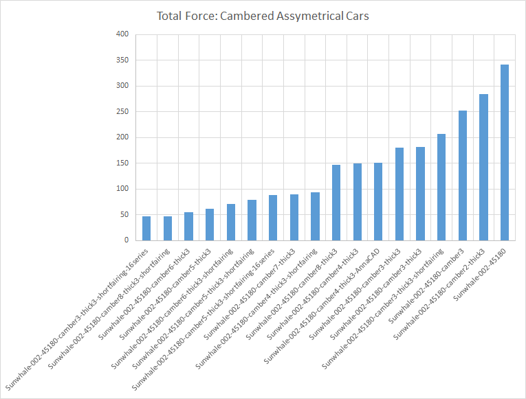

Drag

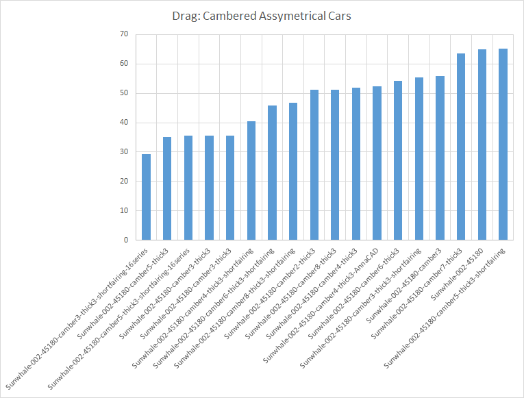

Camber and Drag

These results are for the model 

Sunwhale-002-45180-camber[X]-thick3

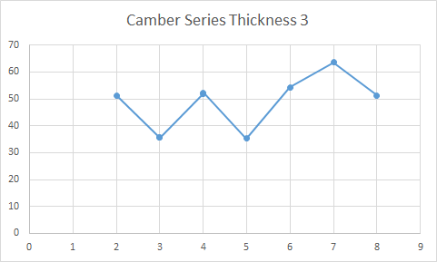

This graph shows results for the model 

Sunwhale-002-45180-camber[X]-thick3-shortfairing

This graph shows results for the model 

Sunwhale-002-45180-camber[X]-thick3-shortfairing and includes the two 16series airfoils in camber of 3 and 5. 

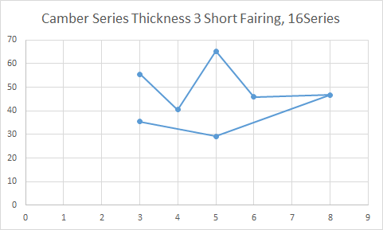

Camber and Downforce

Downforce in N on X-axis, drag in N on y-axis. 

These results are for the model 

Sunwhale-002-45180-camber[X]-thick3

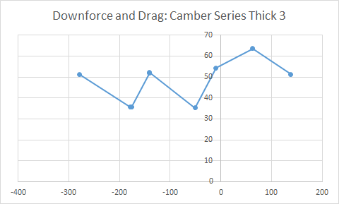

This graph shows results for the model 

Sunwhale-002-45180-camber[X]-thick3-shortfairing

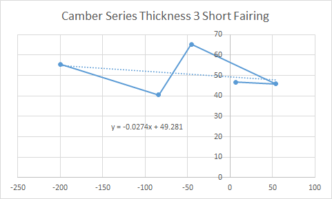

Cars Simulated

Model: Sunwhale-002-45180

Drag: 64.88 N

### Embedded Content

Embedded content: [Custom embed]()

<iframe width="100%" height="400" src="" frameborder="0"></iframe>

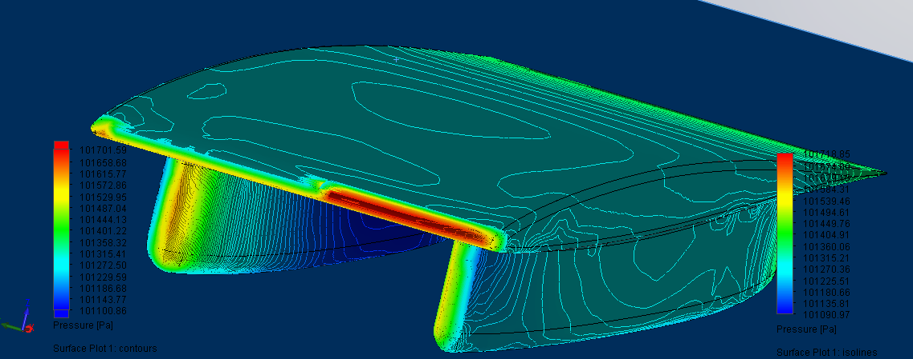

Model: Sunwhale-002-45180-camber2-thick3

Drag: 51.24 N

### Embedded Content

Embedded content: [Custom embed]()

<iframe width="100%" height="400" src="" frameborder="0"></iframe>

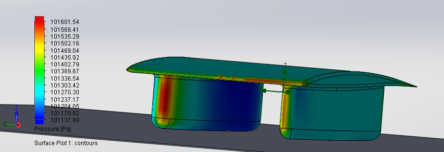

Model: Sunwhale-002-45180-camber3

Drag: 55.76 N

### Embedded Content

Embedded content: [Custom embed]()

<iframe width="100%" height="400" src="" frameborder="0"></iframe>

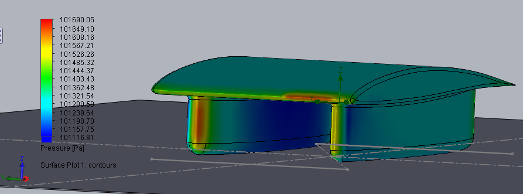

Model: Sunwhale-002-45180-camber3-thick3

Drag: 35.68 N (Confirmed)

Confirmation (Entirely new CFD run, not just a re-run):

### Embedded Content

Embedded content: [Custom embed]()

<iframe width="100%" height="400" src="" frameborder="0"></iframe>

### Embedded Content

Embedded content: [Custom embed]()

<iframe width="100%" height="400" src="" frameborder="0"></iframe>

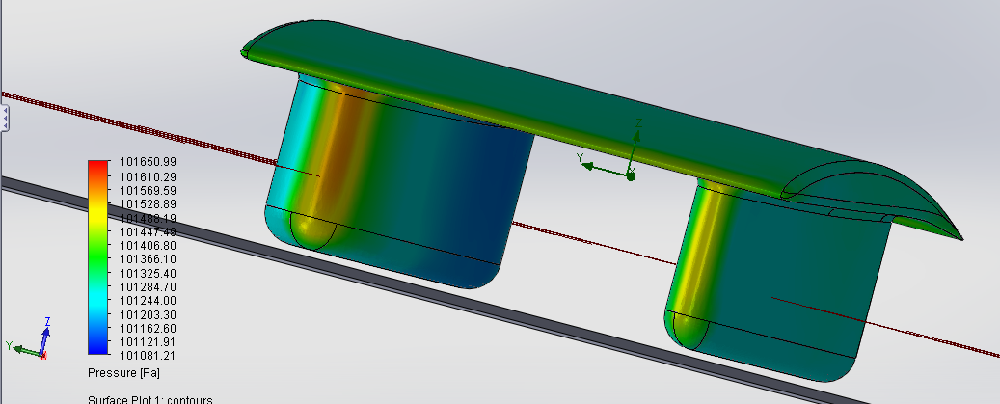

Model: Sunwhale-002-45180-camber3-thick3-shortfairing

Drag: 55.50 N

### Embedded Content

Embedded content: [Custom embed]()

<iframe width="100%" height="400" src="" frameborder="0"></iframe>

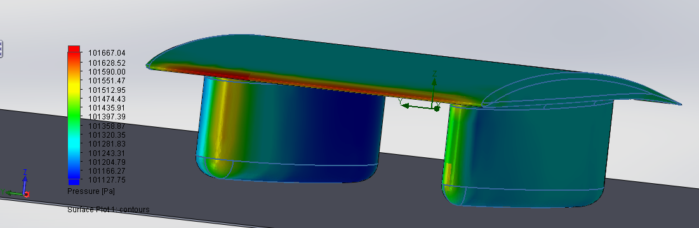

Model: Sunwhale-002-45180-camber3-thick3-shortfairing-16series

Drag: 29.26 N

Initial Run

### Embedded Content

Embedded content: [Custom embed]()

<iframe width="100%" height="400" src="" frameborder="0"></iframe>

CONFIRMATION (FlowSim):

-Guilli's Confirmation

### Embedded Content

Embedded content: [Custom embed]()

<iframe width="100%" height="400" src="" frameborder="0"></iframe>

-Anna's Confirmation

### Embedded Content

Embedded content: [Custom embed]()

<iframe width="100%" height="400" src="" frameborder="0"></iframe>

Crosswinds (FlowSim, 6m/s from positive Y): 

### Embedded Content

Embedded content: [Custom embed]()

<iframe width="100%" height="400" src="" frameborder="0"></iframe>

FlowSim, -6 m/s from positive Y-axis

### Embedded Content

Embedded content: [Custom embed]()

<iframe width="100%" height="400" src="" frameborder="0"></iframe>

CONFIRMATION: Pointwise/SU2: 

Incomplete, due by 8/7-2014

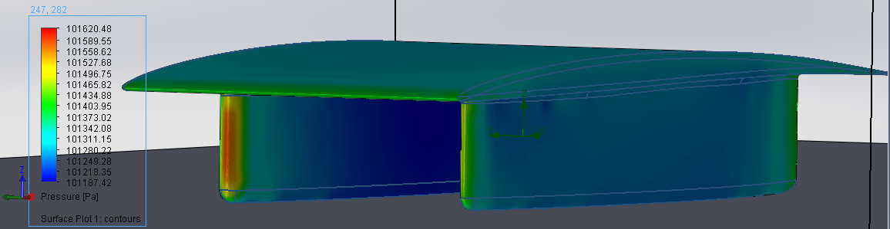

Model: Sunwhale-002-45180-camber4-thick3

Drag: 51.96 N

### Embedded Content

Embedded content: [Custom embed]()

<iframe width="100%" height="400" src="" frameborder="0"></iframe>

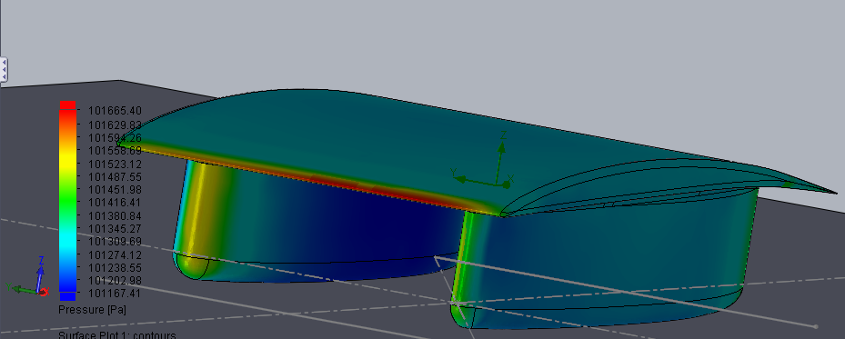

Model: Sunwhale-002-45180-camber4-thick3-AnnaCAD

Drag: 52.32 N

### Embedded Content

Embedded content: [Custom embed]()

<iframe width="100%" height="400" src="" frameborder="0"></iframe>

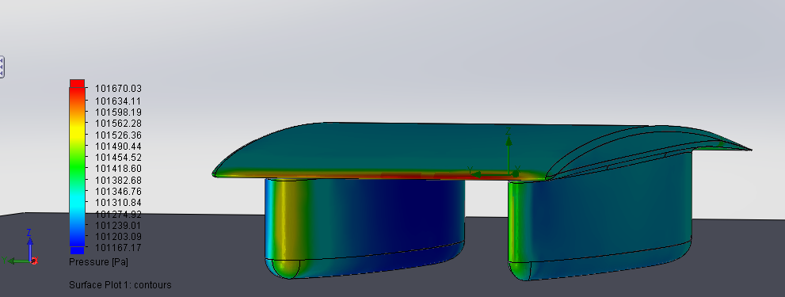

Model: Sunwhale-002-45180-camber4-thick3-shortfairing

Drag: 40.47 N

Model: Sunwhale-002C-45180-camber5-thick3

Drag: 35.2 N (Second CFD Run, Confirmed)

### Embedded Content

Embedded content: [Custom embed]()

<iframe width="100%" height="400" src="" frameborder="0"></iframe>

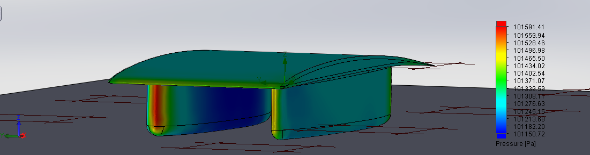

### Embedded Content

Embedded content: [Custom embed]()

<iframe width="100%" height="400" src="" frameborder="0"></iframe>

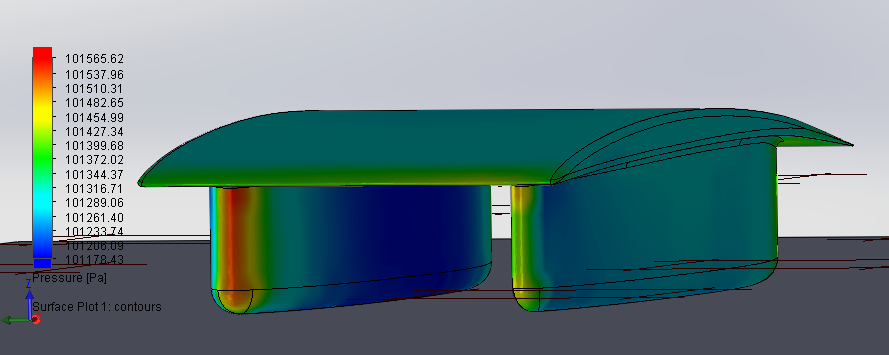

Model: Sunwhale-002C-45180-camber5-thick3-shortfairing

Drag: 65.23 N

### Embedded Content

Embedded content: [Custom embed]()

<iframe width="100%" height="400" src="" frameborder="0"></iframe>

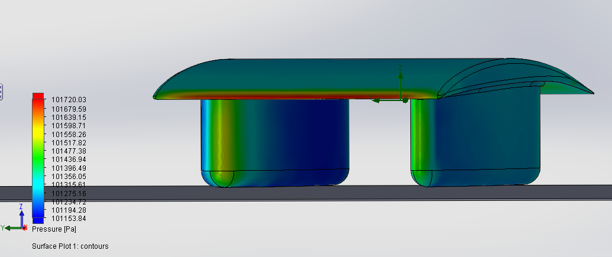

Model: Sunwhale-002-45180-camber5-thick3-shortfairing-16series

Drag: 35.53 N

### Embedded Content

Embedded content: [Custom embed]()

<iframe width="100%" height="400" src="" frameborder="0"></iframe>

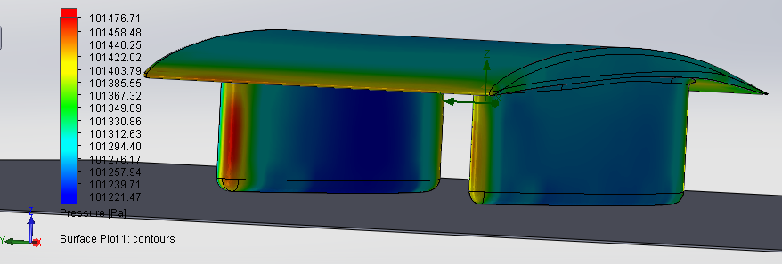

Model: Sunwhale-002-45180-camber6-thick3

Drag: 54.3 N

### Embedded Content

Embedded content: [Custom embed]()

<iframe width="100%" height="400" src="" frameborder="0"></iframe>

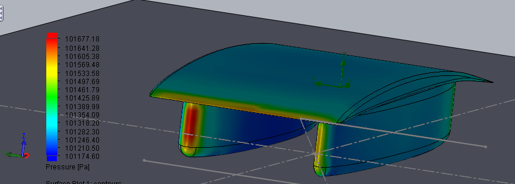

Model: Sunwhale-002-45180-camber6-thick3-shortfairing

Drag: 45.87N

### Embedded Content

Embedded content: [Custom embed]()

<iframe width="100%" height="400" src="" frameborder="0"></iframe>

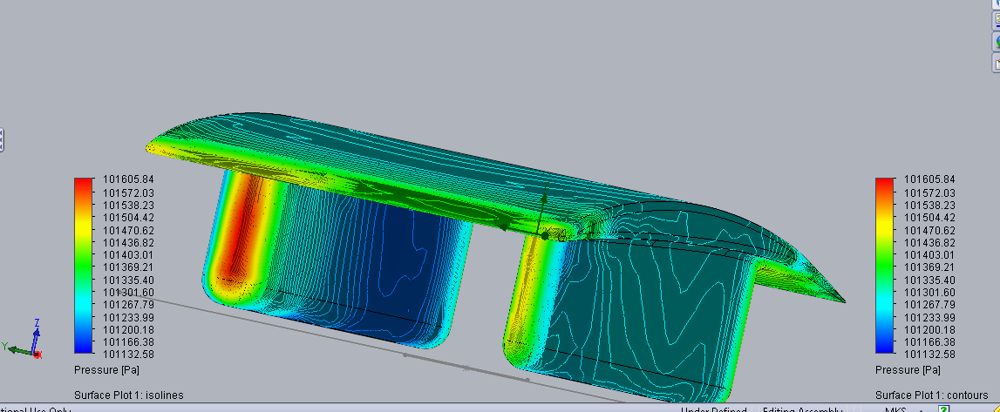

Model: Sunwhale-002-45180-camber7-thick3

Drag: 63.6 N

### Embedded Content

Embedded content: [Custom embed]()

<iframe width="100%" height="400" src="" frameborder="0"></iframe>

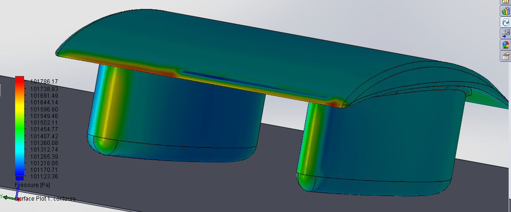

Model: Sunwhale-002-45180-camber8-thick3

Drag: 51.25

### Embedded Content

Embedded content: [Custom embed]()

<iframe width="100%" height="400" src="" frameborder="0"></iframe>

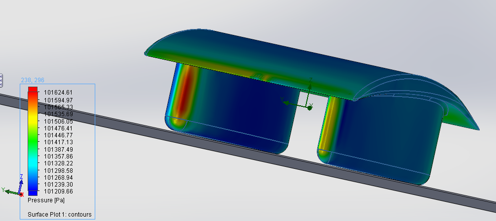

Model: Sunwhale-002-45180-camber8-thick3-shortfairing

Drag 46.72 N

### Embedded Content

Embedded content: [Custom embed]()

<iframe width="100%" height="400" src="" frameborder="0"></iframe>

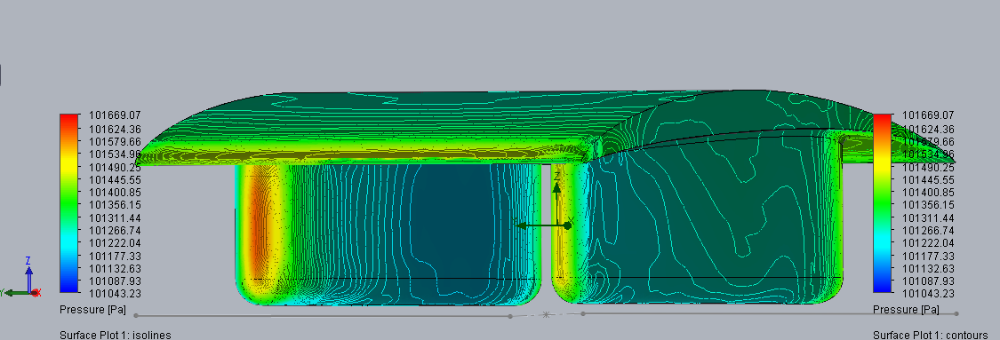

