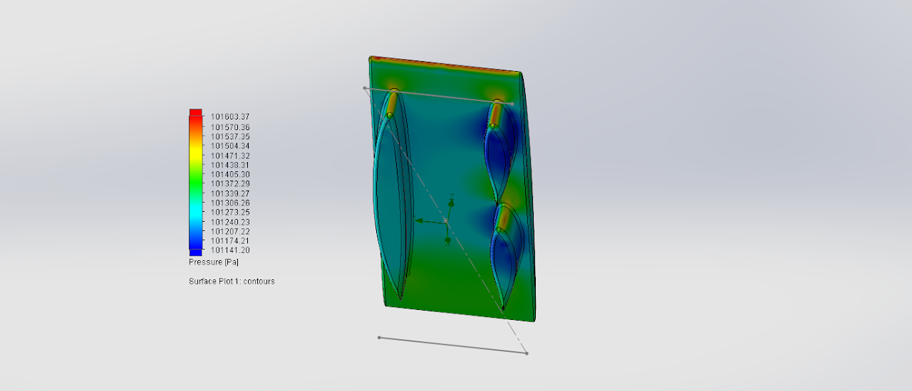

# catamaran-fairing-cambers

## SSCP - Catamaran Fairing Cambers

## Catamaran Fairing Cambers

These are based on the more successful Cambered Catamarans for body shape.

[Cambered Catamarans](../../../../../../stanford.edu/testduplicationsscp/home/sscp-2014-2015/aero-2014-2015/solidworks-flowsim-quick-simulations/cambered-catamarans/)

For each variation series, main foil shape is constant and different fairing configurations are varied.

45180 means that the car is 4.5meters long and 180cm wide.

camber 2 means it has the camber corresponding to coefficient of lift = .2 in Javafoil

thick3 means it has thickness of 3 (approx 3.6% for the Thickness t/c parameter in Javafoil)

These parameters integrated correspond to what the NACA name for the foil is, so NACA 64A-203 would be camber 2, thickness 3

The X component is drag, and Z component is lift (negative is downforce)

Drag value is highlighted in table.

Using model Sunwhale-00\[4 OR 5]-45180-camber3-thick6-fairing338-fcamber\[X], where X denotes the fairing camber.&#x20;

&#x20;   Sunwhale-004 series has split fairings (3 fairings total)

&#x20;   Sunwhale-005 has symmetric fairings (2 fairings total)

&#x20;   fcamber2 corresponds to a fairing camber (on a NACA 16 011 series foil as has been used) of 0.2, or in other words a NACA 16 211 foil.

Summary of Results

Split Fairing                                                                                       &#x20;

Fairing Camber on 3-Fairing Car (split-fairing)

Directory: FairingCamberAug9

Sample name: Sunwhale-004-45180-camber3-thick6-fairing338-fcamber1

fcamber1 corresponds to fairing with 0.1 camber in Javafoil

This series is based on the main foil and fairings of the fairing length comparison series

&#x20;   \- main foil (thickness 6) to reflect more realistic sizing in accommodating suspension etc.

&#x20;   \- fairings are extruded 0.44m&#x20;

&#x20;   \- fairings are 0.5m from leading edge&#x20;

&#x20;   mainfoil = NACA64A-306

&#x20;   original driver fairing = NACA 16-011\*&#x20;

&#x20;   split fairing = NACA 64A 020\* (identical 2)

&#x20;       \* leading 0 changes as camber is introduced

Model: Sunwhale-004-45180-camber3-thick6-fairing338-fcamber1

Main foil camber: 0.1&#x20;

Split foil camber: 0.1   &#x20;

&#x20;0.1

Single Fairing Force

Side fairing front

25.25

Side fairing rear

#### Embedded Content

Embedded content: [Custom embed](catamaran-fairing-cambers.md)

#### Embedded Content

Embedded content: [Custom embed](catamaran-fairing-cambers.md)

Model: Sunwhale-004-45180-camber3-thick6-fairing338-fcamber2

&#x20;

Single Fairing Force

#### Embedded Content

Embedded content: [Custom embed](catamaran-fairing-cambers.md)

Side fairing front

#### Embedded Content

Embedded content: [Custom embed](catamaran-fairing-cambers.md)

Side fairing rear

#### Embedded Content

Embedded content: [Custom embed](catamaran-fairing-cambers.md)

Model: Sunwhale-004-45180-camber3-thick6-fairing338-fcamber3

SPLIT FAIRING <-----------> SYMMETRIC

#### Embedded Content

Embedded content: [Custom embed](catamaran-fairing-cambers.md)

#### Embedded Content

Embedded content: [Custom embed](catamaran-fairing-cambers.md)

Single fairing

#### Embedded Content

Embedded content: [Custom embed](catamaran-fairing-cambers.md)

Side fairing front

#### Embedded Content

Embedded content: [Custom embed](catamaran-fairing-cambers.md)

Side fairing rear

#### Embedded Content

Embedded content: [Custom embed](catamaran-fairing-cambers.md)

Model: Sunwhale-004-45180-camber3-thick6-fairing338-fcamber4

#### Embedded Content

Embedded content: [Custom embed](catamaran-fairing-cambers.md)

Single Fairing&#x20;

#### Embedded Content

Embedded content: [Custom embed](catamaran-fairing-cambers.md)

Side fairing front

#### Embedded Content

Embedded content: [Custom embed](catamaran-fairing-cambers.md)

Side fairing rear

#### Embedded Content

Embedded content: [Custom embed](catamaran-fairing-cambers.md)

Model: Sunwhale-004-45180-camber3-thick6-fairing338-fcamber5

#### Embedded Content

Embedded content: [Custom embed](catamaran-fairing-cambers.md)

Single fairing

#### Embedded Content

Embedded content: [Custom embed](catamaran-fairing-cambers.md)

Side fairing front

#### Embedded Content

Embedded content: [Custom embed](catamaran-fairing-cambers.md)

Side fairing rear

#### Embedded Content

Embedded content: [Custom embed](catamaran-fairing-cambers.md)

Model: Sunwhale-004-45180-camber3-thick6-fairing338-fcamber6

#### Embedded Content

Embedded content: [Custom embed](catamaran-fairing-cambers.md)

Single fairing

#### Embedded Content

Embedded content: [Custom embed](catamaran-fairing-cambers.md)

Side fairing front

#### Embedded Content

Embedded content: [Custom embed](catamaran-fairing-cambers.md)

Side fairing rear

#### Embedded Content

Embedded content: [Custom embed](catamaran-fairing-cambers.md)

Fairing Camber on 2-Fairing Car (Symmetric)

Directory: FairingCamberAug9

Sample name: Sunwhale-005-45180-camber3-thick6-fairing338-fcamber1

fcamber1 corresponds to fairing with 0.1 camber in Javafoil

This series is based on the main foil and fairings of the fairing length comparison series

&#x20;   \- main foil (thickness 6) to reflect more realistic sizing in accommodating suspension etc.

&#x20;   \- fairings are extruded 0.44m&#x20;

&#x20;   \- fairings are 0.5m from leading edge

&#x20;   mainfoil = NACA64A-306

&#x20;   original fairings = NACA 16-011\*&#x20;

&#x20;       \* leading "0" chnages as camber is introduced

Model: Sunwhale-005-45180-camber3-thick6-fairing338-fcamber1

#### Embedded Content

Embedded content: [Custom embed](catamaran-fairing-cambers.md)

Right fairing

#### Embedded Content

Embedded content: [Custom embed](catamaran-fairing-cambers.md)

Left fairing

#### Embedded Content

Embedded content: [Custom embed](catamaran-fairing-cambers.md)

Model: Sunwhale-005-45180-camber3-thick6-fairing338-fcamber2

#### Embedded Content

Embedded content: [Custom embed](catamaran-fairing-cambers.md)

Right fairing

#### Embedded Content

Embedded content: [Custom embed](catamaran-fairing-cambers.md)

Left fairing

#### Embedded Content

Embedded content: [Custom embed](catamaran-fairing-cambers.md)

Model: Sunwhale-005-45180-camber3-thick6-fairing338-fcamber3

#### Embedded Content

Embedded content: [Custom embed](catamaran-fairing-cambers.md)

Right fairing

#### Embedded Content

Embedded content: [Custom embed](catamaran-fairing-cambers.md)

Left fairing

#### Embedded Content

Embedded content: [Custom embed](catamaran-fairing-cambers.md)

Model: Sunwhale-005-45180-camber3-thick6-fairing338-fcamber4

#### Embedded Content

Embedded content: [Custom embed](catamaran-fairing-cambers.md)

Right fairing

#### Embedded Content

Embedded content: [Custom embed](catamaran-fairing-cambers.md)

Left fairing

#### Embedded Content

Embedded content: [Custom embed](catamaran-fairing-cambers.md)

Model: Sunwhale-005-45180-camber3-thick6-fairing338-fcamber5

#### Embedded Content

Embedded content: [Custom embed](catamaran-fairing-cambers.md)

Right fairing

#### Embedded Content

Embedded content: [Custom embed](catamaran-fairing-cambers.md)

Left fairing

#### Embedded Content

Embedded content: [Custom embed](catamaran-fairing-cambers.md)

Model: Sunwhale-005-45180-camber3-thick6-fairing338-fcamber6

#### Embedded Content

Embedded content: [Custom embed](catamaran-fairing-cambers.md)

Right fairing

#### Embedded Content

Embedded content: [Custom embed](catamaran-fairing-cambers.md)

Left fairing

#### Embedded Content

Embedded content: [Custom embed](catamaran-fairing-cambers.md)
