# SSCP - Catamaran Fairing Distance and Split

# Catamaran Fairing Distance and Split

These are based on the more successful Cambered Catamarans for body shape.

[ Cambered Catamarans](/stanford.edu/testduplicationsscp/home/sscp-2014-2015/aero-2014-2015/solidworks-flowsim-quick-simulations/cambered-catamarans)

For each variation series, main foil shape is constant and different fairing configurations are varied.

45180 means that the car is 4.5meters long and 180cm wide.

camber 2 means it has the camber corresponding to coefficient of lift = .2 in Javafoil

thick3 means it has thickness of 3 (approx 3.6% for the Thickness t/c parameter in Javafoil)

These parameters integrated correspond to what the NACA name for the foil is, so NACA 64A-203 would be camber 2, thickness 3

The X component is drag, and Z component is lift (negative is downforce)

Drag value is highlighted in table.    

Fairing Distance from Leading Edge

Directory: FairingPositionAug4

Sample name: Sunwhale-003-45180-camber5-thick3-front2 

front2 corresponds with fairing start 0.2m from leading edge

This series is uses the same main foil and fairings as Sunwhale-002-45180-camber5-thick3-shortfairing-16series

    mainfoil = NACA64A-503

    driver fairing = NACA 16-215

    passenger fairing = NACA 16-211

Fairings are 3.38m long

Model: Sunwhale-003-45180-camber5-thick3-front2

Fairing Size on 2-Fairing Car

Directory: FairingSizeAug1

Sample name: Sunwhale-005-45180-camber3-thick6-fairing338

fairing338 corresponds to fairings of 3.38m length

This series is based on the main foil and fairings of Sunwhale-002-45180-camber5-thick3-shortfairing-16series, but with the following modifications:

    - thicker main foil (thickness 6) to reflect more realistic sizing in accommodating suspension etc.

    - non-cambered fairing foils

    - identical driver and passenger fairings

    - fairings are extruded 0.44m (instead of previously 0.54m)

    mainfoil = NACA64A-306

    driver fairing = NACA 16-011

    passenger fairing = same as driver fairing

When changing length, fairings are placed a reasonable distance from the leading edge in order to maintain a sensible wheelbase. (e.g. 0.3m for a longer fairing, 0.5m for a shorter fairing) This results in a fairing relatively centered between the leading and trailing edges of the car.

When changing length, the foil is generally the same coordinates from Javafoil, but scaled up to length in excel--provided that the fairing does not become too wide or narrow.

Model: Sunwhale-005-45180-camber3-thick6-fairing28

          Fairing size: 2.8m 

        Distance from leading edge: 0.7m

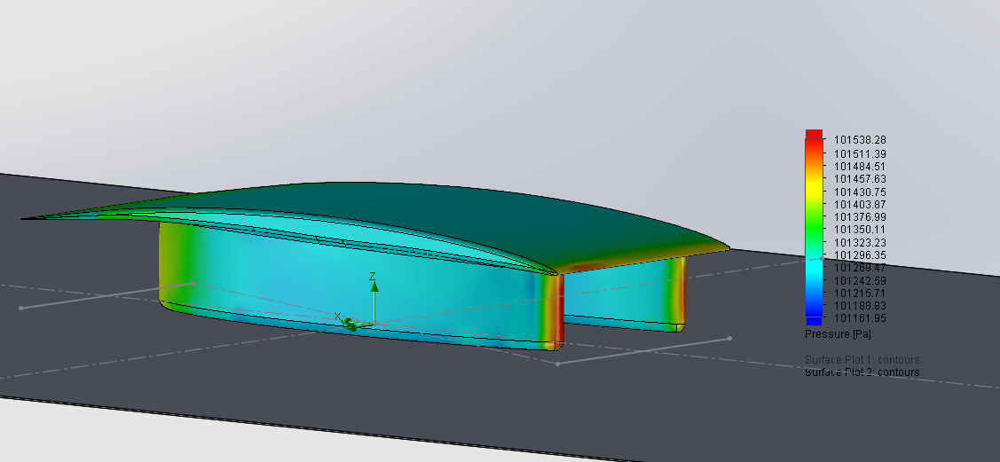

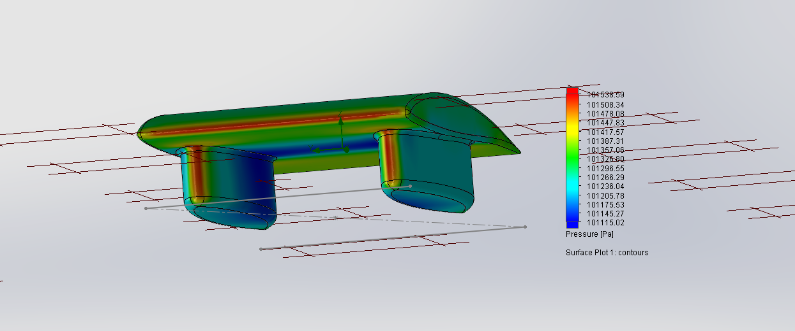

### Embedded Content

Embedded content: [Custom embed]()

<iframe width="100%" height="400" src="" frameborder="0"></iframe>

### Embedded Content

Embedded content: [Custom embed]()

<iframe width="100%" height="400" src="" frameborder="0"></iframe>

Model: Sunwhale-003-45180-camber5-thick3-front3

Model: Sunwhale-005-45180-camber3-thick6-fairing338

    

          Fairing size: 3.38m 

        Distance from leading edge: 0.5m

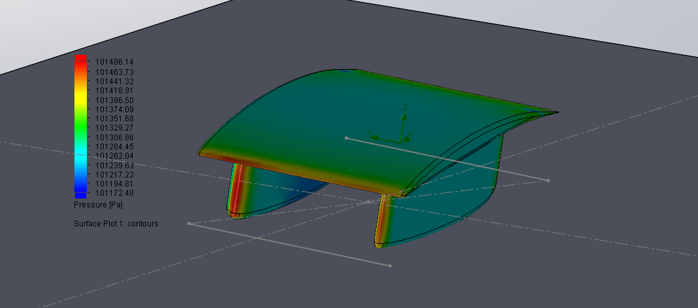

### Embedded Content

Embedded content: [Custom embed]()

<iframe width="100%" height="400" src="" frameborder="0"></iframe>

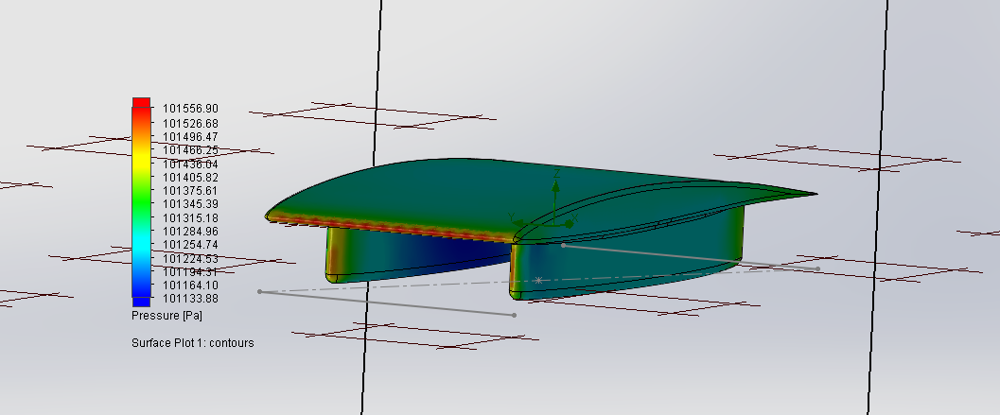

 Force (N)

176.973

 Force x (N)

### Embedded Content

Embedded content: [Custom embed]()

<iframe width="100%" height="400" src="" frameborder="0"></iframe>

 Force y (N)

0.394

 Force z (N)

 SA (m^2)

22.6072

Model: Sunwhale-003-45180-camber5-thick3-front4

44.773

-171.215

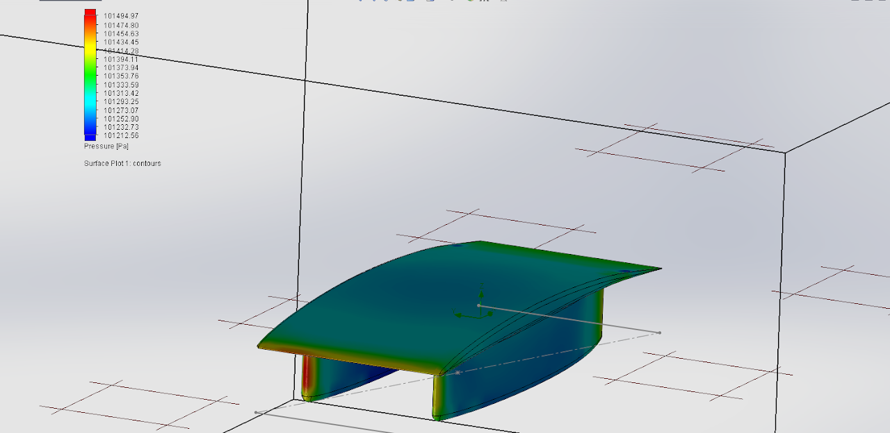

Model: Sunwhale-005-45180-camber3-thick6-fairing38

    

          Fairing size: 3.8m 

        Distance from leading edge: 0.3m

### Embedded Content

Embedded content: [Custom embed]()

<iframe width="100%" height="400" src="" frameborder="0"></iframe>

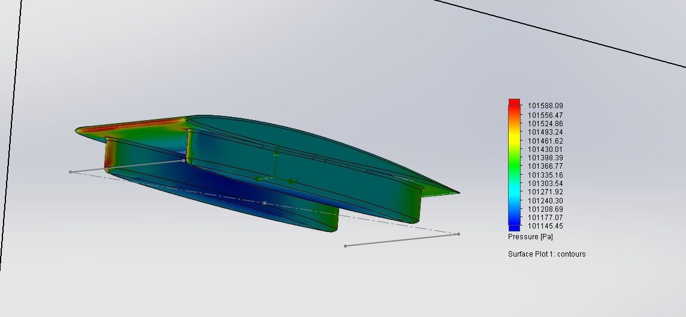

Model: Sunwhale-003-45180-camber5-thick3-front5

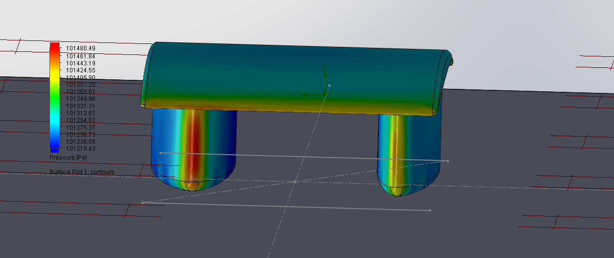

 Force (N)

 Force x (N)

 Force y (N)

 Force z (N)

SA (m^2)

178.913

46.76

1.312

-172.69

23.2416

### Embedded Content

Embedded content: [Custom embed]()

<iframe width="100%" height="400" src="" frameborder="0"></iframe>

Fairing Size on 3-Fairing Car (split fairing)

Directory: SplitFairingAug5

Sample name: Sunwhale-004-45180-camber3-thick6-fairing338

fairing338 corresponds to fairings of 3.38m length

This series is based on the main foil and fairings of Sunwhale-002-45180-camber5-thick3-shortfairing-16series, but with the following modifications:

    - thicker main foil (thickness 6) to reflect more realistic sizing in accommodating suspension etc.

    - non-cambered fairing foils

    - same driver fairing as the corresponding 2-fairing car model for each given size

    - same front/rear fairings on the split fairing side

    - fairings are extruded 0.44m (instead of previously 0.54m)

    mainfoil = NACA64A-306

    driver fairing = NACA 16-011

    split fairings = NACA 64A-020

When changing length, fairings are placed a reasonable distance from the leading edge in order to maintain a sensible wheelbase. (e.g. 0.3m for a longer fairing, 0.5m for a shorter fairing) This results in a fairing relatively centered between the leading and trailing edges of the car.

On the split fairing side, the front of the front fairing and rear of the rear fairing span the same length as the single fairing on the other side. The default for split fairing length is 1.5m.

Model: Sunwhale-003-45180-camber5-thick3-front6

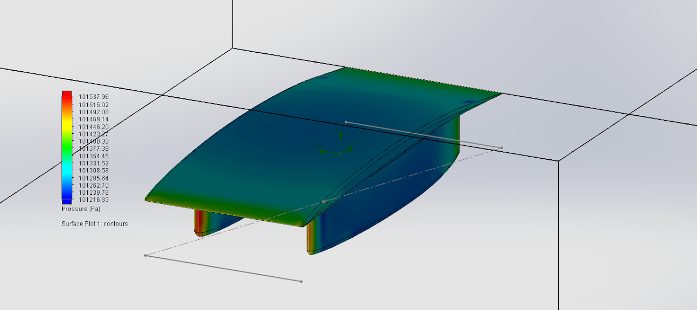

### Embedded Content

Embedded content: [Custom embed]()

<iframe width="100%" height="400" src="" frameborder="0"></iframe>

Model: Sunwhale-003-45180-camber5-thick3-front7

Model: Sunwhale-004-45180-camber3-thick6-fairing28

        Fairing size: 2.8m large, 1.2 small

        Distance from leading edge: 0.7m

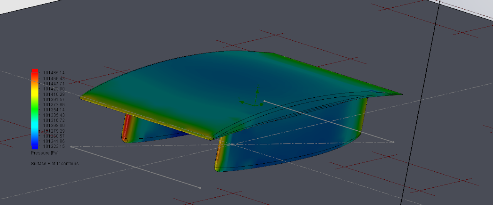

### Embedded Content

Embedded content: [Custom embed]()

<iframe width="100%" height="400" src="" frameborder="0"></iframe>

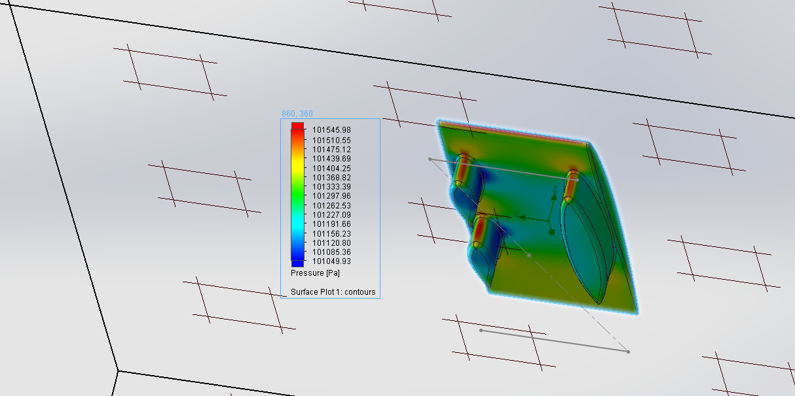

Model: Sunwhale-003-45180-camber5-thick3-front8

### Embedded Content

Embedded content: [Custom embed]()

<iframe width="100%" height="400" src="" frameborder="0"></iframe>

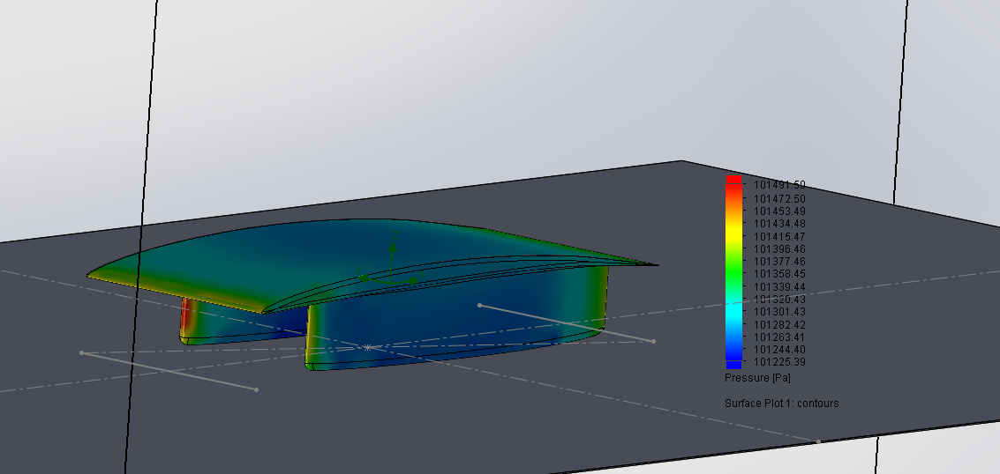

Model: Sunwhale-004-45180-camber3-thick6-fairing338

    

          Fairing size: 3.38m large, 1.5m small

        Distance from leading edge: 0.5m

### Embedded Content

Embedded content: [Custom embed]()

<iframe width="100%" height="400" src="" frameborder="0"></iframe>

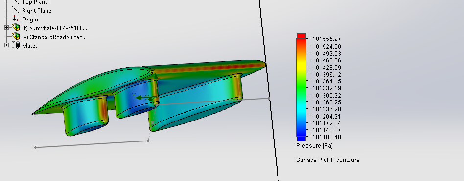

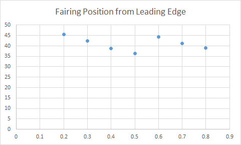

 Force (N)

 Force x (N)

 Force y (N)

 Force z (N)

 SA (m^2)

22.3533

81.07

42.565

1.366

-68.983

### Embedded Content

Embedded content: [Custom embed]()

<iframe width="100%" height="400" src="" frameborder="0"></iframe>

Model: Sunwhale-004-45180-camber3-thick6-fairing38

    

          Fairing size: 3.8m large, 1.5m small

        Distance from leading edge: 0.3m

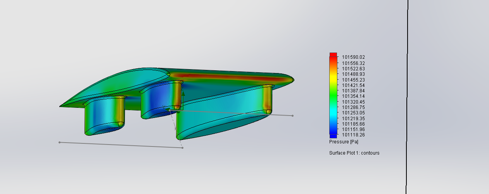

 Force (N)

61.054

 Force x (N)

 Force y (N)

 Force z (N)

 SA (m^2)

46.449

2.348

-39.555

22.6939

