# catamarans

## SSCP - Catamarans

## Catamarans

Model: Sunwhale 001 Catamaran Concept 1

Full-length fairings, bubble front-biased.&#x20;

Drag: 91.4 N

#### Embedded Content

Embedded content: [Custom embed](catamarans.md)

#### Embedded Content

Embedded content: [Custom embed](catamarans.md)

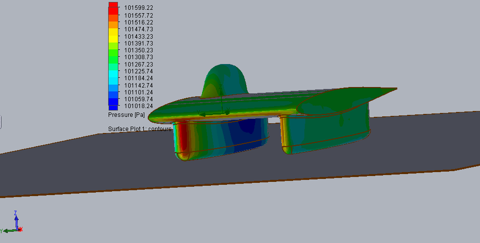

&#x20;&#x20;

Model: Sunwhale 001 with Fillets

Drag: 91.87 N

#### Embedded Content

Embedded content: [Custom embed](catamarans.md)

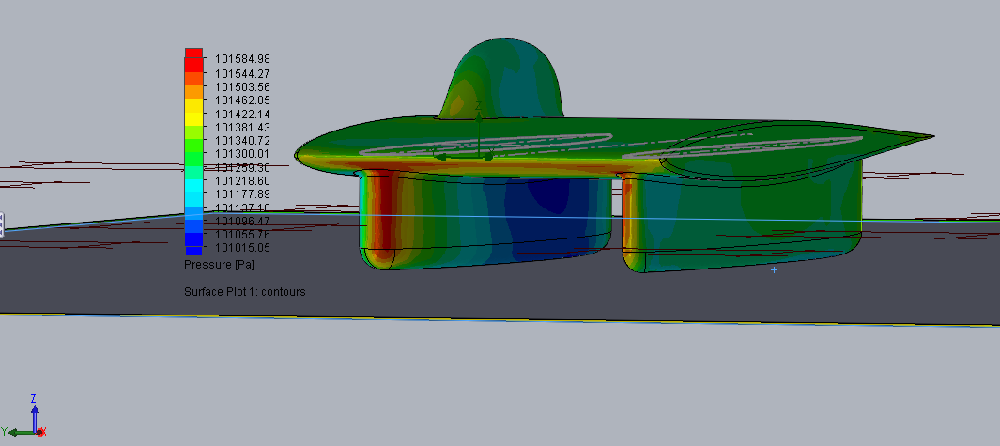

Model: Catamaran Concept 2

Full-length driver fairing, split side fairing, bubble rear-biased.&#x20;

Drag: 72.84N

#### Embedded Content

Embedded content: [Custom embed](catamarans.md)

#### Embedded Content

Embedded content: [Custom embed](catamarans.md)

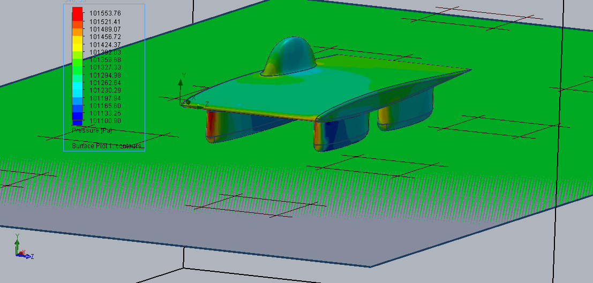

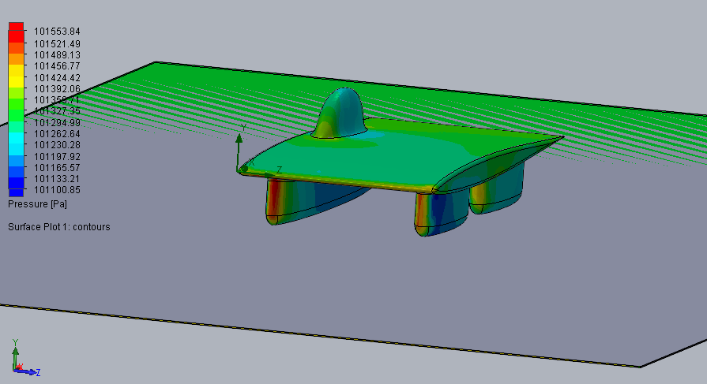

&#x20;       &#x20;

Model: Catamaran Concept 3

Full-length driver fairings, bubble rear-biased.&#x20;

Drag: 68.18 N

Iteration \[ ] 197

Local parameters Integral parameters

Parameter Minimum Maximum Average Bulk Average Surface Area \[m^2] Parameter Value X-component Y-component Z-component Surface Area \[m^2]

Pressure \[Pa] 101134.718 101647.548 101274.532 23.71 Force \[N] 300.81 68.18  -292.96 3.77 23.71

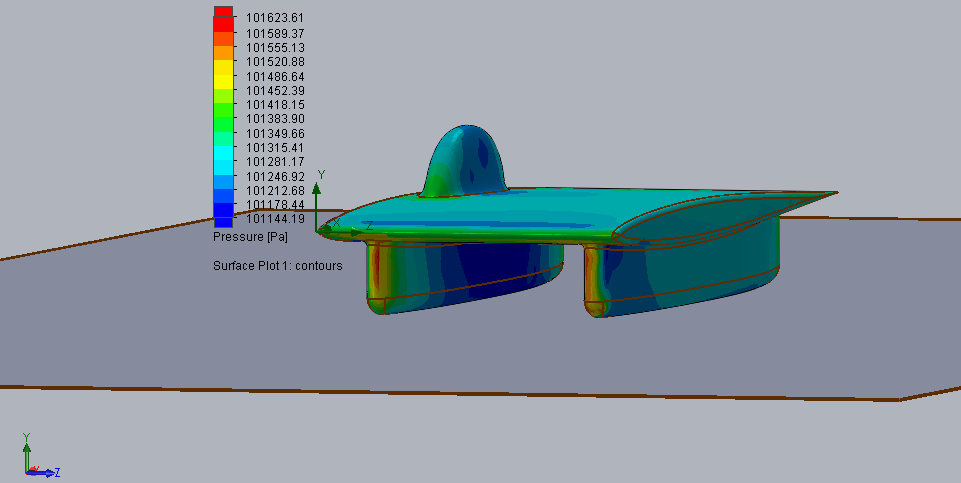

Model: Catamaran Concept 4

Full-length driver fairing, split side fairing, bubble front-biased.&#x20;

Drag: 62.15 N

#### Embedded Content

Embedded content: [Custom embed](catamarans.md)

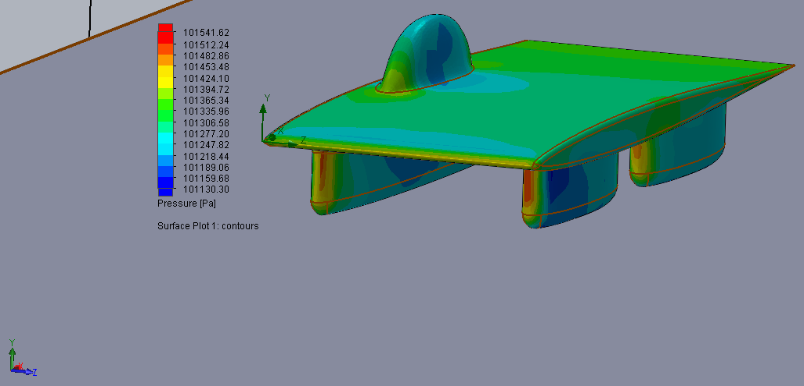

Model: Sunwhale 001 Short&#x20;

Full-length fairings, bubble front-biased.&#x20;

Drag: 71.4 N

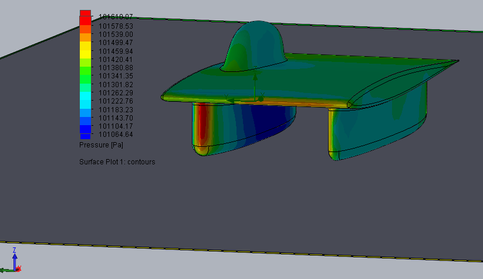

#### Embedded Content

Embedded content: [Custom embed](catamarans.md)

Model: 35150 Short Narrow Catamaran

Description: 3.5m long, 1.5m wide, xx-biased bubble&#x20;

Drag: 67.8 N

#### Embedded Content

Embedded content: [Custom embed](catamarans.md)

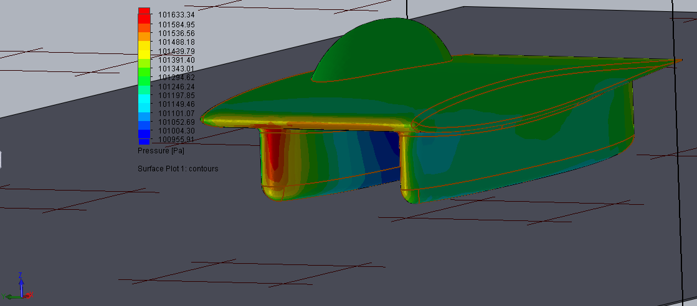

Model: 35180&#x20;

Description: 3.5m long, 1.8m wide

Drag: 72.8 N

#### Embedded Content

Embedded content: [Custom embed](catamarans.md)

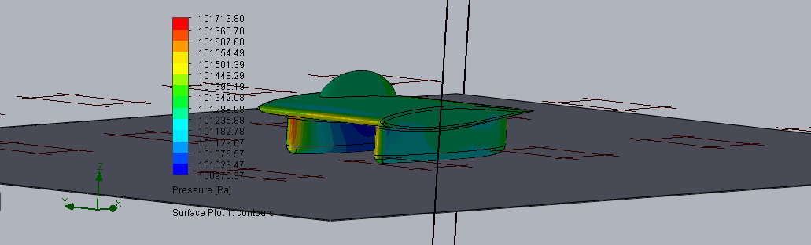

Model: 40150

Description: 4.0m long, 1.5m wide

Drag: 68.9 N

#### Embedded Content

Embedded content: [Custom embed](catamarans.md)

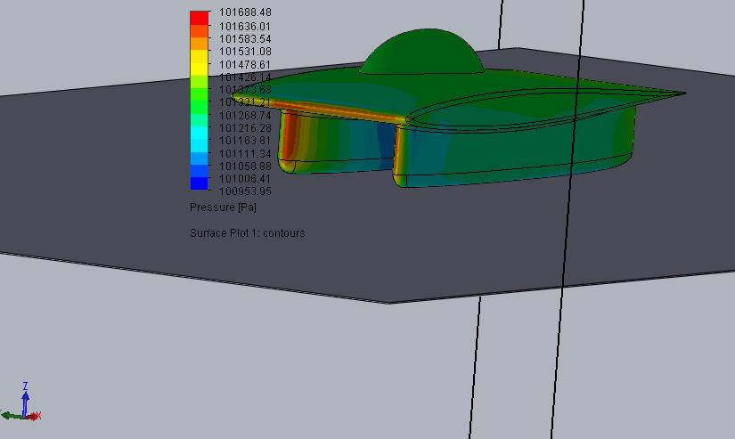

Model: 40180

Description:4.0m long, 1.8m wide

Drag: 69.5 N

#### Embedded Content

Embedded content: [Custom embed](catamarans.md)

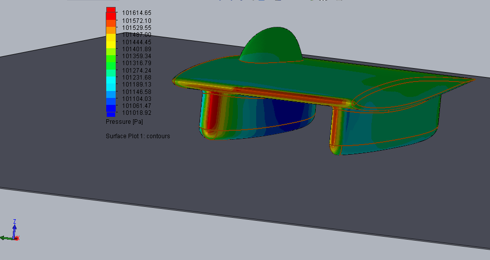

Model: 45150

Description: 4.5m long, 1.5m wide

Drag: 63.4 N

#### Embedded Content

Embedded content: [Custom embed](catamarans.md)

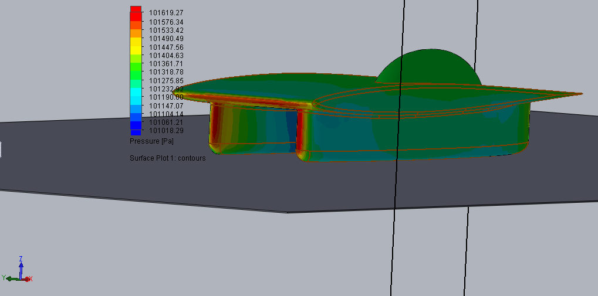

Model: 45180

Description: 4.5m long, 1.8wide,&#x20;

Drag: 60.3 N

#### Embedded Content

Embedded content: [Custom embed](catamarans.md)

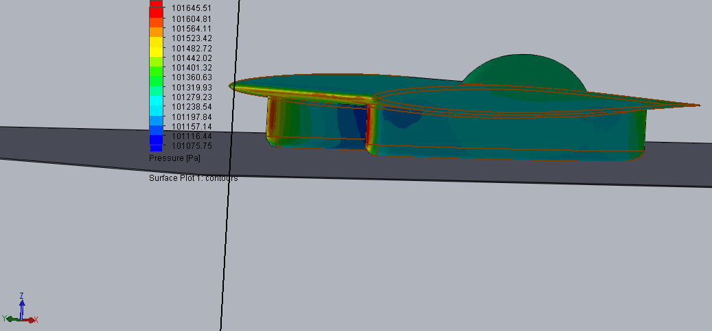

&#x20;&#x20;

Model xx: Gregfoil Darren's Car&#x20;

Description:&#x20;

Drag: 85.7 N

#### Embedded Content

Embedded content: [Custom embed](catamarans.md)

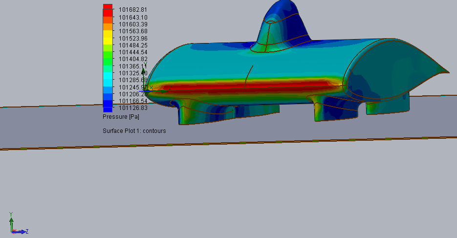
