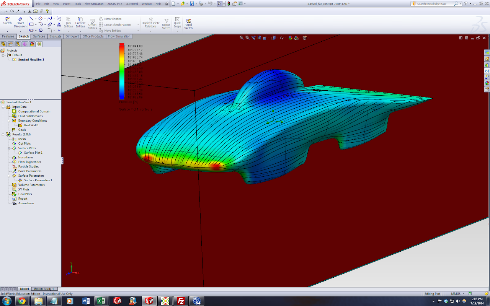
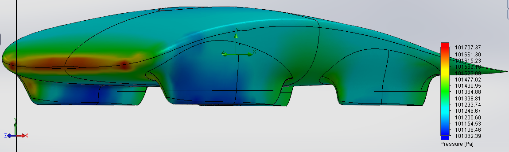
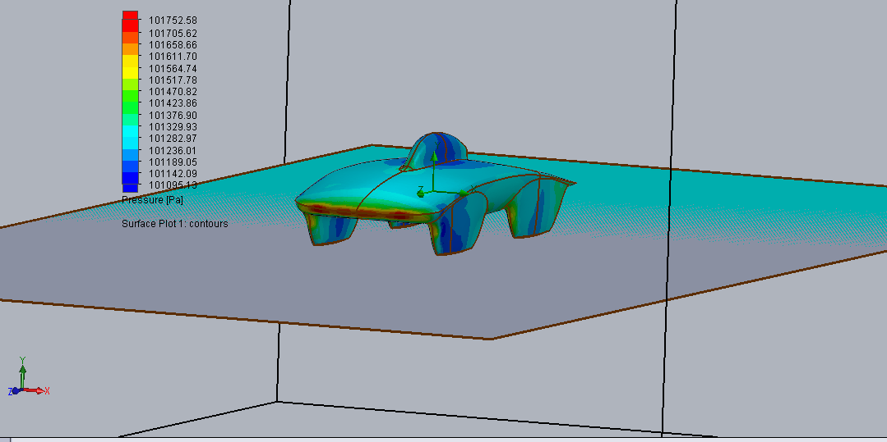
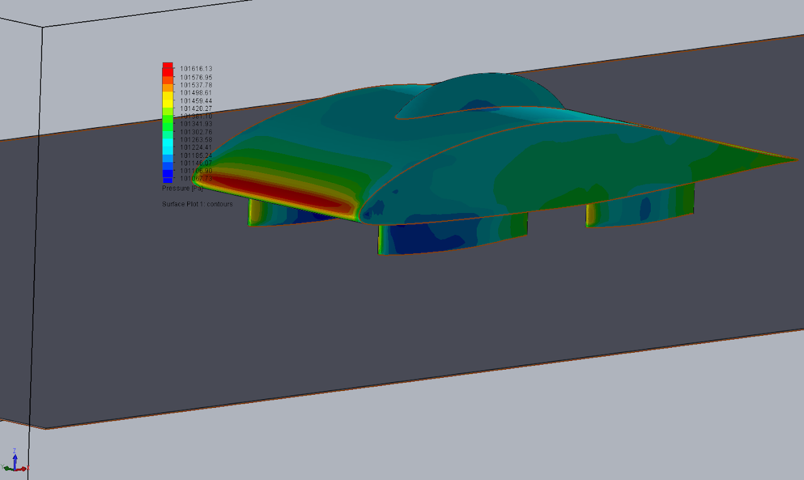

# SSCP - Luminos Reference CFD

# Luminos Reference CFD

Model 1: Sunbad Fat Concept 7

Drag: 43.982 N

### Embedded Content

Embedded content: [Custom embed]()

<iframe width="100%" height="400" src="" frameborder="0"></iframe>

Re-do with a more finalized version. 

Model 1.1: Final Luminos CFD

Drag: -49.36 N

Model: LuminosBubbleless Patched

Drag: 38.06 N

### Embedded Content

Embedded content: [Custom embed]()

<iframe width="100%" height="400" src="" frameborder="0"></iframe>

### Embedded Content

Embedded content: [Custom embed]()

<iframe width="100%" height="400" src="" frameborder="0"></iframe>

Model 2: Sunbad Thin Concept 1

Drag: 81.3 N

### Embedded Content

Embedded content: [Custom embed]()

<iframe width="100%" height="400" src="" frameborder="0"></iframe>

Model 2.5: SimpleLuminos with Generic Bubble

Description:

Drag: 47.9 N

### Embedded Content

Embedded content: [Custom embed]()

<iframe width="100%" height="400" src="" frameborder="0"></iframe>

