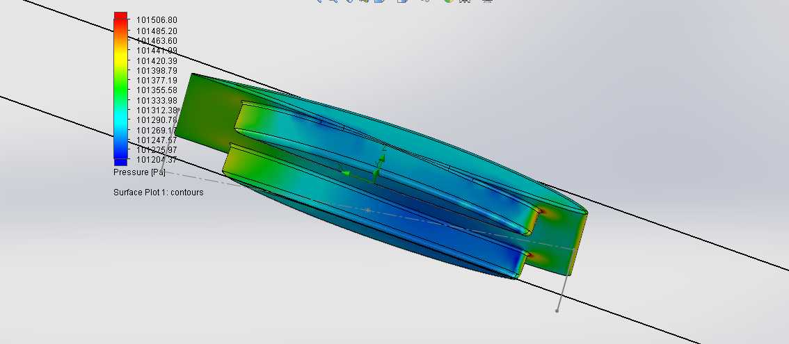
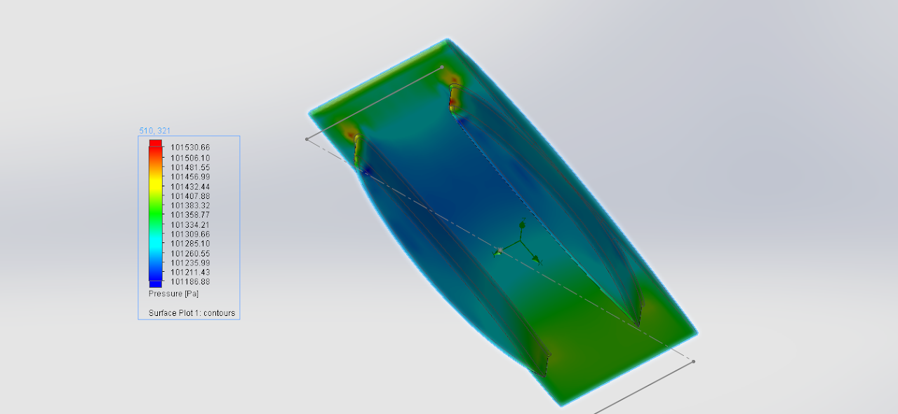
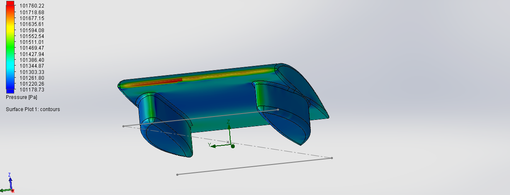
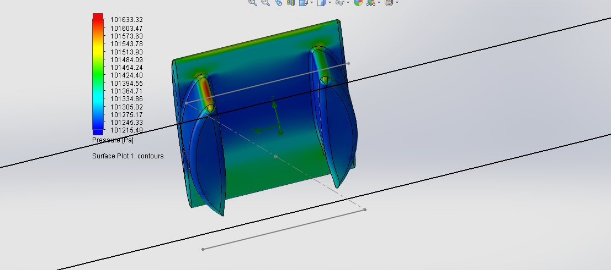
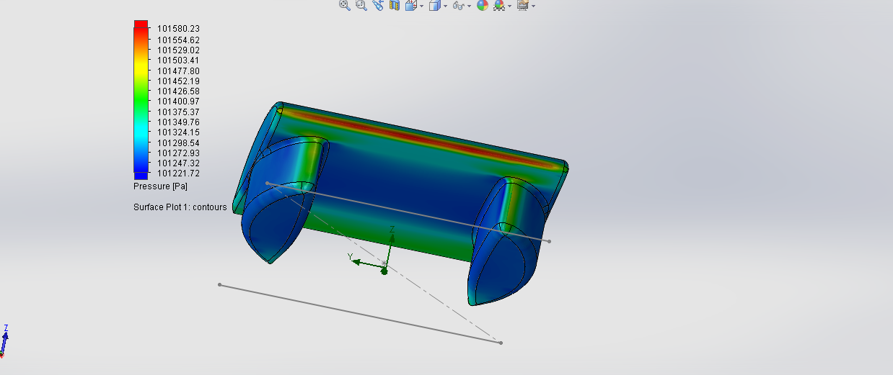
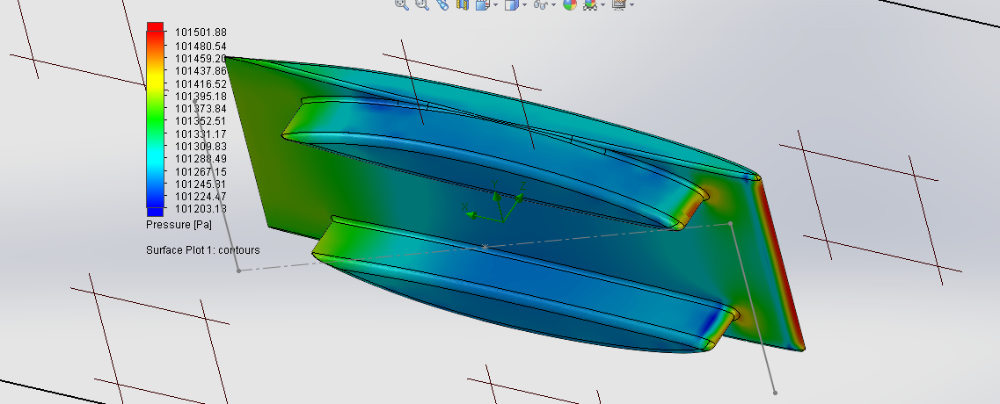

# mainfoil-and-ride-height-revisions

## SSCP - Mainfoil and Ride Height Revisions

## Mainfoil and Ride Height Revisions

Moving forward with some adjustments following discussion at Aero Meeting Aug 11.

[Aero Meeting Aug 11](../../../../../../stanford.edu/testduplicationsscp/home/sscp-2014-2015/aero-2014-2015/sunwhale-design-meeting-notes/)

Main foil has been a NACA64A, where 4 corresponds to xt/c 40% (thickness location at 40% of chord length). We've been varying camber and thickness with this foil, eventually settling on the NACA 64A 306. This was used for all of the subsequent fairing iterations. Suspension could use more room at the rear of the foil, so we're looking at the next 6-series foils in terms of xt/c. Pushing the thickness further back should leave more height towards the rear of the foil. A preliminary comparison of the Cp plots for a 67A versus a 64A does not suggest a drastic difference that would indicate a higher chance of separation at the rear, which would be the biggest concern with this change.

We also properly measured Luminos ride height (distance of fairing off ground), because all simulations have been based on a height of 4cm. With a 181 lb (82 kg) driver + ballast, Luminos sat at 7cm off the ground. From here on out we have switched to 7cm height off ground for FlowSim and CFD.

The 7cm ride height requires a reduction of fairing height from the 44cm height we have been running so far to 38cm.&#x20;

Varying 6-series mainfoil (Sunwhale-008)

Directory: MainfoilSeriesAug12

Sample name: Sunwhale-008-NACA64A306-fairing338-fcamber6

NACA64A306 corresponds to the mainfoil: 6-series, 40% xt/c \[varied parameter], 3 camber, 6 thickness

fairings are 3.38m long

fairing camber is 0.6 in Javafoil

Driver/opposite fairings are symmetric.

Model: Sunwhale-008-NACA64A306-fairing338-fcamber6

(\* actually, Sunwhale-005-45180-camber3-thick6-fairing338-fcamber6, which is identical)

Mainfoil: NACA64A-306

Varying 6-series mainfoil with new ride & fairing heights (Sunwhale-007)

Directory: MainfoilSeriesAug12

Sample name: Sunwhale-007-NACA64A306-fairing338-fcamber6

These have fairings extruded to 0.38m (instead of the previous 0.44m), and a ground-to-fairing distance of 0.07m (instead of the previous 0.04m).&#x20;

Each of these changes can be compared with the corresponding Sunwhale-008 series car that shares the same foil (to compare ride/fairing height adjustment). This series also allows comparison of different xt/c locations on a 6-series cambered main body foil.

Model: Sunwhale-007-NACA64A306-fairing338-fcamber6

Mainfoil: NACA64A-306

&#x20;Force (N)

&#x20;Force x (N)  &#x20;

&#x20;Force y (N)

&#x20;Force z (N)   &#x20;

&#x20;SA (m^2)

55.295

22.974

-0.591

50.293

21.8707

Model: Sunwhale-007-NACA65A306-fairing338-fcamber6

Mainfoil: NACA65A-306

#### Embedded Content

Embedded content: [Custom embed](mainfoil-and-ride-height-revisions.md)

#### Embedded Content

Embedded content: [Custom embed](mainfoil-and-ride-height-revisions.md)

Model: Sunwhale-008-NACA65A306-fairing338-fcamber6

Mainfoil: NACA65A-306

Model: Sunwhale-007-NACA66A306-fairing338-fcamber6

Mainfoil: NACA66A-306

Model: Sunwhale-007-NACA67A306-fairing338-fcamber6

Mainfoil: NACA67A-306

#### Embedded Content

Embedded content: [Custom embed](mainfoil-and-ride-height-revisions.md)

Model: Sunwhale-008-NACA66A306-fairing338-fcamber6

Mainfoil: NACA66A-306

Model: Sunwhale-008-NACA67A306-fairing338-fcamber6

Mainfoil: NACA67A-306

#### Embedded Content

Embedded content: [Custom embed](mainfoil-and-ride-height-revisions.md)

#### Embedded Content

Embedded content: [Custom embed](mainfoil-and-ride-height-revisions.md)
