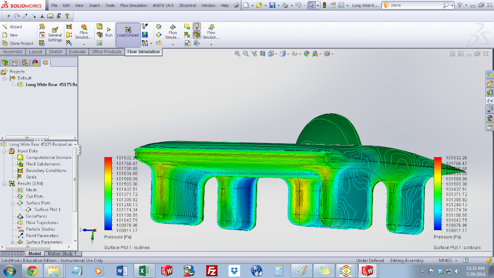

# thin-symmetrical-5th-fairing

## SSCP - Thin Symmetrical 5th Fairing

## Thin Symmetrical 5th Fairing

Symmetrical Car Models

Key:

Long 4.5m, Med 4m, Short 3.5m

Wide is 1.75m, Narrow is 1.5m

Front refers to a front-biased bubble at 1/3 length from the front, rear refers to a rear-biased bubble at 1/2 length from the front.&#x20;

These cars use the NACA-64A-006 airfoil, as used by the assymetrical catamarans also modeled.

&#x20;

Read Me on Creating Symetrical Car Models:

We used a standard "generic" bubble modeled after the bubble used on the catamaran concept cars and mated these to symmetrical car bodies.&#x20;

Model: Long Wide Front&#x20;

Drag: 55.34 N

#### Embedded Content

Embedded content: [Custom embed](thin-symmetrical-5th-fairing.md)

Model: Long Wide Rear

Description: 4.5m long, 1.75 wide, bubble rear-biased at 1/2 from front

Drag: 54.7 N

#### Embedded Content

Embedded content: [Custom embed](thin-symmetrical-5th-fairing.md)

Here's the above long wide rear model re-sized and optimized, New width is 1.75m,&#x20;

Model: Long Wide Rear Resized and Optimized

Drag: 56.43 N

New width is 1.8m and length is 4.5m as before.&#x20;

#### Embedded Content

Embedded content: [Custom embed](thin-symmetrical-5th-fairing.md)

Model: Long Narrow Front 45150

Description: 4.5m long, 1.5m wide, front-biased bubble at 1/3 length from front.&#x20;

Drag: 55.39 N

Iteration: 273

#### Embedded Content

Embedded content: [Custom embed](thin-symmetrical-5th-fairing.md)

Model: Long Narrow Rear 45150

Description: 4.5m long, 1.5m wide, rear-biased bubble at 1/2 length from front.&#x20;

Drag: 58.06 N

Iteration: 273

#### Embedded Content

Embedded content: [Custom embed](thin-symmetrical-5th-fairing.md)

Model: Medium Wide Front 40175

Drag: 77.88 N

#### Embedded Content

Embedded content: [Custom embed](thin-symmetrical-5th-fairing.md)

Model: Medium Wide Rear 40175

Drag: 86.23 N

#### Embedded Content

Embedded content: [Custom embed](thin-symmetrical-5th-fairing.md)

Model: Medium Narrow Front 40150

Drag: 80.07 N

#### Embedded Content

Embedded content: [Custom embed](thin-symmetrical-5th-fairing.md)

Model: Medium Narrow Rear

Drag: 74.52 N

#### Embedded Content

Embedded content: [Custom embed](thin-symmetrical-5th-fairing.md)

Model: Short Wide Front

Drag: 51.31 N

#### Embedded Content

Embedded content: [Custom embed](thin-symmetrical-5th-fairing.md)

Model: Short Narrow Front

Drag: 50.45 N

#### Embedded Content

Embedded content: [Custom embed](thin-symmetrical-5th-fairing.md)

Short Wide Rear and Short Narrow Rear do not fit bubbles very well and are not shown here.
