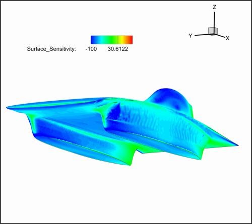
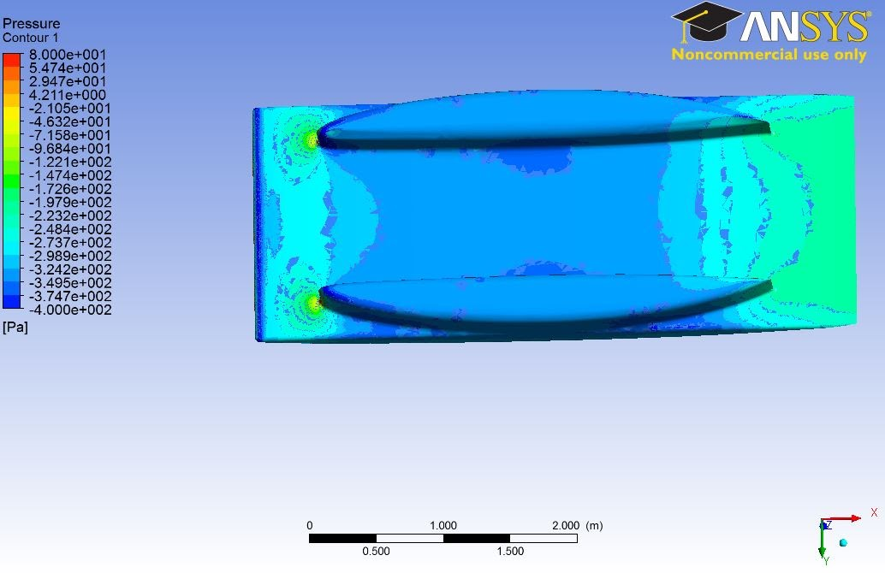
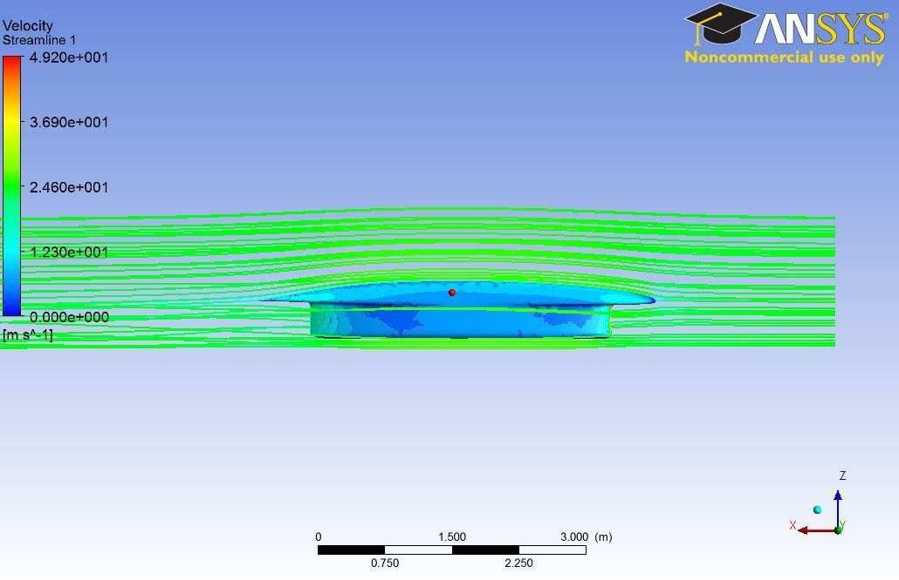

# SSCP - Sunwhale Iterations

# Sunwhale Iterations

This page is used for tracking Sunbad designs and results. Each record on this page should note the following:

* Unique nameLocation of CAD files, meshesCFD result locationsCFD summarized results AND software used for calculating them.
* Unique name
* Location of CAD files, meshes
* CFD result locations
* CFD summarized results AND software used for calculating them.

* Unique name
* Location of CAD files, meshes
* CFD result locations
* CFD summarized results AND software used for calculating them.

Unique name

Location of CAD files, meshes

CFD result locations

CFD summarized results AND software used for calculating them.

Drag breakdown by surface (for later cars only) as well as wetted area / drag correlation can be found attached at the bottom of the page.

Sunwhale-047

Based on Sunwhale 40: "47 manually addresses the issues that you had mentioned about 45 - half the max deformation overall, deformation persisting for longer, and an attempt to smooth out the low pressure bump near the tail of the fairings. It inadvertently turned out 46 was very similar to 45 ( by my cad oversight ) so 47 has significant cad changes."

Results:

        Lift = 32.75

        Drag = 36.1

        Side Force = ??

Sunwhale-046

Based on Sunwhale 40: "46 has about half the maximum Z deflection as 45 but it persists for longer down the car. I think the deflection should actually continue a bit further down the underbody to be able to reach the tail area of the fairings (and keep the constant cross section idea), but we wanted to get a quick model running to see if we're taking a step in the right direction. It will just take some more time and complexity to expand the blue cutout more towards the rear of the car "

"Sunwhale-046 was an attempt to manually do what Tom suggested (reduce deformation to eliminate induced drag from high lift), but I didn't constrain the bottom as much as I thought I did so there was about equivalent deformation as Sunwhale-045."

Results:

        Lift = 36.6

        Drag = 35.8

        Side Force = ??

Sunwhale-045

Based on Sunwhale 40: "Here are the problems we think we fixed: The blue guidelines show the kinks in the deformation cross sections that were causing lumps in the CAD. We deleted the surface near the kink and re patched it with a more curvature happy surface." 

"Sunwhale-045 was created to smooth out the kinks at the edges of the deformation box on the underbelly. These kinks exist in the cross sections exported from adjoint small deformation 040, but we knew that they are not optimal so Anna did a nice smoothing out of the junctions at the edges of the deformation box. Sunwhale 045 resulted in 35.6N drag and 41.5N lift"

Results:

        Lift = 41.5

        Drag = 35.6

        Side Force = ??

Sunwhale-044

Based on Sunwhale 40: "The deformations basically exactly match the CAD thanks to the exported curves from Tom, so this is as good as we can get for matching mesh deformation to CAD. The match is really good so any differences in drag that we get now between the mesh deformation and this next meshed sunwhale 44 would be unexplained." 

"044 seems to be converging now after some tweaks to the config file. However, I had to turn the CFL number down, so it’s going to take extra time to converge. I just stopped it at 3k iterations and restarted it for an extra 7k (I think 10k total should be enough)."

Results:

Lift = 40N lift (with Tom's revised mesh)

Drag = 35.85N

          Side Force = ??

Sunwhale-043

Based on Sunwhale 40: 

Results:

Lift = 40.47 N

Drag = 35.76 N

          Side Force = ??

Sunwhale-042

Based on Sunwhale 40: 

Results:

Lift = 49N

Drag = 35.9 N

          Side Force = ??

Sunwhale-041

Based on Sunwhale 40: Revision of Sunwhale-038, with flat underbelly again so that we can compute mesh deformation for our final aero iteration.

Surfacing improvements:

- constant radius fillet along bottom of fairing (2cm). Still couldn't get variable radius to work, but this time whole fairing bottom has fillet, unlike previous cars. Front of fairing still has rounded nose, same as before.

- kept the swept up rear fairing bottom (1.5" clearance) described on Sunwhale-038

- continued curvature improvements to fairings, esp. at front

Results:

Lift = -0.44 N

Drag = 36.07 N

Side Force = -3.25 N

Sunwhale-040

Revision of Sunwhale-038, with flat underbelly again so that we can compute mesh deformation for our final aero iteration.

Surfacing improvements:

- constant radius fillet along bottom of fairing (2cm). Still couldn't get variable radius to work, but this time whole fairing bottom has fillet, unlike previous cars. Front of fairing still has rounded nose, same as before.

- kept the swept up rear fairing bottom (1.5" clearance) described on Sunwhale-038

- continued curvature improvements to fairings, esp. at front

Results:

Lift = -0.44 N

Drag = 36.07 N

Side Force = -3.25 N

Sunwhale-039

Revision of Sunwhale-037, removing the swept bottom cut at the front of the fairings (because of wheel cutout air intake concern) at both front and rear. Fairings are back to completely flat bottom (with rounded front corner like always)

Additional surfacing improvements (same on -038):

- improved curvature on some of the rear fairing outside surfaces (seems to have successfully addressed what appeared in CFD there on Sunwhale-036)

- improved curvature on rear the rear triangular last section of bubble

Results:

36.3N drag

+65.785 N lift

-3.71 N sideforce

Overall a little less good than Sunwhale-038. Fortunately we guessed right when starting Sunwhale-040, and that one is a revision of -038 (keeping the fairing tilt up at rear).

Sunwhale-038

Revision of Sunwhale-037, removing the swept bottom cut at the front of the fairings (because of wheel cutout air intake concern).

Swept bottom cut remains at rear of fairing, with bottom trailing edge 1.5" higher than originally was on -036

Additional surfacing improvements (same on -039):

- improved curvature on some of the rear fairing outside surfaces (seems to have successfully addressed what appeared in CFD there on Sunwhale-036)

- improved curvature on rear the rear triangular last section of bubble

Results:

36.1 N drag

+60.226 N lift

-3.92N sideforce

Sunwhale-037

Applied the deformation from Sunwhale-034 to this model (knowing that this would probably overshoot; given difference in undeformed lift from -034 and -036. Method/proof of concept testing).

Fixes:

- sanity check fairing-to-body tangency at rear (manufacturing concern. seems okay.)

- fillet on bubble

- fix rear edge of bubble (see first image. not 100% perfect curvature but much better than   before)

- surface for cutting bottom of fairing, anti-beaching issue (see second image. orange line     is previous fairing flat bottom)

Not addressed:

- folds on front of fairing (see third image)

- bottom of

fairing fillet (variable radius fillet wouldn't work in SolidWorks. NHS tried this in   NX and couldn't get it either. He says he can play around with that tool more in coming     days.)

- barely imperceptible lump in front nose surface (trivial)

At final aero design review, the "beaching" whale issue was brought up (fairings bottoming out on bumps, getting car stuck). Added a swept bottom cut to the fairings.

However, then before this got meshed, realized issue of extra intake into wheel cutouts due to slanted fairing bottoms. This issue was addressed in revisions on Sunwhale-038 and -039 before we simulated -037.

Sunwhale-036

New surfaced model of the near-final car. All future cars are revisions of this CAD. Passes draft angle @ 2 degrees mostly; some areas on sides of fairing at 0.93 degrees.

Bubble fits rollcage

Results:

37.1 N drag

-8.97 N lift

3.84 N sideforce

Some strange-ness going on on one of the rear outside fairing surfaces in CFD.

Sunwhale-035

Started making changes on -034 for manufacturability / surfacing improvements (draft angle, surfacing imperfections, fairing tangency to mainfoil @ rear, etc.)

This in addition to editing the mainfoil for deformation proved to be difficult, so -035 was abandoned in favor of a new & cleaner model from the ground up.

Sunwhale-034

Sunwhale-033 with improvements to bubble

Intended to be final geometry / aero freeze.

Original 034

Lift = -20.3 N

Drag = 37.1 N

With adjoint deformation on underbelly

Deformed 034

Lift = -1.5 N

Drag = 34.5 N

Sunwhale-033

Drag: 37.4N

Lift: -31.4N

Sideforce: -3.12 N

Main foil: NACA66A-407 (thickness 7.8, camber 4.0)

- Revision of 31/32 to get closer to 0 lift; err on the side of still having downforce since this can be tuned out via mesh deformation in SU2

- Thinnest mainfoil that still accommodates suspension to reduce car profile / frontal area

Sunwhale-032

Main foil: NACA66A-508 (thickness 8.0, camber 5.5)

- Revision of Sunwhale-031 with more camber to counter the downforce seen on Sunwhale-031 (following ride height correction)

Drag: 41.76 N

Lift: 80.34 N

Sideforce: -6.19

Some strangeness at front of fairings?

Sunwhale-031

Main foil: NACA66A-308 (thickness 8.5, camber 3.5)

- moved forward with -030 style design: suspension accommodated via thicker mainfoil

- same bubble style as -029

Drag: 37.58

Lift: -76.5

Sideforce: 5.81

Forces (6CM ride height):

Force in the X direction (Drag) 37.5804 N

Force in the Y direction (SideForce) 5.8054 N

Force in the Z direction (Lift) -76.4958 N

CG Location (1.0000,1.0000,1.0000) m

Mx is 82.5334 Nm

My is -90.2199 Nm

Mz is 41.7096 Nm

Side Wind:

sunwhale-031-sidewind1

Velocity (m/s):

Vx = 24.59 Vy = 3.00 Vz = 0.00 

Force in the X direction (Drag) 35.6037 N

Force in the Y direction (SideForce) 117.5519 N

Force in the Z direction (Lift) -74.7994 N

CG Location (1.0000,1.0000,1.0000) m

Mx is 193.8207 Nm

My is -104.2137 Nm

Mz is 62.5157 Nm

sunwhale-031-sidewind2

Velocity (m/s):

Vx = 24.59 Vy = -3.00 Vz = 0.00

Force in the X direction (Drag) 35.4231 N

Force in the Y direction (SideForce) -103.5059 N

Force in the Z direction (Lift) -107.9923 N

CG Location (2.2500,0.0000,0.0000) m

Mx is -6.2629 Nm

My is -190.7039 Nm

Mz is 115.4293 Nm

sunwhale-031-sidewind3

Velocity (m/s):

Vx = 24.59 Vy = 6.00 Vz = 0.00

Force in the X direction (Drag) 26.3658 N

Force in the Y direction (SideForce) 260.2219 N

Force in the Z direction (Lift) 3.1691 N

CG Location (2.2500,0.0000,0.0000) m

Mx is -4.7303 Nm

My is -239.2289 Nm

Mz is -239.2546 Nm

sunwhale-031-sidewind4

Velocity (m/s):

Vx = 24.59 Vy = -6.00 Vz = 0.00

Force in the X direction (Drag) 25.2870 N

Force in the Y direction (SideForce) -243.6916 N

Force in the Z direction (Lift) -74.9600 N

CG Location (2.2500,0.0000,0.0000) m

Mx is -18.7817 Nm

My is -292.6187 Nm

Mz is 237.9636 Nm

sunwhale-031-sidewind5

Velocity (m/s):

Vx = 24.59 Vy = 10.00 Vz = 0.00

Force in the X direction (Drag) 0.8115 N

Force in the Y direction (SideForce) 492.9930 N

Force in the Z direction (Lift) 170.5536 N

CG Location (2.2500,0.0000,0.0000) m

Mx is -47.4401 Nm

My is -376.0031 Nm

Mz is -421.7394 Nm

sunwhale-031-sidewind6

Cd Sensitivity Plots

Changes from action item list:

* Decambered mainfoil, down to a NACA 66A 308 (camber 3.5 instead of previous 4.0)More junction between fairing & mainfoil on outside rear of fairings (as desired by sensitivity plots)Sharp fairing trailing edgesSame bubble style as Sunwhale-029
* Decambered mainfoil, down to a NACA 66A 308 (camber 3.5 instead of previous 4.0)
* More junction between fairing & mainfoil on outside rear of fairings (as desired by sensitivity plots)
* Sharp fairing trailing edges
* Same bubble style as Sunwhale-029

* Decambered mainfoil, down to a NACA 66A 308 (camber 3.5 instead of previous 4.0)
* More junction between fairing & mainfoil on outside rear of fairings (as desired by sensitivity plots)
* Sharp fairing trailing edges
* Same bubble style as Sunwhale-029

Decambered mainfoil, down to a NACA 66A 308 (camber 3.5 instead of previous 4.0)

More junction between fairing & mainfoil on outside rear of fairings (as desired by sensitivity plots)

Sharp fairing trailing edges

Same bubble style as Sunwhale-029

Additional changes:

* New fairing profiles: NACA 07 314 (instead of previous 07 316)along with cleaner sketches. NACA profile not trimmed until maximum thickness; this is the best I could come up with for addressing Action Item #5 (remove kinks between fairing NACA profile & spline). We'll see how this turns out.Sharper mainfoil front corners; defined via spline (instead of previous tangent radius)Mainfoil profile exported with 500-something points; airfoil at leading edge of car better defined by manually adding points to spline. [Did this on Sunwhale-030 as well, to address Cp plot issue.]Origin in SolidWorks is actually the 100% legit frontmost point of the airfoil. 4 u darrenFit with suspension-v8 from PDM
* New fairing profiles: NACA 07 314 (instead of previous 07 316)
* along with cleaner sketches. NACA profile not trimmed until maximum thickness; this is the best I could come up with for addressing Action Item #5 (remove kinks between fairing NACA profile & spline). We'll see how this turns out.
* Sharper mainfoil front corners; defined via spline (instead of previous tangent radius)
* Mainfoil profile exported with 500-something points; airfoil at leading edge of car better defined by manually adding points to spline. [Did this on Sunwhale-030 as well, to address Cp plot issue.]
* Origin in SolidWorks is actually the 100% legit frontmost point of the airfoil. 4 u darren
* Fit with suspension-v8 from PDM

* New fairing profiles: NACA 07 314 (instead of previous 07 316)
* along with cleaner sketches. NACA profile not trimmed until maximum thickness; this is the best I could come up with for addressing Action Item #5 (remove kinks between fairing NACA profile & spline). We'll see how this turns out.
* Sharper mainfoil front corners; defined via spline (instead of previous tangent radius)
* Mainfoil profile exported with 500-something points; airfoil at leading edge of car better defined by manually adding points to spline. [Did this on Sunwhale-030 as well, to address Cp plot issue.]
* Origin in SolidWorks is actually the 100% legit frontmost point of the airfoil. 4 u darren
* Fit with suspension-v8 from PDM

New fairing profiles: NACA 07 314 (instead of previous 07 316)

along with cleaner sketches. NACA profile not trimmed until maximum thickness; this is the best I could come up with for addressing Action Item #5 (remove kinks between fairing NACA profile & spline). We'll see how this turns out.

Sharper mainfoil front corners; defined via spline (instead of previous tangent radius)

Mainfoil profile exported with 500-something points; airfoil at leading edge of car better defined by manually adding points to spline. [Did this on Sunwhale-030 as well, to address Cp plot issue.]

Origin in SolidWorks is actually the 100% legit frontmost point of the airfoil. 4 u darren

Fit with suspension-v8 from PDM

Lacking:

* Good fillet along majority of fairing bottom edge. Front is filleted; fairings were surfaced with new approach and remaining fillet requires variable radius feature in SW

Good fillet along majority of fairing bottom edge. Front is filleted; fairings were surfaced with new approach and remaining fillet requires variable radius feature in SW

Sunwhale-030

SU2 Force (6cm ride height, but lift value was still changing *slightly* after 10k iterations):

Drag: 39.23 N

Lift: -86.84 N

Sideforce: 0.75 N

In SU (wrong ride height):

Lift: +36.9 N

Drag: 37.8 N

In Fluent (wrong ride height):

38.42 N drag

+48.85 N lift (yes, positive lift)

Main foil: NACA66A-408 (with thickness 8.5) 

- suspension (v6) accommodated via thicker mainfoil

- hack bubble stolen from -028

Sunwhale-029

(6cm ride height):

Drag: 39.5 N

Lift: -118N

Sideforce: 2.775

(wrong ride height)

Lift: -16.6N

Drag: 37.4N

Main foil: NACA66A-306 (with thickness 6.5)

- suspension (v6) accommodated via fillet to mainfoil

- "good" bubble

ALL SUNWHALE ITERATIONS BELOW HERE WERE RUN AT NON-6CM RIDE HEIGHT. Luminos is correct.

Drag may be off by a Newton or two; lift is probably way off.

Sunwhale-028

Force in the X direction (Drag) 34.6164 N 

Force in the Y direction (SideForce) -1.0116 N 

Force in the Z direction (Lift) -41.4157 N 

CG Location (1.0000,1.0000,1.0000) m 

Mx is 41.2706 Nm 

My is -32.8151 Nm 

Mz is 31.9117 Nm 

- rounder fairing bottom front edge

- slightly improved fillet to main foil owing thanks to more clearance with hardpoints

- new bubble with:

     - eliminated bubble shelf/shoulder with main foil

     - bubble has roll cage in it, although roll cage in current config won't work with regs

Sunwhale-027

Location: sftp://cars/sunwhale/aero/Sunwhale-027

Drag: 36.14 N

Lift: -52.95 N

Surface Area: 96.42m^2

Comments from Carsten (VW):

Hi Max,

 

Carsten has asked me to comment on the CFD results for your current vehicle geometry, which btw. looks very efficient and professional: Congratulations.

 

Because of the emitter positions of the streamlines there is no clear indication of longitudinal vortices at the “wing tips” at the rear of the airfoil / main body (I don’t know what you call the horizontal airfoil-shaped part of the vehicle), but from the pressure and friction plots I suspect that there is some flow around the “wing tips” downstream of the wheel fairings. I’d suggest trying to either suppress this flow by adding winglets to the rear part of the airfoil or by changing the airfoil in such a way as to reduce the pressure gradient between the upper and lower surfaces.

 

Carsten has already mentioned the driver’s canopy. I think that the geometry does not sufficiently reflect the asymmetry of the configuration. I assume that there are visibility issues at the front of the canopy, but maybe you can try to model the shape of the rear closer to what the streamlines suggest. Besides, the canopy is not really a slender body … increasing its length and thereby reducing taper angle might reduce the drag, however it would also reduce solar array area. But maybe you just give it a try and then calculate the tradeoff between drag improvement and electrical power output decrease. In any case I’d suggest tapering the canopy not only laterally but also vertically in order to reduce the “tail fin” of the canopy.

 

I am unsure about how to interpret the friction and pressure plots for the lower part of the airfoil downstream of the wheel fairings: Do you have attached flow in this area? If there is separation there, I’d pay closer attention to this issue.

 

Best regards

 

Carsten

Force in the X direction (Drag) 36.1402 N

Force in the Y direction (SideForce) -7.1618 N

Force in the Z direction (Lift) -52.9493 N

CG Location (1.0000,1.0000,1.0000) m

Mx is 46.1748 Nm

My is -12.1292 Nm

Mz is 24.5190 Nm

Sunwhale-026

Location: sftp://cars/sunwhale/aero/Sunwhale-025

Edited fairing surface issues on Sunwhale-025 -- removed dent near outer/front, added filleted bottom surface for smoother bottom edge.

Mirroring / knitting / suppressing components screwed up original bubble, so the current one is more or less a patch with a flat rear edge that shouldn't be there.

Initially blew up in CFD; able to converge results after a few days with some coaxing.

Drag: 37.5 N

Lift: -39.4 N

Sideforce: 11.0 N

(this & subsequent cars are back to Anna)

Sunwhale-025

Location: sftp://cars/sunwhale/aero/Sunwhale-025

Fairing foils are made from leading/trailing edge of NACA foil, followed by splines in between to fit everything. Fairing surfaces did not turn out well.

Sunwhale-024

Intermediate model to see if my changes to fairing foils were looking okay. Results not relevant.

Sunwhale-023

Location: doesn't exist yet. Never existed. Oops.

Sunwhale-022

Location: sftp://cars/sunwhale/aero/Sunwhale-022

Same as Sunwhale-021, but no divot under car (suspected that we don't know what we're doing by adding the divot).

Drag: 40.36

Lift: -54.39

Sideforce: 0.186

Sunwhale-021

Location: sftp://cars/sunwhale/aero/Sunwhale-021b

Main foil: NACA 65A-306

Fairing foil: NACA 16-316 (thicker to allow for better fitting of suspension/wheel volume. The fairing length is smaller, though, so the actually scaled-up thickness is comparable to other models)

Bubble foil: NACA 16-030

Drag: 38.82

Lift: -13.66

Sideforce: -1.26

Sunwhale-020

Location: sftp://cars/sunwhale/aero/Sunwhale-020

Main foil: NACA 64A-206

Fairing foil: NACA 16-312, 0.5 degree toe inward

Bubble foil: NACA 16-030

Drag: 36.5 N

Lift: -82 N

Sideforce: -6.54 N

Sunwhale-019

Location: sftp://cars/sunwhale/aero/Sunwhale-019

Using Sunwhale-014 CAD, with improved bubble

Drag: 33.183 N

Sideforce: 3.05 N

Lift: -42.02 N

SideWinds

Sunwhale-019-wind1

vy = 5 m/s

Force in the X direction (Drag) 35.0319 N

Force in the Y direction (SideForce) 8.6515 N

Force in the Z direction (Lift) -40.1904 N

Sunwhale-019-wind2

vy = -5 m/s

Force in the X direction (Drag) 35.1109 N

Force in the Y direction (SideForce) -2.0038 N

Force in the Z direction (Lift) -41.7918 N

Sunwhale-019-wind3

vy = 10 m/s

Force in the X direction (Drag) 39.4669 N

Force in the Y direction (SideForce) 9.7833 N

Force in the Z direction (Lift) -45.6641 N

Sunwhale-019-wind4

vy = -10 m/s

Force in the X direction (Drag) 39.7213 N

Force in the Y direction (SideForce) -2.4203 N

Force in the Z direction (Lift) -48.0504 N

Angle of Attack

Sunwhale-019-aoa2

AoA = 5 deg

Force in the X direction (Drag) 60.0949 N

Force in the Y direction (SideForce) 9.3305 N

Force in the Z direction (Lift) 372.2904 N

CG Location (2.2500,0.9000,0.0000) m

Mx is -335.4776 Nm

My is 409.9572 Nm

Mz is 43.5500 Nm

Sunwhale-018

Location: sftp://cars/sunwhale/aero/Sunwhale-018

Ridiculous camber under the car to see if it's a feasible way to reduce downforce on a car with symmetric fairings.

Drag: 33.725

Lift: -39.66 N

Sideforce: 3.227 N

Sunwhale-017

Location: sftp://cars/sunwhale/aero/Sunwhale-017

Using Sunwhale-016 CAD, increasing size of dimple under the car to attempt to reduce the downforce we see.

Drag: 

Lift:

Sideforce:

Sunwhale-016

Location: sftp://cars/sunwhale/aero/Sunwhale-016

Using Sunwhale-015 CAD, but adding a dimple under the car. The CAD is robust enough to allow some change in dimple shape without needing to fix up the entire model. I also chose fully symmetric airfoils for the fairings to hopefully improve our performance in crosswinds. I blended the fairing into the main body on the sides of the car by using the "side of car" curve as part of the fairing cutout trimming tool. The "side of car" curve is used in defining the main body surface and is created by projecting the 3/4 main foil onto the planform view of the car.

Drag: 41.1 N

Lift: -104.6 N

Sideforce: -5.8 N

"sunwhale-016-wind1"

vy = +3 m/s

Drag: 38.71 N

Sideforce: 103.78 N

Lift: -109.76 N

"sunwhale-016-wind2"

vy = -3 m/s

Drag: 40.03 N

Sideforce: -102.2 N

Lift: -83.41 N

"sunwhale-016-wind3"

vy = +5 m/s

Drag: 35.25 N

Sideforce: 177.41 N

Lift: -111.85 N

"sunwhale-016-wind4"

vy = -5 m/s

Drag: 37.024 N

Sideforce: -186.125 N

Lift: -57.85 N

vy = -5 m/s

"sunwhale-016-aoa4"

angle of attack = 5 deg

Force in the X direction (Drag) 60.0949 N

Force in the Y direction (SideForce) 9.3305 N

Force in the Z direction (Lift) 372.2904 N

CG Location (2.2500,0.9000,0.0000) m

Force in the Mx direction -335.4776 N

Force in the My direction 409.9572 N

Force in the Mz direction 43.5500 N

Sunwhale-015

Location: sftp://cars/sunwhale/aero/Sunwhale-015

Max's first attempt at a car. The only foil change from 014 to 015 is the fairing: I reverted back to a NACA 16 411. 

I defined the surfaces differently, especially the guide curves for the main foil. I noticed that our current technique for surfacing bubbles is not acceptable because it does not follow Dir1 curves. We may need to build them more like we build the fairings.

I tried to get a good blend on the side of the car with simply defined curves - the technique is promising but the fairing does not go all the way out to the side of the car as it should.

Sunwhale-014

Location: sftp://cars/sunwhale/aero/sunwhale-014

Design notes:

- Reverted back to the NACA 65A mainfoil that was used in Sunwhale-012 and earlier (2.5 camber, thickness 6)

The increase in camber should help with some of the downforce seen in Sunwhale-013

- Still using the same suspension model as 10/11/12/13

- Using the same driver model as 13 (Aug 28 version -- wider hip width and 29" butt-to-eye)

Surfacing:

- Leading edge surface is fixed using technique demonstrated by NHS

- Fairing blend is even wider, more taper at front of fairing foils, and better blend to side of car. Still not perfect, but definitely an improvement on 13

Bubble:

- Same construction as 13 (will be properly addressed and improved in future models)

Fairings:

- Same fairings at Sunwhale-013. Probably not cambered enough to counteract the downforce seen in 13, but with better blending into mainfoil. This is probably what we'll want to adjust in the next iteration; however, changing mostly the mainfoil without altering fairing camber between 13 & 14 allows us to see more clearly what the affect of that is.

- Airfoils referenced: 

  Canopy outline NACA 64A 022 (40% thickness instead of prev. 50%, thickness +2)

  Mainfoil NACA 65A 206 (thickness 6, CL 0.25)

  Fairings NACA 16 216 (less camber, more thickness)

Results

Fluent

Drag: 33.594041 

Sideforce: 3.6714592 

Lift: -41.858841

SU2

Drag: 34.483 N

Lift: -38.2765 N 

Tecplot Visualization

Sidewind Runs

This model was run in SU2 as an external flow-style problem (changing the walls and outlet to type MARKER_FAR, and adding a y velocity to the inlet boundary condition.

** For the results with 10 and -10 m/s I think there is something wrong with the post processing and I will be giving it a more detailed look once I get back. att. David ***

"sunwhale-014-wind0"

vy = 0 m/s (control)

Force in the X direction (Drag) 34.4690 N

Force in the Y direction (SideForce) 4.1193 N

Force in the Z direction (Lift) -38.5341 N

CG Location (1.0000,1.0000,1.0000) m

Mx is 42.5612 Nm

My is 1.8983 Nm

Mz is 36.7809 Nm

"sunwhale-014-wind1"

vy = -10 m/s (starboard to port)

Force in the X direction (Drag) -8.7269 N

Force in the Y direction (SideForce) -475.3949 N

Force in the Z direction (Lift) -11.2518 N

CG Location (1.0000,1.0000,1.0000) m

Mx is -485.2659 Nm

My is -204.5480 Nm

Mz is -320.2665 Nm

"sunwhale-014-wind2"

vy = +10 m/s (port to starboard)

Force in the X direction (Drag) -4.7400 N

Force in the Y direction (SideForce) 488.1409 N

Force in the Z direction (Lift) 161.8274 N

CG Location (1.0000,1.0000,1.0000) m

Mx is 284.3380 Nm

My is -361.9504 Nm

Mz is 316.0645 Nm

"sunwhale-014-wind3"

vy = +5 m/s (port to starboard)

Force in the X direction (Drag) 28.4738 N

Force in the Y direction (SideForce) 180.4023 N

Force in the Z direction (Lift) 14.7748 N

CG Location (1.0000,1.0000,1.0000) m

Mx is 158.8883 Nm

My is -85.3184 Nm

Mz is 100.0483 Nm

"sunwhale-014-wind4"

vy = +3 m/s (port to starboard)

Force in the X direction (Drag) 32.8216 N

Force in the Y direction (SideForce) 96.5584 N

Force in the Z direction (Lift) -11.8140 N

CG Location (1.0000,1.0000,1.0000) m

Mx is 105.7821 Nm

My is -35.1937 Nm

Mz is 54.9675 Nm

"sunwhale-014-wind5"

vy = -3 m/s (port to starboard)

Force in the X direction (Drag) 32.2978 N

Force in the Y direction (SideForce) -88.0421 N

Force in the Z direction (Lift) -49.6525 N

CG Location (1.0000,1.0000,1.0000) m

Mx is -41.1863 Nm

My is -8.1357 Nm

Mz is 15.4073 Nm

"sunwhale-014-wind6"

vy = -5 m/s (port to starboard)

Force in the X direction (Drag) 27.4550 N

Force in the Y direction (SideForce) -170.5013 N

Force in the Z direction (Lift) -50.4083 N

CG Location (1.0000,1.0000,1.0000) m

Mx is -129.0955 Nm

My is -38.5849 Nm

Mz is -36.4490 Nm

Sunwhale-013

Location: sftp://cars/sunwhale/aero/sunwhale-013

Sunwhale-013-shellonly is the SW part file without the driver model and misc. entities

Sunwhale-013.IGS is the IGS'd version of shellonly

^ These are both on FTP, created mostly for ease of meshing.

Sunwhale-013.SLDPRT is what's referenced in the full assembly, complete w/ driver model

Sunwhale-013-fullassembly is the full assembly (surprise surprise) w/ driver model and suspension geometries 

^ These are both on PDM as well as FTP

Design notes:

- NACA66A main foil (moving thickness back to 60%), to make more room for suspension

- Still using the same suspension model as in 10/11/12

- Using new driver model with set hip width (slightly wider than before) and 29" butt-to-eye height (as measured on Anna, slightly taller than before). 

- The idea with this one was to do a better blend of fairings to main body, using the Luminos fairing blend techniques that Greg helped enlighten in on Saturday. Debatable success. More swoop but also more surface derp. Changed fairing foil to a less cambered version, leaving more room for wheel volume at lock in front. Also spliced foils to construct the horizontal cross sections (left front & rear intact, but added curvature continuous spline in middle to extend foil to needed length).

- Leading edge has some strangeness. NHS imparted some surfacing-singularities-and-car-noses knowledge on Saturday that we will be incorporating in future models.

- Bubble is same construction as 11/12, but with a larger top down cutout and less height. This was to make curvature more gradual, as we saw likely separation on the previous one. Again, this will be properly addressed and improved in future models.

- Airfoils referenced: 

  Canopy outline NACA 64A 022 (40% thickness instead of prev. 50%, thickness +2)

  Mainfoil NACA 66A 206 (thickness 6.5, CL 0.2)

  Fairings NACA 16 216 (less camber, more thickness)

Results:

SU2 (run by Dr. Tom) 

Fluent (run by Max - ground and walls as symmetry planes. SST turbulence)

Drag = 34.9 N

Lift = -75.4 N

Sideforce = 3.5 N

Drag = 34.9 N

Lift = -82.82 N

Sideforce = 3.06 N

DOWNFORCE: Neat! Aside from some of the surfacing imperfections, there are two notable changes from Sunwhale-012 that could explain the downforce --

- To counter the positive lift we saw on 012, I reduced the camber of the mainfoil from 0.25 to 0.2, in addition to moving the thickness back to 60% for suspension room (now a NACA 66A, previously a NACA 65A).

- In reshaping the fairings, I selected a new profile using a NACA 16 216, reducing the fairing camber and increasing thickness (previously a NACA 16 411). This was both for a better fairing-to-body blend as well as to accommodate wheel volumes within a reasonable length. 

Sunwhale-012

Location: sftp://cars/sunwhale/aero/sunwhale-012

Solver: SU2

Drag = 33.4 N

Lift = 6.8 N

Side force = 3.2 N

Design notes: 

- Same as Sunwhale-011, but with less junction between the fairing side / outside of car. Fairings in the same location, but junction with body of car moved out. Basically just a slightly smoother blend, that's about it.

Potential issues: Rachel thinks strange geometry at the leading edge is causing some strange low pressure at the leading edge that Tom pointed out

Sunwhale-011

Location: sftp://cars/sunwhale/aero/Sunwhale-011

Solver: Fluent

Drag: 34.118063 

Lateral: 2.5218274 

Lift: 10.979681

Solver: SU2

Drag = 34.15 N

Side Force = 3.15 N

Lift = 4.11 N

Design notes:

- Fixed issues in Sunwhale-010

        Body was cut in half and mirrored sans-bubble to produce symmetrical fairings without 

        surface gap problems. 

        Bubble then re-drawn (although keeping 65A-020 foil cutout) with a simpler surface to 

        make it ready for meshing in a timely manner.

Meshing:

- Done by Rachel in Pointwise

CFD:

- Run by Max in Fluent, Tom in SU2

Sunwhale-010

Location: sftp://cars/sunwhale/aero/Sunwhale-010

Design notes:

- First surfaced car, entering preliminary design. 

- Also Anna's practice model while learning how to surface. Hence much sub-optimal.

- Mainfoil: NACA 65A-206 (camber/CL 0.25, thickness 6)

- Symmetrical full-length fairings, based on NACA 16-411

- Canopy outline: 65A-020

- Fitted with Aug19 driver model & suspension, fairing bottoms are 7cm from ground

- Lots of singularities/irregularities/un-knittable gaps. :(

Some mirroring issues for non-driver fairing, plus surface derping on canopy. Did not patch/mesh, and instead became...

Luminos (as meshed by Tom & David)

Location: sftp://cars/sunwhale/aero/luminos_benchmarking

Solver: Fluent

Forces (on car): 40.6N drag, 0.14N lateral, 37.6N downforce

Forces (on car, ground as symmetry BC): 40.24 N drag -0.12 lateral, 39.42 N downforce

Sidewind Runs

Model was run in SU2 using MARKER_FAR for the walls, inlet, and outlet. The side winds are added as a velocity component in the y-direction while keeping cruise speed on the x-direction.

Luminos wind1

vy = 5 m/s

Drag: 44.66 N

Sideforce: 97.42 N

Lift: 28.76 N

Luminos wind2

vy = 10 m/s

Drag: 45.57 N

Sideforce: 177.34 N

Lift: 122.21 N

Sunwhale-002

Location: sftp://cars/sunwhale/aero/sunwhale-002

Solver: Fluent

Forces (on car): 38.2N drag, 7.3N lateral, 91.7N downforce

Sunwhale-006

Location: sftp://cars/sunwhale/aero/sunwhale-006

Solver: Fluent

Forces (on car): 34.9N drag, -1.77N lateral, 8.06N lift

Sunwhale-007

Location: sftp://cars/sunwhale/aero/sunwhale-007

Solver: Fluent

Forces (on car): 34.5N drag, 1.2N lateral, 62.4N lift

Sunwhale-007-helmet-baby-rachel

Location: sftp://cars/sunwhale/aero/sunwhale-007-NACA64A306-fairing338-fcamber6-patched

Solver: Fluent

Forces (on car): 33.5N drag, 0.04N lateral, 67.7N lift

### Embedded Content

Embedded content: [Embedded Content]()

<iframe width="100%" height="400" src="" frameborder="0"></iframe>

For Future Improvement

1. Look very closely at suspension design. Read the suspension-aero interaction email thread below. Suspension was a limiting factor for Arctan's aerodynamic design. 

Look very closely at suspension design. Read the suspension-aero interaction email thread below. Suspension was a limiting factor for Arctan's aerodynamic design. 

### Embedded Google Drive File

Google Drive File: [Embedded Content](https://drive.google.com/embeddedfolderview?id=1yuYsJSr4J2BrxExV4Zl8EmWRhQ0qXXDl#list)

<iframe width="100%" height="400" src="https://drive.google.com/embeddedfolderview?id=1yuYsJSr4J2BrxExV4Zl8EmWRhQ0qXXDl#list" frameborder="0"></iframe>

