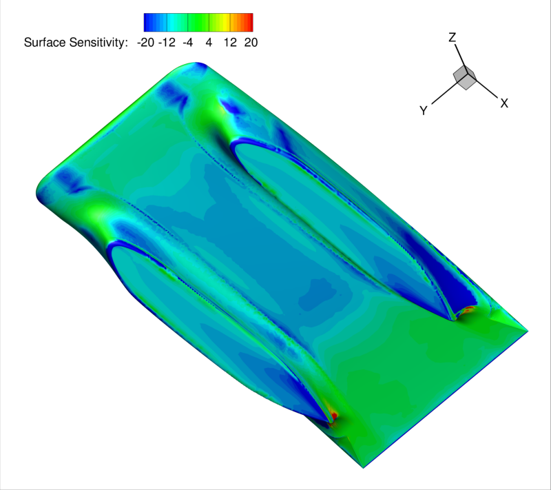

# sunwhale-sensitivity-and-adjoint-analysis

## SSCP - Sunwhale Sensitivity and Adjoint Analysis

## Sunwhale Sensitivity and Adjoint Analysis

Tom's analyses show the drag sensitivities for the surfaced car bodies of a select few iterations. Blue denotes a region where the highlighted surface should be pushed inward (in at the local normal) to reduce drag, while red identifies regions that should be pulled out.&#x20;

Sunwhale-28

Sunwhale-30

Sunwhale-28
