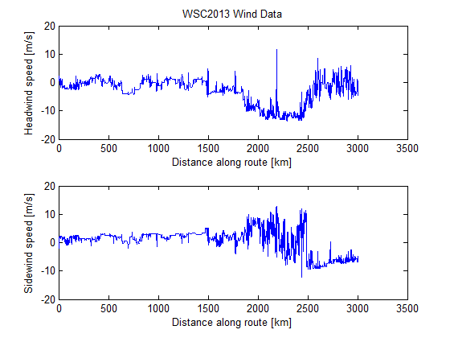
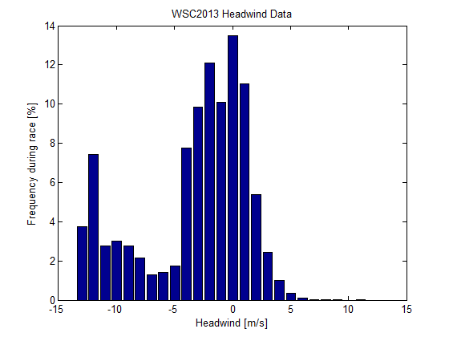
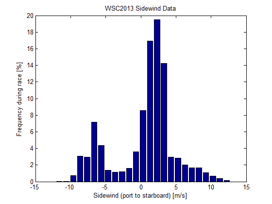
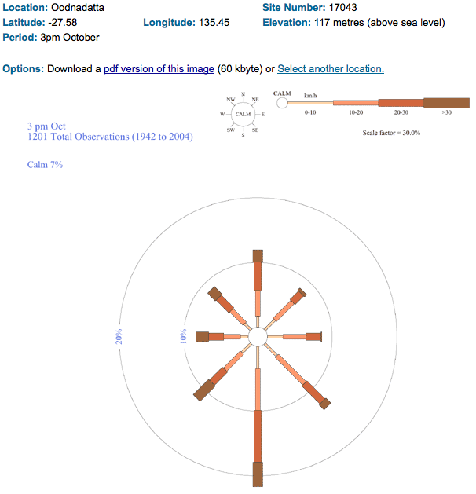
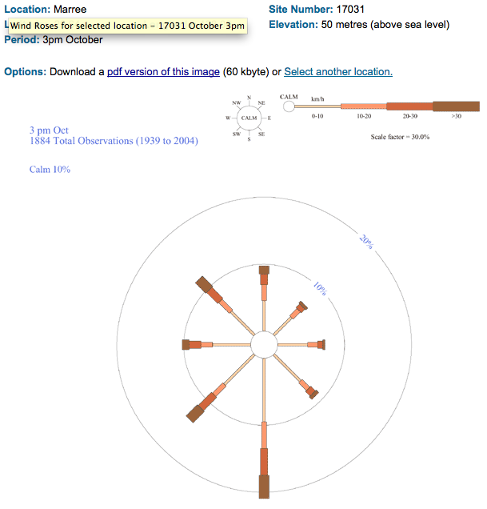

# SSCP - Wind Analysis

# Wind Analysis

I analyzed wind from WSC2013 using the NOAA and Weatherzone data from strategy during the race. The "windAnalysisWSC2013_data.mat" file was compiled using the .tar.gz weather files files, "getInsolationAndWind.m", and excerpts of "runRoute.m" - all from the sunbad strategy folder.

Headwind and sidewind are computed by comparing the difference of the "az" angle (the car's bearing, found from latitude and longitude of the route) and the wind direction from the weather data. Note that the wind data are averages over regions and possibly multiple hours.

An alternate approach to wind analysis uses historical weather data from sites like Weather Underground at weather stations throughout Australia - however, these locations are not necessarily representative of the regions over which we drove - a town like Alice Springs is in a valley. I don't feel that examing WSC2013 data is more relevant than a thorough history, but I do believe that our NOAA/WZ data were accurate and accurately represent the weather from WSC2013. It's also worth noting that we have reports and recollections of gusts above 100kph near Coober Pedy - so some margin should be placed on these numbers.

Data and plotting scripts are found in svn://sunwhale/analysis/windWSC2013.

-Max

--

Here are some wind speed/direction plots from the Australia Bureau of Metrology. They're averages for October, at about the 2000 and 2500 mile marks (very approximate), respectively. Rose direction means the frequency of winds blowing from that direction — so winds from the southwest seem to be most common for both locations.

http://www.bom.gov.au/climate/averages/wind/selection_map.shtml

[http://www.bom.gov.au/climate/averages/wind/selection_map.shtml](http://www.bom.gov.au/climate/averages/wind/selection_map.shtml)

