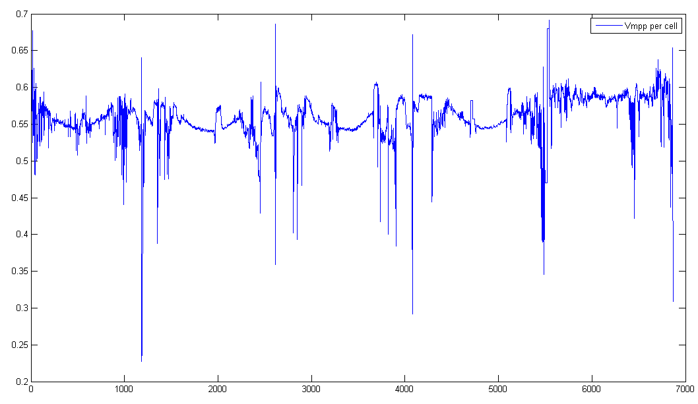
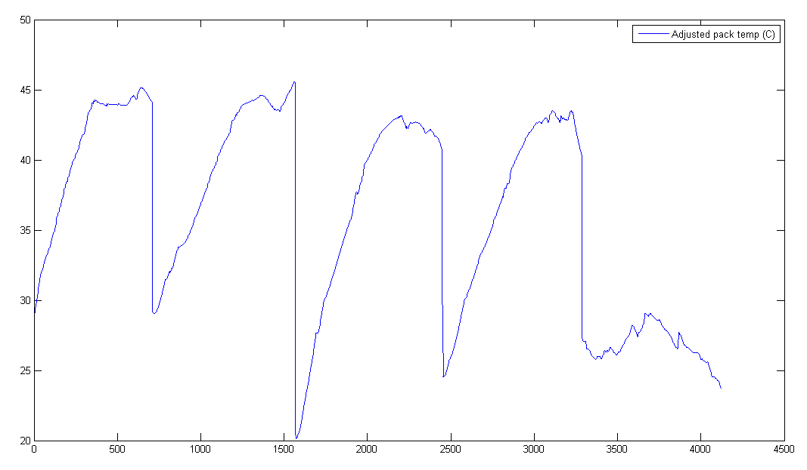

# array-cooling

## SSCP - Array Cooling

## Array Cooling

The premise behind this is that solar cell efficiency is related to temperature. Basically, cell gets hotter -> max. power point voltage decreases (but current remains relatively unchanged) -> P = IV decreases -> efficiency goes down.

See http://www.pveducation.org/pvcdrom/solar-cell-operation/effect-of-temperature for a more detailed explanation of the physics behind this phenomenon. Tl;dr: pretty much all types of solar cells get worse as temperature goes up, but the magnitude of the effect depends on the specific material and cell quality.

[http://www.pveducation.org/pvcdrom/solar-cell-operation/effect-of-temperature](http://www.pveducation.org/pvcdrom/solar-cell-operation/effect-of-temperature)

Which leads to this&#x20;

Array cooling investigation

for the 2014-2015 cycle.

Members: Charlie, Alex, Dale

8/30/14 - From Matthew

In mid August, we met with professor Ihme to discuss different methods of array cooling. Two cooling methods that he brought up were heat pipes, and bernoulli's principle. He showed us an old CPU he had on his desk that was cooled via heat tubes, we discussed them, and realized that they wold be a great way to cool solar cells, but most likely would take up too much space, add too much weight, and be too labor-intensive to implement into our car.

The second idea he had was related to some of the new cycling aero helmets such as the Giro Selector (http://www.giro.com/us\_en/products/men/helmets/aero-tri/selector.html). It uses a small inlet at the front of the helmet to prevent the area between your head and the helmet shell from becoming a vacuum. The outlet holes at the rear use bernoulli's principle to move air out the back of the helmet, thus creating a flow of cooling are between the rider's head and the helmet. Professor Ihme thought that if we could have some sort of inlet at the front of the car (even at the front sides of the car by the headlights), and then put outlet holes wherever we wanted airflow (between the solar cells at various points), we could utilize bernoulli's principle to get airflow through the back of the solar cells.

The only issue with this design, is that we would need a thin layer of air behind the cells. Currently, behind the cells, there is a large area (the entire inside of the car body). In order to utilize bernoulli's principle, we would need to create an inner layer of the top shell, thus creating a channel through which air can flow between a carbon layer and the cells. This would probably prove to be a design and manufacturing nightmare, but it is definitely worth looking into, and looking into how much it effects aero. I am currently trying to contact Giro engineers (Santa Cruz) to see if they can tell us a bit about the aero gains/losses they saw by using this type of helmet design in the Selector. Hopefully they will talk to us.

\--

8/12/14 - From Dale

After searching endlessly for relevant equations, I've done some rough calculations on the feasibility of a pumped water cooling system using a CPU water cooling pump (this one requires 18W, though other options are available).

[CPU water cooling pump](http://www.frozencpu.com/products/11740/ex-pmp-109/Swiftech_MCP35X_12v_PWM_Controlled_Water_Pump_-_Black.html?tl=g30c107s153\&id=qfjpRRvK)

A primary issue here is that these pumps aren't built for long pipe systems: this one can only support about 6' of 1/4" copper pipe, at a speed of 9.5 m/s. This gives us a convective heat transfer coefficient of 767 W/m^2\*K, through approx. .05 m^2 of piping through the piping. For a temperature difference of 10 Celsius between the cells and ambient (about what Charlie's results indicated), this means we could lift 384 W of heat. The piping would presumably connect to waterblocks or some sort of heat strapping that goes to the cells.

I'm not quite sure how to convert this number into a temperature drop, but this is about half of the amount of solar energy that gets turned into heat on one square meter (77% of 1 kW/m^2). Even if this translates into a 50% drop in the delta T (5 Celsius above ambient), this would only give us a .33% increase in power over whatever cells are linked to the piping. As far as I can tell, there's no way to cover enough cells with 6' of piping to recoup the 18W used to power the pump.

\--

7/15/14 - From Charlie

Plots of estimated array temperature and subsequent power losses during WSC 2013. A couple of things to note:

* Assume that insolation doesn't affect MPP voltage (fair)
* Temperature dependence is linera, with slope -0.0018 V / °C
* There is no direct measure of ambient temperature, so I just took the battery pack temperature profile and transformed it parabolically to fit a reasonable temperature range throughout the race (low \~15°C, high \~35°C, a la http://www.weatherzone.com.au/climate/station.jsp?lt=site\&lc=15540 October data). It seems to produce more or less believable results, good for a first pass.
* Matlab code that produced this data can be found under SVN sunwhale/analysis/array\_cooling
* Mean power losses throughout the race = \~27W from cell temperatures above ambient.
* Power losses are 35W if you only count race days 1-4 (x-values up to 3000 in the plot below)
* Delta P = Power losses from high cell temperatures relative to ambient.

Cell voltages @ MPP (per cell, averaged over the entire array):

Ambient temperature profile constructed from battery pack temperature, scaled to fit a reasonable temperature range for the Australian outback.

7/14/14 - From Alex

I found some literature on the problem. I attached the document in files.

Also, these patents may be of interest http://www.google.com/patents/US4361717 and http://www.google.com/patents/US8283555.&#x20;

7/13/14 - Email from Max:&#x20;

There is a lot of guessing about solar cell temperatures and cooling while driving, and although we didn't ever directly measure junction temperature, I think we can figure it out by looking at the cell voltage at maximum power point and comparing it to the datasheet. Also, if you look at the data from any day at WSC, the power drops when we stop driving at a control stop, so we could figure out how much the cells are cooled on Luminos by driving (see power plot below).

The first step should be data analysis to see if we are even chasing the right problem. Knowing the cell temperatures while stopped and driving could show that we already are cooling the cells as much as possible.

7/13/14 - Charlie is going to work on the initial data analysis outlined by Max above, "to see if we are even chasing the right problem." Stay tuned for updates.

#### Embedded Google Drive File

Google Drive File: [Embedded Content](https://drive.google.com/embeddedfolderview?id=1-83nN1M4Kt3DBkl4FSrCuFQU8CI5sLnm#list)
