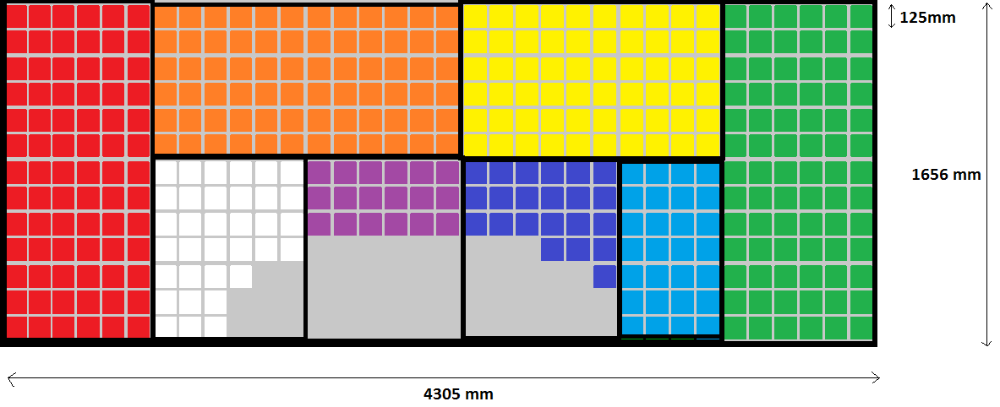
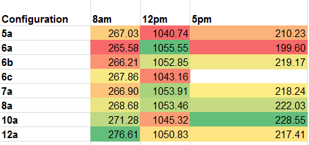

# array-layout-2014-2015

## SSCP - Array Layout 2014-2015

## Array Layout 2014-2015

Max (4-24-15)

I am proposing the below cell stringing scheme. This is scheme "8A" - Shellpower analysis of this design can be found in Sunwhale SVN/analysis/shellpower\_analysis/sunwhale-040. I evaluated a number of different stringing methods which are summarized in the&#x20;

"string powers.xlsx" spreadsheet. This spreadsheet creates a trapezoidal insolation profile that interpolates between 8am, 12pm, and 5pm Shellpower outputs. Stringing configurations are compared on the basis of energy throughout the day, not peak power. Note that array output power is string power (from Shellpower) convolved through MPPT efficiency, taken from Sam Lenius' Photon datasheet.

Configuration 8A does not produce the most power at any time of day, but it yields the best overall energy delivery. Note that the largest strings just barely become shaded (from the bubble) in any orientation. Bubble shading is also the reason for the higher granularity of solar strings around the bubble.

Next team, take note! It is worth doing this analysis. The difference in output power varies quite a bit between equally reasonable looking configurations. The difference in power outputs is a non-negligible fraction of the car's power produced or consumed.

:

Matt

This is what I have so far. I won't be around this weekend, but I have put together this jpeg for you guys. I measured it all out on solid works, but removed the annotations so that it wasn't super cluttered. But for reference, here are the sizes.

4x5 is 505mm x 631mm

2x4 is 253mm x 505mm

4x4 is 505mm x 505mm

1x4 is 127mm x 505mm

1x1 is 127mm x 127mm

5-cell L is 505mm x 253mm (at wide end), 127mm (at narrow end)

These dimensions are assuming 1mm spacing between cells (which is what we had on Luminos). I was also assuming 1mm at the edge of each module. This is less than luminos, but am confident we can trim the modules after encapsulation and get this 1mm border. I also accounted for 3mm between each of the modules. the flatter the aerobody, we can make this 3mm gap less because we can fit modules together better.

This layout has 393 cells, and we only need 391. That gives us 2 cell wiggle room, which is probably a bit too little. If possible, it would be awesome if the bubble could be a bit smaller. Or just have the flat-ish surface on the sides of the car extend as far as possible. by that, I mean the fillet (lacking better term) on the left and right sides of the car be as little as possible. If that is done, we may be able to fit another row of cells along the length of the car.

Hope this helps. I don't yet know how to conform a flat image to a curved surface on solidworks. Any advice?

Pengchuan Wang

Yeah for sure. Please see the attachment for my results. The powerpoint summarizes the result, please also look at the solidworks file I created with the sketch embossed on the body.

SW file now on PDM as "Sunwhale\_Solar panel estimate.sldprt"

Max

I removed the sldprt file from here and put it on pdm.

I'm working on fitting array modules onto the sunwhale-013 shell including the wsc sticker

#### Embedded Google Drive File

Google Drive File: [Embedded Content](https://drive.google.com/embeddedfolderview?id=105lpM4t3UHIqjoYjYFywH-Fc2yXmxbGl#list)
