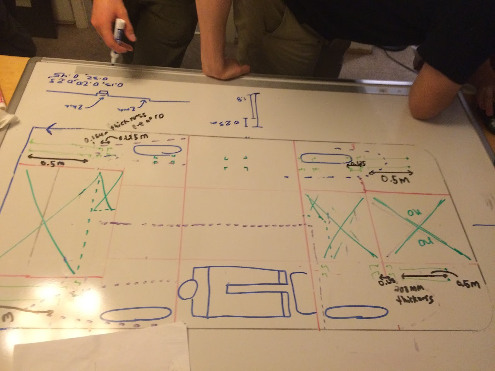
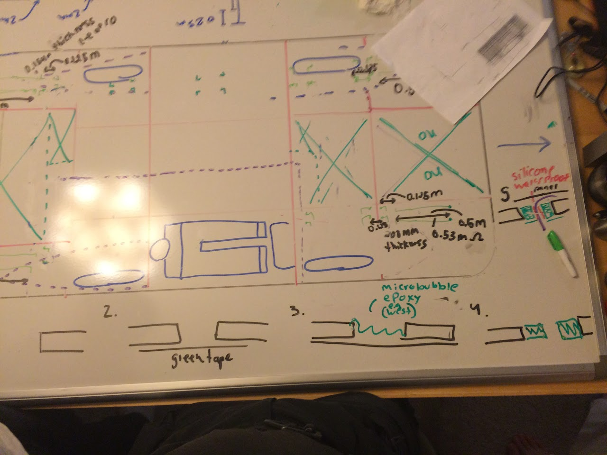

# SSCP - Array Wiring

# Array Wiring

8/18/15 Added layout (which module is in which string) and which string leads to which MPPT (see attachment). Note: Modules are numbered in this doc according to where they are on the car, not which array modules we used for each one. 

### Embedded Content

Embedded content: [Custom embed]()

<iframe width="100%" height="400" src="" frameborder="0"></iframe>

Note: On the trackers, the higher number string is closer to the HV cabling.

Looking at the car from the door side, left to right MPPT Serial Numbers are 6,5,3,4.

Current plan as of 12/7/14, looked at by:

Darren

NHS

Harry

Key for below diagram:

Red: Chassis Panels

Purple: Planned door outline

Large Green X: area inaccessible for soldering when chassis is glued. 

Small green dots: array drop-in locations for potentially tricky areas (AKA everywhere that's not the door)

Green line: run with Laminax wiring in top channel. 

Green L: Drop through outer shell underneath, for immediate soldering to board. 

## Procedure for dropping tab through top of car:

Steps:

1: Mill (with router) large hole in carbon.

2: Green-tape over bottom of hole

3: Fill hole with micro-bubble epoxy (typically west), cleaning off top for flush finish.

4: Router with 1/2" carbide bur in plunge mode to route hole in epoxy (NOT carbon).

5: Run flat tab wire through newly routed hole, then silicone around it for water tightness. 

Special note: The wire should remain kapton-insulated on both sides *until* it has been brought through the shell. Only after the wire is secured should the insulation be peeled back as necessary to allow soldering to board. 

### Embedded Google Drive File

Google Drive File: [Embedded Content](https://drive.google.com/embeddedfolderview?id=1Ms0yb0x-ri4Evw2T6TlPNokwq29sHndU#list)

<iframe width="100%" height="400" src="https://drive.google.com/embeddedfolderview?id=1Ms0yb0x-ri4Evw2T6TlPNokwq29sHndU#list" frameborder="0"></iframe>

