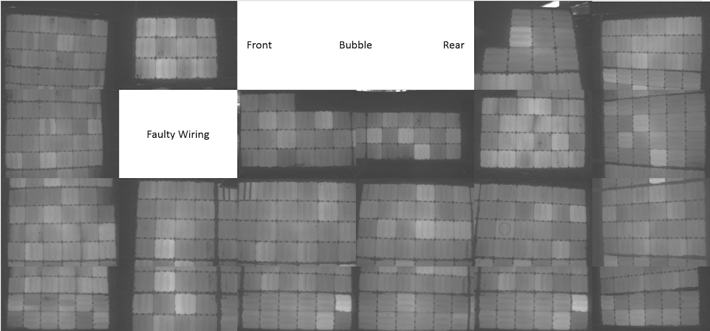

# SSCP - On-car Array Testing (EL)

# On-car Array Testing (EL)

Update 8/23/15: Added Module 6 (previously left out due to wiring); it's the one with two black rectangles near it because I couldn't get the borders to fit. The important cells there are the 4x4 near the bottom of the picture as you see it in the ppt slide. 

From Email sent on 8/11/15

Hello,

Yesterday we did a full EL sweep of the array. Thanks to John and Susan for taking the pictures. A screenshot is below but the attached PPT is zoomable and shows much more detail. Here's the summary:

* The worst cell has dead fingers. This is the worst sanded through cell and may warrant the module getting replaced. You can see it at the bottom right corner of the faulty wiring module.Faulty wiring module is module #6 where either the module is dead or the wiring is wrong (more likely)Sanding has damaged perimeter of cells. Sanded edges have black wavy borders, some worse than others. Circular marks are from suction cups in Sunpower manufacturing lab.Door has some spiderweb cracks from the early days of door binding.Several cells have small cracks that are visible when you zoom in. It is our understanding that small cracks are not too bad for performance as long as the fingers underneath are not cracked.We are getting rock hits on the front. This is a real warning against testing too much. As long as we are testing with discrete objectives it is a cost we are going to have to pay, but being that this is a solar car the cycle life of components is not stellar and we will have to pay slightly for every mile on the road. 
* The worst cell has dead fingers. This is the worst sanded through cell and may warrant the module getting replaced. You can see it at the bottom right corner of the faulty wiring module.
* Faulty wiring module is module #6 where either the module is dead or the wiring is wrong (more likely)
* Sanding has damaged perimeter of cells. Sanded edges have black wavy borders, some worse than others. 
* Circular marks are from suction cups in Sunpower manufacturing lab.
* Door has some spiderweb cracks from the early days of door binding.
* Several cells have small cracks that are visible when you zoom in. It is our understanding that small cracks are not too bad for performance as long as the fingers underneath are not cracked.
* We are getting rock hits on the front. This is a real warning against testing too much. As long as we are testing with discrete objectives it is a cost we are going to have to pay, but being that this is a solar car the cycle life of components is not stellar and we will have to pay slightly for every mile on the road. 

* The worst cell has dead fingers. This is the worst sanded through cell and may warrant the module getting replaced. You can see it at the bottom right corner of the faulty wiring module.
* Faulty wiring module is module #6 where either the module is dead or the wiring is wrong (more likely)
* Sanding has damaged perimeter of cells. Sanded edges have black wavy borders, some worse than others. 
* Circular marks are from suction cups in Sunpower manufacturing lab.
* Door has some spiderweb cracks from the early days of door binding.
* Several cells have small cracks that are visible when you zoom in. It is our understanding that small cracks are not too bad for performance as long as the fingers underneath are not cracked.
* We are getting rock hits on the front. This is a real warning against testing too much. As long as we are testing with discrete objectives it is a cost we are going to have to pay, but being that this is a solar car the cycle life of components is not stellar and we will have to pay slightly for every mile on the road. 

The worst cell has dead fingers. This is the worst sanded through cell and may warrant the module getting replaced. You can see it at the bottom right corner of the faulty wiring module.

Faulty wiring module is module #6 where either the module is dead or the wiring is wrong (more likely)

Sanding has damaged perimeter of cells. Sanded edges have black wavy borders, some worse than others. 

Circular marks are from suction cups in Sunpower manufacturing lab.

Door has some spiderweb cracks from the early days of door binding.

Several cells have small cracks that are visible when you zoom in. It is our understanding that small cracks are not too bad for performance as long as the fingers underneath are not cracked.

We are getting rock hits on the front. This is a real warning against testing too much. As long as we are testing with discrete objectives it is a cost we are going to have to pay, but being that this is a solar car the cycle life of components is not stellar and we will have to pay slightly for every mile on the road. 

Pending an IV sweep of all modules on Thursday I will make a decision on whether or not we need to replace modules. Let me know if you spot any problematic areas. I would recommend future teams to do this electroluminescence test as it very effectively reveals damage. 

//////////////////////////////////////////////

All pictures from EL testing on 8/10/15 will be attached here; I'll also attach a document explaining the orientation of the pictures.

General Notes:

There were 4 impacts on the front of the car (it looks like)

The back 4 modules all have cracks on the cells that are adjacent to the tail of the car (Christensen?)

Module 14’ has two massive dead fingers right next to the door

Module 10’ has cracks right next to where 14’ has its dead fingers; but, this shouldn’t be as much of an issue

Module 6 didn’t light up; Harry is looking into why that would happen. 

Overview of Car Layout (from the document, see that for more details)

Right (driver side)

1’        5'    9    bubble    16’    20

2        6    10’    20’        3     21

Front                                                                Rear

3        7    14’    14        18    22

15      8    19’    4          19    23

Left (non-driver side)

Note: Google site doesn't recognize the ' symbol, so 19' is denoted as 19 (backup) in the file names below (same for all the other backup modules).

### Embedded Google Drive File

Google Drive File: [Embedded Content](https://drive.google.com/embeddedfolderview?id=1ZhtRiUHXLOpbpoKWArDc0do-m59U47rM#list)

<iframe width="100%" height="400" src="https://drive.google.com/embeddedfolderview?id=1ZhtRiUHXLOpbpoKWArDc0do-m59U47rM#list" frameborder="0"></iframe>

