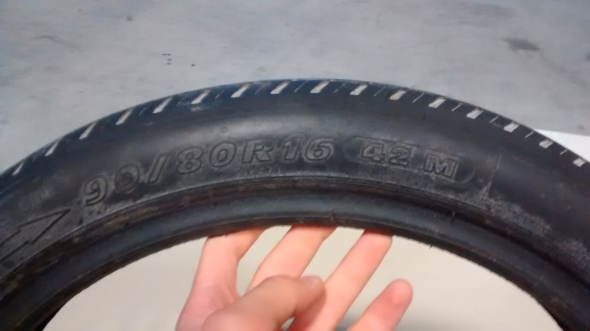
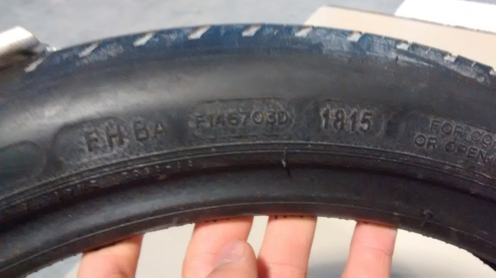
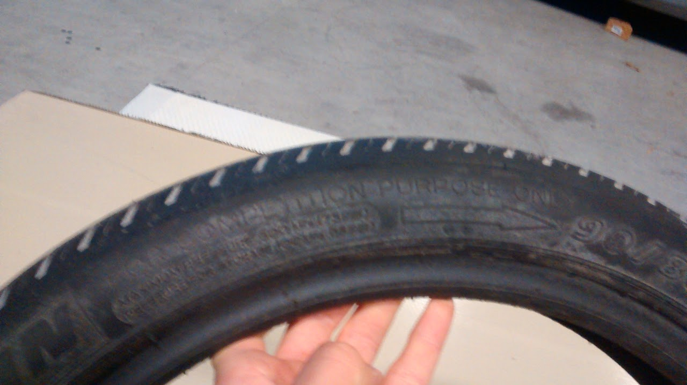

# SSCP - Procuring Radial Tires 2014-2015

# Procuring Radial Tires 2014-2015

On September 8, 2014, I spoke over the phone with Will Whitley of Michelin North America in South Carolina to try to procure some more Michelin radial tires. Michelin has run out of their North American supply, due to large requests from American teams like Michigan, MIT, Georgia Tech, and others. **Will Whitley claims their inventory ran out in January, 2014.

It is my fault for not having called Will earlier, although my very early email went ignored. 

We expect to place an order for tires as soon as new inventory arrives in the US from France. If something catastrophic happens and we cannot procure tires, we may have to use old ones. I do not expect this to happen, and see no reason for it occurring. 

When we place an order, I expect we'll want at most 16 new tires or so, depending on what's available. We have several used tires for US testing.

**As of  November 14, 2014, our Michelin contact, Will Whitley let me know that Michelin North America will not ship tires from France anytime soon. Will has directed our team to seek Michelin tires from the Shell Eco Marathon. It is possible that our request may be limited to a small quantity, as Shell has chosen to dispense these tires at heavily-discounted rates and limited quantities to eco marathon teams. 

I was in contact with both Shell and Michelin on Tuesday, November 18, 2014. Shell says they're reserving their tires for eco marathon teams. Will Whitley is confirming that Shell can actually do that, while also checking to see if we can place a direct order for tires from France. 

Tires to Research

1. Bridgestone race tires for WSC 2015I'm also looking into other tires (namely Bridgestone) because they have a new line of tires specifically for WSC 2015 and claim rolling resistance numbers near those of the Michelins. I was not allowed to know the specific number, only a "<xxx", and all of the information I was shown today was confidential. I don't think the tires will be as good from the Michelins, judging from the rolling resistance number range I was given. 
2. I'm also looking into other tires (namely Bridgestone) because they have a new line of tires specifically for WSC 2015 and claim rolling resistance numbers near those of the Michelins. I was not allowed to know the specific number, only a "<xxx", and all of the information I was shown today was confidential. I don't think the tires will be as good from the Michelins, judging from the rolling resistance number range I was given. 

Bridgestone race tires for WSC 2015

1. I'm also looking into other tires (namely Bridgestone) because they have a new line of tires specifically for WSC 2015 and claim rolling resistance numbers near those of the Michelins. I was not allowed to know the specific number, only a "<xxx", and all of the information I was shown today was confidential. I don't think the tires will be as good from the Michelins, judging from the rolling resistance number range I was given. 

I'm also looking into other tires (namely Bridgestone) because they have a new line of tires specifically for WSC 2015 and claim rolling resistance numbers near those of the Michelins. I was not allowed to know the specific number, only a "<xxx", and all of the information I was shown today was confidential. I don't think the tires will be as good from the Michelins, judging from the rolling resistance number range I was given. 

** As of early June, 2015, our new Michelin contact Leesa Owens leesa.owens@us.michelin.com has told us that tires have shipped from France. 

### Embedded Content

Embedded content: [Embedded Content]()

<iframe width="100%" height="400" src="" frameborder="0"></iframe>

Teams We're Contacting for Tires

* MichiganOur contact (aero lead) seems favorable to the idea of selling us tires, but need approval from business team. Does Michigan know about tire shortage, and how do they expect their tires from Michelin? Is Michelin a full-out sponsor?Update: Will not sell tires until future tire availability can be determined. Michelin sponsors team outright; if Michigan cannot receive new tires, they'll use their old ones and may be convinced to sell only one set. If they receive new tires, older tires (with little to no use) will be available for certain. Next step: Investigate Michelin's relationship with other solar car teams and determine if sourcing issues are particular to ours. MIT
* MichiganOur contact (aero lead) seems favorable to the idea of selling us tires, but need approval from business team. Does Michigan know about tire shortage, and how do they expect their tires from Michelin? Is Michelin a full-out sponsor?Update: Will not sell tires until future tire availability can be determined. Michelin sponsors team outright; if Michigan cannot receive new tires, they'll use their old ones and may be convinced to sell only one set. If they receive new tires, older tires (with little to no use) will be available for certain. Next step: Investigate Michelin's relationship with other solar car teams and determine if sourcing issues are particular to ours. 
* Our contact (aero lead) seems favorable to the idea of selling us tires, but need approval from business team. Does Michigan know about tire shortage, and how do they expect their tires from Michelin? Is Michelin a full-out sponsor?
* Update: Will not sell tires until future tire availability can be determined. Michelin sponsors team outright; if Michigan cannot receive new tires, they'll use their old ones and may be convinced to sell only one set. If they receive new tires, older tires (with little to no use) will be available for certain. 
* Next step: Investigate Michelin's relationship with other solar car teams and determine if sourcing issues are particular to ours. 
* MIT

1. MichiganOur contact (aero lead) seems favorable to the idea of selling us tires, but need approval from business team. Does Michigan know about tire shortage, and how do they expect their tires from Michelin? Is Michelin a full-out sponsor?Update: Will not sell tires until future tire availability can be determined. Michelin sponsors team outright; if Michigan cannot receive new tires, they'll use their old ones and may be convinced to sell only one set. If they receive new tires, older tires (with little to no use) will be available for certain. Next step: Investigate Michelin's relationship with other solar car teams and determine if sourcing issues are particular to ours. 
2. Our contact (aero lead) seems favorable to the idea of selling us tires, but need approval from business team. Does Michigan know about tire shortage, and how do they expect their tires from Michelin? Is Michelin a full-out sponsor?
3. Update: Will not sell tires until future tire availability can be determined. Michelin sponsors team outright; if Michigan cannot receive new tires, they'll use their old ones and may be convinced to sell only one set. If they receive new tires, older tires (with little to no use) will be available for certain. 
4. Next step: Investigate Michelin's relationship with other solar car teams and determine if sourcing issues are particular to ours. 
5. MIT

Michigan

1. Our contact (aero lead) seems favorable to the idea of selling us tires, but need approval from business team. Does Michigan know about tire shortage, and how do they expect their tires from Michelin? Is Michelin a full-out sponsor?
2. Update: Will not sell tires until future tire availability can be determined. Michelin sponsors team outright; if Michigan cannot receive new tires, they'll use their old ones and may be convinced to sell only one set. If they receive new tires, older tires (with little to no use) will be available for certain. 
3. Next step: Investigate Michelin's relationship with other solar car teams and determine if sourcing issues are particular to ours. 

Our contact (aero lead) seems favorable to the idea of selling us tires, but need approval from business team. Does Michigan know about tire shortage, and how do they expect their tires from Michelin? Is Michelin a full-out sponsor?

Update: Will not sell tires until future tire availability can be determined. Michelin sponsors team outright; if Michigan cannot receive new tires, they'll use their old ones and may be convinced to sell only one set. If they receive new tires, older tires (with little to no use) will be available for certain. 

Next step: Investigate Michelin's relationship with other solar car teams and determine if sourcing issues are particular to ours. 

MIT

* Need a contact at this team. 
* Need a contact at this team. 
* Need a contact at this team. 

* Need a contact at this team. 
* Need a contact at this team. 

1. Need a contact at this team. 

Need a contact at this team. 

* Oregon State University
* Oregon State University

1. Oregon State University

Oregon State University

* Need a contact at this team. 
* Need a contact at this team. 
* Need a contact at this team. 

* Need a contact at this team. 
* Need a contact at this team. 

1. Need a contact at this team. 

Need a contact at this team. 

* Principia College
* Principia College

1. Principia College

Principia College

* Need a contact at this team. 
* Need a contact at this team. 
* Need a contact at this team. 

* Need a contact at this team. 
* Need a contact at this team. 

1. Need a contact at this team. 

Need a contact at this team. 

20 Michelin 2015 Tires Received mid July 2015

### Embedded Google Drive File

Google Drive File: [Embedded Content](https://drive.google.com/embeddedfolderview?id=1--ZxAY7nsYreH-deBMllOguhJtlHp80m#list)

<iframe width="100%" height="400" src="https://drive.google.com/embeddedfolderview?id=1--ZxAY7nsYreH-deBMllOguhJtlHp80m#list" frameborder="0"></iframe>

