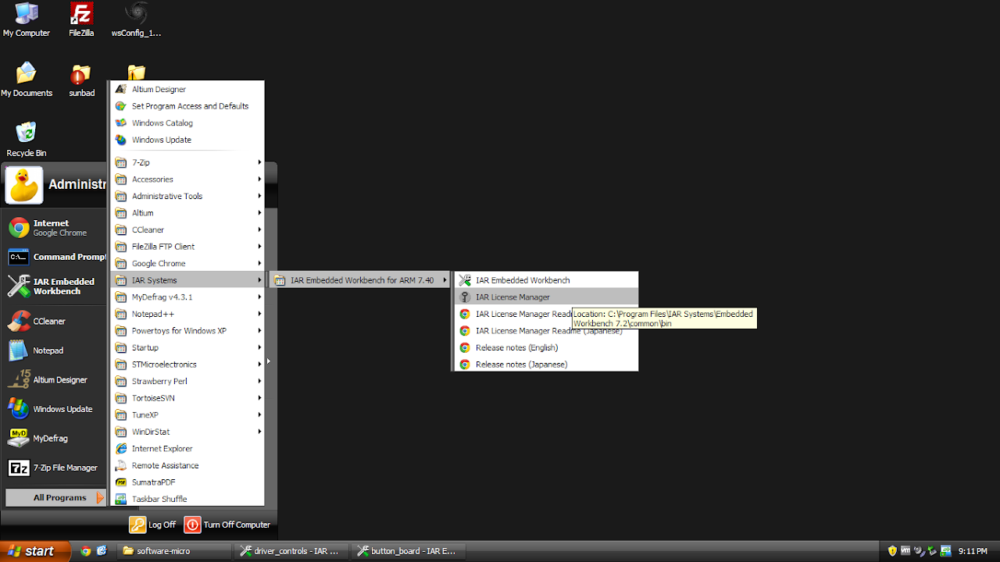
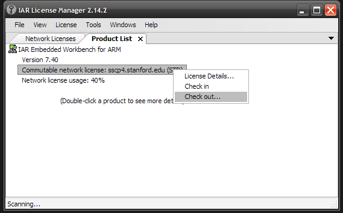
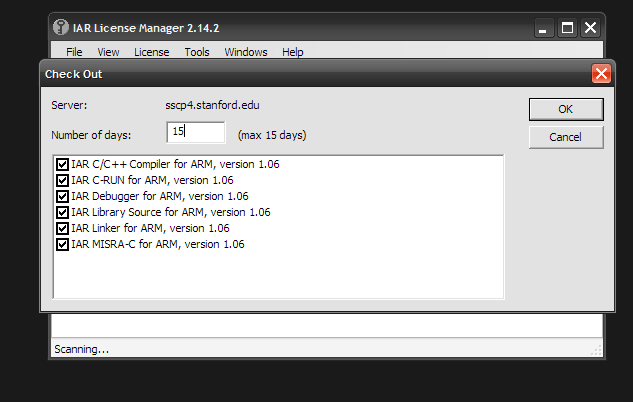

# SSCP - Checking out a IAR License for offline use

# Checking out a IAR License for offline use

It is possible to use IAR offline. Here's how:

1. Open IAR License Manager.

2. Right click the product in the Product List

3. Checkout a license for a maximum of 15 days - note this reduce our number of network licenses available by 1.

